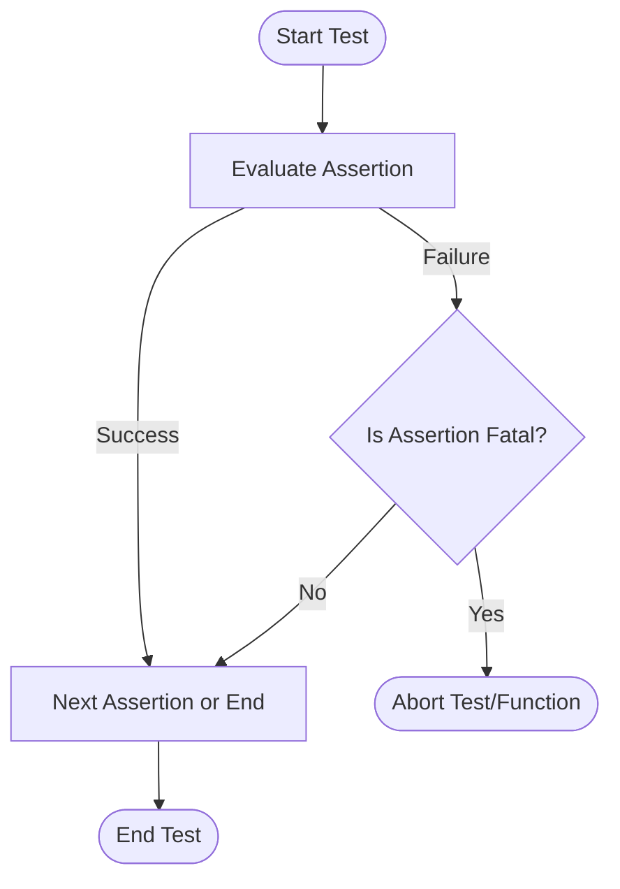

# Assertions and Failure Handling

This reference details the assertions available in GoogleTest, focusing on their usage, differences, effects on test flow, and how to handle failures effectively. It further explains assertion macros, death tests, the distinction between fatal and non-fatal assertions, and best practices for analyzing and responding to test failures.

---

## 1. Introduction to Assertions

Assertions are fundamental building blocks in GoogleTest that verify conditions in your code during testing. They help confirm that code behaves as expected by asserting boolean conditions, comparisons, exceptions, or specific outcomes.

When an assertion fails, it either aborts the current test immediately (fatal failure) or reports the failure but continues running (non-fatal failure), depending on the macro used.

---

## 2. Types of Assertions and Their Effects

GoogleTest pairs most assertions in two variants:

- **`EXPECT_` macros:** Generate *non-fatal* failures allowing the test function to continue running.
- **`ASSERT_` macros:** Generate *fatal* failures that immediately abort the current function.

### Why This Matters to You

- Use `EXPECT_` macros when you want to verify multiple conditions within the same test and continue after failure to see all failing assertions.
- Use `ASSERT_` macros when the failure of an assertion makes continuing unsafe or pointless, such as critical preconditions.


---

## 3. Explicit Success and Failure Macros

GoogleTest provides macros that generate explicit test successes or failures, useful when control flow itself determines test results rather than evaluating expressions.

### SUCCEED

Generate a success explicitly. Uses:

```cpp
SUCCEED();
```

It documents that a particular code path was reached and passes silently.

### FAIL

Generate a fatal failure immediately, aborting the current function.

```cpp
FAIL() << "This code path should not be reached.";
```

Use only in functions returning `void`.

### ADD_FAILURE

Generate a non-fatal failure, allowing test execution to continue:

```cpp
ADD_FAILURE() << "Something unexpected happened";
```

### ADD_FAILURE_AT

Generate a non-fatal failure at a specific file and line number:

```cpp
ADD_FAILURE_AT("my_file.cc", 123) << "Detected problem here";
```

---

## 4. Common Boolean Assertions

### EXPECT_TRUE / ASSERT_TRUE

Verify that a condition is true.

```cpp
EXPECT_TRUE(condition);
ASSERT_TRUE(condition);
```

### EXPECT_FALSE / ASSERT_FALSE

Verify that a condition is false.

```cpp
EXPECT_FALSE(condition);
ASSERT_FALSE(condition);
```

---

## 5. Binary Comparison Assertions

Used for asserting that two values are related by common operators.

### EXPECT_EQ / ASSERT_EQ

Verifies that two values are equal (`==`). For C strings, compare content with `EXPECT_STREQ` instead.

### EXPECT_NE / ASSERT_NE

Verifies that two values are not equal (`!=`). Use `EXPECT_STRNE` for C strings.

### EXPECT_LT / ASSERT_LT

Asserts less than.

### EXPECT_LE / ASSERT_LE

Asserts less than or equal.

### EXPECT_GT / ASSERT_GT

Asserts greater than.

### EXPECT_GE / ASSERT_GE

Asserts greater than or equal.

All comparison assertions:
- Evaluate arguments exactly once.
- Use stream output operator to show values on failures if available.

---

## 6. String Comparison Assertions

Specialized for C strings (`const char*`) and wide strings.

- **EXPECT_STREQ / ASSERT_STREQ** — Check if two C strings have the same content.
- **EXPECT_STRNE / ASSERT_STRNE** — Check if two C strings differ.
- **EXPECT_STRCASEEQ / ASSERT_STRCASEEQ** — Case-insensitive equality.
- **EXPECT_STRCASENE / ASSERT_STRCASENE** — Case-insensitive inequality.

Use `EXPECT_EQ` for `std::string` comparisons.

---

## 7. Floating-Point Comparison Assertions

Due to rounding and representation issues, exact comparison doesn't work well for floating types. GoogleTest provides:

- **EXPECT_FLOAT_EQ / ASSERT_FLOAT_EQ**: Compares two `float`s, accepting differences within 4 ULPs.
- **EXPECT_DOUBLE_EQ / ASSERT_DOUBLE_EQ**: Same for `double`s.
- **EXPECT_NEAR / ASSERT_NEAR**: Verifies that the absolute difference is within a specified error.

Example:

```cpp
EXPECT_NEAR(computed_value, expected_value, 1e-5);
```

---

## 8. Exception Assertions

Tests that code throws or does not throw exceptions.

- **EXPECT_THROW / ASSERT_THROW**: Checks that a statement throws a specific exception type.
- **EXPECT_ANY_THROW / ASSERT_ANY_THROW**: Checks that any exception is thrown.
- **EXPECT_NO_THROW / ASSERT_NO_THROW**: Checks that no exceptions are thrown.

Example:

```cpp
EXPECT_THROW(FunctionThatThrows(), std::runtime_error);
EXPECT_NO_THROW(SafeFunction());
```

---

## 9. Predicate Assertions

These enable more complex predicates as conditions with informative failure messages.

- `EXPECT_PRED1` to `EXPECT_PRED5`: Call predicate functors or functions with corresponding number of arguments.
- `EXPECT_PRED_FORMAT1` to `EXPECT_PRED_FORMAT5`: Use predicate formatters that provide custom failure messages.

Example:

```cpp
bool IsPrime(int n);
EXPECT_PRED1(IsPrime, 7);
```

---

## 10. Windows HRESULT Assertions

Specialized assertions for Windows HRESULT values:

- **EXPECT_HRESULT_SUCCEEDED / ASSERT_HRESULT_SUCCEEDED** — Checks success result.
- **EXPECT_HRESULT_FAILED / ASSERT_HRESULT_FAILED** — Checks failure result.

Example:

```cpp
ASSERT_HRESULT_SUCCEEDED(CoCreateInstance(...));
```

---

## 11. Death Assertions

Verify that a piece of code causes program termination, useful for testing fatal failures.

Runs the code in a separate process and expects it to exit with failure and produce stderr output.

- **EXPECT_DEATH / ASSERT_DEATH**: Verifies termination with an error output matching a regex or matcher.
- **EXPECT_DEATH_IF_SUPPORTED / ASSERT_DEATH_IF_SUPPORTED**: Behaves as above if death tests are supported.
- **EXPECT_DEBUG_DEATH / ASSERT_DEBUG_DEATH**: Runs death test only in debug mode, else executes code.
- **EXPECT_EXIT / ASSERT_EXIT**: Verifies termination exit status and output.

Example:

```cpp
EXPECT_DEATH(DoSomethingDangerous(), "Error: fatal");
EXPECT_EXIT(ExitCodeZeroFunction(), ExitedWithCode(0), "Success");
```

---

## 12. Assertion Failure Handling and Best Practices

### Fatal vs Non-fatal

- Use **fatal** assertions (`ASSERT_`) when continuing after a failed check would cause cascading failures or misleading test behavior.
- Use **non-fatal** (`EXPECT_`) when you want to validate multiple expectations in one test run.

### Custom Failure Messages

All assertions support streaming custom failure messages for richer diagnostics:

```cpp
EXPECT_TRUE(x > 0) << "x must be positive but was " << x;
```

### Troubleshooting Failures

- Use `--gtest_break_on_failure` to stop at the first failing assertion in debugger.
- Use `--gtest_stack_trace_depth` to see the stack trace to debug test failures.
- Use `--gmock_verbose=info` to trace mock invocations and understand why expectations fail (see the mocking documentation).

### Common Pitfalls

- Avoid side-effects in assertion macros, arguments are evaluated once but in undefined order.
- Ensure assertions are placed in test functions to get proper reporting and control flow.

### Failure Output Overview

On failure, GoogleTest prints:

- Location and description of the failure
- Expected condition and actual values
- Optionally stack trace

This information points you to the failure cause clearly.

---

## 13. Summary Flow of Assertion Usage

<Steps>
<Step title="Write Test and Place Assertions">
Use `EXPECT_` and `ASSERT_` macros to assert expected conditions.
</Step>
<Step title="Run Test Executable">
Run your test binary. Each assertion is evaluated.
</Step>
<Step title="View Assertion Outcomes">
Failures log appropriate messages; decide if test passes or fails.
</Step>
<Step title="Debug Using Failure Messages">
Use GoogleMock verbose flags, stack traces, and failure messages to analyze problems.
</Step>
</Steps>

---

## 14. Additional Resources

- [GoogleMock Assertions API Reference](./reference/assertions.md)
- [Mocking Reference](./reference/mocking.md) for mocking expectations
- [gMock Cookbook](./gmock_cook_book.md) for recipes on complex mocking
- [GoogleTest Primer](https://github.com/google/googletest/blob/main/docs/primer.md)
- Troubleshooting guide: [Troubleshooting Common Issues](../../getting-started/first-test-run-validation/troubleshooting-common-issues)

---

## 15. Example: Using Assertions

```cpp
#include <gtest/gtest.h>

TEST(FactorialTest, HandlesZeroInput) {
    int result = Factorial(0);
    EXPECT_EQ(result, 1) << "Factorial of 0 should be 1.";
}

TEST(VectorTest, CanPushBackElements) {
    std::vector<int> v;
    v.push_back(10);
    ASSERT_EQ(v.size(), 1) << "Size should be 1 after push_back.";
    EXPECT_EQ(v[0], 10);
}

TEST(ExceptionTest, ThrowsOnNegativeInput) {
    EXPECT_THROW(MyFunction(-1), std::invalid_argument);
}
```

This example shows common usage of `EXPECT_`, `ASSERT_`, and exception assertions with custom messages.

---

## 16. Summary Diagram of Assertion Outcomes



This illustrates test flow based on assertion results.

---

## Troubleshooting Common Assertion Issues

- Verify correct macro usage: `EXPECT_` vs `ASSERT_`.
- Avoid side-effects in assertion expressions.
- Use verbose logging to trace failures.
- Ensure mock expectations are set before calls.
- Use `SUCCEED()` to mark reached code paths explicitly.

<Tip>
For diagnosing why an assertion failed, enable `--gtest_break_on_failure` to halt test execution and use the debugger to inspect state.
</Tip>

<Tip>
Use `--gmock_verbose=info` to get detailed mock function call traces helpful to understand mock expectation failures.
</Tip>