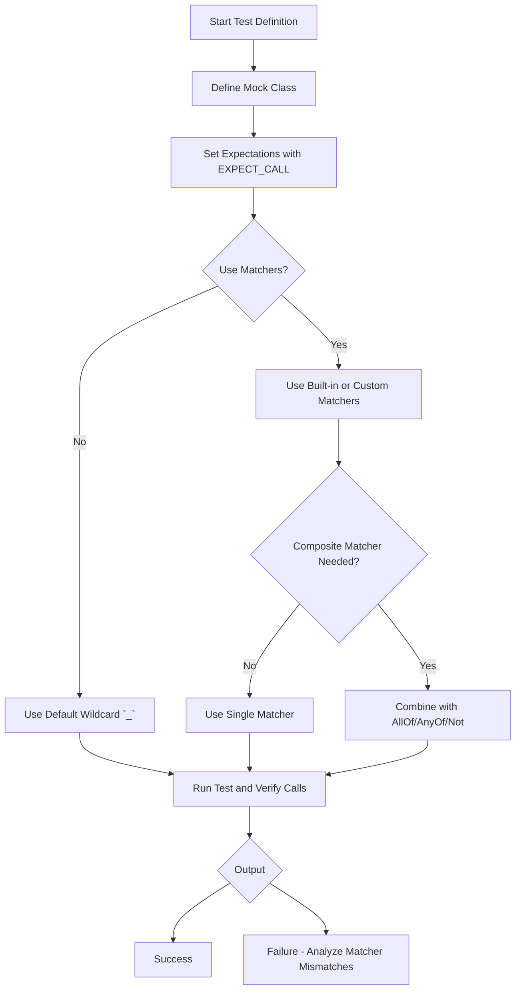

# Argument Matching and Custom Matchers

Master the use of built-in and custom matchers to specify expectations on mock method arguments. This reference covers standard, advanced, and user-defined matchers, providing examples and guidance for composing and combining matcher logic.

---

## Overview of Argument Matching

In Google Mock, *matchers* allow you to specify conditions on the arguments your mock methods receive. Instead of testing exact argument equality, matchers verify that arguments satisfy certain properties, making your tests both expressive and flexible.

You can use matchers inside `EXPECT_CALL()` and `ON_CALL()` macros to define expectations and default behaviors on mock methods. Beyond built-in matchers, Google Mock allows you to create custom matchers tailored to your specific domain.

## Built-in Matchers

Google Mock offers a rich collection of built-in matchers to suit most argument validation needs. Matchers can be broadly categorized as follows:

### Wildcard Matchers
| Matcher               | Description                                         |
|-----------------------|-----------------------------------------------------|
| `_` (underscore)      | Matches any value of the correct type.              |
| `A<type>()`, `An<type>()` | Matches any value of the specified `type`.         |

### Generic Comparison Matchers

| Matcher        | Description                                      |
|----------------|------------------------------------------------|
| `Eq(value)` or `value` | Matches `argument == value`.                 |
| `Ne(value)`    | Matches `argument != value`.                      |
| `Ge(value)`    | Matches `argument >= value`.                      |
| `Gt(value)`    | Matches `argument > value`.                       |
| `Le(value)`    | Matches `argument <= value`.                      |
| `Lt(value)`    | Matches `argument < value`.                       |
| `IsTrue()`     | Matches arguments that evaluate to `true`.       |
| `IsFalse()`    | Matches arguments that evaluate to `false`.      |
| `IsNull()`     | Matches null pointers (raw or smart).             |
| `NotNull()`    | Matches non-null pointers (raw or smart).         |
| `Ref(variable)` | Matches arguments that are a reference to `variable`. |

### Floating-Point Matchers

Matchers that handle approximate equality and NaNs:

| Matcher                 | Description                                                       |
|-------------------------|-------------------------------------------------------------------|
| `DoubleEq(val)`         | Matches doubles approximately equal to `val` (NaNs unequal).      |
| `FloatEq(val)`          | Matches floats approximately equal to `val` (NaNs unequal).       |
| `NanSensitiveDoubleEq(val)` | Matches doubles equal including NaNs.                           |
| `NanSensitiveFloatEq(val)`  | Matches floats equal including NaNs.                            |
| `IsNan()`               | Matches `NaN` floating-point values.                              |
| `DoubleNear(val, eps)`  | Matches doubles close to `val` within absolute error `eps`.      |
| `FloatNear(val, eps)`   | Matches floats close to `val` within absolute error `eps`.       |

### String Matchers

Matchers for string equality and pattern matching:

| Matcher               | Description                                              |
|-----------------------|----------------------------------------------------------|
| `StrEq(string)`       | Matches strings equal to `string` (case-sensitive).      |
| `StrNe(string)`       | Matches strings not equal to `string` (case-sensitive).  |
| `StrCaseEq(string)`   | Matches strings equal ignoring case.                      |
| `StrCaseNe(string)`   | Matches strings not equal ignoring case.                  |
| `HasSubstr(string)`   | Matches strings containing the given substring.          |
| `StartsWith(prefix)`  | Matches strings that start with `prefix`.                 |
| `EndsWith(suffix)`    | Matches strings that end with `suffix`.                   |
| `ContainsRegex(re)`   | Matches strings matching the regular expression `re`.    |
| `MatchesRegex(re)`    | Matches strings matching the full regular expression `re`.| 
| `WhenBase64Unescaped(matcher)` | Matches base64-encoded strings which decode to a value that matches `matcher`.

### Container Matchers

Matchers for STL or native containers:

| Matcher                     | Description                                             |
|-----------------------------|---------------------------------------------------------|
| `ElementsAre(e0, e1, ..., en)` | Matches container with elements exactly matching given matchers in order.   |
| `UnorderedElementsAre(e0, e1, ..., en)` | Matches container elements in any order matching the given matchers.    |
| `ElementsAreArray(container or array)` | Like `ElementsAre`, but from container or array input.               |
| `UnorderedElementsAreArray(container or array)` | Like `UnorderedElementsAre`, but from container or array input.     |
| `Contains(element_matcher)` | Matches containers containing at least one element matching `element_matcher`.|
| `Each(element_matcher)`      | Matches containers whose *every* element matches `element_matcher`. |
| `SizeIs(matcher)`            | Matches containers whose size matches the matcher.         |
| `ContainerEq(container)`     | Matches containers equal to another container, reporting differences.| 
| `Pointwise(pair_matcher, container)` | Matches containers element-wise via `pair_matcher`.       |
| `UnorderedPointwise(pair_matcher, container)` | Like `Pointwise` ignoring element order.                   |
| `BeginEndDistanceIs(matcher)`| Matches containers with distance between `begin()` and `end()` matching matcher.|
| `IsEmpty()`                  | Matches empty containers.                                  |

### Member Matchers

Matchers to verify fields or properties on structured or class types:

| Matcher                                        | Description                                             |
|------------------------------------------------|---------------------------------------------------------|
| `Field(&Class::field, matcher)`                | Matches object's `field` member against matcher.        |
| `Field(field_name, &Class::field, matcher)`    | Same as above, with named field for better errors.      |
| `Property(&Class::property, matcher)`          | Matches return value of const `property()` method.      |
| `Property(property_name, &Class::property, matcher)` | Same with property name for better errors.            |
| `Key(matcher)`                                 | Matches first element of a pair or map element.          |
| `Pair(m1, m2)`                                 | Matches both first and second elements of a pair.        |
| `Address(matcher)`                             | Matches address of an object.                             |
| `Pointee(matcher)`                             | Matches the pointee of a pointer or smart pointer.       |
| `Pointer(matcher)`                             | Matches the pointer itself (raw or smart).                |
| `WhenDynamicCastTo<T>(matcher)`                | Matches after dynamic_cast to T.                          |

### Composite Matchers

Combine matchers for more advanced checks:

| Matcher                         | Description                                        |
|---------------------------------|----------------------------------------------------|
| `AllOf(m1, m2, ..., mn)`        | Matches if all sub-matchers match.                  |
| `AnyOf(m1, m2, ..., mn)`        | Matches if any sub-matcher matches.                  |
| `Not(m)`                       | Matches if `m` does not match.                       |
| `Conditional(cond, m1, m2)`    | Matches with `m1` if `cond` is true, else `m2`.     |
| `AllOfArray(container)`          | Same as `AllOf`, matchers from a container/array.  |
| `AnyOfArray(container)`          | Same as `AnyOf`, matchers from a container/array.   |

### Multi-argument Matchers

Function arguments can be matched together as tuples:

- `Args<N1, N2, ..., Nk>(matcher)` matches selected arguments in a tuple against `matcher`.
- `AllArgs(m)` is the full argument tuple matcher.

Example:

```cpp
EXPECT_CALL(foo, Bar(_, _))
    .With(Lt());  // First argument less than second.
EXPECT_CALL(foo, Blah)
    .With(AllOf(Args<0,1>(Lt()), Args<1,2>(Lt()))); // x < y < z
```

## Defining Custom Matchers

When built-in matchers don't suffice, Google Mock supports defining custom matchers with the `MATCHER` family of macros, or by writing matcher classes implementing the matcher interface.

### Quick Custom Matcher Using `MATCHER`

```cpp
MATCHER(IsEven, "") {  // Simple matcher with no parameters
  return (arg % 2) == 0;
}

// Usage:
EXPECT_CALL(mock_obj, Foo(IsEven()));
EXPECT_THAT(value, IsEven());
```

Descriptions are automatically generated from the matcher name but can be customized:

```cpp
MATCHER(IsDivisibleBy7, absl::StrCat(negation ? "isn't" : "is", " divisible by 7")) {
  return (arg % 7) == 0;
}
```

You can add extra failure info by streaming to `*result_listener`:

```cpp
MATCHER(IsDivisibleBy7, "") {
  if ((arg % 7) == 0) return true;
  *result_listener << "the remainder is " << (arg % 7);
  return false;
}
```

### Parameterized Matchers Using `MATCHER_P` and Variants

You can add parameters to matchers to increase their flexibility:

```cpp
MATCHER_P(HasAbsoluteValue, value, "") {
  return abs(arg) == value;
}

// Usage:
EXPECT_THAT(some_expr, HasAbsoluteValue(10));
```

Descriptions can include parameters:

```cpp
MATCHER_P2(InRange, low, high,
           absl::StrFormat("%s in range [%s, %s]", negation ? "isn't" : "is", low, high)) {
  return low <= arg && arg <= high;
}
```

You can create up to 10-parameter matchers using `MATCHER_P2`, `MATCHER_P3`, ..., `MATCHER_P10`.

### Writing Custom Matcher Classes

For advanced control, write matcher classes implementing `MatchAndExplain()`, `DescribeTo()`, and `DescribeNegationTo()`:

```cpp
class BarPlusBazEqMatcher {
 public:
  using is_gtest_matcher = void;

  explicit BarPlusBazEqMatcher(int expected_sum) : expected_sum_(expected_sum) {}

  bool MatchAndExplain(const Foo& foo, std::ostream* os) const {
    return (foo.bar() + foo.baz()) == expected_sum_;
  }

  void DescribeTo(std::ostream* os) const {
    *os << "bar() + baz() equals " << expected_sum_;
  }

  void DescribeNegationTo(std::ostream* os) const {
    *os << "bar() + baz() does not equal " << expected_sum_;
  }

 private:
  int expected_sum_;
};

Matcher<const Foo&> BarPlusBazEq(int expected_sum) {
  return BarPlusBazEqMatcher(expected_sum);
}
```

## Using Matchers in `EXPECT_CALL` and `ON_CALL`

- Pass matchers as arguments to specify which calls you expect or specify default behavior for.
- Use `_` to allow any argument value.
- Combine matchers with `AllOf()`, `AnyOf()`, `Not()`, and more.
- Use `SafeMatcherCast<T>()` to safely cast a matcher to another argument type if needed.

## Composing Matcher Logic

Google Mock lets you compose matchers using logical combinators:

- `AllOf(m1, m2, ...)` requires all sub-matchers to match.
- `AnyOf(m1, m2, ...)` requires any sub-matcher to match.
- `Not(m)` matches if `m` does not.

These can be nested arbitrarily for fine-grained control.

## Matcher as Predicates

Matchers can be used as predicates in standard algorithms by wrapping them with `Matches(m)`:

```cpp
std::vector<int> v = {1,2,3,4,5};
auto count = std::count_if(v.begin(), v.end(), Matches(Ge(3)));  // counts elements >= 3
```

## Troubleshooting & Common Pitfalls

- **Unprotected commas:** Wrap complex types with parentheses or alias types when using `MOCK_METHOD`.
- **Overloaded methods:** Use `Const()` or `TypedEq<type>()` to disambiguate.
- **Non-copyable arguments:** Wrap such arguments with `std::ref()` in matchers.
- **Sticky expectations:** Use `.RetiresOnSaturation()` to retire saturated expectations and avoid conflicts.
- **Uninteresting calls:** By default warnings are generated; suppress with `NiceMock` or explicit wildcard expectations.

## Examples

### Using Built-in Matchers

```cpp
using ::testing::_;
using ::testing::Gt;
using ::testing::Return;

EXPECT_CALL(mockFoo, DoThis(Gt(5), _))
    .WillOnce(Return(true));
```

### Custom Matcher with `MATCHER_P`

```cpp
MATCHER_P(IsDivisibleBy, divisor, "") {
  return (arg % divisor) == 0;
}

// Usage
EXPECT_CALL(mockFoo, Process(IsDivisibleBy(7)));
```

### Matcher Combos

```cpp
EXPECT_CALL(mockFoo, Process(AllOf(Gt(5), Ne(10))));
```

### Using Member Matchers

```cpp
EXPECT_CALL(mockFoo, Process(Field(&Foo::count, Gt(0))));
```

### Matching Containers

```cpp
EXPECT_CALL(mockFoo, UpdateValues(ElementsAre(1, Gt(10), _)));
```

### Matching Tuple Arguments

```cpp
EXPECT_CALL(mockFoo, DoSomething(_, _))
    .With(Lt());  // first arg < second arg

EXPECT_CALL(mockFoo, DoSomething)
    .With(Args<0, 2>(Ge()));  // arg0 >= arg2
```

## Next Steps
- Explore [Matchers Reference](reference/matchers.md) for an exhaustive list
- Learn to write custom [Matchers and Actions](guides/advanced-testing-patterns/custom-matchers-actions.md) for domain-specific behavior
- Combine with Expectation Declaration in [EXPECT_CALL & ON_CALL](api-reference/core-mocking-apis/expectations-on-call.md)
- Review [gMock Cookbook](docs/gmock_cook_book.md) for recipes and best practices

---

## Diagram: Matcher Usage Flow


```

---

<Note>
Remember: matchers must be purely functional without side effects. Use `MATCHER` macros for quick creation, and matcher classes for complex behavior.
</Note>

<Warning>
Unprotected commas in type names will cause compilation errors in `MOCK_METHOD`. Use parentheses or type aliases to fix.
</Warning>

<Tip>
Use `SafeMatcherCast<T>()` to ensure type safety when matching arguments of types close but not identical to the matcher’s target type.
</Tip>
