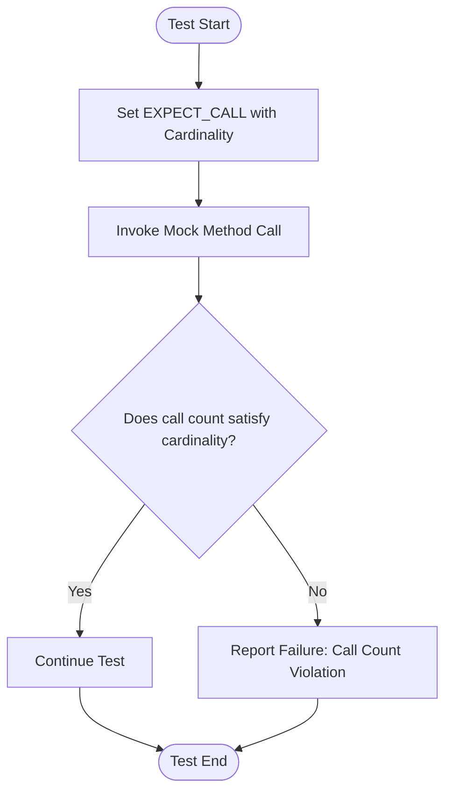

# Cardinalities: Controlling Call Counts

GoogleMock empowers you to precisely declare how many times a mock method is expected to be invoked by using cardinality constraints in the `.Times()` clause of your `EXPECT_CALL` expressions. Cardinalities like `Times()`, `AtLeast()`, `AtMost()`, `Between()`, and `AnyNumber()` enable your tests to clearly document and rigorously verify the intended call count behavior. This improves the robustness of your tests and enhances their readability by conveying intent unambiguously.

---

## Understanding Cardinalities

A **cardinality** is a flexible specification determining *how many times* a mocked method is expected to be called. Instead of writing repetitive, brittle, or hard-to-maintain code, cardinalities let you express expectations that are exact or fuzzy, allowing the mock framework to verify calls against these defined bounds.

### Built-in Cardinalities

GoogleMock provides several commonly used cardinalities in the `::testing` namespace:

| Cardinality        | Meaning                                            | Example Usage                  |
|--------------------|----------------------------------------------------|-------------------------------|
| `Exactly(n)`       | The method must be called exactly *n* times.       | `.Times(Exactly(3))` or `.Times(3)` |
| `AtLeast(n)`       | The method must be called at least *n* times.      | `.Times(AtLeast(2))`           |
| `AtMost(n)`        | The method can be called at most *n* times.        | `.Times(AtMost(5))`            |
| `Between(m, n)`    | The method must be called between *m* and *n* times inclusive. | `.Times(Between(2, 4))`        |
| `AnyNumber()`      | The method can be called any number of times including zero. | `.Times(AnyNumber())`          |

If you omit `.Times()`, GoogleMock infers the cardinality automatically based on the presence and number of `.WillOnce()` and `.WillRepeatedly()` clauses.


## How to Use Cardinalities

You specify cardinalities as the argument to the `.Times()` modifier on an `EXPECT_CALL`. This modifier can only appear once per expectation.

```cpp
using ::testing::Exactly;
using ::testing::AtLeast;
using ::testing::AnyNumber;

EXPECT_CALL(mock_object, SomeMethod())
    .Times(Exactly(3));  // Expect exactly 3 calls

EXPECT_CALL(mock_object, AnotherMethod(_))
    .Times(AtLeast(2));  // Expect at least 2 calls

EXPECT_CALL(mock_object, AnyMethod())
    .Times(AnyNumber());  // Allow any number of calls
```

### Inferring Cardinality

If `.Times()` is omitted, GoogleMock figures out how many times the call is expected based on `.WillOnce()` and `.WillRepeatedly()` behavior clauses:

- No `.WillOnce()` or `.WillRepeatedly()` → implied `.Times(1)`.
- **N** `.WillOnce()` clauses with no `.WillRepeatedly()` → implied `.Times(N)`.
- **N** `.WillOnce()` clauses and one `.WillRepeatedly()` → implied `.Times(AtLeast(N))`.

Using these inference rules helps keep your tests clean and focused on intent.

### Common Examples

```cpp
// Method expected exactly twice
EXPECT_CALL(turtle, PenDown())
    .Times(2);

// Method expected any number of times including zero
EXPECT_CALL(turtle, PenUp())
    .Times(AnyNumber());

// Method expected at least 3 times
EXPECT_CALL(turtle, Forward(_))
    .Times(AtLeast(3));

// Method expected between 2 and 4 times
EXPECT_CALL(turtle, Turn(_))
    .Times(Between(2, 4));
```

### Special Case: Times(0)

Setting `Times(0)` means you expect this method **never** to be called with the matching arguments. If the method is called, GoogleMock will immediately report a test failure, making this cardinality useful for prohibiting unwanted interactions.

```cpp
EXPECT_CALL(mock_obj, ForbiddenMethod(_))
    .Times(0);  // Should never be called
```

---

## Understanding Cardinality Semantics

Cardinality objects precisely define whether the current call count has satisfied, saturated, or over-saturated the expectation.

- **Satisfied**: The number of calls meets the lower bound of the cardinality.
- **Saturated**: The number of calls has reached the upper bound.
- **Over-saturated**: The number of calls exceeds the upper bound, producing an error.

GoogleMock internally tracks how many times the call matching the expectation has been invoked and enforces these rules to uphold correctness.

### Sticky Expectations and Retiring

By default, expectations are "sticky" — even after saturating the call count, the expectation remains active and will match calls (which will produce failures upon over-calls).

You can explicitly retire an expectation on saturation using `.RetiresOnSaturation()`, which deactivates the expectation after it is saturated, allowing subsequent calls to be intercepted by older expectations or defaults.


## Advanced Cardinality Usage

### Custom Cardinalities

You can create your own cardinalities by implementing the `CardinalityInterface` interface and wrapping it via `MakeCardinality()`. This is useful if you need complex or domain-specific call count constraints.

Example: a cardinality that allows calls an even number of times.

```cpp
class EvenNumberCardinality : public testing::CardinalityInterface {
 public:
  bool IsSatisfiedByCallCount(int call_count) const override {
    return call_count % 2 == 0;
  }

  bool IsSaturatedByCallCount(int /*unused*/) const override {
    return false;  // Never 'saturates'
  }

  void DescribeTo(std::ostream* os) const override {
    *os << "called even number of times";
  }
};

Testing::Cardinality EvenNumber() {
  return testing::MakeCardinality(new EvenNumberCardinality);
}

// Use
EXPECT_CALL(mock, Foo())
    .Times(EvenNumber());
```

## Error Reporting and Common Pitfalls

GoogleMock provides expressive messages when call counts don't match the expectations. These messages include the expected cardinality, the actual number of calls, and their satisfaction state.

### Common errors

- Calling a method more times than specified in `.Times(...)` produces an upper-bound violation.
- Calling fewer times than `AtLeast(n)` leads to failures once the test completes or mock verifies.
- Specifying invalid cardinalities, like `AtLeast(-1)`, triggers configuration errors.

### Practical tips

- Prefer exact cardinalities for fixed expected call counts; use fuzzy cardinalities (`AtLeast`, `AtMost`, `Between`) for ranges.
- Use `.RetiresOnSaturation()` to prevent over-call errors when repeated calls should transition expectations.
- When mixing multiple expectations on the same method, remember that GoogleMock matches calls to the last matching active expectation (newer overrides older).


## Example Usage

```cpp
#include <gmock/gmock.h>
using ::testing::AtMost;
using ::testing::AtLeast;
using ::testing::Exactly;
using ::testing::AnyNumber;

class MockPrinter {
public:
  MOCK_METHOD(void, Print, (const std::string& text), ());
};

TEST(PrintTest, CardinalityExamples) {
  MockPrinter printer;

  EXPECT_CALL(printer, Print("Hello"))
      .Times(Exactly(1));  // Exactly one call expected

  EXPECT_CALL(printer, Print("Retry"))
      .Times(AtLeast(2));  // At least two calls expected

  EXPECT_CALL(printer, Print("Debug"))
      .Times(AtMost(5));  // No more than five calls

  EXPECT_CALL(printer, Print("Other"))
      .Times(AnyNumber());  // Any number of calls

  printer.Print("Hello");
  printer.Print("Retry");
  printer.Print("Retry");
  printer.Print("Debug");
  printer.Print("Other");
  printer.Print("Other");
}
```

This test verifies the methods are called within the cardinality constraints and will fail immediately if any are violated.

---

## Visualizing Cardinality Flow



This diagram represents the mock call verification logic, highlighting how each call is verified against its cardinality expectations.

---

## Summary

Using cardinalities in GoogleMock lets you declare how many times a mock method should be called, from exact counts to ranges to unlimited invocations. This precision strengthens test correctness and clarity. Knowing how to leverage built-in and custom cardinalities, along with `.RetiresOnSaturation()` for lifecycle management, ensures your mocking remains flexible yet strict.

<Check>
- Always specify `.Times()` explicitly or rely on inference rules.
- Avoid negative numbers in cardinalities.
- Combine with sequences and `.RetiresOnSaturation()` for complex ordered or transient expectations.
</Check>

<Note>
Be cautious when using repeated `.WillOnce()` and `.WillRepeatedly()` without `.Times()`, as unseen cardinalities are inferred and affect how many calls are expected.
</Note>

---

## References and Next Steps

- See [EXPECT_CALL and Times Clause](../mocking-api/call-expectations.md) for fuller details on expectations.
- Read [gMock for Dummies](../gmock_for_dummies.md) for beginner-friendly guidance including cardinalities.
- Explore [Matchers Reference](../matchers-and-actions/argument-matchers.md) to combine argument matchers with call count constraints.
- Learn about advanced test organization with [`InSequence`](../mocking-api/call-expectations.md#expectcall-insequence) and `.After()` ordering.

For deeper mastery, consult the [gMock Cookbook](../gmock_cook_book.md) recipes on expectations and mocks.

<Source url="https://github.com/google/googletest" branch="main" paths={[{"path": "googlemock/include/gmock/gmock-cardinalities.h", "range": "1-94"},{"path": "googlemock/src/gmock-cardinalities.cc", "range": "1-120"}]} />
