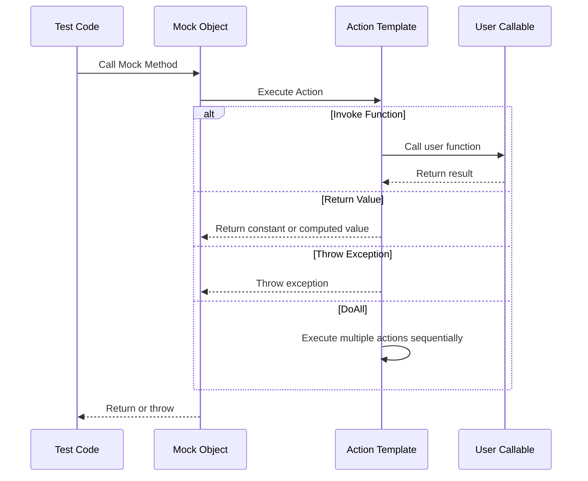

# Mock Actions

This page explains the built-in and user-defined action templates in GoogleMock, which allow you to specify custom mock behaviors. Actions determine what happens when a mock method is invoked during testing, such as returning values, throwing exceptions, or invoking custom logic.

GoogleMock provides several core built-in actions such as `Invoke`, `Return`, and `Throw`. Additionally, it supports advanced variadic actions that let you compose complex behaviors for mock methods.

---

## Action Templates Overview

GoogleMock offers a rich set of action templates for controlling mock method behaviors in tests. These include:

- **Invoke**: Calls a function, method, functor, or lambda when the mock is invoked.
- **Return**: Specifies a fixed value or varying responses to return from the mock call.
- **Throw**: Throws an exception from the mock method.
- **Variadic Actions**: Advanced templates like `DoAll`, `WithArg`, and `InvokeArgument` to perform sequences of actions or manipulate arguments.

Each action is defined in the `::testing` namespace and can be combined or customized to simulate complex interactions.

---

## Core Action Types

### Invoke: Calling Callables or Member Functions

Allows the mock method to delegate execution to a callable object:

```cpp
using ::testing::Invoke;

class MockFoo {
 public:
  MOCK_METHOD(int, Compute, (int x), (override));
};

int RealCompute(int x) { return x * 2; }

MockFoo mock;
EXPECT_CALL(mock, Compute(5))
    .WillOnce(Invoke(RealCompute));

// On call, RealCompute(5) is invoked, returning 10
int result = mock.Compute(5);
```

`Invoke` also supports invoking member functions on objects:

```cpp
class Helper {
 public:
  int AddOne(int x) { return x + 1; }
};

Helper helper;
EXPECT_CALL(mock, Compute(3))
    .WillOnce(Invoke(&helper, &Helper::AddOne));
```

`Invoke` can accept lambdas or functors, letting you embed custom logic inline.

### Return: Specifying Return Values

The `Return()` action immediately returns a specified value when the mock method is called.

```cpp
using ::testing::Return;

EXPECT_CALL(mock, Compute(10))
    .WillOnce(Return(42));

int result = mock.Compute(10); // returns 42
```

Variations include `ReturnRef()` for returning references and `ReturnPointee()` for returning the pointed-to value. You can also specify sequences:

```cpp
EXPECT_CALL(mock, Compute(_))
    .WillOnce(Return(1))
    .WillOnce(Return(2))
    .WillRepeatedly(Return(3));
``` 

### Throw: Simulating Exceptions

Using `Throw()` lets a mock method throw an exception when called, useful for testing error paths.

```cpp
using ::testing::Throw;

EXPECT_CALL(mock, Compute(0))
    .WillOnce(Throw(std::runtime_error("invalid input")));

// mock.Compute(0) will throw.
```

---

## Advanced Variadic Actions

GoogleMock supports several composable actions allowing you to implement complex behaviors.

### DoAll

Executes multiple actions in sequence for the same mock call. The result of the last action is returned.

```cpp
using ::testing::DoAll;
using ::testing::SetArgPointee;
using ::testing::Return;

EXPECT_CALL(mock, MutateValue(_))
    .WillOnce(DoAll(
        SetArgPointee<0>(10),  // set *arg0 = 10
        Return(true)          // then return true
    ));
```

### WithArg and WithArgs

Pass selected arguments of the mock method to another action.

```cpp
using ::testing::WithArg;

// Calls the inner action with the 1st argument.
EXPECT_CALL(mock, SomeFunc(_, _))
    .WillOnce(WithArg<1>(Invoke(SomeOtherFunc)));

// Calls the inner action with the 0th and 2nd argument.
EXPECT_CALL(mock, SomeFunc(_, _, _))
    .WillOnce(WithArgs<0, 2>(Invoke(AnotherFunc)));
```

### WithoutArgs

Invokes an action without passing any arguments.

```cpp
using ::testing::WithoutArgs;

EXPECT_CALL(mock, Process(_))
    .WillOnce(WithoutArgs(Invoke([] { DoSomething(); })));
```

### InvokeArgument

Invokes a callable argument passed into the mock method.

```cpp
using ::testing::InvokeArgument;

EXPECT_CALL(mock, Process(_, _))
    .WillOnce(InvokeArgument<1>(42));  // calls second argument as a callable with 42
```

If the callable takes reference parameters, you can wrap arguments with `std::ref()`.

---

## Defining Custom Actions

You can create your own actions using the `ACTION`, `ACTION_P`, and `ACTION_TEMPLATE` macros. They provide a succinct way to define complex behaviors.

Example of a simple action that returns the sum of two arguments:

```cpp
ACTION(Sum) { return arg0 + arg1; }

EXPECT_CALL(mock, Add(_, _))
    .WillOnce(Sum());
```

Parameterized actions allow passing custom parameters:

```cpp
ACTION_P(AddN, n) { return arg0 + n; }

EXPECT_CALL(mock, Add(_, _))
    .WillOnce(AddN(5));
```

More details and examples are available in the [gMock Cookbook](https://google.github.io/googletest/gmock_cook_book.html#new-actions).

---

## Tips and Best Practices

- Prefer using `ON_CALL` to specify default behaviors without imposing expectations; reserve `EXPECT_CALL` for calls you want to verify.
- When specifying multiple actions with `WillOnce` and `WillRepeatedly`, remember gMock infers how many times the mock method is expected to be called.
- Use `RetiresOnSaturation()` to deactivate an expectation once its call count is reached.
- Use `DoAll` to combine multiple side effects in a single mock method call.
- Use `InvokeArgument` to call callbacks passed as arguments without handcrafting mock behavior.
- When returning move-only types, use lambdas or `Return(ByMove(...))` with care.

---

## Common Pitfalls

- Forgetting to specify actions for methods that do not have built-in default returns can cause runtime errors.
- Actions like `DoDefault()` cannot be used inside composite actions like `DoAll()`.
- Be cautious with sticky expectations in sequences; use `RetiresOnSaturation()` as needed.
- Calling uninteresting methods without expectations leads to warnings unless you use `NiceMock`.

---

## References

For further detailed recipes and API details, see:

- [Actions Reference](../reference/actions.md)
- [gMock Cookbook - Using Actions](https://google.github.io/googletest/gmock_cook_book.html#using-actions)
- [gMock Cheat Sheet](../docs/gmock_cheat_sheet.md#actionlist)

---

## Diagram: Action Flow in Mock Invocation


