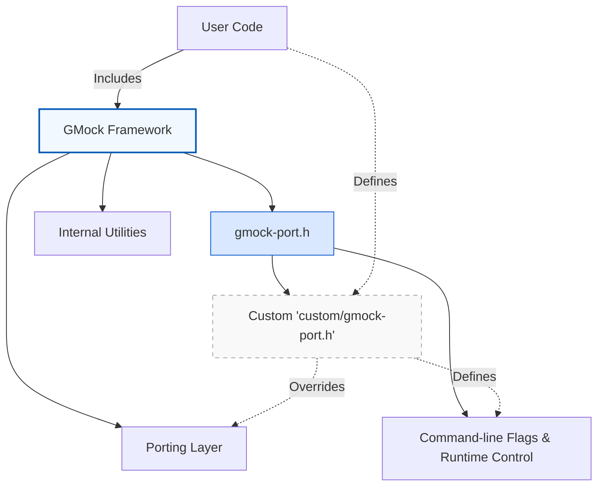

# Customization & Internals

An essential resource for advanced users aiming to **extend**, **adapt**, or deeply **integrate** GoogleTest and GoogleMock is their suite of customization hooks, internal utilities, and porting APIs. This documentation provides a comprehensive overview of these mechanisms, detailing how you can influence the frameworks' behavior or tailor them for special environments, without breaking the robust test capabilities GoogleTest and GoogleMock offer.

---

## Overview

GoogleTest and GoogleMock are designed to be highly configurable and portable across platforms, compilers, and build environments. This flexibility is achieved through internal interfaces and macros primarily exposed in the `gmock-port.h` header, which serves as the primary entry point for customization related to platform-specific behavior, feature overrides, and flag integration.

### Key Customization Areas
- **Flags & Command-Line Options:** Control runtime behavior and logging verbosity
- **Porting Macros & Utilities:** Adapt framework internals to diverse systems and compilers
- **Internal Namespaces:** Facilities that are not part of the public API but may be customized carefully

---

## The `gmock-port.h` Interface

This header is the main injection point for platform and user-specific customizations within GoogleMock (and by extension GoogleTest). It encapsulates macros and declarations that enable configuration of compile-time and runtime aspects.

### What You Can Customize
- **Flag Declarations and Definitions:**
  - `GMOCK_DECLARE_bool_(name)`
  - `GMOCK_DECLARE_int32_(name)`
  - `GMOCK_DECLARE_string_(name)`
  - `GMOCK_DEFINE_bool_(name, default_val, doc)`
  - `GMOCK_DEFINE_int32_(name, default_val, doc)`
  - `GMOCK_DEFINE_string_(name, default_val, doc)`
- **Flag Access Macros:**
  - `GMOCK_FLAG_GET(flag_name)`
  - `GMOCK_FLAG_SET(flag_name, value)`

These macros abstract away differences between underlying flag implementations, such as Google's Abseil flags or native implementations, allowing GoogleMock's core code to remain portable and independent of the flag system.

### How to Use
Defining or declaring a GoogleMock-specific flag involves using these macros rather than dealing directly with the flag system. This ensures that whether you're using Abseil or a fallback implementation, your customizations will seamlessly integrate.

Example:

```cpp
// Declare a boolean flag
GMOCK_DECLARE_bool_(my_custom_flag);

// Define and initialize the flag, defaulting to true
GMOCK_DEFINE_bool_(my_custom_flag, true, "Enables my custom feature");

// Use the flag
if (GMOCK_FLAG_GET(my_custom_flag)) {
  // Custom behavior
}

// Modify the flag at runtime
GMOCK_FLAG_SET(my_custom_flag, false);
```

### Enabling Customizations
The `custom/gmock-port.h` file is included within the internal implementation, allowing users or platform vendors to provide override implementations or additional macros to control GoogleMock's behavior in their environments.

---

## Internal Namespaces and Utilities

GoogleMock encapsulates much of its internal logic in namespaces and headers not meant for public use. Nevertheless, advanced users can access or modify these aspects if needed by including internal headers, but such usage comes with risk as these APIs could change without notice.

Examples include:
- Internal logging and formatting utilities
- Locking and threading mechanisms
- Low-level matcher utilities

> **Warning:** Direct use of internal APIs is risky and should be approached with caution. Always verify compatibility with the framework version you are using.

---

## Porting and Platform Support

The frameworks support a wide range of platforms and compilers. The porting layer handles:

- Compiler quirks and limitations
- Platform-specific threading and synchronization
- Integration with various runtime environments

This is primarily achieved via conditional definitions and macros in the porting headers.

Users integrating GoogleTest/GoogleMock into custom or embedded systems should evaluate this layer, possibly supplying custom implementations in `custom/gmock-port.h` to meet specialized requirements.

---

## How to Extend GoogleMock via Customization Points

1. **Adjust Runtime Flags:** Use the macros for declaring and controlling custom flags tailored to your environment or debugging needs.
2. **Compile-Time Configuration:** Define macros before including GoogleMock headers to tweak behavior such as allocator use, exceptions handling, or threading support.
3. **Provide Custom Implementations:** Override or augment ports, logging, or synchronization through `custom/gmock-port.h`.

---

## Additional Advanced Topics

The following topics, while not part of the public API, represent important avenues for advanced adaptation:

- **Custom Allocators:** Modify memory management to suit embedded or constrained environments.
- **Logging Integration:** Tie GoogleMock's logging into external systems or adjust verbosity granularly.
- **Multi-threading Safety:** Extend or alter locking strategies for complex test scenarios.

---

## Practical Tips

- **Keep Customizations Maintainable:** Use customizations sparingly and document their necessity to prevent problems during upgrades.
- **Test Custom Changes Thoroughly:** Deep framework adaptations may break internal assumptions.
- **Monitor Framework Updates:** GoogleTest and GoogleMock evolve; regularly review changes to customization APIs.

---

## References and Further Reading

- [gmock-port.h source and customization](https://github.com/google/googletest/blob/main/googlemock/include/gmock/internal/gmock-port.h)
- [GoogleMock source code and internal utilities](https://github.com/google/googletest/tree/main/googlemock/include/gmock/internal)
- GoogleTest & GoogleMock [Customization & Integration Guide](https://github.com/google/googletest/tree/main/googlemock/internal/custom)
- Related: [GoogleMock Cookbook](docs/gmock_cook_book.md), [Mocking Reference](docs/reference/mocking.md)

---

## Diagram: Customization Point Overview



This diagram shows the relationship between user customizations and internal framework layers, highlighting where users inject their adaptations.

---

## Summary

Customization and internal utilities exposed by GoogleTest and GoogleMock empower power users and integrators to tailor testing environments, runtime behavior, and platform compatibility. The primary entry is via the `gmock-port.h` interface and the optional `custom/gmock-port.h` file, where flags, macros, and platform-specific code injection occur. Users aiming to tweak memory, logging, threading, or flag behavior can do so here, always bearing in mind that these are advanced customization points that require careful maintenance.

---

## Best Practices

- Prefer using official APIs documented elsewhere for common testing and mocking needs.
- Use customization only when necessary for environment-specific requirements.
- Keep customizations isolated and well documented.
- Monitor release notes for breaking changes impacting customization.

---

For ongoing updates and full technical details, refer to the GitHub repository and official documentation listed above.
