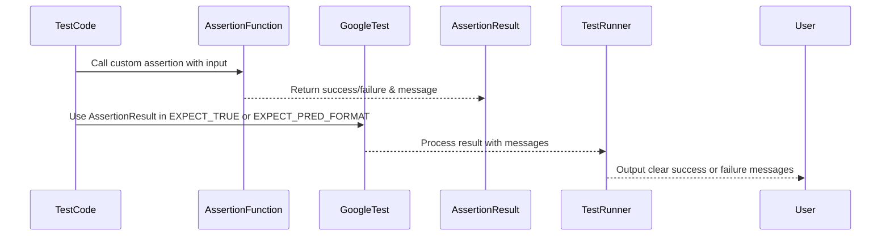

# Custom Assertions & Matchers

GoogleTest empowers you to craft **custom assertions and matchers** tailored precisely to your testing needs. This page guides you through defining, registering, and using these powerful tools in your tests to create clear, expressive, and maintainable validation logic.

Custom assertions and matchers shine when built-in options aren't sufficient. They let you encapsulate complex validation rules, generate informative failure messages, and make test code more readable and intent-revealing.

---

## Why Use Custom Assertions and Matchers?

Imagine your test requires checking complex conditions that are too subtle or verbose for standard assertions like `EXPECT_TRUE` or `EXPECT_EQ`. Writing raw expressions often leads to cryptic test failures, causing frustration during debugging.

Custom assertions and matchers solve this by:

- **Providing descriptive failure messages** that show why and how a check failed.
- **Encapsulating complex validation logic** into reusable components.
- **Improving test readability and maintainability** by giving meaningful names to conditions.

---

## Writing Custom Boolean Predicate Assertions

GoogleTest lets you define predicate functions that return a simple `bool`. However, such predicates provide limited failure information: when the assertion fails, you only get to know *that* it failed, but not *why*.

### The Problem with Raw Booleans

Consider testing if a number is even:

```cpp
bool IsEven(int n) {
  return (n % 2) == 0;
}
```

Using this predicate in `EXPECT_TRUE`:

```cpp
EXPECT_TRUE(IsEven(n));
```

If the test fails, the output will be:

```
Value of: IsEven(n)
  Actual: false
Expected: true
```

No details on what `n` was or why the check failed, making diagnosing tedious.

### Return `AssertionResult` Instead

To get richer messages, define predicates returning `testing::AssertionResult` instead of `bool`.

Custom predicates can signal success or failure and stream explanatory messages:

```cpp
#include <gtest/gtest.h>

using ::testing::AssertionResult;

AssertionResult IsEven(int n) {
  if ((n % 2) == 0) {
    return AssertionSuccess();
  } else {
    return AssertionFailure() << n << " is odd";
  }
}
```

Now when you use:

```cpp
EXPECT_TRUE(IsEven(3));
```

The failure message is:

```
Value of: IsEven(3)
  Actual: false (3 is odd)
Expected: true
```

This enhanced feedback helps you immediately see *why* the test failed.

#### Tip: Provide Success Messages for Negative Assertions

If you use `EXPECT_FALSE` and want it to also produce informative messages, include success messages:

```cpp
AssertionResult IsEven(int n) {
  if ((n % 2) == 0)
    return AssertionSuccess() << n << " is even";
  else
    return AssertionFailure() << n << " is odd";
}
```

It will print:

```
Value of: IsEven(8)
  Actual: true (8 is even)
Expected: false
```

but bear in mind this may slightly reduce performance.

---

## Using Predicate-Formatter Assertions

Sometimes, your predicate may need even more control over failure messages or handle cases where some arguments cannot be streamed. In such cases, GoogleTest offers *predicate-format assertions* where you define a predicate-formatter function.

### Defining a Predicate-Formatter Function

A predicate-formatter takes as arguments the expressions as strings and their evaluated values, and returns an `AssertionResult`.

Example for two arguments:

```cpp
#include <gtest/gtest.h>

using ::testing::AssertionResult;

AssertionResult AssertSumEquals(
    const char* expr1, const char* expr2, int val1, int val2) {
  if (val1 + val2 == 10) {
    return AssertionSuccess();
  } else {
    return AssertionFailure() << "Expected sum of " << expr1 << " and "
                              << expr2 << " to be 10 but was " << val1 + val2;
  }
}
```

Use with assertions such as:

```cpp
EXPECT_PRED_FORMAT2(AssertSumEquals, x, y);
```

Here, the failure message may read:

```
Expected sum of x and y to be 10 but was 7
```

This format gives you the utmost flexibility.

---

## Defining Custom Matchers

Beyond predicates, GoogleMock's matcher interface lets you create reusable, composable matcher objects, which can be used in `EXPECT_THAT` and mock expectations.

### Quick Matchers Using Macros

The easiest way to define a matcher is using the `MATCHER` family of macros.

Basic example:

```cpp
MATCHER(IsDivisibleBy7, "Checks if divisible by 7") {
  return (arg % 7) == 0;
}
```

Usage:

```cpp
EXPECT_THAT(value, IsDivisibleBy7());
```

Custom failure message automatically reflects success or negation:

```
Value of: value
Expected: is divisible by 7
  Actual: 23 (the remainder is 2)
```

### Parameterized Matchers

Use `MATCHER_P`, `MATCHER_P2`, etc. to define matchers that take parameters:

```cpp
MATCHER_P(HasAbsoluteValue, val, "") {
  return abs(arg) == val;
}
```

Usage:

```cpp
EXPECT_THAT(number, HasAbsoluteValue(10));
```

Gives message:

```
Expected: has absolute value 10
  Actual: -9
```

### Writing Matcher Classes

For more control, define a matcher class implementing:

- `bool MatchAndExplain(T arg, std::ostream* os) const;`
- `void DescribeTo(std::ostream* os) const;`
- `void DescribeNegationTo(std::ostream* os) const;`

and provide a factory function returning `::testing::Matcher<T>`.

Example:

```cpp
class DivisibleBy7Matcher {
 public:
  using is_gtest_matcher = void;

  bool MatchAndExplain(int n, std::ostream* os) const {
    if ((n % 7) != 0 && os != nullptr) {
      *os << "the remainder is " << n % 7;
      return false;
    }
    return true;
  }

  void DescribeTo(std::ostream* os) const {
    *os << "is divisible by 7";
  }

  void DescribeNegationTo(std::ostream* os) const {
    *os << "is not divisible by 7";
  }
};

::testing::Matcher<int> DivisibleBy7() {
  return ::testing::Matcher<int>(new ::testing::internal::MatcherImpl<DivisibleBy7Matcher>(DivisibleBy7Matcher()));
}
```

### Polymorphic Matchers

To write matchers that can be used with multiple types, make `MatchAndExplain` a template method. Use `MakePolymorphicMatcher()` to create the matcher factory.

---

## Registering and Using Custom Assertions and Matchers in Your Tests

GoogleTest and GoogleMock integrate seamlessly with custom components.

1. **Define** your custom assertion predicate or matcher.
2. **Register** it in your test code or shared headers.
3. **Use** it in assertions, such as `EXPECT_TRUE`, `EXPECT_PRED_FORMAT*`, or `EXPECT_THAT`.

### Example: Using a Custom Assertion

```cpp
// Custom assertion:
AssertionResult IsEven(int n) {
  if (n % 2 == 0) {
    return AssertionSuccess();
  }
  return AssertionFailure() << n << " is odd";
}

TEST(MyTest, EvenCheck) {
  int val = 3;
  EXPECT_TRUE(IsEven(val));  // Will fail with informative message.
}
```

### Example: Using a Custom Matcher With GoogleMock

```cpp
MATCHER_P(MatchesRange, range, "checks if in range") {
  return arg >= range.first && arg <= range.second;
}

class MockFoo {
 public:
  MOCK_METHOD(bool, CheckValue, (int), ());
};

TEST(MyMockTest, CustomMatcher) {
  MockFoo mock;
  EXPECT_CALL(mock, CheckValue(MatchesRange(std::make_pair(3, 8))))
      .WillOnce(Return(true));

  mock.CheckValue(5);  // Passes.
  mock.CheckValue(10); // Fails as 10 not in [3, 8].
}
```

---

## Best Practices and Tips

- Use **custom assertions** when you want rich, context-aware failure messages, especially for simple predicates.
- Use **custom matchers** when you need composable, reusable matching logic, often with complex types or arguments.
- Define **polymorphic matchers** to maximize flexibility and reuse across types.
- Avoid **overly verbose** custom assertions; keep them focused and clear.
- Use `ASSERT_*` for fatal failures within helper functions that return void; use `ADD_FAILURE()` or `EXPECT_*` for non-void functions.
- Use `SCOPED_TRACE` to add trace information to failures occurring in helper functions.
- Remember, **all assertions and matchers should be pure**: they must have no side effects and always produce the same output for the same inputs.
- To learn how to make custom types print nicely in test output, see [Advanced Topics: Teaching GoogleTest to Print Your Values](advanced.md#teaching-googletest-how-to-print-your-values).

---

## Troubleshooting

### Assertion or Matcher Does Not Print Meaningful Information

- Ensure your custom assertion returns `testing::AssertionResult` and streams descriptive messages.
- For custom matchers, implement `DescribeTo` and `DescribeNegationTo` explicitly.
- For types without `operator<<`, provide `PrintTo()` or `AbslStringify()` overloads.

### Predicate or Matcher Fails Unexpectedly

- Check that your predicate or matcher is **pure** with no side effects.
- Verify that types used as parameters match expected usage.
- Use `EXPECT_PRED_FORMAT*` to get more detailed custom failure messages.

### Custom Matchers Does Not Compile

- Use macros like `MATCHER`, `MATCHER_P`, or their polymorphic variants for simplicity.
- When defining class-based matchers, ensure the matcher class includes required methods.
- Consult the mock and matcher reference documentation for API details.

---

## Related Documentation

- [GoogleTest Assertions Reference](reference/assertions.md) — for all built-in assertions
- [GoogleMock Matchers Reference](reference/matchers.md) — core and composite matchers
- [GoogleMock Cookbook](guides/gmock_cook_book.md) — practical recipes for writing matchers and assertions
- [Advanced Topics: Custom Printing](docs/advanced.md#teaching-googletest-how-to-print-your-values) — for customizing output formatting of user types
- [Mocking Reference](docs/reference/mocking.md) — for integrating custom matchers in mock expectations

---

## Summary

Custom assertions and matchers empower you to verify conditions that go beyond built-in checks, ultimately making your tests more expressive, debuggable, and maintainable. By adopting these tools, you write tests that communicate intent clearly while providing rich feedback on failures.

Leveraging predicate-returning `AssertionResult` functions and GoogleMock matcher classes, you can tailor test validations precisely, enabling high-quality automated test suites.

---

For detailed usage examples and API, refer to the sections on [Boolean Conditions](reference/assertions.md#boolean), [Predicate Assertions](reference/assertions.md#predicates), and [Matchers](reference/matchers.md). Consider reading the [Advanced Topics](docs/advanced.md) and [gMock Cookbook](guides/gmock_cook_book.md) to grow mastery.

---

## Diagram: Flow of Custom Assertion Usage in a Test


