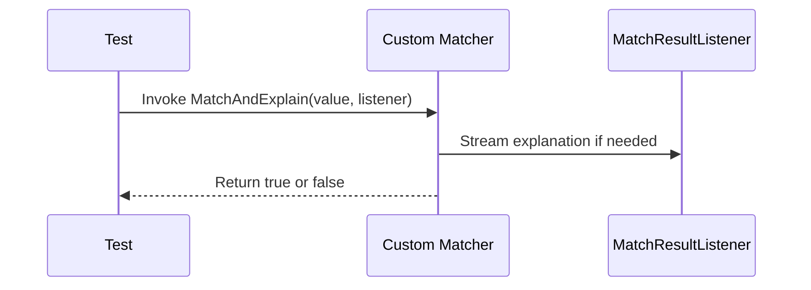

# Custom Matchers & Extensions

Guide power users through creating custom matchers, using the matcher builder APIs, and extending the framework for highly specialized or complex test validations.

---

## Overview

Custom matchers empower you to tailor GoogleMock's verification capabilities beyond the built-in matchers, enabling precise, domain-specific assertions in your tests. This page guides you through authoring your own matchers, parameterized matchers, polymorphic matchers, and composite matchers, essential for handling specialized validation scenarios.

You will learn how to:

- Create simple and parameterized matchers with expressive failure messages.
- Write polymorphic matchers that work across multiple argument types.
- Compose matchers from other matchers to build complex validation logic.
- Understand best practices to ensure matchers remain pure and side-effect free.

Maximize your testing precision and clarity by mastering custom matcher creation.

---

## Why Create Custom Matchers?

Built-in matchers cover common cases like equality, comparisons, substring checks, container contents, and pointer validations. However, software tests often demand tailored checks—for example, verifying invariants on custom data structures, complex object properties, or subtle interactions.

Custom matchers let you express these checks with clarity and efficiency, improving your test readability and failure diagnostics. Writing them ensures your test assertions map directly to your domain's semantics.

---

## Creating Simple Custom Matchers

The simplest way to create a custom matcher is using the `MATCHER` macro. It lets you write predicate logic with access to the argument's value, and optionally stream diagnostic information.

### Basic Syntax

```cpp
MATCHER(MatcherName, "Description of Matcher") {
  // arg is the argument to be matched
  // Return true if match, false otherwise
  return <condition involving arg>;
}
```

### Example: IsDivisibleBy7

```cpp
MATCHER(IsDivisibleBy7, "checks if a number is divisible by 7") {
  if ((arg % 7) == 0) return true;
  *result_listener << "the remainder is " << (arg % 7);
  return false;
}
```

#### Using the Matcher

```cpp
EXPECT_CALL(mock, Process(IsDivisibleBy7()));
EXPECT_THAT(value, IsDivisibleBy7());
```

If the test fails, you get a message like:

```
Value of: value
Expected: checks if a number is divisible by 7
  Actual: 23 (the remainder is 2)
```


### Important Considerations

- The argument type `arg` is inferred from context, making the matcher polymorphic by default.
- The `result_listener` stream allows adding rich explanation on failure.
- Ensure matchers have no side effects.

---

## Parameterized Matchers

Use `MATCHER_P`, `MATCHER_P2`, etc., macros to write matchers that take parameters, making them versatile.

### Syntax

```cpp
MATCHER_P(MatcherName, param, "Description with params") {
  return <condition using arg and param>;
}
```

### Example: HasAbsoluteValue

```cpp
MATCHER_P(HasAbsoluteValue, value, "checks if absolute value matches") {
  return std::abs(arg) == value;
}
```

#### Using the Matcher

```cpp
EXPECT_THAT(-10, HasAbsoluteValue(10));
```

Failure message:

```
Value of: -9
Expected: checks if absolute value matches 10
  Actual: -9
```

### Creating Multi-Parameter Matchers

Macros `MATCHER_P2`, `MATCHER_P3`, ... to `MATCHER_P10` support up to 10 parameters:

```cpp
MATCHER_P2(InClosedRange, low, high, "checks if in closed range") {
  return low <= arg && arg <= high;
}
```

---

## Writing Monomorphic Matchers Manually

For fine-grained control or better compiler errors, implement a matcher class:

- Declare `using is_gtest_matcher = void;`.
- Implement `bool MatchAndExplain(const T& value, std::ostream* os) const;`.
- Implement `void DescribeTo(std::ostream* os) const;`.
- Implement `void DescribeNegationTo(std::ostream* os) const;`.

### Example: DivisibleBy7Matcher

```cpp
class DivisibleBy7Matcher {
 public:
  using is_gtest_matcher = void;

  bool MatchAndExplain(int n, std::ostream* os) const {
    int remainder = n % 7;
    if (remainder != 0 && os != nullptr) {
      *os << "the remainder is " << remainder;
    }
    return remainder == 0;
  }

  void DescribeTo(std::ostream* os) const {
    *os << "is divisible by 7";
  }

  void DescribeNegationTo(std::ostream* os) const {
    *os << "is not divisible by 7";
  }
};

::testing::Matcher<int> DivisibleBy7() {
  return ::testing::MakeMatcher(new DivisibleBy7Matcher());
}
```

---

## Writing Polymorphic Matchers

Polymorphic matchers can handle multiple argument types.

### Pattern

- Define a class with template `bool MatchAndExplain(const T& value, MatchResultListener* listener) const`.
- Implement description methods as normal.
- Create a factory that returns a `PolymorphicMatcher`.

### Example: NotNull Matcher

```cpp
class NotNullMatcher {
 public:
  using is_gtest_matcher = void;

  template <typename T>
  bool MatchAndExplain(T* p, ::testing::MatchResultListener* /*listener*/) const {
    return p != nullptr;
  }

  void DescribeTo(std::ostream* os) const { *os << "isn't NULL"; }
  void DescribeNegationTo(std::ostream* os) const { *os << "is NULL"; }
};

::testing::PolymorphicMatcher<NotNullMatcher> NotNull() {
  return ::testing::MakePolymorphicMatcher(NotNullMatcher());
}
```

Use as:

```cpp
EXPECT_CALL(mock, Func(NotNull()));
```

---

## Composite Matchers

Build matchers that wrap or combine other matchers, providing composability.

Examples include:

- `AllOf(m1, m2, ...)` matches if all matchers succeed.
- `AnyOf(m1, m2, ...)` matches if any matcher succeeds.
- `Not(m)` matches if inner matcher fails.
- `Field(&Class::member, matcher)` matches object member.
- `Property(&Class::GetterMethod, matcher)` matches result of getter.

When building composite matchers, store inner matchers as `Matcher<const T&>` and use their `DescribeTo`, `DescribeNegationTo`, and `MatchAndExplain` to build failure explanations.

---

## Using Matcher Builders

Advanced users can create matchers programmatically, such as tuple matchers, container element matchers, and more, by leveraging GoogleMock's internal matcher classes (found in implementation headers).

Although this is for expert usage and extending beyond the macros, detailed exploration in the [Matchers Reference](reference/matchers.md) and [gMock Cookbook](gmock_cook_book.md) is recommended.

---

## Best Practices and Tips

- **Keep Matchers Pure:** Matchers must not produce side effects or depend on mutable state.
- **Write Clear Descriptions:** Use the `result_listener` stream to provide meaningful diagnostic messages.
- **Test Your Matchers:** Write tests to verify matcher correctness and message clarity.
- **Parameterize Wisely:** Provide parameters to make matchers reusable.
- **Use Polymorphism When Needed:** This allows matchers to adapt to argument types automatically.
- **Leverage Composition:** Build complex matchers by combining simpler ones, avoiding redundancy.

---

## Troubleshooting Common Issues

- **Compilation fails due to commas in types:** Wrap complex types in parentheses or use type aliases as documented in `MOCK_METHOD` guidelines.
- **Matcher description is unhelpful:** Provide a custom description expression in the matcher macro.
- **Matcher does not support certain argument types:** Make your matcher polymorphic or specialize for needed types.
- **Match failures are obscure:** Use the `result_listener` to explain failures clearly.

---

## Related Documentation

- [Matchers Reference](reference/matchers.md) — explore built-in and framework matcher APIs.
- [gMock Cookbook](gmock_cook_book.md) — recipes for advanced matcher creation and usage.
- [Mocking Reference](reference/mocking.md) — defining mock classes and methods.
- [Assertions Reference](reference/assertions.md) — using matchers within assertions (`EXPECT_THAT`).
- [Custom Assertions & Extending Matchers Guide](guides/advanced-usage/customization-extensions) — broader guide to customizable test assertions.

---

## Summary

Mastering custom matchers unlocks the full potential of GoogleMock, allowing you to write precise, readable, and maintainable tests that clearly express complex validation logic native to your domain. Use the tools and patterns described here to craft matchers that not only verify but also explain test expectations and failures effectively, accelerating debugging and improving test quality.

---

## Example: Full Custom Parameterized Matcher

```cpp
#include <gmock/gmock.h>
#include <cmath>

MATCHER_P2(InClosedRange, low, high,
           "is in closed range [" + ::testing::PrintToString(low) + ", " +
           ::testing::PrintToString(high) + "]") {
  return low <= arg && arg <= high;
}

// Usage
EXPECT_THAT(value, InClosedRange(10, 20));
```


---

## Diagram: Custom Matcher Flow

