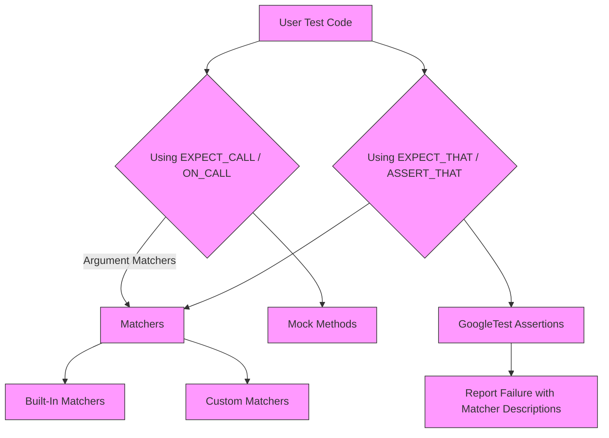

# Using Matchers

The **Matchers** page documents how to use the Matcher APIs in GoogleTest and GoogleMock, focusing on built-in matchers and usage patterns. Matchers let you specify flexible, expressive criteria for checking values passed to mock methods or verified with assertions. This page covers the types of matchers provided, how matchers integrate with expectations and assertions, and how you can extend matcher behavior to create custom matchers tailored to your testing needs.

---

## What Are Matchers?

Matchers are objects or macros that specify criteria to validate values, typically the arguments passed to mock methods. They are central to controlling mock behavior and writing assertions like `EXPECT_THAT(value, matcher)` to check if runtime values meet specific conditions.

Matchers can range from simple equality checks (e.g., `Eq(5)`) to complex predicates combining multiple conditions or inspecting container contents.


## Using Built-In Matchers

GoogleTest and GoogleMock provide a rich built-in library of matchers categorized as:

- Wildcard Matchers
- Generic Comparisons
- Floating-Point Matchers
- String Matchers
- Container Matchers
- Member Matchers
- Pointer Matchers
- Exception Matchers
- Composite Matchers

### Wildcard Matchers

- `_`: Matches any argument of the correct type.
- `A<type>()` or `An<type>()`: Matches any argument of the specified `type`.

Example:
```cpp
EXPECT_CALL(mock_obj, SomeMethod(_));  // Matches any argument
EXPECT_CALL(mock_obj, SomeMethod(A<int>()));  // Matches any int argument
```

### Generic Comparison Matchers

These matchers compare values using the standard comparison operators:

| Matcher         | Meaning                                      |
|-----------------|----------------------------------------------|
| `Eq(value)`     | Argument equals `value`                        |
| `Ne(value)`     | Argument not equal to `value`                  |
| `Lt(value)`     | Argument less than `value`                     |
| `Le(value)`     | Argument less or equal to `value`              |
| `Gt(value)`     | Argument greater than `value`                  |
| `Ge(value)`     | Argument greater or equal to `value`          |
| `IsTrue()`      | Argument evaluates to `true`                   |
| `IsFalse()`     | Argument evaluates to `false`                  |
| `IsNull()`      | Argument is null pointer                        |
| `NotNull()`     | Argument is non-null pointer                    |
| `Optional(m)`   | Argument is an `optional<>` engaged with value matching `m` |
| `VariantWith<T>(m)` | Argument is `variant<>` holding type `T` with value matching `m` |
| `Ref(variable)` | Argument is a reference to `variable`         |

### Floating-Point Matchers

Matchers for approximate equality and special floating-point conditions:

- `DoubleEq(a_double)` / `FloatEq(a_float)`: Approximate equality with a default tolerance.
- `NanSensitiveDoubleEq` / `NanSensitiveFloatEq`: Like above, but treats NaNs as equal.
- `DoubleNear` / `FloatNear`: Approximate equality with user-specified absolute error.
- `IsNan()`: Matches NaN values.

### String Matchers

Matchers designed for string comparisons, working with C strings and `std::string`:

- `StrEq`, `StrNe`, `StrCaseEq`, `StrCaseNe`
- `HasSubstr(str)` – contains substring
- `StartsWith(prefix)`
- `EndsWith(suffix)`
- `IsEmpty()` – string is empty
- `ContainsRegex(regex)`, `MatchesRegex(regex)` – regex match
- `WhenBase64Unescaped(m)` – matches after decoding base64

### Container Matchers

Matchers to inspect STL-style containers and arrays:

- `Contains(e)`: Checks if at least one element matches `e`.
- `ElementsAre(...)`: Exact matching of elements in order.
- `ElementsAreArray(...)`: Like `ElementsAre` but takes a sequence.
- `UnorderedElementsAre(...)`: Matches elements ignoring order.
- `UnorderedElementsAreArray(...)`: Unordered version of above for sequences.
- `Each(e)`: All elements match `e`.
- `SizeIs(m)`: Checks container size.
- `BeginEndDistanceIs(m)`: Checks iterator distance.
- `ContainerEq(container)`: Checks container equality with detailed diagnostics.
- `WhenSorted(m)`, `WhenSortedBy(comparator, m)`: Compare after sorting.
- `IsSubsetOf()`, `IsSupersetOf()`: Partial/complete subset/superset match.
- `Pointwise(m, container)`, `UnorderedPointwise(m, container)`: Elementwise matching with pair matcher.

### Member Matchers

Matchers to test properties or fields inside objects:

- `Field(&Class::field, matcher)`: Matches if the object's field matches.
- `Field("field_name", &Class::field, matcher)`: Same, with explicit field name for better errors.
- `Property(&Class::method, matcher)`: Matches if property's getter return value matches.
- `Property("property_name", &Class::method, matcher)`: With explicit property name for error clarity.

> **Warning:** Avoid using `Property()` on member functions you do not control, as function addresses may be unstable.

### Pointer Matchers

Matchers for pointer types (raw or smart pointers):

- `Address(m)`: The address of the argument matches `m`.
- `Pointee(m)`: The value pointed to by the pointer matches `m`.
- `Pointer(m)`: The pointer itself matches `m`.
- `WhenDynamicCastTo<T>(m)`: Matches objects dynamically cast to type T matching `m` (requires RTTI).

### Exception Matchers

Matchers for testing that callables throw exceptions:

- `Throws<E>()`: Throws an exception of type `E`.
- `Throws<E>(m)`: Throws exception of type `E` that matches `m`.
- `ThrowsMessage<E>(m)`: Throws exception of type `E` with message matching `m`.


## Using Matchers With Assertions

Matchers integrate seamlessly with gTest assertions:

```cpp
EXPECT_THAT(actual_value, matcher);
ASSERT_THAT(actual_value, matcher); // fatal failure on mismatch
```

These assertions generate readable failure messages referencing the matcher descriptions for clarity.

> **Best Practice:** Make expectations explicit by wrapping values in matchers like `Eq(value)` instead of relying on implicit conversions in `EXPECT_THAT`.

## Combining and Composing Matchers

Matchers can be composed to express complex conditions:

- Logical combinations: `AllOf(m1, m2, ...)` requires all to match.
- `AnyOf(m1, m2, ...)` requires at least one to match.
- Negation: `Not(m)` matches if `m` does not.
- Conditional matchers: `Conditional(cond, m1, m2)` selects matcher based on `cond`.

You can also combine matchers at tuple and container levels to build intricate match conditions.

## Custom Matchers

While built-in matchers serve most needs, you can define your own:

- Use `MATCHER(name, description) { ... }` macros for quick definitions.
- Define matcher classes implementing the matcher interface for advanced control.

Custom matchers allow:
- Custom predicates with detailed failure explanations.
- Parameterized matchers using `MATCHER_P` and variants.
- Composable reusable matchers tailored to your domain.


## Practical Tips and Best Practices

- Use `ON_CALL()` for default mock method behaviors without setting call count expectations.
- Use `EXPECT_CALL()` when verifying specific invocations.
- Avoid excessive constraints to keep tests robust and maintainable.
- Use wildcards (`_`) when argument specifics do not matter.
- When matching container elements, choose between ordered (`ElementsAre`) and unordered (`UnorderedElementsAre`) based on semantics.
- Prefer `Matchers` over raw assertions for clearer diagnostics.

## Common Pitfalls

- Watch out for implicit conversions causing unexpected matcher behaviors.
- Be careful when matching pointers—distinguish between pointer value and pointee.
- Avoid producing side effects inside matchers; they must be pure functions.
- When matching overloaded methods, you may need `TypedEq<type>` or explicit casts.

---

## Summary

Matchers are a cornerstone of effective testing with GoogleTest and GoogleMock. Mastering them empowers you to write expressive, maintainable, and informative test expectations and assertions.

For more comprehensive coverage on assertions integration, see the [Assertions Reference](../reference/assertions.md).

For advanced custom matcher creation, explore the [Custom Assertions and Matchers Guide](../guides/advanced-usage-integration/custom-assertions-matchers.md).

---

## Example Usage

```cpp
// Using built-in matcher to specify expected argument equality
EXPECT_CALL(mock_obj, Foo(Eq(42))).WillOnce(Return(true));

// Using wildcard matcher to match any argument
EXPECT_CALL(mock_obj, Bar(_)).Times(AnyNumber());

// Using composite matcher
EXPECT_CALL(mock_obj, Baz(AllOf(Gt(10), Lt(100))));

// Matching container with ElementsAre
EXPECT_CALL(mock_obj, ProcessVector(ElementsAre(1, 2, Gt(3))));

// Using matcher in assertion
int value = Calculate();
EXPECT_THAT(value, Ge(5));

// Custom matcher
MATCHER(IsDivisibleBy3, "is divisible by 3") {
  return (arg % 3) == 0;
}
EXPECT_THAT(9, IsDivisibleBy3());
```

## How Matchers Fit Into GoogleTest

Matchers enhance both mocking and assertion capabilities:
- Used in `EXPECT_CALL` and `ON_CALL` to define argument expectations and default behaviors.
- Used in `EXPECT_THAT` and `ASSERT_THAT` to validate test values with clear messages.

This page works alongside the [Assertions Reference](../reference/assertions.md) and [Mocking Reference](../docs/reference/mocking.md) in the overall documentation navigation.


<Info>
Matchers must be pure functions without side effects, ensuring tests are deterministic and reliable.
</Info>

<Warning>
Avoid implicit type conversions inside matchers to prevent subtle bugs and confusing failures.
</Warning>

<Note>
Use `SafeMatcherCast<T>(m)` to safely cast matchers to compatible types when needed.
</Note>

---

## Mermaid Diagram: Matcher Integration Overview



This diagram illustrates how matchers are central to verifying function arguments in mocks and running expressive assertions.

---

## Troubleshooting

- **Matcher not matching expected argument?** Double-check the types involved. Use `TypedEq<type>(value)` for overloaded methods.
- **Getting "Uninteresting mock function call" warnings?** Use `NiceMock` to suppress or add appropriate `EXPECT_CALL` statements.
- **Custom matcher messages unclear?** Use the `result_listener` in custom `MATCHER` macros to stream additional details.
- **Compilation errors mocking methods with commas in types?** Follow `MOCK_METHOD` usage by wrapping comma-containing types in extra parentheses or defining type aliases.


## Next Steps

- Deepen understanding with the [Matchers Reference](../docs/reference/matchers.md).
- Learn how to define [Custom Matchers](../guides/advanced-usage-integration/custom-assertions-matchers.md).
- Explore the integration of matchers in [Mocking Reference](../docs/reference/mocking.md) for controlling mock behaviors.
- Review sample tests using matchers in the [gMock Cookbook](../docs/gmock_cook_book.md).


---

## References
- [Matchers Reference](../docs/reference/matchers.md)
- [Assertions Reference (EXPECT_THAT)](../reference/assertions.md#EXPECT_THAT)
- [Mocking Reference](../docs/reference/mocking.md)
- [Custom Assertions and Matchers Guide](../guides/advanced-usage-integration/custom-assertions-matchers.md)
- [gMock Cookbook](../docs/gmock_cook_book.md)
- [GoogleTest Primer](../overview/getting-started/product-intro.md)

---

<Check>
Ensure you understand matcher purity and argument type correctness for reliable mocks and assertions.
</Check>

---

# Summary
GoogleTest's Matcher API empowers developers to write expressive, flexible tests by defining precise criteria for verifying mock method arguments and test values. This page comprehensively covers the built-in matchers available, how to use them in assertions and mock expectations, and guides users on creating custom matchers to fit unique testing scenarios.
