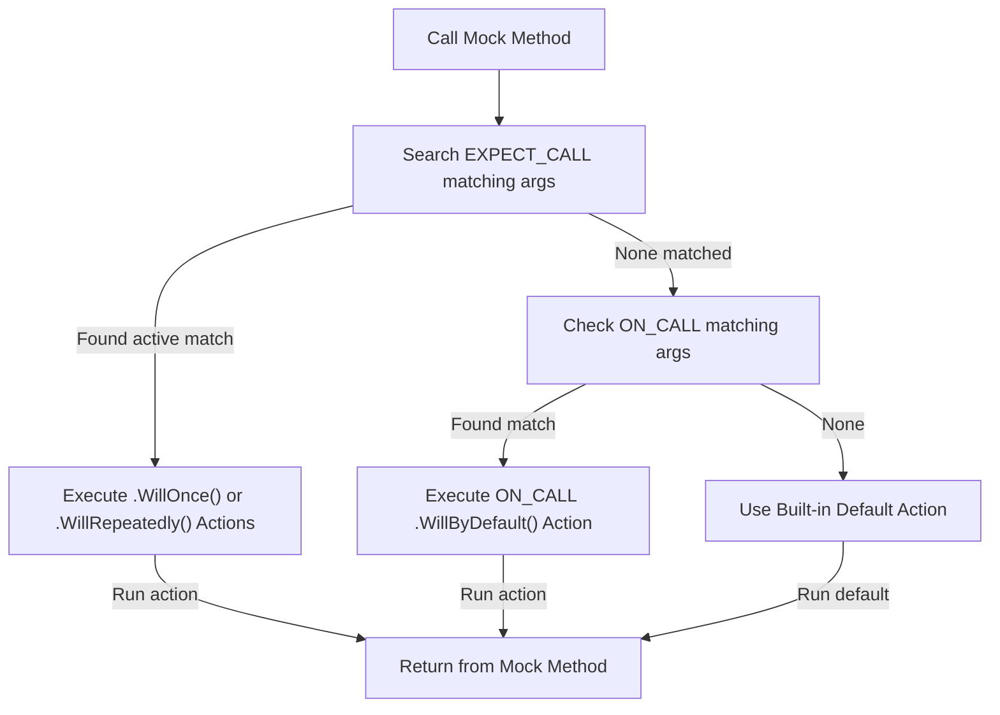

# Actions and Call Behaviors

This document explains how to control what happens when mock methods are called in GoogleMock. It covers the specification of actions—both built-in and custom—that define the behavior of mock methods during a test. You will learn how to use the Actions API, how default return behaviors work, and essential patterns to manage mock call results effectively.

---

## Overview: What Are Actions?

When you mock a method, the mock itself does not have a real implementation. Instead, you _specify an action_ that dictates what should happen when the method is called. Actions can:

- Return specific values
- Set output parameters
- Call custom functions or lambdas
- Throw exceptions
- Perform sequences of things

Actions are central to making your mocks behave realistically and align with the scenarios you want to test.

---

## Setting Actions Using EXPECT_CALL

In GoogleMock, you specify actions on expected calls using `EXPECT_CALL(...)` with `.WillOnce(...)` and `.WillRepeatedly(...)` clauses.

### Basic Syntax

```cpp
EXPECT_CALL(mock_object, Method(matchers...))
    .WillOnce(action1)
    .WillOnce(action2)
    .WillRepeatedly(action3);
```

- `.WillOnce(...)` specifies the action to perform for one matching call, in the sequence they are written.
- `.WillRepeatedly(...)` specifies the action to perform for any further calls after all `WillOnce` actions are consumed.

If no action is specified, the mock method uses a default action (covered later).

### Example: Returning Different Values on Calls

```cpp
using ::testing::Return;

EXPECT_CALL(mock_turtle, GetX())
    .WillOnce(Return(100))
    .WillOnce(Return(200))
    .WillRepeatedly(Return(300));
```

This means:
- The first call returns 100
- The second call returns 200
- All subsequent calls return 300

### Inferring the Number of Calls

If you omit `.Times()`, GoogleMock infers how many times the call is expected based on the number of `WillOnce()` and/or `WillRepeatedly()` statements:

- No `.WillOnce()` or `.WillRepeatedly()` → default `Times(1)`
- N `.WillOnce()` and no `.WillRepeatedly()` → `Times(N)`
- N `.WillOnce()` and one `.WillRepeatedly()` → `Times(AtLeast(N))`

---

## Default Actions with ON_CALL

To specify what the method should do when called _without an expectation_, use the `ON_CALL(...)` macro. Unlike `EXPECT_CALL`, `ON_CALL` does *not* assert that the call must happen. It merely sets the default behavior:

```cpp
ON_CALL(mock_turtle, GetX())
    .WillByDefault(Return(42));
```

This means calls to `GetX()` that do not match any `EXPECT_CALL` will return 42 by default.

### Syntax

```cpp
ON_CALL(mock_object, Method(matchers...))
    .With(multi_argument_matcher)  // optional, at most once
    .WillByDefault(action);        // mandatory, exactly once
```

- `.With()` restricts to calls where all arguments passed as a tuple match the given multi-argument matcher.
- `.WillByDefault()` sets the action to take for matching method calls.

`ON_CALL` settings are overridden by any matching `EXPECT_CALL` actions.

---

## Built-in Actions

GoogleMock offers a rich set of predefined actions to specify mock behavior.

### Returning Values

| Action                       | Description                                         |
| ---------------------------- | -------------------------------------------------- |
| `Return()`                   | Return from a void mock function.                   |
| `Return(value)`              | Return a copy of `value`. Conversion to return type happens at expectation set time. |
| `ReturnRef(variable)`        | Return a reference to `variable` (use for reference return types). |
| `ReturnRefOfCopy(value)`     | Return a reference to a copy of `value` (copy lives with the action). |
| `ReturnPointee(ptr)`         | Return the value pointed by `ptr` when action runs. |
| `ReturnNull()`               | Return a null pointer (works for raw and smart pointers). |
| `ReturnRoundRobin({a1,...})` | Return values from a list round-robin.               |
| `ReturnNew<T>(args...)`      | Create and return a new `T` using the arguments each time called. |

### Side Effects

| Action                        | Description                                      |
| ----------------------------- | ------------------------------------------------ |
| `Assign(&var, value)`         | Assign `value` to variable `var`.                |
| `DeleteArg<N>()`              | Delete the pointer argument at index N.          |
| `SaveArg<N>(pointer)`         | Save argument N by copy to `*pointer`.           |
| `SaveArgByMove<N>(pointer)`   | Save argument N by move to `*pointer`.           |
| `SetArgReferee<N>(value)`    | Assign `value` to the variable referred to by argument N. |
| `SetArgPointee<N>(value)`    | Assign `value` to the variable pointed to by argument N. |
| `SetArrayArgument<N>(first, last)` | Copy range `[first,last)` into argument N (pointer or iterator). |
| `SetErrnoAndReturn(error, value)` | Set global `errno` and return `value`.       |
| `Throw(exception)`            | Throw the passed exception.                       |

### Calling Callbacks or Arbitrary Functions

| Action                                   | Description                                               |
| ---------------------------------------- | --------------------------------------------------------- |
| Callable `f`                             | Call a callable `f` with the same arguments as mock.       |
| `Invoke(f)`                             | Like above but with support for pointers, methods, lambdas.|
| `Invoke(object_ptr, &Class::method)`    | Calls given method on the object with mock arguments.      |
| `InvokeWithoutArgs(f)`                   | Calls `f` without passing mock arguments.                  |
| `InvokeArgument<N>(args...)`             | Invoke the N-th argument (callable) with specified args.   |

### Composite Actions

| Action                       | Description                                         |
| ---------------------------- | -------------------------------------------------- |
| `DoAll(a1, a2, ..., an)`      | Executes all actions in sequence, returns last action's result. |
| `IgnoreResult(a)`             | Perform `a` but ignore its return value.            |
| `WithArg<N>(a)`               | Pass mock's argument N to inner action `a`.         |
| `WithArgs<N1, N2, ..., Nk>(a)` | Pass selected arguments to `a`.                      |
| `WithoutArgs(a)`              | Invoke `a` with no arguments.                         |

---

## Using Actions in Practice

### Example: Setting Default Behavior

```cpp
ON_CALL(mock, GetValue())
    .WillByDefault(Return(100));
```

### Example: Overriding with Expectation

```cpp
EXPECT_CALL(mock, GetValue())
    .WillOnce(Return(42));

EXPECT_EQ(42, mock.GetValue());  // from EXPECT_CALL
EXPECT_EQ(100, mock.GetValue()); // from ON_CALL default
```

### Example: Simulating Side Effects

Suppose your mock method sets an output parameter, you can use `SetArgPointee`:

```cpp
EXPECT_CALL(mock, Mutate(_, _))
    .WillOnce(DoAll(SetArgPointee<1>(5), Return(true)));
```

When `Mutate(arg0, arg1)` is called, `*arg1` will be set to 5, and the method returns true.

### Example: Invoking a Callback

If your mock method receives a callback as an argument and you want to invoke it:

```cpp
EXPECT_CALL(mock, DoSomething(_, _))
    .WillOnce(InvokeArgument<1>(42));
```

This will call the second argument (index 1), presumed callable, with value 42.

### Example: Combining Multiple Actions

```cpp
EXPECT_CALL(mock, Process())
    .WillOnce(DoAll(
        InvokeWithoutArgs([] { Init(); }),
        Return(true)));
```

`Init()` runs first, then method returns `true`.

---

## Default Return Values

If no action is specified, GoogleMock uses **built-in default actions**:

- Void methods return immediately.
- `bool` methods return `false`.
- Numeric methods return `0`.
- Pointer methods return `nullptr`.
- Methods whose return type has a default constructor return the default constructed value.

### Overriding Defaults per Type

You can customize this by using `::testing::DefaultValue<T>`:

```cpp
DefaultValue<int>::Set(100);
// Now int-returning mock methods return 100 by default
DefaultValue<int>::Clear();
```

### Overriding Defaults per Mock Method

Use `ON_CALL` to specify default action on a method level.

---

## Key Patterns and Best Practices

### 1. Use ON_CALL for Default Behavior

Set common fallback behaviors with `ON_CALL`. This avoids over-constraining tests.

### 2. Use EXPECT_CALL for Verifying Interactions

Use `EXPECT_CALL` to assert that your code interacts with mocks as expected.

### 3. Sequence Your Actions with WillOnce and WillRepeatedly

Control call-by-call actions using `WillOnce` for specific calls and `WillRepeatedly` for all following calls.

### 4. Control Return Reference vs Copy

Use `ReturnRef()` to return references and `Return()` for copies. `ReturnPointee()` fetches the value pointed to at invocation time.

### 5. Mock Side Effects with SetArgPointee and DoAll

Combine side effects and return values using `DoAll()`, making tests more expressive and precise.

### 6. Avoid Sharing Stateful Actions

Be cautious when reusing actions with internal mutable state - prefer fresh instances to avoid unexpected test behaviors.

### 7. Use Invoke* for Custom Logic

Invoke custom functions, lambdas, or callbacks inline for flexible behavior.

### 8. Use RetiresOnSaturation When Needed

To retire an expectation after it reaches its call limit, use `.RetiresOnSaturation()`. This helps modeling non-sticky expectations.

---

## Troubleshooting and Common Pitfalls

- **Default return type issues:** If your mock returns unexpected defaults, check if a suitable `ON_CALL` or `DefaultValue<T>` is set.

- **Actions running out:** If you use fewer `WillOnce()` than calls, and omit `WillRepeatedly()`, the default action runs, which might be unexpected.

- **Multiple WillRepeatedly():** Only one is allowed per expectation.

- **Using DoDefault() improperly:** Do not use `DoDefault()` inside an `ON_CALL` — it causes failure.

- **Sharing mutable actions:** Sharing an action object with internal state can cause surprises.

- **Order of CALL clauses:** `.With()` must be the first clause in `EXPECT_CALL` or `ON_CALL`.

- **Move-only types and actions:** Use `WillOnce()` with rvalue-qualified call operators or lambdas to handle move-only types.

- **Avoid specifying `Times()` inconsistently:** If you specify `WillOnce()`/`WillRepeatedly()`, be explicit about `Times()`, or follow inference rules.

---

## Related Components and Concepts

- [Matchers Reference](../matchers-and-mocking/matchers-reference.md): How to specify argument matchers.
- [Mocking Macros and Methods](../matchers-and-mocking/mocking-macros-and-methods.md): How to define mock methods.
- [gMock for Dummies](../gmock_for_dummies.md): Beginner guide on mocking.
- [gMock Cookbook](../gmock_cook_book.md): Recipes for advanced mocking.

---

## Summary
This document empowers you to precisely control the behavior of mock method calls using GoogleMock's Actions API. You will be able to specify what your mocks return, how they respond, handle side effects, call callbacks, and combine multiple behaviors per call. With this reference, you can create robust and maintainable tests that accurately simulate your dependencies.

---

## Additional Resources

- API Reference: [Actions Reference](../reference/actions.md)
- Best Practices: [Mocking with GoogleMock Guide](../../guides/advanced-testing-strategies/mocking-with-googlemock.md)
- Examples and Cheat Sheet: [gMock Cheat Sheet](../../docs/gmock_cheat_sheet.md)

---

### Code Example
```cpp
#include <gmock/gmock.h>
using ::testing::Return;
using ::testing::SetArgPointee;
using ::testing::DoAll;

class MockFoo {
 public:
  MOCK_METHOD(int, Calculate, (int, int));
  MOCK_METHOD(void, Mutate, (int, int*));
};

TEST(FooTest, ActionsExample) {
  MockFoo mock;

  EXPECT_CALL(mock, Calculate(5, 10))
      .WillOnce(Return(42));

  EXPECT_CALL(mock, Mutate(_, _))
      .WillRepeatedly(DoAll(SetArgPointee<1>(100), Return()));

  EXPECT_EQ(42, mock.Calculate(5, 10));

  int out = 0;
  mock.Mutate(3, &out);
  EXPECT_EQ(100, out);
}
```

---

### Diagram: Action Flow

