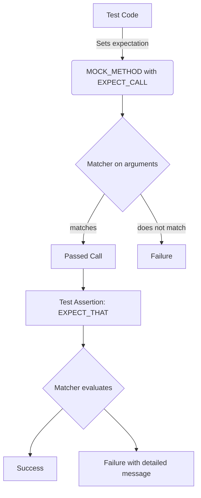

# Matchers Reference

This page catalogs the built-in matchers and matcher combinators that GoogleMock provides for flexible value comparisons and pattern-based assertions in C++ tests. Matchers empower you to specify expectations on the arguments passed to mock methods or use expressive assertions with `EXPECT_THAT` and `ASSERT_THAT` in GoogleTest.

---

## Overview of Matchers

Matchers are predicate-like objects that test whether a value satisfies a specified criterion. GoogleMock provides a rich hierarchy of polymorphic and monomorphic matchers for primitive values, STL containers, pointers, pairs, tuples, and user-defined types.

You use matchers to describe the expected arguments of mock function calls or verify complex assertions about values during tests. Built-in matchers cover equality, inequality, relational comparisons, container content, string patterns, floating-point comparisons, and more.

### Key Features
- Polymorphic matchers work with multiple compatible argument types.
- Matchers can combine via logical AND (`AllOf`), OR (`AnyOf`), and NOT (`Not`).
- Support for container element matching, including order-sensitive (`ElementsAre`) and order-insensitive (`UnorderedElementsAre`) matchers.
- Custom composite matchers can be written using macros like `MATCHER()` and `MATCHER_P()`.
- Ability to match properties of objects by field or getter method.

---

## Commonly Used Matchers

### Wildcard Matcher
- `_` matches any value of any type.

### Equality and Comparison
- `Eq(value)` — equal to `value`.
- `Ne(value)` — not equal to `value`.
- `Lt(value)` — less than `value`.
- `Le(value)` — less than or equal to `value`.
- `Gt(value)` — greater than `value`.
- `Ge(value)` — greater than or equal to `value`.

You can also use plain values directly as matchers, e.g., `EXPECT_CALL(mock, Foo(42))` is equivalent to `EXPECT_CALL(mock, Foo(Eq(42)))`.

### Pointer Matchers
- `IsNull()` — matches any raw or smart pointer that is `nullptr`.
- `NotNull()` — matches any raw or smart pointer that is not `nullptr`.
- `Pointee(matcher)` — matches a pointer pointing to a value that matches `matcher`.
- `Pointer(matcher)` — matches pointers that satisfy `matcher` (matcher applies to the pointer itself).

### String Matchers
- `StrEq(string)` — matches strings equal to `string` (case sensitive).
- `StrNe(string)` — matches strings not equal to `string`.
- `StrCaseEq(string)` — matches strings equal ignoring case.
- `StrCaseNe(string)` — matches strings not equal ignoring case.
- `HasSubstr(substring)` — matches strings containing `substring`.
- `StartsWith(prefix)` — matches strings starting with `prefix`.
- `EndsWith(suffix)` — matches strings ending with `suffix`.

### Container Matchers
- `ElementsAre(e1, e2, ...)` — container has elements in order matching each matcher/value.
- `ElementsAreArray(container_or_array)` — like `ElementsAre` but from a container or array.
- `UnorderedElementsAre(e1, e2, ...)` — container has exactly these elements, order ignored.
- `UnorderedElementsAreArray(container_or_array)` — like `UnorderedElementsAre` but from a container or array.
- `Contains(matcher)` — container contains at least one element matching `matcher`.
- `Each(matcher)` — every element in the container matches `matcher`.
- `SizeIs(matcher)` — container size matches `matcher`.

Modifiers:
- `.Times(n)` — modifier for `Contains()` matcher to check element frequency, including `Times(0)` to check for absence.

### Tuples and Pairs
- `Pair(matcher1, matcher2)` — matches a `std::pair` whose elements match `matcher1` and `matcher2` respectively.
- `Key(matcher)` — matches a pair whose first element matches `matcher`.
- `Property(&Class::Method, matcher)` — matches objects whose getter returns match value.
- `Field(&Class::field, matcher)` — matches objects whose field matches.
- `Args<k1, k2, ...>(matcher)` — matches a tuple of arguments by selected indices.

### Logical Combinators
- `AllOf(m1, m2, ...)` — matches if all inner matchers match.
- `AnyOf(m1, m2, ...)` — matches if any inner matcher matches.
- `Not(matcher)` — matches if `matcher` does not match.
- `Conditional(cond, m1, m2)` — matches `m1` if `cond` is true, else `m2`.

### Floating-Point and Numeric Matchers
- `FloatEq(value)`, `DoubleEq(value)` — approximate equality with ULP-based comparison.
- `NanSensitiveFloatEq(value)`, `NanSensitiveDoubleEq(value)` — approximate equality treating NaN as equal when expected.
- `FloatNear(value, max_abs_error)`, `DoubleNear(value, max_abs_error)` — approximate equality with user-specified error bound.

---

## Using Matchers in GoogleTest Assertions

Matchers are most prominently used with `EXPECT_THAT(value, matcher)` and `ASSERT_THAT(value, matcher)` assertion macros to write expressive checks with detailed diagnostic messages on failure.

Example:

```cpp
using ::testing::StartsWith;
using ::testing::Gt;
using ::testing::Pair;

EXPECT_THAT("Hello, world", StartsWith("Hello"));
EXPECT_THAT(10, Gt(5));
EXPECT_THAT(my_map, Contains(Pair(5, "foo")));
```

This produces natural language-like failure messages explaining what was expected and what was actually received.

---

## Writing Custom Matchers

GoogleMock provides powerful macros for writing custom matchers:

- `MATCHER(name, description_string) { statements; }` 
- `MATCHER_P(name, param, description_string) { statements; }`

Inside the matcher body, you refer to the value being matched as `arg` and its type as `arg_type`.

Example:

```cpp
MATCHER(IsEven, "") {
  return (arg % 2) == 0;
}

// Usage:
EXPECT_THAT(value, IsEven());
```

To generate better failure messages, you can write to a special `result_listener` to explain why matching failed.

More complex multi-parameter matchers can be defined with `MATCHER_P2`, `MATCHER_P3`,... up to `MATCHER_P10`.

---

## Advanced Matcher Features

### Composite Matchers
Matchers can wrap or compose other matchers to build complex requirements. For example, `AllOf` combines multiple matchers with logical AND.

### Matching Based on Multiple Arguments
With `.With()` clause in `EXPECT_CALL` or `ON_CALL` you can match the arguments tuple as a whole, such as:

```cpp
EXPECT_CALL(mock, Func(_, _))
    .With(Lt());  // First arg less than second arg
```

### Safe Matcher Casting
`SafeMatcherCast<T>(matcher)` helps adapt matcher types when the type of function arguments differ but conversions are safe.

### Matching Non-copyable Arguments
Use `Truly()` with predicates when matching arguments that cannot be trivially copied.

### Sharing Matchers
Matchers are cheap to copy and may be reused by assigning to variables.

---

## Practical Tips and Best Practices

- Use `_` for arguments you don't care to specify.
- Prefer `ON_CALL` to specify default behavior and `EXPECT_CALL` only when you want to verify a call.
- Place `EXPECT_CALL` statements before exercising the code under test.
- For overloaded functions, disambiguate with `Const()` or explicit matcher types.
- Use `RetiresOnSaturation()` to prevent expectations from being sticky after saturation.
- Combine matchers with `AllOf`, `AnyOf`, `Not` for flexible argument matching.
- Use container element matchers like `ElementsAre`, `Contains`, and `Each` for complex checks.
- For pointers, `Pointee()` lets you match the pointed-to value instead of the pointer itself.

---

## Troubleshooting Matcher Use

Common failures include:

- Calling `EXPECT_CALL` after mock usage causes undefined behavior.
- Over-specifying argument matching leads to brittle tests.
- Misunderstanding sticky expectations leads to unexpected failures; use `.RetiresOnSaturation()` or sequences.
- Incorrect use of matchers with overloaded functions may cause compiler errors.

Debug your matcher-related test failures using `--gmock_verbose=info` to get detailed trace information on matcher evaluation.

---

## Summary

This reference page catalogs the built-in matchers available in GoogleMock, illustrating how to use them in mock expectations and GoogleTest assertions to write expressive and maintainable C++ tests. You will find extensive functionality for value matching, container contents, string patterns, pointer dereferencing, and composite logical matchers, as well as instructions for authoring custom matchers tailored to your domain.


<Info>
For practical use, see the [gMock Cookbook](https://google.github.io/googletest/gmock_cook_book.html) and [Mocking for Dummies](https://google.github.io/googletest/gmock_for_dummies.html) to get started with applying matchers effectively in your mocks and tests.
</Info>

---

### Example: Using Common Matchers

```cpp
#include <gmock/gmock.h>
using ::testing::Eq;
using ::testing::_;
using ::testing::ElementsAre;
using ::testing::NotNull;

class MockFoo {
 public:
  MOCK_METHOD(int, GetValue, (int id), (const));
  MOCK_METHOD(void, ProcessData, (const std::vector<int>& data), ());
};

void TestMockFoo() {
  MockFoo mock;

  EXPECT_CALL(mock, GetValue(Eq(42)))
      .WillOnce(testing::Return(100));

  EXPECT_CALL(mock, ProcessData(ElementsAre(1, _, 3)));

  int val = mock.GetValue(42);  // Returns 100
  std::vector<int> input = {1, 2, 3};
  mock.ProcessData(input);      // Matches
}
```

### Example: Writing a Custom Matcher

```cpp
MATCHER_P(IsMultipleOf, divisor, "") {
  return (arg % divisor) == 0;
}

// Usage:
EXPECT_CALL(mock, Foo(IsMultipleOf(5)));
```

---

## Mermaid Diagram: Matchers Role in Test Flow

