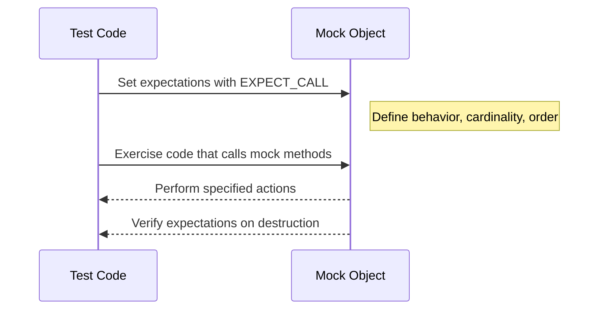

# Mocking Macros and Methods

This documentation details how to define and use mock methods within GoogleMock (gMock), the C++ mocking framework integrated with GoogleTest. It covers the essential macros for creating mock classes, setting expectations on mock methods, manipulating the behavior of these mocks, and controlling call cardinality and ordering. The guide explains how to effectively use mocks in real test scenarios, ensuring maintainable, expressive, and reliable testing.

---

## Defining Mock Methods with `MOCK_METHOD`

The core facility for mocking is the `MOCK_METHOD()` macro, which declares mock methods inside mock classes. It generates the necessary boilerplate code for intercepting calls and verifying expectations.

### Syntax
```cpp
MOCK_METHOD(ReturnType, MethodName, (Args...), (Qualifiers));
```

- **ReturnType**: The return type of the method, wrapped in parentheses if it contains commas.
- **MethodName**: The name of the method to mock.
- **Args**: The argument list enclosed in parentheses.
- **Qualifiers** (optional): Method qualifiers such as `const`, `override`, `noexcept`, calling convention `Calltype(...)`, or reference qualifiers `ref(&)`, `ref(&&)`.

### Important Usage Notes
- Arguments and qualifiers **must be enclosed in parentheses** to be parsed correctly.
- If the return type has unprotected commas (like `std::pair<int, int>`), wrap it in parentheses.
- This macro must be placed in the `public:` section of a mock class, regardless of the original method’s access level.

### Example
```cpp
class MockFoo : public Foo {
 public:
  MOCK_METHOD(int, GetSize, (), (const, override));
  MOCK_METHOD(std::string, Describe, (const char* name), (override));
  MOCK_METHOD(void, DoSomething, (int x, double y), (noexcept, override));
};
```

This defines mock implementations of `GetSize()`, `Describe()`, and `DoSomething()`.

### Overloads and Special Cases
- For **overloaded functions**, each version must be mocked explicitly with the correct signature.
- For **const and reference qualified methods**, specify `const`, `ref(&)`, `ref(&&)` as qualifiers.
- For **methods with calling conventions** (e.g., on Windows), use `Calltype(STDMETHODCALLTYPE)` in qualifiers.

---

## Setting Expectations on Mock Methods with `EXPECT_CALL`

Once mock methods are defined, you use `EXPECT_CALL` to specify how you expect those methods to be called during a test, and what behavior they should exhibit.

### Syntax
```cpp
EXPECT_CALL(mock_object, MethodName(matchers...))
    .With(multi_argument_matcher)  // Optional, must be first if used
    .Times(cardinality)            // Optional
    .InSequence(sequences...)      // Optional
    .After(expectations...)        // Optional
    .WillOnce(action)              // Zero or more
    .WillRepeatedly(action)        // Optional
    .RetiresOnSaturation();        // Optional
```

### Components Explained
- **`matchers...`**: Argument matchers specifying which calls this expectation applies to. Use `_` to match any value.
- **Chainable Modifiers**:
  - `.With(...)`: Match all arguments as a tuple using a matcher.
  - `.Times(...)`: Specify how many times the call is expected (`Exactly(n)`, `AtLeast(n)`, `AnyNumber()`, etc.).
  - `.InSequence(...)`: Specify ordering constraints.
  - `.After(...)`: Specify that this call must happen after other expectations.
  - `.WillOnce(...)`: The action to perform on this call, for specific invocations.
  - `.WillRepeatedly(...)`: Action for all additional calls beyond `WillOnce`s.
  - `.RetiresOnSaturation()`: When the expectation is fulfilled, it stops matching calls.

### Example
```cpp
EXPECT_CALL(mock_foo, DoSomething(Ge(10), _))
    .Times(3)
    .WillOnce(Return(true))
    .WillRepeatedly(Return(false));
```
This expects `DoSomething` to be called three times with first argument >= 10, returning `true` on the first call and `false` thereafter.

### Inferred Cardinality
- If no `Times()` is specified, gMock infers cardinality based on presence of `WillOnce()` and `WillRepeatedly()`.
- Example: Three `WillOnce()` actions implies `Times(3)`. Combination of `WillOnce(...).WillRepeatedly(...)` implies `Times(AtLeast(n))` where n is number of `WillOnce`s.

### Ordering
- Use `InSequence` to require calls occur in strict order.
- Combine sequences to express partial order graphs.
- Use `After()` to specify dependencies between expectations.

---

## Default Behavior with `ON_CALL`

Use `ON_CALL` to specify *default* mock behavior when a method is called, but without setting explicit expectations (i.e., the method can be called any number of times without failing).

### Syntax
```cpp
ON_CALL(mock_object, MethodName(matchers...))
    .With(multi_argument_matcher)  // Optional
    .WillByDefault(action);        // Required
```

- It sets the fallback action to be applied when no matching `EXPECT_CALL` is found.
- Useful to specify general behavior shared by multiple tests.

### Example
```cpp
ON_CALL(mock_foo, GetName()).WillByDefault(Return("John"));
```

---

## Controlling Calls: Cardinality and Behavior

### Cardinality
Specify how often a mock method is expected to be called.

| Cardinality         | Description                                   |
|---------------------|-----------------------------------------------|
| `Exactly(n)` or `n` | Called exactly n times                         |
| `AtLeast(n)`        | Called at least n times                        |
| `AtMost(n)`         | Called at most n times                         |
| `Between(m, n)`     | Called between m and n times (inclusive)     |
| `AnyNumber()`       | Called zero or more times                      |

### Sticky Expectations
- Expectations are *sticky* by default, meaning they remain active even after their upper bound is reached.
- Use `.RetiresOnSaturation()` to make an expectation inactive after fulfillment.

### Actions
- Use predefined actions like `Return()`, `ReturnRef()`, `DoAll()`, `Invoke()`, `SetArgPointee()`, and `Throw()` to define what a mock method does when called.
- Chain multiple actions with `DoAll()`; only the last action’s return value is used.

---

## Mock Classes: Example

```cpp
#include <gmock/gmock.h>

class MockTurtle : public Turtle {
 public:
  MOCK_METHOD(void, PenUp, (), (override));
  MOCK_METHOD(void, PenDown, (), (override));
  MOCK_METHOD(void, Forward, (int distance), (override));
  MOCK_METHOD(int, GetX, (), (const, override));
};
```

Use mock objects in tests as:

```cpp
MockTurtle turtle;
EXPECT_CALL(turtle, PenDown()).Times(AtLeast(1));
// Exercise code that calls turtle.PenDown()
```

Violations of expectations produce immediate test failures with diagnostic messages.

---

## Special Mock Wrappers: NiceMock, StrictMock, NaggyMock

Wrap your mocks with these to control reaction to uninteresting calls:

- `NiceMock<T>`: Suppresses warnings on uninteresting calls.
- `StrictMock<T>`: Treats uninteresting calls as errors (fail the test).
- `NaggyMock<T>`: Default behavior; prints warnings on uninteresting calls.

Example:
```cpp
NiceMock<MockFoo> mock_foo;
StrictMock<MockFoo> strict_foo;
```

---

## Handling Overloads

- You must mock every overloaded method explicitly.
- Use static_cast, helper functions, or explicit qualifications when setting expectations to disambiguate overloaded methods.

Example:
```cpp
EXPECT_CALL(mock, GetBar());               // Calls non-const GetBar()
EXPECT_CALL(Const(mock), GetBar()).WillOnce(ReturnRef(bar));  // Const GetBar()
```

---

## Mocking Move-Only Types

- gMock supports mocking methods taking or returning move-only types (e.g., `std::unique_ptr`).
- Use lambdas or functor objects in `WillOnce` or `WillRepeatedly` to provide new instances on each call.

Example:
```cpp
EXPECT_CALL(mock, MakeBuzz(_))
    .WillRepeatedly([](StringPiece text) {
        return std::make_unique<Buzz>(AccessLevel::kInternal);
    });
```

---

## Best Practices
- Set expectations **before** exercising the code that calls the mocks.
- Use `ON_CALL` for default behavior when call count verification is not needed.
- Use parameter matchers wisely to avoid brittle tests.
- Use `InSequence` or `After` to specify call order requirements clearly.
- Avoid overly complex expectations that test non-essential details.

---

## Troubleshooting

- If tests fail with unexpected call errors, run tests with --gmock_verbose=info to see detailed traces of mock method calls and matched expectations.
- Use `RetiresOnSaturation()` to prevent sticky expectations leading to saturation errors.
- For static or free functions, prefer wrapping in interfaces or using `MockFunction`.
- To mock destructors' timing, add a mock method called by the destructor.

---

## Summarized Flow of Using Mocking Macros and Methods



---

## Additional Resources

- [gMock for Dummies](../guides/gmock_for_dummies.md)
- [gMock Cookbook](../guides/gmock_cook_book.md)
- [Matchers Reference](../api-reference/matchers-and-mocking/matchers-reference.md)
- [Actions Reference](../api-reference/matchers-and-mocking/actions-and-call-behaviors.md)
- [Mocking Reference](../api-reference/matchers-and-mocking/mocking-reference.md)

---

<Source url="https://github.com/google/googletest" branch="main" paths='[{"path": "googlemock/include/gmock/gmock-function-mocker.h", "range": "1-308"},{"path": "docs/gmock_cook_book.md", "range": "1-2581"},{"path": "docs/gmock_for_dummies.md", "range": "1-255"},{"path": "docs/reference/mocking.md", "range": "1-400"}]' />