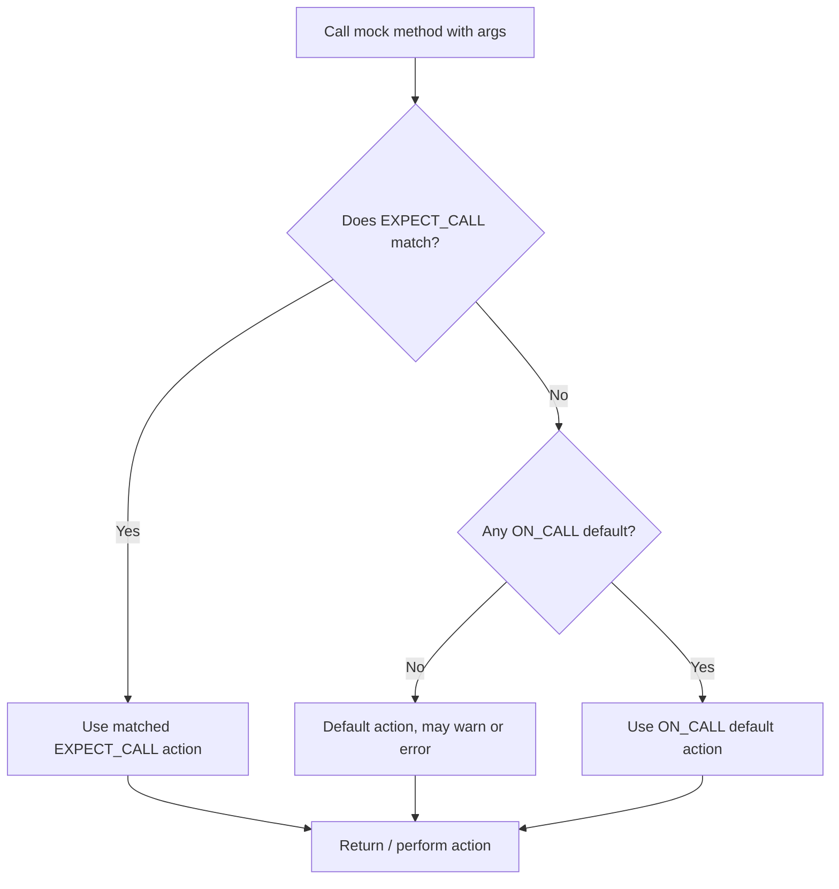

# Built-in Matchers

This document provides a comprehensive reference for all standard matchers available in GoogleTest/GoogleMock. Matchers are a critical component for verifying argument values in mock function expectations and assertions. Whether you want to check types, values, strings, containers, or compose matchers with logic operators, this guide details how to use them effectively.

---

## Table of Contents

- [Introduction to Matchers](#introduction-to-matchers)
- [Type and Value Matchers](#type-and-value-matchers)
- [String Matchers](#string-matchers)
- [Container Matchers](#container-matchers)
- [Matcher Composition and Combinators](#matcher-composition-and-combinators)
- [Customizing Matchers](#customizing-matchers)
- [Best Practices and Troubleshooting](#best-practices-and-troubleshooting)

---

## Introduction to Matchers

Matchers form the foundation of argument verification in GoogleMock. They enable expressive checks on function arguments beyond simple equality. Each matcher tests whether a given argument fulfills a certain condition:

- Simple equality or inequality
- Ranges and comparisons (greater than, less than, etc.)
- String properties (contains substring, starts with, etc.)
- Container content (elements matching certain criteria, container sizes)
- Composite logic (and, or, not)

The `EXPECT_CALL` and `ON_CALL` macros accept matchers as parameters to specify which arguments are expected or to customize behavior.

Example:
```cpp
using ::testing::_;        // Matches anything
using ::testing::Gt;       // Matches values > given value
using ::testing::Return;   // Action to specify return value

EXPECT_CALL(mock, Foo(Gt(5), _))  // First arg > 5, second arg anything
    .WillOnce(Return(true));
```


## Type and Value Matchers

Matchers for exact values or type-based assertions are the building blocks.

### Wildcard Matcher

- **`_`**
  - Matches any value of any type.
  - Polymorphic: works with any argument type.

```cpp
EXPECT_CALL(mock, Func(_));  // Matches any argument
```

### Equality and Comparison

- **Eq(value)**: matches values equal to `value`.
- **Ne(value)**: matches values not equal to `value`.
- **Lt(value)**, **Le(value)**, **Gt(value)**, **Ge(value)**: less than, less or equal, greater than, greater or equal respectively.

```cpp
EXPECT_CALL(mock, Foo(Eq(10)));
EXPECT_CALL(mock, Bar(Gt(5)));
```

### Type-safe Equality

- **TypedEq<T>(value)**: matches value of type `T` equal to `value`.

Use when conversion ambiguity arises.

### Reference Matchers

- **Ref(var)**
  - Matches an argument that refers to the variable `var`.
  - Useful to verify that the exact variable instance was passed.

### Null and Pointer Matchers

- **IsNull()**: matches any NULL pointer (raw or smart pointer).
- **NotNull()**: matches any non-NULL pointer (raw or smart pointer).

### NaN Matcher

- **IsNan()**: Matches NaN floating point numbers.

### Matcher for Move-only Types

Matchers work seamlessly with move-only types like `std::unique_ptr`.


## String Matchers

GoogleMock provides rich support for checking strings beyond equality.

### Equality

- **StrEq(str)**: string equality, case-sensitive.
- **StrNe(str)**: string inequality, case-sensitive.
- **StrCaseEq(str)**: string equality ignoring case.
- **StrCaseNe(str)**: string inequality ignoring case.


### Substring Matchers

- **HasSubstr(substring)**: string contains the specified substring.
- **StartsWith(prefix)**: string starts with the given prefix.
- **EndsWith(suffix)**: string ends with the given suffix.


### Regex Matchers

- **MatchesRegex(pattern)**: string fully matches the regular expression.
- **ContainsRegex(pattern)**: string contains a substring that matches the regex.

### Base64 Matchers

- **WhenBase64Unescaped(matcher)**: matches string after base64 unescape and then matched against the inner matcher.


## Container Matchers

Matchers designed to validate container contents and characteristics.

### Elements

- **ElementsAre(e1, e2, ...)**
  - Checks a container has elements equal to each matcher in the provided order.

- **ElementsAreArray(container_or_array)**
  - Like `ElementsAre` but takes a sequence container or array.

### Unordered Elements

- **UnorderedElementsAre(e1, e2, ...)**
  - Container elements match the given values/matchers in any order.

- **UnorderedElementsAreArray(container_or_array)**
  - Similar to above with sequence container or array input.

### Subsets and Supersets

- **IsSubsetOf(...)**
- **IsSupersetOf(...)**

Matchers to verify subset or superset relationships between containers and expected values.

### Contains

- **Contains(element_matcher)**
  - Container contains at least one element matching the matcher.
  - Has modifier `.Times(n)` to specify the expected count times.

### Each

- **Each(element_matcher)**
  - Every element in the container matches the given matcher.

### Size and Distance

- **SizeIs(matcher)**
  - Matches containers whose `size()` matches the matcher.

- **BeginEndDistanceIs(matcher)**
  - Matches containers by the iterator distance between `begin()` and `end()`.

### Map and Pair Matchers

- **Key(matcher)**
  - Matches an `std::pair` whose first element matches `matcher`.

- **Pair(first_matcher, second_matcher)**
  - Matches an `std::pair` where both elements match their respective matchers.

### Fields and Properties

- **Field(field_pointer, matcher)**
  - Matches objects whose member field satisfies `matcher`.

- **Property(method_pointer, matcher)**
  - Matches objects whose property method returns a value satisfying `matcher`.

### Pointwise and UnorderedPointwise

- **Pointwise(tuple_matcher, rhs_container)**
  - Checks elements of a container and rhs container match pairwise in order.

- **UnorderedPointwise(tuple_matcher, rhs_container)**
  - Like Pointwise but the match is order independent.


## Matcher Composition and Combinators

Matchers can be combined for expressive expectations.

### Logical Combinators

- **AllOf(m1, m2, ...)**
  - Matches if all matchers succeed.

- **AnyOf(m1, m2, ...)**
  - Matches if any matcher succeeds.

- **Not(matcher)**
  - Matches if the matcher fails.

### Conditional

- **Conditional(cond, m1, m2)**
  - Matches if `m1` matches when `cond` is `true`, else `m2`.

### Args and WithArgs

- **Args<N1, N2, ...>(matcher)**
  - Matches selected function arguments tuple.

- **WithArgs<N1, N2, ...>(action)**
  - Selects arguments passed to an inner action.

- **AllArgs(m)** 
  - Synonym for m; useful with `.With(AllArgs(m))` for readability.

### SafeMatcherCast

Casting between matcher types to suit argument types safely.

### Truly

- **Truly(predicate)**
  - Creates a matcher from a unary predicate function/functor.


## Customizing Matchers

GoogleMock supports defining your own matchers to capture domain-specific semantics.

- Use [`MATCHER(name, desc)`](#writing-new-matchers-quickly) and [`MATCHER_P`](#parameterized-matchers) macros.
- Implement full matcher interface for fine-grained control.
- Parameterize and compose them with built-in matchers.

Custom matchers yield expressive failure messages aiding quick debugging.


## Best Practices and Troubleshooting

- Use matchers for clear intent and robust tests.
- Avoid over-specification: match only relevant argument properties.
- Suppress warnings on uninteresting calls with `NiceMock` when appropriate.
- Runs tests with `--gmock_verbose=info` to debug matcher behaviour.
- Use `EXPECT_THAT` macros for fluent assertions with matchers.
- When mocking multiple expectations on the same method, order and specificity matter.

---

## Code Examples

```cpp
#include <gmock/gmock.h>
using ::testing::_;  // wildcard
using ::testing::Return;
using ::testing::Gt;
using ::testing::Contains;
using ::testing::ElementsAre;

class MockFoo {
 public:
  MOCK_METHOD(int, GetInt, (int x), (const));
  MOCK_METHOD(void, ProcessList, (const std::vector<int>&));
};

TEST(FooTest, ExampleMatchers) {
  MockFoo mock;

  // Matches any argument.
  EXPECT_CALL(mock, GetInt(_)).WillRepeatedly(Return(0));

  // Matches argument > 5.
  EXPECT_CALL(mock, GetInt(Gt(5))).WillOnce(Return(42));

  // Matches vector containing elements 1, 2, 3 in order.
  EXPECT_CALL(mock, ProcessList(ElementsAre(1, 2, 3)));

  mock.GetInt(10);  // returns 42
  mock.GetInt(2);   // returns 0
  mock.ProcessList(std::vector<int>{1, 2, 3});
}
```

```cpp
// Using composite matcher: all args are positive
EXPECT_CALL(mock, Foo(_, _))
    .With(testing::AllOf(testing::Gt(0), testing::_));
```

```cpp
// Checking pointer arguments
EXPECT_CALL(mock, Func(IsNull()));
EXPECT_CALL(mock, Func(NotNull()));
```

---

## Related References

- [Matchers Reference](reference/matchers.md)
- [Mocking Reference](reference/mocking.md)
- [gMock Cookbook](gmock_cook_book.md)
- [Assertions Reference](reference/assertions.md)
- [Writing Custom Matchers](guides/advanced-testing/custom-matchers-and-assertions.md)
- [Mock Classes and Methods](api-reference/mocking-apis/mock-classes.mdx)

For practical workflow and using matchers, see the [GoogleMock Overview and Cookbook](https://google.github.io/googletest/gmock_cook_book.html).

---

If you encounter confusing matcher failures, remember the distinction between:

- *Uninteresting calls*: calls without matching expectations but allowed to run default actions (may trigger warnings)
- *Unexpected calls*: calls that do not meet any existing expectation and are errors

Using `NiceMock` or `StrictMock` modifies the behavior for uninteresting calls.

---

## Visual Guide: Matcher Flow



This shows how matcher evaluation fits into mock method call resolution.

---

Harness the power of matchers to write expressive, robust tests that communicate intent clearly and improve your unit testing workflow.