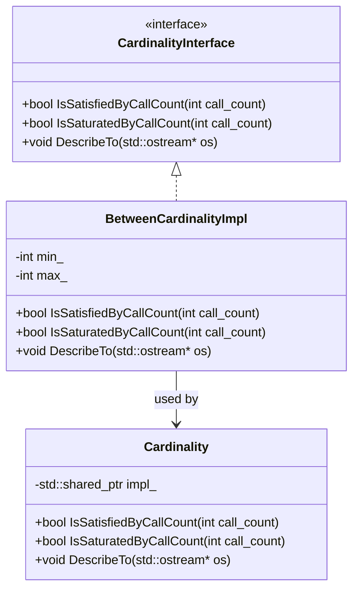

# Cardinalities and Mock Strictness

This page describes how to control and verify the number of times mock methods are called in GoogleMock, using *cardinalities*. It also explains how to manage the behavior of uninteresting calls with the `NiceMock`, `NaggyMock`, and `StrictMock` wrappers. This guide emphasizes best practices to keep your tests robust, maintainable, and expressive.

---

## Understanding Cardinalities: Controlling Call Counts

When writing tests with GoogleMock, you often want to specify how many times a mock method is expected to be called. This helps ensure your code interacts exactly as intended with its dependencies. A *cardinality* is a way to express this expected call frequency.

### Why Cardinalities Matter

Setting correct cardinalities helps:

- Validate that your code calls a mock method *exactly* as many times as expected.
- Detect bugs where methods are called too often or too few times.
- Make your tests precise without being overly strict or too lenient.

### Built-in Cardinalities

GoogleMock provides a variety of cardinalities you can specify in the `.Times()` clause of an `EXPECT_CALL`.

| Cardinality       | Meaning                                           |
|-------------------|---------------------------------------------------|
| `AnyNumber()`     | Allows the method to be called zero or more times (no upper limit). |
| `AtLeast(n)`      | Method must be called *at least* `n` times.       |
| `AtMost(n)`       | Method must be called *at most* `n` times.        |
| `Between(m, n)`   | Method must be called between `m` and `n` times inclusive. |
| `Exactly(n)` or `n` | Method must be called *exactly* `n` times. If `n` is zero, the method must *never* be called. |

You can also specify cardinalities implicitly by using `.WillOnce()` and `.WillRepeatedly()`, which influence the expected call count.

### Cardinality Syntax in Tests

```cpp
EXPECT_CALL(mock_object, Method(args))
    .Times(cardinality)
    .WillOnce(action)...
    .WillRepeatedly(action);
```

For example, expecting a method to be called exactly twice:

```cpp
EXPECT_CALL(mock_foo, DoSomething())
    .Times(2);
```

or expecting a method to be called at least three times:

```cpp
EXPECT_CALL(mock_foo, Calculate())
    .Times(AtLeast(3));
```

### Omitting `.Times()` Clause

If you omit the `.Times()` clause, GoogleMock infers it based on how you specify actions:

- No `WillOnce` or `WillRepeatedly` clauses: inferred cardinality is `Times(1)`.
- *n* `WillOnce` clauses but no `WillRepeatedly`: inferred cardinality is `Times(n)`.
- *n* `WillOnce` clauses and one `WillRepeatedly`: inferred cardinality is `Times(AtLeast(n))`.

### Special Case: Disallowing Calls

To assert that a method should not be called at all, explicitly specify:

```cpp
EXPECT_CALL(mock_obj, Method(_))
    .Times(0);
```

If the method is called, your test will fail immediately.

### Cardinality Descriptions

GoogleMock provides descriptive error messages that clearly describe cardinalities. For instance, "called once", "called at least twice", or "called between 3 and 5 times".

These descriptions help diagnose failures quickly.

---

## Using the Nice, Naggy, and Strict Mock Wrappers

Beyond setting call expectations, controlling how your mocks handle *uninteresting calls* (calls without explicit expectations) is crucial for test clarity and maintenance.

### What Are Uninteresting Calls?

An *uninteresting call* is a call to a mock method for which **no explicit expectations** (`EXPECT_CALL`) have been set.

### The Three Strictness Levels

GoogleMock provides handy wrappers to easily specify how uninteresting calls are treated:

| Wrapper           | Behavior on Uninteresting Calls        | Typical Usage                                    |
|-------------------|---------------------------------------|-------------------------------------------------|
| `NiceMock<T>`     | Suppresses warnings                   | Use when you want to ignore uninteresting calls safely, keeping test output clean.                     |
| `NaggyMock<T>`    | Prints warnings (default)              | Default behavior; warns about uninteresting calls but allows tests to continue.                      |
| `StrictMock<T>`   | Makes uninteresting calls *failures* | Use when you want to catch *all* unexpected calls aggressively.                                     |


### How to Use These Wrappers

They are template wrappers around your mock classes. Example:

```cpp
using ::testing::NiceMock;
using ::testing::StrictMock;

NiceMock<MockFoo> nice_mock;    // Uninteresting calls are ignored
StrictMock<MockFoo> strict_mock; // Uninteresting calls cause test failures
```

They forward all constructor arguments to the underlying mock class.

### Important Notes

- These wrappers work only with mock methods defined directly in the mock class (using `MOCK_METHOD` macros).
- Wrapping mocks multiple times (e.g. `NiceMock<StrictMock<MockFoo>>`) is not supported.
- The mock class should have a virtual destructor for these wrappers to work properly.

### Choosing the Right Strictness

- Use `NiceMock` to reduce noise when you legitimately do not care about many calls.
- Use `NaggyMock` (default) for general development, to alert you to potential oversights.
- Use `StrictMock` when your test must precisely validate every interaction.

---

## Best Practices for Cardinalities and Mock Strictness

- **Specify expectations before exercising mocks**: Always set `EXPECT_CALL` before the mock is used, as undefined behavior results otherwise.
- **Avoid over-specifying**: Too strict cardinalities can lead to fragile tests; be as precise as necessary but no more.
- **Use `NiceMock` to suppress noise**: When some methods are not relevant to the current test, use `NiceMock` to avoid cluttered warnings.
- **Use `StrictMock` sparingly**: Strict mocks can be helpful for critical components but cause more test maintenance.
- **Combine expectations carefully**: Multiple expectations on the same method match calls in reverse order; order your expectations with care.
- **Use sequences and ordering for complex interactions**: When call order matters, use `InSequence` blocks or the `.After()` clause.

---

## Troubleshooting Common Cardinality and Strictness Issues

### Test Fails Because Of Unexpected Extra Calls

- Verify that your `EXPECT_CALL` cardinalities accurately reflect intended call counts.
- Consider whether you need multiple expectations with different argument matchers.
- Use `RetiresOnSaturation()` if you want an expectation to deactivate after matching its cardinality.

### Warnings About Uninteresting Calls

- If an uninteresting call warning is irrelevant, switch to `NiceMock` to suppress.
- If these warnings indicate missing expectations, add appropriate `EXPECT_CALL` statements.

### Confusing Order of Multiple Expectations

- Remember that the last matching expectation overrides earlier ones.
- Use sequences or `.InSequence()` spanned blocks to enforce call ordering.

### Tests Pass Without Verifying Expectations

- Ensure mocks go out of scope or are destructed to trigger verification.
- For mocks allocated on the heap, consider using `Mock::VerifyAndClearExpectations(mock)` explicitly.

---

## Example Usage

```cpp
#include <gmock/gmock.h>
using ::testing::AtLeast;
using ::testing::Exactly;
using ::testing::NiceMock;

class MockFoo {
 public:
  MOCK_METHOD(void, DoSomething, (), ());
};

TEST(MyTest, CardinalityExample) {
  MockFoo mock;

  // Expect DoSomething to be called exactly twice.
  EXPECT_CALL(mock, DoSomething())
      .Times(Exactly(2));

  mock.DoSomething();
  mock.DoSomething();
}

TEST(MyTest, StrictnessExample) {
  NiceMock<MockFoo> nice_mock;

  // No expectations set, calls to DoSomething will not warn.
  nice_mock.DoSomething();  // No warning
}

TEST(MyTest, StrictMockExample) {
  StrictMock<MockFoo> strict_mock;

  // No expectations set, calls to DoSomething will fail the test.
  strict_mock.DoSomething();  // Test fails
}
```

---

## References and Further Reading

- [GoogleMock for Dummies](https://google.github.io/googletest/gmock_for_dummies.html) – Getting started with mocks.
- [gMock Cookbook](https://google.github.io/googletest/gmock_cook_book.html) – Recipes, including expectation patterns.
- [Mocking Reference](reference/mocking.md) – Comprehensive reference for mocking functions.
- [Matchers Reference](reference/matchers.md) – How to specify argument matchers.
- [Actions and Mock Behaviors](api-reference/matchers-mocking/actions-mock-behaviors.md) – Define mock method behaviors.
- [Nice, Naggy, and Strict Mocks](concepts/mocking-fundamentals/nice-naggy-strict-mocks.md) – Details about mock strictness.

---

## Diagram: Cardinality Relationships



This diagram shows the interface and a typical concrete implementation for cardinalities.

---