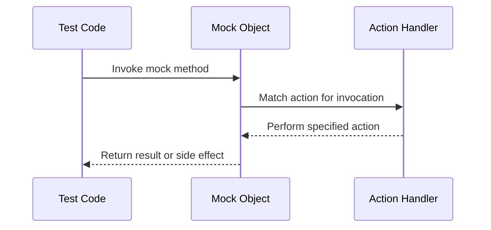

# Actions API

GoogleMock's Actions API enables you to precisely control the behavior of mock methods during testing. This API defines how mock functions respond when invoked: whether by returning mocked values, calling real functions, or triggering side effects. It supports both general-purpose built-in actions and user-defined custom actions, providing a flexible toolkit for modeling complex interactions.

---

## 1. Purpose and Value

When writing tests, simply expecting method calls is often not enough; the test requires the mock to behave in specific ways. GoogleMock's Actions API lets you express these behaviors declaratively, so your mocks faithfully simulate real dependencies' effects or return values. The `Actions API` transforms mocks from passive verifiers into active participants in your test scenarios.

Use this API to:

- Define precise return values or references.
- Simulate dynamic or stateful behavior by invoking callables or lambdas.
- Create side effects such as modifying output parameters.
- Combine multiple operations into one composite behavior.
- Customize behavior flexibly, including invoking real implementations.

---

## 2. Defining Mock Behavior: `ON_CALL` and `EXPECT_CALL` Integration

The Actions API is closely tied to `ON_CALL` and `EXPECT_CALL`. While `EXPECT_CALL` sets expectations on invocation, it also specifies what action to perform when invoked through `.WillOnce()`, `.WillRepeatedly()`. Conversely, `ON_CALL` sets default behaviors via `.WillByDefault()` without implying an expectation.

Both rely on actions from this API to drive method return values or side effects.

---

## 3. Built-in Actions

GoogleMock comes with a comprehensive suite of pre-defined actions, enabling most common mocking scenarios out of the box.

### 3.1 Returning Values and References

- **`Return(value)`**
  Returns a copy of the provided value. The value is copied at the time the expectation is set.

- **`ReturnRef(variable)`**
  Returns a reference to an existing variable. Useful for mock methods returning references.

- **`ReturnPointee(pointer)`**
  Returns the live value referenced by a pointer at call time.

- **`ReturnNew<T>(args...)`**
  Constructs and returns a pointer to a new object of type `T` for each call.

- **`ReturnNull()`**
  Returns a `nullptr`. Useful for mock functions returning pointer types.

- **`ReturnRoundRobin({val1, val2, ...})`**
  Cycles through the provided return values sequentially on each call.

### 3.2 Side Effects on Arguments

- **`SetArgPointee<N>(value)`**
  Sets the value pointed to by the Nth (zero-based) argument.

- **`SetArrayArgument<N>(first, last)`**
  Copies a range of elements into an array or iterator argument.

- **`Assign(&variable, value)`**
  Assigns a new value to a variable (used for simulating side effects).

- **`DeleteArg<N>()`**
  Deletes a pointer argument.

- **`SaveArg<N>(pointer)`**
  Saves a copy of the Nth argument into the provided location.

### 3.3 Functional and Lambda Actions

- **`Invoke(functor)`**
  Executes a function, method, functor, or lambda, forwarding mock call arguments.

- **`InvokeWithoutArgs(functor)`**
  Executes a callable that takes no arguments.

- **`InvokeArgument<N>(args...)`**
  Calls the Nth argument (which is a callable) with the supplied arguments.

### 3.4 Composite and Utility Actions

- **`DoAll(action1, action2, ..., actionN)`**
  Executes multiple actions sequentially; returns the last action's result.

- **`IgnoreResult(action)`**
  Performs an action and ignores its return value.

- **`WithArg<N>(action)` / `WithArgs<N1, N2, ...>(action)`**
  Selects specific arguments to be passed to an inner action.

- **`WithoutArgs(action)`**
  Calls an action but passes no arguments.

---

## 4. Writing Custom Actions

If built-in actions do not fit your needs, you can define your own actions easily:

- Implement a callable (function, lambda, functor) with a compatible signature.
- Use `WillOnce()` or `WillRepeatedly()` clauses with your callable.

Example:

```cpp
EXPECT_CALL(mock, Foo(_))
    .WillOnce([](int x) { return x * 2; });
```

For more complex patterns:

- Implement `::testing::ActionInterface<F>` manually where `F` is the mock function signature.
- Use the `MakePolymorphicAction()` helper for wide applicability.

---

## 5. Practical Usage Examples

### 5.1 Simple Return Value

```cpp
using ::testing::Return;
EXPECT_CALL(mock, GetValue())
    .WillOnce(Return(42));
```

### 5.2 Returning Reference

```cpp
Bar bar;
EXPECT_CALL(mock, GetBar())
    .WillOnce(ReturnRef(bar));
```

### 5.3 Returning Live Value from Pointer

```cpp
int state = 0;
EXPECT_CALL(mock, GetState())
    .WillRepeatedly(ReturnPointee(&state));
state = 10;
EXPECT_EQ(10, mock.GetState());
```

### 5.4 Combining Side Effects with Return

```cpp
EXPECT_CALL(mock, Mutate(_))
    .WillOnce(DoAll(SetArgPointee<0>(5), Return(true)));
```

### 5.5 Invoking a Callable Argument

```cpp
EXPECT_CALL(mock, Process(_, _))
    .WillOnce(InvokeArgument<1>(42, "done"));
```

### 5.6 Using Lambdas

```cpp
EXPECT_CALL(mock, Transform(_))
    .WillOnce([](int x) { return x * x; });
```

---

## 6. Best Practices and Tips

- Prefer specifying default behaviors with `ON_CALL` and reserve `EXPECT_CALL` for verifying interactions.
- Use `DoAll()` to chain side effects and returns, ensuring the last action returns the expected type.
- When returning references, always use `ReturnRef()` to avoid dangling references.
- Use `ReturnPointee()` to return values that may change during test execution.
- Compose and combine actions for complex behavior instead of writing monolithic custom actions.
- Use `Invoke*()` actions to delegate to real methods, lambdas, or existing functions.
- Be mindful of argument lifetimes when passing references or pointers in actions.
- Use `IgnoreResult()` when you want to silence warnings from actions returning unwanted results.

---

## 7. Troubleshooting Common Issues

### 7.1 Unexpected or Uninteresting Calls

Uninteresting calls occur when a mock method is called without an explicit expectation (`EXPECT_CALL`). They use the default `ON_CALL` action or built-in default return values and produce warnings to indicate a potential mistake.

Use `NiceMock<>` to suppress these warnings if they are acceptable, or add broader `EXPECT_CALL` with `.Times(AnyNumber())`.

### 7.2 Return Type Mismatches

Use the appropriate action:

- `Return` for value returns (copies made when expectation is set).
- `ReturnRef` for reference returns.
- `ReturnPointee` for pointer dereference returns.

Avoid returning references to temporaries.

### 7.3 Side Effects Overwritten by Return Values

When combining side effects like `SetArgPointee` and return values in an action, ensure you use `DoAll()` and place the `Return()` last.

### 7.4 Lifetime of Returned Objects

If your action returns pointers or references, ensure returned objects outlive the call to avoid dangling references or undefined behavior.

---

## 8. Related Topics

For full mastery of mocking with GoogleMock, consult:

- [Mocking API](../core-apis/gmock-mocking-api.md) — for how to define mock methods and expectations.
- [Matchers API](../matchers-and-assertions/gmock-matchers.md) — to specify argument constraints.
- [Mock Strictness Control](../core-apis/gmock-nice-strict-api.md) — to understand mock behavior configurations.
- [gMock Cookbook](https://google.github.io/googletest/gmock_cook_book.html) — for practical recipes and examples.
- [Writing Your First Test](../../guides/getting-started/writing-your-first-test.md) — to bootstrap using mocks effectively.

---

## Further Reading

- [Actions Reference](../reference/actions.md) — Deep dive into available built-in actions.
- [Matchers Reference](../reference/matchers.md) — Detail on argument matching expressions.
- [Mocking Reference](../reference/mocking.md) — Comprehensive guide to mocking facilities.

---

Illustrative Mermaid Diagram: Mock Action Flow



---

By leveraging the Actions API, you unlock the true power of GoogleMock, turning mock objects into rich, behavior-driven test doubles that actively shape the flow of your tests and grant unparalleled precision and insight into your unit testing.
