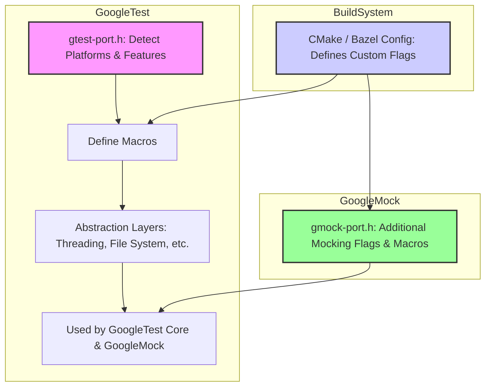

# Platform and Portability Macros

This reference guide covers the macros, type definitions, and platform abstractions integral to GoogleTest and GoogleMock. These components ensure that your tests run consistently and correctly across a wide range of compilers and operating systems. Understanding and customizing these macros helps you adapt GoogleTest and GoogleMock to specific environments and resolve compatibility challenges.

---

## Overview

GoogleTest is designed to be portable across many operating systems and compilers. To facilitate this, it relies heavily on a set of platform detection and environment configuration macros. These macros abstract platform-specific details such as threading support, exception handling, wide string encoding, file system access, and compiler capabilities.

Typically, these macros are automatically defined by GoogleTest during compilation based on the detected environment. However, you can override their values via compiler flags if automatic detection is insufficient or incorrect for your build environment.

The main platform and environment macros discussed on this page are implemented primarily in the internal header file `gtest-port.h` and related internal headers.

---

## Common Platform Macros

These macros are defined to 1 when the corresponding platform or feature is detected and undefined otherwise:

| Macro Name                  | Description                                                                                  |
|-----------------------------|----------------------------------------------------------------------------------------------|
| `GTEST_OS_WINDOWS`          | Windows desktop platform (including MinGW variants)                                         |
| `GTEST_OS_LINUX`            | Linux platform                                                                              |
| `GTEST_OS_MAC`              | macOS platform                                                                             |
| `GTEST_OS_IOS`              | iOS platform                                                                              |
| `GTEST_OS_CYGWIN`           | Cygwin environment on Windows                                                              |
| `GTEST_OS_FREEBSD`          | FreeBSD platform                                                                           |
| `GTEST_OS_SOLARIS`          | Solaris platform                                                                           |
| `GTEST_OS_ANDROID`          | Android platform (subset of Linux)                                                         |
| `GTEST_OS_WINDOWS_MOBILE`   | Windows Mobile variants                                                                    |
| `GTEST_OS_WINDOWS_MINGW`    | Windows MinGW GCC environment                                                              |
| ...                         | (Numerous others for BSDs, AIX, QNX, Haiku, and embedded platforms)                         |

You should rarely define these manually. Instead, rely on GoogleTest's auto-detection or file an issue if the detection fails on your platform.

---

## Environment Feature Macros

These macros indicate the availability or state of important C++ environment features, enabling GoogleTest to tailor its implementation. They are always defined to 0 or 1.

| Macro Name                   | Description                                                                  |
|------------------------------|------------------------------------------------------------------------------|
| `GTEST_HAS_PTHREAD`           | Whether POSIX threads (`<pthread.h>`) are available and can be used.
| `GTEST_HAS_EXCEPTIONS`        | Whether C++ exception handling is enabled.
| `GTEST_HAS_RTTI`              | Whether Run-Time Type Information (RTTI) is enabled.
| `GTEST_HAS_STD_WSTRING`       | Whether standard `std::wstring` is available and usable.
| `GTEST_HAS_FILE_SYSTEM`       | Whether a standard file system is available (enables file IO support).
| `GTEST_HAS_SEH`               | Whether Structured Exception Handling (SEH) is available (Windows-specific).
| `GTEST_HAS_CLONE`             | Whether `clone(2)` system call is available (mostly Linux).
| `GTEST_HAS_STREAM_REDIRECTION`| Whether output stream redirection (dup/dup2) is supported.
| `GTEST_IS_THREADSAFE`         | Whether GoogleTest is built thread-safe.

You can override these flags at compile time if automatic detection is insufficient. For example, to force pthread usage:

```bash
-DGTEST_HAS_PTHREAD=1
```

or to disable exceptions:

```bash
-DGTEST_HAS_EXCEPTIONS=0
```

---

## Macro Control for Shared Libraries

The following macros control whether GoogleTest is built or linked as a shared library (DLL):

- `GTEST_CREATE_SHARED_LIBRARY`: Define to 1 when compiling GoogleTest itself as a shared library.
- `GTEST_LINKED_AS_SHARED_LIBRARY`: Define to 1 when compiling user tests that link GoogleTest as a shared library.

When these macros are set, GoogleTest adjusts symbol visibility and linkage attributes appropriately.

Source files often define these automatically via CMake based on build configuration.

---

## Macro Control for Compiler and Build System Flags

You can customize GoogleTest behavior by defining some common macros in your build system's compiler flags:

- **Threading Control**
  - `-DGTEST_HAS_PTHREAD=1` or `0`: Forces pthread support on/off.
- **Exception Support**
  - `-DGTEST_HAS_EXCEPTIONS=1` or `0`: Forces exception support on/off.
- **Shared Library**
  - `-DGTEST_CREATE_SHARED_LIBRARY=1`: Compile GoogleTest as a shared library.
  - `-DGTEST_LINKED_AS_SHARED_LIBRARY=1`: Compile test code when linking with shared GoogleTest.
- **Avoiding Macro Conflicts**
  - For common GoogleTest macros, e.g., `TEST`, `ASSERT_EQ`, you can prevent GoogleTest from defining the bare macro name to avoid clashes by defining `-DGTEST_DONT_DEFINE_TEST=1` (analogously for other macros). This renames `TEST` to `GTEST_TEST`.

---

## Thread-Safety and Synchronization

GoogleTest and GoogleMock provide internal synchronization primitives abstracted by:

- `Mutex` and `MutexLock` classes
- Thread local storage via `ThreadLocal<T>` template

The availability and implementation of these are controlled by `GTEST_IS_THREADSAFE`:

- `GTEST_IS_THREADSAFE=1` means threading primitives are available and used.
- `0` means dummy synchronization is used (no real thread safety).

Again, this macro is auto-configured, but can be overridden if necessary.

---

## Wide String Encoding

GoogleTest defines the macro `GTEST_WIDE_STRING_USES_UTF16_` to indicate if wide strings use UTF-16 encoding. This affects how wide strings are processed, especially on Windows where UTF-16 is standard.

This is defined internally based on the platform:

| Platform     | Value |
|--------------|-------|
| Windows      | 1     |
| Cygwin, AIX, OS/2  | 1     |
| Others       | 0     |

---

## File System and POSIX Compatibility

These macros help abstract file system quirks and POSIX availability:

- `GTEST_HAS_FILE_SYSTEM` (0 or 1) flag for whether a file system is available.
- POSIX regex availability: `GTEST_HAS_POSIX_RE`.
- Stream redirection support: `GTEST_HAS_STREAM_REDIRECTION`.
- File path separators:
  - `GTEST_PATH_SEP_` is typically `/` on Unix-like OS and `\` on Windows.
  - `GTEST_HAS_ALT_PATH_SEP_` is 1 if an alternate separator exists.

Because file and POSIX APIs differ, GoogleTest provides wrappers in `posix` namespace that hide these differences.

---

## Attribute and Compiler Feature Detection

Extra macros detect compiler support for attributes or features:

- `GTEST_HAVE_ATTRIBUTE_(attr)`: Checks for GCC/Clang style attribute support.
- `GTEST_INTERNAL_HAS_CPP_ATTRIBUTE(attr)`: Checks for C++11 style attributes.
- `GTEST_HAVE_FEATURE_(feat)`: Checks for compiler features like sanitizers.

These macros allow GoogleTest to control optimizations and diagnostic behavior.

---

## Practical Tips

- **Customizing Behavior:** Use compiler flags in your build scripts to tune GoogleTest behavior when auto-detection is insufficient.
  - Example: Force `-DGTEST_HAS_PTHREAD=0` for single-threaded environments with no pthreads.
- **Shared Libraries:** Always define shared library flags consistently between GoogleTest and test binaries.
- **Avoiding Macro Name Clashes:** When integrating with other testing or logging libraries, use the `GTEST_DONT_DEFINE_<MACRO>=1` flags to rename GoogleTest's macros.
- **Thread Safety:** When using GoogleTest in multi-threaded test code, make sure that test setup and teardown (expectation setting, verification) happens on the same thread to avoid undefined behavior.

---

## Troubleshooting Common Issues

- **Incorrect Platform Detection:** Define the relevant flags explicitly to override incorrect automatic detection.
- **Linker Errors Related to pthread:** Confirm `GTEST_HAS_PTHREAD` is defined correctly and link with pthread libraries if necessary.
- **Macro Conflicts:** Use macro renaming flags to avoid conflicts with other libraries.
- **Shared Library Linking Errors:** Align your shared/static library usage and define `GTEST_CREATE_SHARED_LIBRARY` and `GTEST_LINKED_AS_SHARED_LIBRARY` coherently.

---

## Source and Customization Points

GoogleMock relies heavily on these platform and portability macros from GoogleTest. The primary source file defining these macros is:

- [`googletest/include/gtest/internal/gtest-port.h`](https://github.com/google/googletest/blob/main/googletest/include/gtest/internal/gtest-port.h)

Additionally, specialized GoogleMock portability macros and flag support are in:

- [`googlemock/include/gmock/internal/gmock-port.h`](https://github.com/google/googletest/blob/main/googlemock/include/gmock/internal/gmock-port.h)

The `custom` directories allow adding or overriding flag declarations and definitions for custom builds.

---

## Summary

GoogleTest and GoogleMock rely on an extensive, preconfigured set of macros to detect and abstract platform-specific details, environment capabilities, and compiler features. Familiarity with these portability macros enables you to debug, extend, or customize the test framework's behavior in specialized build environments.

When building or embedding GoogleTest and GoogleMock, ensure these macros are correctly set by your build system or overridden explicitly if needed. This guarantees consistent test behavior across diverse platforms and toolchains.

---

## References

- [GoogleTest Platform Portability Header (`gtest-port.h`)](https://github.com/google/googletest/blob/main/googletest/include/gtest/internal/gtest-port.h)
- [GoogleMock Portability (`gmock-port.h`)](https://github.com/google/googletest/blob/main/googlemock/include/gmock/internal/gmock-port.h)
- [GoogleTest Build Setup and Macros](https://github.com/google/googletest/blob/main/googletest/cmake/internal_utils.cmake)
- [Mock Strictness Wrappers](https://github.com/google/googletest/blob/main/docs/api-reference/mock-behavior-config/nice-naggy-strict-mock.md)
- [Mocking Reference](https://github.com/google/googletest/blob/main/docs/reference/mocking.md)
- [GoogleMock Cookbook](https://github.com/google/googletest/blob/main/docs/gmock_cook_book.md)

For detailed usage of key macros, see the core testing APIs and mocking reference sections within the API documentation.

---

## Example: Overriding `GTEST_HAS_PTHREAD` to Build Without pthreads

If you are targeting an environment without pthread support, you can disable threading internally as follows:

```bash
c++ -DGTEST_HAS_PTHREAD=0 -std=c++17 -I/path/to/googletest/include ...
```

This instructs GoogleTest to disable pthread-based thread safety features, enabling compilation in single-threaded or embedded systems where pthreads aren't available.


---

## Example: Avoiding Macro Name Conflicts

If your project also uses another library which defines macros conflicting with GoogleTest's, you can rename GoogleTest's macros by adding compiler flags:

```bash
-DGTEST_DONT_DEFINE_TEST=1
-DGTEST_DONT_DEFINE_ASSERT_EQ=1
```

With these flags, you must use prefixed macro names in your code, e.g., `GTEST_TEST()` instead of `TEST()`, `GTEST_ASSERT_EQ()` instead of `ASSERT_EQ()`. This helps prevent conflicts without changing GoogleTest source.

---

## Diagram: Platform and Portability Abstractions



The diagram illustrates how the build system configures and injects custom macros into GoogleTest and GoogleMock through these platform-portability headers.

---

For comprehensive integration, always consult the related setup and configuration guides, and verify macro definitions especially when targeting new or less common platforms.
