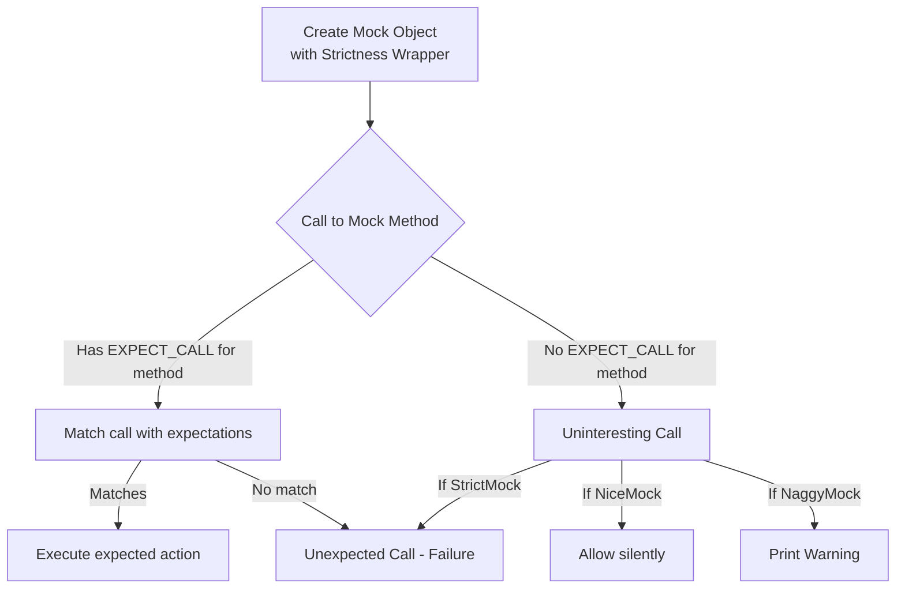

# NiceMock, NaggyMock, StrictMock Controls

This reference covers the usage of GoogleMock's NiceMock, NaggyMock, and StrictMock wrapper classes. It explains how each control modifies the treatment of uninteresting mock calls—calls to mock methods without explicit expectations—to either allow silently, warn the user, or treat as errors. This enables you to tailor the verbosity and strictness of mock behavior in your tests, improving maintainability and test clarity.

---

## Overview of Mock Strictness Controls

GoogleMock provides three wrapper classes you can use to adjust the handling of uninteresting calls on mock objects:

- `NiceMock<T>`: Allows uninteresting calls silently without warnings.
- `NaggyMock<T>`: (Current default) Allows uninteresting calls but prints warnings.
- `StrictMock<T>`: Treats uninteresting calls as test failures.

Each of these is a subclass of your original mock class `T` and can be used transparently wherever `T` is accepted.

### Why Use These Wrappers?
By default, mock objects warn you when a method with no expectation is called (an uninteresting call). While helpful, these warnings can clutter test logs or cause brittle failures during refactoring.

- **Use `NiceMock`** when you want to suppress these warnings, keeping tests cleaner without losing verification of explicitly expected calls.
- **Use `NaggyMock`** during test development or debugging to spot unexpected or forgotten calls.
- **Use `StrictMock`** when you want even uninteresting calls to cause test failures, enforcing the strictest contract on your mocks.

---

## How to Use NiceMock, NaggyMock, and StrictMock

These templates wrap a mock class and modify its behavior regarding uninteresting calls. They "inherit" constructors so you can instantiate them just like the underlying mock.

```cpp
#include <gmock/gmock.h>
using ::testing::NiceMock;
using ::testing::NaggyMock;
using ::testing::StrictMock;

// Assume MockFoo is a mock class.

// Allows uninteresting calls silently.
NiceMock<MockFoo> nice_mock_foo;
EXPECT_CALL(nice_mock_foo, DoThis());

// Prints warnings on uninteresting calls.
NaggyMock<MockFoo> naggy_mock_foo;
EXPECT_CALL(naggy_mock_foo, DoThis());

// Treats uninteresting calls as failures.
StrictMock<MockFoo> strict_mock_foo;
EXPECT_CALL(strict_mock_foo, DoThis());
```

### Passing Constructor Arguments

If your mock class has constructors with parameters, you can pass those through the wrapper:

```cpp
NiceMock<MockFoo> nice_obj(5, "info");  // Calls MockFoo(5, "info")
StrictMock<MockFoo> strict_obj(42);
```

---

## Behavior Differences Explained

| Mock Type      | Uninteresting Calls | Unexpected Calls | Effect on Test |
|----------------|---------------------|------------------|---------------|
| `NiceMock<T>`  | Allowed silently     | Always fail      | Less verbose, test outcome unchanged |
| `NaggyMock<T>` | Warning issued      | Always fail      | Default; warns on uninteresting calls |
| `StrictMock<T>`| Fail test           | Always fail      | Most strict; enforces exact expectations |

- **Uninteresting calls:** calls to mock methods with no `EXPECT_CALL`.
- **Unexpected calls:** calls that don't match any active `EXPECT_CALL`.

`NiceMock` and `StrictMock` affect only uninteresting calls. Unexpected calls always cause failures regardless.

---

## Detailed Usage Guidance

### Suppressing Warnings with NiceMock

If your test does not need to verify all interactions, but you want to avoid noisy warnings:

```cpp
NiceMock<MockFoo> mock_obj;
EXPECT_CALL(mock_obj, ImportantMethod());
// Other methods called on mock_obj without EXPECT_CALL will be quietly allowed
```

This keeps your test output focused on relevant expectations while ignoring less significant calls.

### Getting Warnings with NaggyMock

For existing tests or when you want to discover unintended calls gradually, prefer `NaggyMock`:

```cpp
NaggyMock<MockFoo> mock_obj;
EXPECT_CALL(mock_obj, ImportantMethod());
// Uninteresting calls will generate warnings to alert you
```

This is the current default behavior of raw mocks (`MockFoo` itself acts like a `NaggyMock`), useful for incremental test hardening.

### Enforcing Strict Behavior with StrictMock

When you want to guarantee that no calls other than those specified occur:

```cpp
StrictMock<MockFoo> mock_obj;
EXPECT_CALL(mock_obj, ImportantMethod());
// Any other calls without expectations will cause test failures
```

This approach ensures tests fail if the system under test interacts with unexpected methods.

---

## Important Notes and Limitations

- **Works only on mocks defined using `MOCK_METHOD` macros directly in the class `T`.**
  Mock methods defined in base classes may not be controlled correctly by these wrappers.

- **Nesting wrappers is not supported.** For example, `NiceMock<StrictMock<MockFoo>>` will not work reliably.

- **Destructor of `T` should be virtual** for correct behavior.

- Currently, mock objects are naggy by default, but future versions may make `NiceMock` the default.

- These wrappers make *no* changes to how expected or unexpected calls behave. They only control uninteresting (un-expected) call treatment.

---

## Examples

```cpp
#include <gmock/gmock.h>
using ::testing::NiceMock;
using ::testing::NaggyMock;
using ::testing::StrictMock;

class MockFile {
 public:
  MOCK_METHOD(void, Open, (const std::string& file), ());
  MOCK_METHOD(void, Close, ());
};

TEST(ExampleTest, NiceMockAllowsUninterestingCalls) {
  NiceMock<MockFile> mock_file;

  EXPECT_CALL(mock_file, Open("test.txt"));

  mock_file.Open("test.txt");  // Expected call
  mock_file.Close();             // Uninteresting call allowed silently
}

TEST(ExampleTest, NaggyMockWarnsOnUninterestingCalls) {
  NaggyMock<MockFile> mock_file;

  EXPECT_CALL(mock_file, Open("test.txt"));

  mock_file.Open("test.txt");  // Expected call
  mock_file.Close();             // Warning issued
}

TEST(ExampleTest, StrictMockFailsOnUninterestingCalls) {
  StrictMock<MockFile> mock_file;

  EXPECT_CALL(mock_file, Open("test.txt"));

  mock_file.Open("test.txt");  // Expected call

  // The following causes test failure
  mock_file.Close();             // Uninteresting call triggers failure
}
```

---

## Best Practices

- Use `NiceMock` for most tests to avoid brittle warnings caused by refactoring.
- Use `NaggyMock` during test development to identify unexpected calls progressively.
- Use `StrictMock` sparingly when you want airtight guarantees on mock interaction, e.g., in critical modules.
- Add explicit `EXPECT_CALL(...).Times(AnyNumber())` for methods that you want to allow calls on without warnings.
- Avoid nesting these wrappers.

---

## Troubleshooting

### Problem: Unexpected warnings even after using `NiceMock`.
- Verify your mock methods are defined using `MOCK_METHOD` directly in the mock class.
- Uninteresting calls to methods defined in a base class may still generate warnings.

### Problem: Uninteresting calls cause silent failures in `StrictMock`.
- Ensure your `EXPECT_CALL` statements explicitly state expected calls.
- Omitted or incorrect expectations are the root cause, not `StrictMock` itself.

### Problem: Wrapping a mock class with multiple wrappers causes compilation or runtime errors.
- Nesting of `NiceMock`, `NaggyMock`, and `StrictMock` is not supported. Remove nested wrappers.

---

## How It Works (Conceptual Flow)



---

## Additional Resources

- [gMock Cookbook - The Nice, the Strict, and the Naggy](https://google.github.io/googletest/gmock_cook_book.html#NiceStrictNaggy)
- [Mocking Reference - NiceMock, NaggyMock, StrictMock](https://google.github.io/googletest/reference/mocking#NiceMock)
- [Core Mocking API - Setting Expectations and Actions](https://google.github.io/googletest/api/gmock_reference.html#EXPECT_CALL)

---