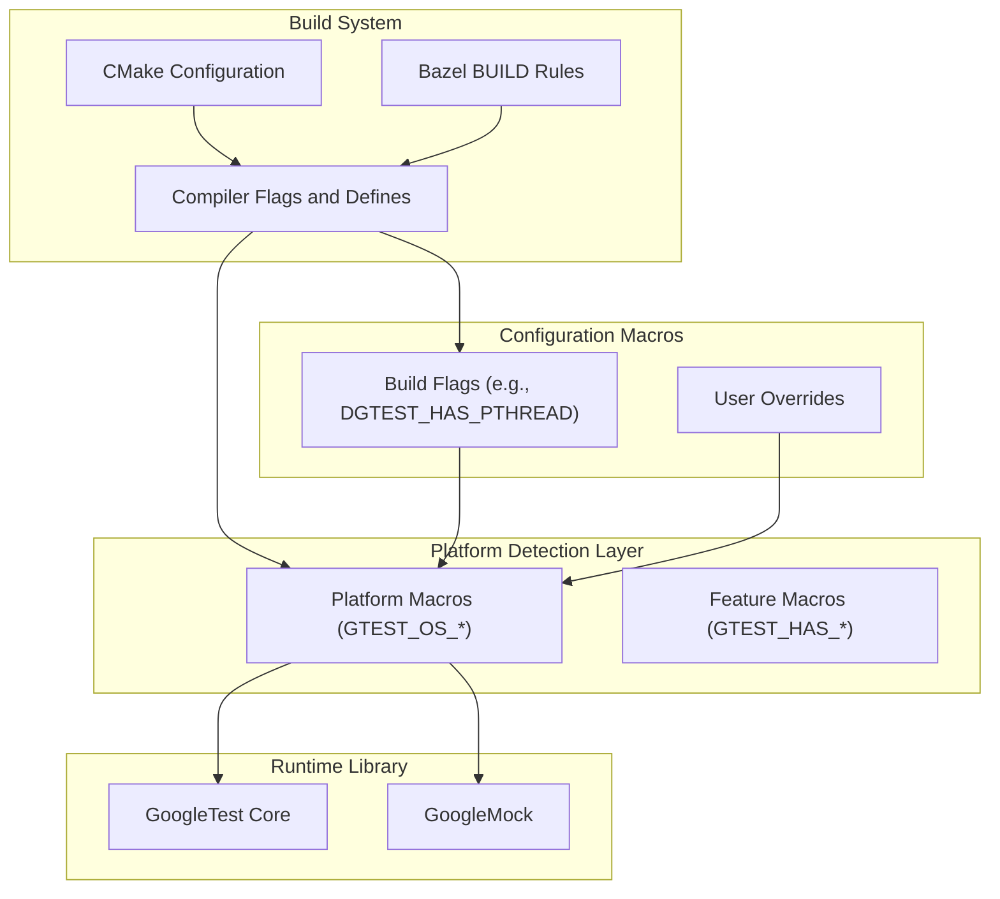

# Platform Compatibility and Configuration

GoogleTest and GoogleMock are designed to be highly portable, running across a diverse range of compilers, operating systems, and environments. This chapter equips you with the knowledge and tools to adapt GoogleTest/GoogleMock to your specific platform and configuration needs.

Here, you will explore macros and configuration APIs crucial for ensuring compatibility, controlling feature flags, managing platform-specific nuances, and extending GoogleTest's core portability to fit uncommon or constrained environments.

---

## 1. Understanding GoogleTest/GoogleMock Porting Macros

GoogleTest detects the compilation environment and platform automatically through a rich set of predefined macros. These macros enable GoogleTest to tailor its behavior to your environment and are critical when adapting or troubleshooting platform-specific issues.

### 1.1 Platform Identification Macros

GoogleTest defines a consistent set of macros to identify the underlying operating system and environment. Knowing these macros allows for conditional compilation of tests or code paths.

| Macro Name                     | Description                           |
|-------------------------------|-------------------------------------|
| `GTEST_OS_WINDOWS`             | Microsoft Windows platforms          |
| `GTEST_OS_WINDOWS_DESKTOP`     | Windows desktop variants             |
| `GTEST_OS_WINDOWS_MINGW`       | MinGW compiler on Windows            |
| `GTEST_OS_LINUX`               | Linux systems                       |
| `GTEST_OS_LINUX_ANDROID`       | Android on Linux                    |
| `GTEST_OS_MAC`                 | Mac OS X                            |
| `GTEST_OS_IOS`                 | iOS devices                        |
| `GTEST_OS_CYGWIN`              | Cygwin environment                  |
| `GTEST_OS_FREEBSD`             | FreeBSD OS                         |
| `GTEST_OS_OPENBSD`             | OpenBSD                           |
| Other macros for specialized or niche platforms (e.g., `GTEST_OS_QNX`, `GTEST_OS_FUCHSIA`, `GTEST_OS_ZOS`, etc.)  |

These macros are all defined with value 1 if true for your environment, or undefined otherwise.

### 1.2 Feature and Capability Macros

GoogleTest uses additional macros to signal the availability of platform features or compiler characteristics, such as:

- `GTEST_HAS_PTHREAD` — pthread threading support
- `GTEST_HAS_EXCEPTIONS` — exception handling support
- `GTEST_HAS_RTTI` — runtime type information
- `GTEST_HAS_STD_WSTRING` — wide string support
- `GTEST_HAS_FILE_SYSTEM` — file system presence
- `GTEST_HAS_CLONE` — Linux-specific clone syscall availability
- `GTEST_HAS_SEH` — Windows Structured Exception Handling
- `GTEST_HAS_STREAM_REDIRECTION` — ability to capture standard streams (stdout/stderr)

These macros are automatically detected but can be manually overridden if necessary.

### 1.3 How to Override Macros

If the automatic detection does not fit your platform or build environment, you can override macros via compiler flags. For example:

```bash
-DGTEST_HAS_PTHREAD=0
-DGTEST_HAS_EXCEPTIONS=1
```

Overrides like these should be added cautiously and typically only when debugging or porting to a new platform.

## 2. Configuration Flags APIs and Macros

GoogleMock extends GoogleTest's portability infrastructure with its own set of configuration macros and APIs to manage flags within your testing environment.

### 2.1 Flag Declaration and Definition Macros

GoogleMock provides an injection point for customized flag management in the `custom/gmock-port.h` file. The primary macros available include:

| Macro                              | Purpose                                  |
|-----------------------------------|------------------------------------------|
| `GMOCK_DECLARE_bool_(name)`        | Declares a boolean flag                   |
| `GMOCK_DEFINE_bool_(name, default, doc)` | Defines and documents a boolean flag      |
| `GMOCK_DECLARE_int32_(name)`       | Declares a 32-bit integer flag            |
| `GMOCK_DEFINE_int32_(name, default, doc)` | Defines a 32-bit integer flag               |
| `GMOCK_DECLARE_string_(name)`      | Declares a string flag                   |
| `GMOCK_DEFINE_string_(name, default, doc)` | Defines a string flag                      |
| `GMOCK_FLAG_GET(name)`              | Retrieves the current value of a flag    |
| `GMOCK_FLAG_SET(name, value)`       | Sets the value of a flag at runtime      |

These macros allow flexible definition and runtime manipulation of testing flags.

### 2.2 Practical Usage Example

```cpp
#include "gmock/gmock.h"

GMOCK_DEFINE_bool_(verbose, false, "Enable verbose logging in tests");

void SomeTestFunction() {
  if (GMOCK_FLAG_GET(verbose)) {
    std::cout << "Verbose mode enabled" << std::endl;
  }
}
```

### 2.3 Extending Compatibility

You can adapt GoogleMock to new or embedded platforms by customizing flag behavior in `gmock-port.h` under the `custom/` directory. This allows you to define or redefine how flags are stored and accessed, potentially integrating with your environment's configuration system.

## 3. Build System and Compiler Configuration

Building GoogleTest/GoogleMock correctly for your platform ensures that these macros and flags behave as expected.

### 3.1 CMake Build Configuration

GoogleTest includes CMake support, which adapts compiler and linker flags for cross-platform compatibility. The CMake scripts:

- Detect platform threading support (`GTEST_HAS_PTHREAD`)
- Set compiler warning levels and options for strictness
- Manage shared vs static library builds via `BUILD_SHARED_LIBS` and related flags

A key function `config_compiler_and_linker()` establishes recommended flags based on your environment:

- Enables `GTEST_HAS_PTHREAD` on platforms with pthread
- Sets stricter warnings on MSVC and GCC/Clang
- Handles disabling exceptions and RTTI if requested

### 3.2 Bazel Build Configuration

Bazel build scripts contain platform predicates such as `windows`, `freebsd`, and `openbsd` to tailor build flags and dependencies. Bazel also manages platform-specific defines and appropriate link options, such as linking against pthread where necessary.

### 3.3 Compiler Feature Requirements

GoogleTest requires a C++17 conforming compiler at a minimum. It detects and uses compiler features like exceptions, RTTI, and attribute support accordingly, falling back gracefully when unavailable.

## 4. Common Configuration Scenarios

This section covers how to apply configuration macros effectively to common real-world situations.

### 4.1 Enabling Thread-Safety

GoogleTest is thread-safe when pthreads or equivalent threading support is available (`GTEST_IS_THREADSAFE`). If automatic detection fails:

- For pthreads-supported platforms, pass `-DGTEST_HAS_PTHREAD=1` during compilation.

Ensure your build links against the pthread library, e.g., `-pthread` on Linux.

### 4.2 Building with or without Exceptions

To compile with exceptions enabled (recommended):

```bash
# Default or
-DGTEST_HAS_EXCEPTIONS=1
```

To disable exceptions (e.g., on platforms or builds that do not support them):

```bash
-DGTEST_HAS_EXCEPTIONS=0
```

Note: Some GoogleTest features, like death tests, require exceptions.

### 4.3 Building with or without RTTI

If your environment lacks or disables RTTI, inform GoogleTest by:

```bash
-DGTEST_HAS_RTTI=0
```

Otherwise, this is the default.

### 4.4 Using GoogleTest as a Shared Library

When building GoogleTest or GoogleMock as shared libraries (DLLs on Windows), these defines are required:

```bash
-DGTEST_CREATE_SHARED_LIBRARY=1  # when building GoogleTest
-DGTEST_LINKED_AS_SHARED_LIBRARY=1  # when building tests linking against shared GoogleTest
```

Missing these can cause linker errors or runtime issues.

### 4.5 Avoiding Macro Name Collisions

GoogleTest exposes many macros that can conflict with other libraries. To rename these macros and avoid collisions, define:

```bash
-DGTEST_DONT_DEFINE_TEST=1
```

This causes the macro `TEST` to be renamed as `GTEST_TEST`, and so on for other standard macros.

## 5. Best Practices and Tips

- Always use the predefined macros to write portable test code, guarding code with `#if GTEST_OS_LINUX` or similar as needed.
- Prefer configuring build flags via CMake or Bazel rather than manually redefining macros.
- If unsure, rely on GoogleTest's automatic detection but verify with `GTEST_HAS_PTHREAD` and similar indicators.
- Use `gmock-port.h` under `custom/` for platform-specific adaptations, but keep maintenance in mind when upgrading.

## 6. Troubleshooting Common Issues

### 6.1 Test Suite Won't Link on Windows

Check that shared library flags are properly set:

- Define `GTEST_CREATE_SHARED_LIBRARY` when building
- Define `GTEST_LINKED_AS_SHARED_LIBRARY` when linking

### 6.2 Thread-Related Failures or Link Errors

Ensure that your build links against pthread (`-pthread`) if `GTEST_HAS_PTHREAD=1`. Confirm that `GTEST_IS_THREADSAFE` is defined.

### 6.3 Exceptions Not Working As Expected

If you disabled exceptions (`GTEST_HAS_EXCEPTIONS=0`), some features won’t work. Either re-enable exceptions or modify your tests to accommodate the limitation.

### 6.4 Macro Collision Errors

If macro redefinition errors occur, use the `DGTEST_DONT_DEFINE_*` flags to rename macros and avoid conflicts.

## 7. Further Reading and Related Documentation

- [Platform Support and Portability Concept](https://github.com/google/googletest/blob/main/docs/platforms.md): Overview of supported platforms and compilers.
- [Build and Installation Guides](https://github.com/google/googletest/blob/main/README.md#build): Instructions for CMake and Bazel setups.
- [NiceMock, NaggyMock, and StrictMock Controls](./nice-naggy-strict-mocks): To control mock strictness in tests.
- [Error Handling and Status Codes](./error-handling-status-codes): For understanding runtime errors.

---

With this knowledge, you can confidently adapt GoogleTest and GoogleMock to a wide range of environments, enabling robust, portable, and maintainable C++ testing across platforms.

---

## Appendix: Platform Detection Macro Excerpt Example

Here is a snippet from the source header defining platform macros, illustrating the concept:

```cpp
#ifdef __CYGWIN__
#define GTEST_OS_CYGWIN 1
#elif defined _WIN32
#define GTEST_OS_WINDOWS 1
  #ifdef _WIN32_WCE
  #define GTEST_OS_WINDOWS_MOBILE 1
  #else
  #define GTEST_OS_WINDOWS_DESKTOP 1
  #endif
#elif defined __linux__
#define GTEST_OS_LINUX 1
#if defined __ANDROID__
#define GTEST_OS_LINUX_ANDROID 1
#endif
#elif defined __APPLE__
#define GTEST_OS_MAC 1
#include <TargetConditionals.h>
#if TARGET_OS_IPHONE
#define GTEST_OS_IOS 1
#endif
#endif
```

This auto-detection facilitates seamless compilation tailored to your environment.

## Code References

- See the [gtest/internal/gtest-port.h](https://github.com/google/googletest/blob/main/googletest/include/gtest/internal/gtest-port.h) for macros and platform checks.
- GoogleMock flags and extensions appear in [gmock/internal/gmock-port.h](https://github.com/google/googletest/blob/main/googlemock/include/gmock/internal/gmock-port.h).


## Summary Diagram of Platform Compatibility Layers



This diagram shows how platform and feature macros interact with build flags and user overrides to configure GoogleTest/GoogleMock behavior.
