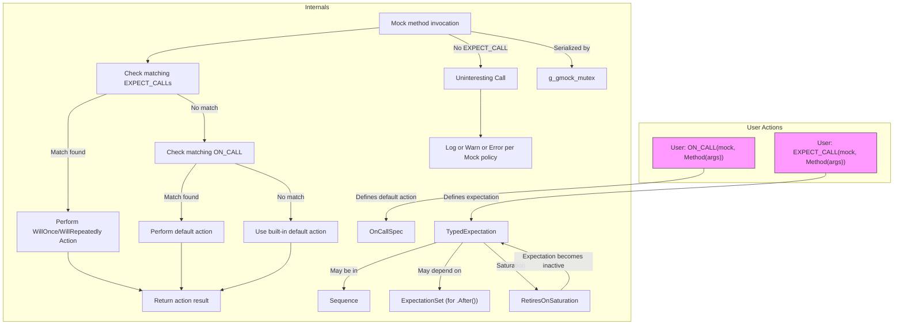

# Actions and Expectations Reference

Comprehensive documentation and examples for `ON_CALL`, `EXPECT_CALL` and their related builder APIs. This guide explains how to specify call expectations, cardinalities, order, and default/mock behaviors for interaction testing with GoogleMock.

---

## Overview

In GoogleMock, **`ON_CALL`** and **`EXPECT_CALL`** provide the core mechanisms to define behaviors and expectations for mock object methods:

- `ON_CALL` specifies **default actions** for mock methods, controlling what happens when the method is invoked _without_ enforcing expectations on call counts or order.
- `EXPECT_CALL` sets strict **expectations** that a method must be called **with specific arguments, a given number of times, and optionally in a defined order**.

Understanding when and how to use these macros effectively enables robust interaction-based testing, empowering you to model, verify, and react to complex behaviors in the code under test.

---

## 1. Specifying Default Behaviors with `ON_CALL`

The `ON_CALL` macro defines default behavior for matching calls to mock methods. It doesn’t enforce that calls happen; it just determines what should be done if they do.

### Syntax and Usage

```cpp
ON_CALL(mock_object, Method(argument_matchers))
    .With(multi_argument_matcher)  // optional
    .WillByDefault(action);
```

- `Method(argument_matchers)`: specifies the mocked method and argument patterns.
- `.With(...)`: (optional) narrows matches to only those arguments that collectively satisfy a tuple matcher.
- `.WillByDefault(...)`: required, defines the action executed by default on matching calls.

### Important Characteristics

- Multiple `ON_CALL` statements can exist for the same method; **the last matching `ON_CALL` takes precedence**.
- Default actions are overridden by any matching `EXPECT_CALL` actions.
- If no `ON_CALL` matches a call, a built-in default action is used (e.g., returning default-constructed values).

### Example

```cpp
ON_CALL(mock_obj, Foo(_))
    .WillByDefault(Return(42));

ON_CALL(mock_obj, Foo(5))
    .WillByDefault(Return(10));

// Calls:
EXPECT_EQ(mock_obj.Foo(5), 10);   // Matches second ON_CALL
EXPECT_EQ(mock_obj.Foo(7), 42);   // Matches first ON_CALL
```

---

## 2. Defining Call Expectations with `EXPECT_CALL`

`EXPECT_CALL` asserts that certain calls will occur on mock methods under defined conditions.

### Syntax and Usage

```cpp
EXPECT_CALL(mock_object, Method(argument_matchers))
    .With(multi_argument_matcher)   // optional, can appear once
    .Times(cardinality)             // optional, at most once
    .InSequence(sequence_objects...) // optional, can appear multiple times
    .After(expectation_objects...)    // optional, can appear multiple times
    .WillOnce(action)               // optional, multiple times
    .WillRepeatedly(action)         // optional, at most once
    .RetiresOnSaturation();          // optional, at most once
```

| Clause                | Description |
|-----------------------|-------------|
| `.With()`             | Adds a matcher on the entire argument tuple for fine-grained matching.
| `.Times()`            | Specifies expected call count cardinality (`Exactly(n)`, `AnyNumber()`, `AtLeast(n)`, etc.).
| `.InSequence()`       | Associates the expectation with one or more `Sequence`s to enforce call ordering.
| `.After()`            | Declares prerequisite expectations; this call can only occur after them.
| `.WillOnce()`         | Defines a one-time action to perform on the N-th matching call.
| `.WillRepeatedly()`   | Defines a default action performed on all calls after `WillOnce` actions are exhausted.
| `.RetiresOnSaturation()` | Causes the expectation to retire (become inactive) after satisfying its cardinality.

### Behavior Rules

- Later matching `EXPECT_CALL`s have precedence over earlier ones.
- If `.Times()` is omitted, cardinality is inferred from actions specified:
  - No `.WillOnce()` or `.WillRepeatedly()` => `Times(1)`.
  - N `WillOnce()` clauses and no `WillRepeatedly()` => `Times(N)`.
  - N `WillOnce()` clauses and 1 `WillRepeatedly()` => `Times(AtLeast(N))`.
- Multiple `.With()` or `.Times()` clauses are disallowed.
- Calls that do not match any active `EXPECT_CALL` result in error (unexpected calls).

### Examples

#### Simple Expectation

```cpp
EXPECT_CALL(mock_obj, GetValue(5))
    .Times(1)
    .WillOnce(Return(100));

// Usage
int val = mock_obj.GetValue(5);  // returns 100
```

#### Allow Multiple Calls with Different Returns

```cpp
EXPECT_CALL(mock_obj, Compute(_))
    .WillOnce(Return(1))
    .WillOnce(Return(2))
    .WillRepeatedly(Return(3));

// Calls return 1,2,3,3,...
```

#### Call Ordering Using `InSequence`

```cpp
Sequence s1;

EXPECT_CALL(mock_obj, Init())
    .InSequence(s1);
EXPECT_CALL(mock_obj, Run())
    .InSequence(s1);
EXPECT_CALL(mock_obj, Finish())
    .InSequence(s1);

// Calls to Init(), Run(), Finish() must happen in that order
```

#### Using `After` Clause

```cpp
Expectation e1 = EXPECT_CALL(mock_obj, Step1());
Expectation e2 = EXPECT_CALL(mock_obj, Step2()).After(e1);

// Step2() call allowed only after Step1() call
```

---

## 3. Cardinalities: Controlling Expected Call Counts

GoogleMock provides a powerful cardinality system for `Times()` clauses, enabling you to specify exactly how many times calls are expected.

### Built-in Cardinalities

| Cardinality     | Meaning                   |
|-----------------|---------------------------|
| `AnyNumber()`   | Called zero or more times. |
| `AtLeast(n)`    | Called at least `n` times. |
| `AtMost(n)`     | Called at most `n` times.  |
| `Between(m, n)` | Called between `m` and `n` times inclusive. |
| `Exactly(n)` or just `n` | Called exactly `n` times. |

### Inferred Cardinalities

See above under `EXPECT_CALL`

### Using Custom Cardinalities

You can implement custom cardinalities by implementing the `CardinalityInterface`. For example, to expect calls occur an even number of times:

```cpp
class EvenNumberCardinality : public CardinalityInterface {
 public:
  bool IsSatisfiedByCallCount(int call_count) const override {
    return call_count % 2 == 0;
  }

  bool IsSaturatedByCallCount(int /* call_count */) const override {
    return false;
  }

  void DescribeTo(std::ostream* os) const override {
    *os << "called even number of times";
  }
};

Cardinality EvenNumber() {
  return Cardinality(new EvenNumberCardinality);
}

EXPECT_CALL(mock_obj, Foo()).Times(EvenNumber());
```

---

## 4. Sequences and Order Constraints

### Strict Ordering with `InSequence`

- Place all `EXPECT_CALL`s that need to happen strictly in order within an `InSequence` block.
- Each mock method is assigned to the same implicit sequence.

Example:

```cpp
{
  InSequence s;
  EXPECT_CALL(mock, Start());
  EXPECT_CALL(mock, Process());
  EXPECT_CALL(mock, End());
}
```

### Partial Ordering Using Multiple Sequences

- You can assign expectations to multiple sequences by passing multiple sequences to `.InSequence()`.
- This specifies a directed acyclic graph (DAG) of call order constraints.

### Using `.After()` for Arbitrary Partial Orders

- `.After()` can express that an expectation must only occur after the specified expectations.
- Can accept multiple `Expectation` or `ExpectationSet` to represent prerequisite calls.

### Retiring Expectations

- By default, expectations are "sticky"; they remain active after saturation unless explicitly retired.
- Use `.RetiresOnSaturation()` to retire an expectation upon reaching its call count.
  This helps avoid brittle tests when setting multiple overlapping expectations.

---

## 5. Matching Arguments and Using `.With()` Clauses

- Individual argument matchers specify which calls the expectation applies to.
- The optional `.With()` clause allows matching **all arguments together** as a tuple.
- `.With()` is **optional** and can be specified at most once.

Example:

```cpp
EXPECT_CALL(mock, DoSomething(_, _))
    .With(Lt());  // First arg < second arg
```

---

## 6. Handling Multiple Actions in `EXPECT_CALL`

- You can specify a series of one-time actions using `.WillOnce()`, executed in order.
- Use `.WillRepeatedly()` to specify a fallback action for subsequent calls after all `.WillOnce()` actions are used.

Example:

```cpp
EXPECT_CALL(mock, Get())
    .WillOnce(Return(1))
    .WillOnce(Return(2))
    .WillRepeatedly(Return(3));

// Returns 1, then 2, then 3 on all subsequent calls.
```

---

## 7. Uninteresting vs Unexpected Calls

- **Uninteresting calls**: calls to mock methods with no matching `EXPECT_CALL`. By default, these trigger a warning but not a test failure. Behavior can be altered via `NiceMock`, `NaggyMock`, or `StrictMock`.
- **Unexpected calls**: calls to mock methods where expectations exist but no match is found. These always produce failures.

---

## 8. Advanced Topics

### Evaluation Order

- Both `ON_CALL` and `EXPECT_CALL` evaluate their arguments exactly once.
- `.With()` clauses must be first in an `EXPECT_CALL` or `ON_CALL` statement if used.

### Common Pitfalls

- Avoid specifying `.With()` or `.Times()` multiple times; these cause runtime errors.
- Use `.RetiresOnSaturation()` when chaining multiple `.WillOnce()` actions to prevent "sticky" expectations errors.
- Ensure that `EXPECT_CALL` is set before the method calls; setting expectations after calls results in undefined behavior.

### Suppressing Leaked Mock Errors

- Use `Mock::AllowLeak(&mock_object)` to explicitly allow leaks for objects that won't be deleted, preventing test failures on shutdown.

### Behavior When Actions Run Out

- If all `WillOnce()` actions are exhausted and no `WillRepeatedly()` is specified, default actions are used, generating warnings.

---

## 9. Illustrative Examples

### Basic ON_CALL and EXPECT_CALL

```cpp
class MockFoo {
 public:
  MOCK_METHOD(int, GetValue, (int), ());
};

MockFoo mock_foo;

ON_CALL(mock_foo, GetValue(_)).WillByDefault(Return(0));
EXPECT_CALL(mock_foo, GetValue(5)).Times(1).WillOnce(Return(42));

EXPECT_EQ(mock_foo.GetValue(5), 42);  // Matches EXPECT_CALL
EXPECT_EQ(mock_foo.GetValue(1), 0);   // Matches ON_CALL
```

### Specifying a Call Sequence

```cpp
using ::testing::InSequence;

{
  InSequence seq;
  EXPECT_CALL(mock_foo, Step1());
  EXPECT_CALL(mock_foo, Step2());
  EXPECT_CALL(mock_foo, Step3());
}

// Calls must occur in order: Step1 -> Step2 -> Step3
```

### Partial Order with `.After()`

```cpp
Expectation e1 = EXPECT_CALL(mock_foo, Init());
Expectation e2 = EXPECT_CALL(mock_foo, LoadConfig()).After(e1);
EXPECT_CALL(mock_foo, Run()).After(e2);

// 'LoadConfig()' can only occur after 'Init()',
// 'Run()' can only occur after 'LoadConfig()'.
```

### Multiple WillOnce and WillRepeatedly

```cpp
EXPECT_CALL(mock_foo, Get()).
    WillOnce(Return(1))
    .WillOnce(Return(2))
    .WillRepeatedly(Return(3));

mock_foo.Get();  // returns 1
mock_foo.Get();  // returns 2
mock_foo.Get();  // returns 3
mock_foo.Get();  // returns 3
```

---

## Troubleshooting and Best Practices

- Use **`--gmock_verbose`** flag (`info`, `warning`, `error`) to control message verbosity and gain insights into call matching.
- Always set `EXPECT_CALL` before exercising mocks. Do not set expectations after method calls.
- Prefer specifying only those argument matchers relevant to your test intent to avoid over-specification.
- Chain multiple `.WillOnce()` actions followed by `.WillRepeatedly()` for sequences of returns.
- Use `.RetiresOnSaturation()` to have expectations retire after being satisfied, avoiding “sticky” behavior.
- Use `NiceMock` to suppress warnings on uninteresting calls, and `StrictMock` to treat them as failures.
- Explicitly allow mock leaks with `Mock::AllowLeak()` if necessary, to avoid shutdown failures.
- Use `InSequence()` blocks to express strict call ordering and `.After()` for partial ordering.

---

## Related Topics and Further Reading

- [Mock Classes and Methods API](./mock-classes-methods.md): Defining mocks and methods.
- [Matchers Reference](../core-assertions-macros/gmock-matchers.md): Matchers for argument validation.
- [Actions Reference](../core-assertions-macros/actions.md): Built-in and custom actions for mocks.
- [Mocking Policies and Behaviors](./mock-object-behaviors.md): Using `NiceMock`, `StrictMock`, and `NaggyMock`.
- [gMock Cookbook](https://github.com/google/googletest/blob/main/docs/gmock_cook_book.md): Practical recipes and best practices.

---

## Further Details

For precise method signatures, usage examples, and error diagnostics, see:

- Google Mock internal test suite validating `ON_CALL` and `EXPECT_CALL` usage.
- The Google Mock source code and headers for spec builder implementation.

This page focuses specifically on how to use `ON_CALL` and `EXPECT_CALL`, their chaining clauses, cardinalities, ordering constraints, and related concepts needed for effective mocking and interaction testing.


---

# Diagrams

Below is a Mermaid diagram outlining the flow and relationships between `ON_CALL`, `EXPECT_CALL`, expectations, sequences, actions, and calls within the GoogleMock framework.



---

## Summary

This guide serves as a comprehensive reference to:

- Define default mock behaviors with `ON_CALL`.
- Set precise call expectations using `EXPECT_CALL` with cardinality and ordering clauses.
- Use sequences and `After` clauses to enforce call order constraints.
- Specify argument matching with individual matchers and `.With()` tuple matchers.
- Configure actions with `.WillOnce()` and `.WillRepeatedly()` to script mock responses.
- Handle uninteresting vs unexpected calls, including policy control via mock wrappers.
- Troubleshoot common issues and idiomatic usage patterns.

The combination of expressive syntax and powerful call control makes GoogleMock’s `ON_CALL` and `EXPECT_CALL` facility the cornerstone for interaction-based testing in C++.

---

<!--
Source: 
- googlemock/include/gmock/gmock-spec-builders.h
- googlemock/src/gmock-spec-builders.cc
- docs/gmock_cook_book.md
- docs/reference/mocking.md
- googlemock/test/gmock-spec-builders_test.cc
- googlemock/test/gmock_output_test_.cc
- googlemock/test/gmock_output_test_golden.txt
-->
