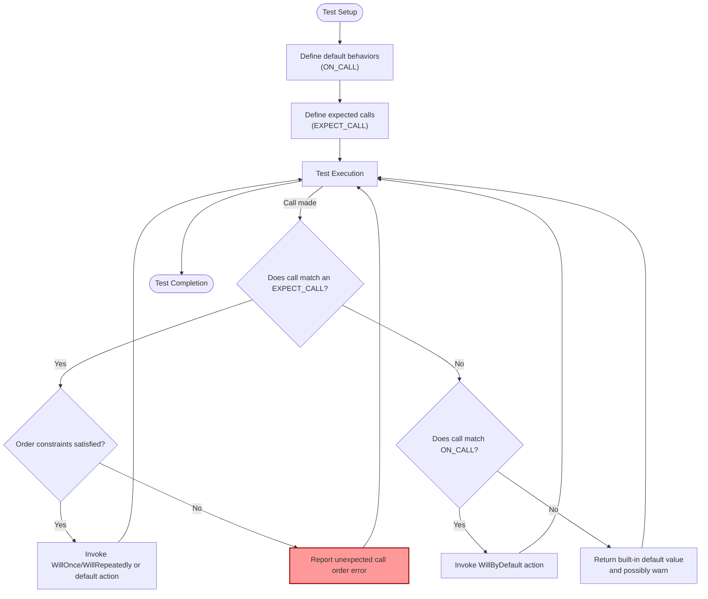

# Setting Expectations and Call Sequences

Use this page to master how to define behaviors and verify interactions on mock objects using GoogleMock's `ON_CALL` and `EXPECT_CALL` macros. Here, you'll learn to specify default behaviors, precise call expectations, and how to control the order of calls across mocks — key to testing complex interactions in your code.

---

## Overview

In GoogleMock, **setting expectations on mock methods** allows you to specify how you expect your code under test to interact with its dependencies. This includes:

- Defining **default behaviors** for calls that you do not necessarily want to verify but want to simulate (`ON_CALL`).
- Specifying **expected calls** that *must occur* for the test to pass, including argument matchers, call counts, and call sequences (`EXPECT_CALL`).
- Controlling **ordering** of calls, both strict sequences and partial orders, to validate complex workflows.

The design encourages using `ON_CALL` for default behavior — the baseline contract —and `EXPECT_CALL` for explicit verification, ensuring tests remain robust and maintainable by avoiding over-specification.

---

## Using ON_CALL — Defining Default Behavior

`ON_CALL` defines what your mock does *when* a method is called matching specified arguments, but does **not** set any requirement for that call to happen.

```cpp
ON_CALL(mock_object, SomeMethod(matchers...))
    .With(multi_arg_matcher)  // optional
    .WillByDefault(action);   // required
```

- Use `ON_CALL` when you want the mock to simulate a method returning or doing something without asserting the call is made.
- This helps create sensible defaults in test setup or mock constructors.
- The `.With()` clause restricts this behavior to calls whose arguments as a whole match the given matcher.

Example:

```cpp
using ::testing::Return;
ON_CALL(my_mock, Compute(_))
    .WillByDefault(Return(42));
```

If no `EXPECT_CALL` matches a call, the last matching `ON_CALL` action (or built-in default action) is used.

---

## Using EXPECT_CALL — Specifying Expected Calls

`EXPECT_CALL` sets an expectation that a method *will be called* satisfying argument matchers, and defines what to do when it happens.

```cpp
EXPECT_CALL(mock_object, Method(matchers...))
    .With(multi_arg_matcher)  // optional
    .Times(cardinality)       // optional, default inferred
    .InSequence(sequences...) // zero or more
    .After(expectations...)   // zero or more
    .WillOnce(action)         // zero or more
    .WillRepeatedly(action)   // zero or one
    .RetiresOnSaturation();   // optional
```

- `EXPECT_CALL` combines verification intent and behavior declaration.
- The `Times` clause controls *how many times* the call is expected.
- Subsequent `WillOnce` calls define behaviors on each matching call in order.
- `WillRepeatedly` defines the fallback behavior after all `WillOnce`s are exhausted.

Example — expect exactly two calls returning specific values:

```cpp
EXPECT_CALL(mock, GetValue())
    .WillOnce(Return(100))
    .WillOnce(Return(200));
```

If call counts or argument matching don't align during test execution, GoogleMock reports errors immediately.

---

## Argument Matchers and Combining Expectations

- Use concrete values for exact argument matching or GoogleMock’s extensive suite of [**matchers**](reference/builtin-matchers.md) for flexible comparisons.
- The special matcher `_` matches any argument.
- The `.With()` clause enables matching arguments collectively as a tuple for complex conditions.
- Multiple `EXPECT_CALL` statements on the same method are searched in reverse order; the last matching applies. This allows layering more specific overrides after general expectations.

### Example — Catch-all and specific expectations

```cpp
EXPECT_CALL(mock, Foo(_)).Times(AnyNumber());       // Catch all calls
EXPECT_CALL(mock, Foo(42)).Times(2).WillRepeatedly(Return(true)); // Specific rules
```

Here, calls to `Foo(42)` have their own behavior and call count verified; other calls are allowed but not verified.

---

## Controlling Call Ordering

GoogleMock makes verifying call order explicit and flexible with these mechanisms:

### `InSequence`

Wrap related `EXPECT_CALL`s in an `InSequence` object to require **strict sequential order** of matching calls:

```cpp
{
  InSequence seq;
  EXPECT_CALL(mock, First()).Times(1);
  EXPECT_CALL(mock, Second()).Times(1);
}
```

`First()` call must precede `Second()`.

### `Sequence` Object and `.InSequence()` Clause

You can create named sequences and assign expectations to them, enabling partial ordering:

```cpp
Sequence s1, s2;
EXPECT_CALL(mock, A()).InSequence(s1, s2);
EXPECT_CALL(mock, B()).InSequence(s1);
EXPECT_CALL(mock, C()).InSequence(s2);
```

This generates an ordering where `A` comes before both `B` and `C`, but relative order of `B` and `C` is free.

### `.After()` Clause

Use `.After()` to specify that expectation(s) must be satisfied before this one can match:

```cpp
Expectation e1 = EXPECT_CALL(mock, Init());
EXPECT_CALL(mock, Process()).After(e1);
```

The `Process()` call must occur after the `Init()` call completes.

### Retirement of Expectations

By default, expectations remain active even after their upper bound is reached, which can cause errors if called more times.

`.RetiresOnSaturation()` lets you make an expectation **retire immediately after satisfying the expected number of calls**, allowing other less specific expectations to take over.

```cpp
EXPECT_CALL(mock, Foo(7)).Times(2).RetiresOnSaturation();
EXPECT_CALL(mock, Foo(_)).Times(AnyNumber());
```

The first two matching calls for `Foo(7)` activate the first expectation; subsequent calls match the second.

---

## Best Practices for Setting Expectations

- Prefer `ON_CALL` for *default behavior* when you do not care if the call happens.
- Use `EXPECT_CALL` to specify calls you want to verify.
- Avoid setting overly strict expectations that lead to brittle tests.
- Use sequences or `.After()` for ordering where relevant.
- Employ `.RetiresOnSaturation()` to avoid sticky expectations causing false failures.
- Use catch-all expectations with `.Times(AnyNumber())` to relax constraints on uninteresting calls.

---

## Common Pitfalls and Troubleshooting

<Warning>
Do **not** set expectations (`EXPECT_CALL`) after your code under test has executed; doing so leads to undefined behavior.
</Warning>

<Warning>
Uninteresting calls (calls to methods with no expectation) generate warnings and, by default, return default values. Use `NiceMock` to suppress warnings or add catch-all expectations to explicitly allow calls.
</Warning>

<Warning>
Beware of sticky expectations: an expectation remains active even after its upper bound is reached, potentially causing failures if called extra times without `RetiresOnSaturation()`.
</Warning>

<Note>
Use the `--gmock_verbose=info` flag during test runs to get detailed logs of expectations and calls, including stacks, to diagnose mismatches and unexpected calls.
</Note>

---

## Code Examples

<CodeGroup>
```cpp
#include <gmock/gmock.h>
using ::testing::Return;
using ::testing::_;
using ::testing::InSequence;
using ::testing::Sequence;

class MockFoo {
 public:
  MOCK_METHOD(int, Bar, (int x), ());
  MOCK_METHOD(void, Baz, (), ());
};

// Default behavior example
void SetupDefaultBehavior(MockFoo& mock) {
  ON_CALL(mock, Bar(_)).WillByDefault(Return(10));
}

// Expect calls with order
void TestSequence() {
  MockFoo mock;
  {
    InSequence seq;
    EXPECT_CALL(mock, Baz());
    EXPECT_CALL(mock, Bar(5)).WillOnce(Return(15));
  }

  mock.Baz();         // Must be first
  int val = mock.Bar(5); // Then this
  assert(val == 15);
}

// Partial order with Sequence objects
void TestPartialOrder() {
  MockFoo mock;
  Sequence s1, s2;

  EXPECT_CALL(mock, Bar(1)).InSequence(s1, s2);
  EXPECT_CALL(mock, Bar(2)).InSequence(s1);
  EXPECT_CALL(mock, Baz()).InSequence(s2);

  mock.Bar(1);  // First
  mock.Bar(2);  // After Bar(1), before Baz()
  mock.Baz();   // Last
}

// Expectation retirement
void TestRetiresOnSaturation() {
  MockFoo mock;
  EXPECT_CALL(mock, Bar(100)).Times(2).RetiresOnSaturation();
  EXPECT_CALL(mock, Bar(_)).Times(::testing::AnyNumber());

  mock.Bar(100);
  mock.Bar(100);
  mock.Bar(200);  // Matches catch-all
}
```
```
</CodeGroup>

---

## Summary Diagram: Expectation Flow



---

## Further Resources

- [GoogleMock Cookbook](https://github.com/google/googletest/blob/main/docs/gmock_cook_book.md) — Practical recipes for writing mocks, defining expectations, actions, and mock behaviors.
- [Matchers Reference](reference/builtin-matchers.md) — Detailed list and explanation of argument matchers.
- [Actions Reference](reference/actions.md) — How to specify actions during mock method calls.
- [Mocking Reference](reference/mocking.md) — Comprehensive grounding in mocking syntax, classes, macros.
- [Using Mocks in Tests](docs/gmock_for_dummies.md#using-mocks) — Overview of mock usage workflows.

---

Use this page as your authoritative guide to structuring your mock's call expectations and default behaviors effectively, enabling you to validate intricate test interactions confidently and maintain test stability during refactoring and enhancements.
