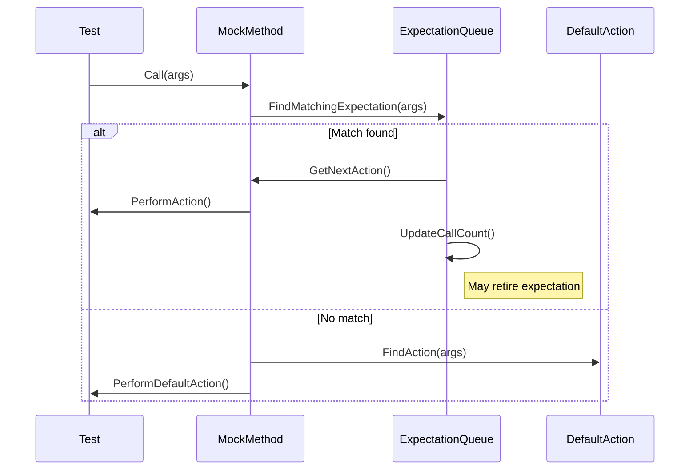

# Actions: Defining Mock Method Behavior

This reference details how to control the behavior of mock methods in GoogleMock (gMock) tests using its rich set of built-in actions, custom actions, and variadic template features. It teaches you how to specify what happens when a mock method is called, crucial for simulating realistic and varied responses in unit tests.

---

## Overview

Mock methods do not have real implementations; their behavior must be explicitly specified in tests. GoogleMock provides **actions** to define these behaviors declaratively. Actions specify what happens when a particular mock method is invoked, such as returning a value, throwing an exception, modifying arguments, or invoking callbacks.

Two primary macros let you define these behaviors:

- `ON_CALL(mock_object, method(matchers))` — defines default actions without setting expectations.
- `EXPECT_CALL(mock_object, method(matchers))` — sets expectations and defines actions when those expectations match.

While `EXPECT_CALL` implies an expectation of a call, `ON_CALL` merely defines the default behavior if no expectation overrides it.

---

## Built-in Actions

GoogleMock provides a variety of built-in actions organized by their purpose.

### Returning Values or References

| Action | Description |
| --- | --- |
| `Return()` | Returns from a `void` mock method.
| `Return(value)` | Returns a copy of `value`. The conversion happens when the expectation is set.
| `ReturnRef(variable)` | Returns a reference to a variable. Suitable for mock methods returning references.
| `ReturnPointee(ptr)` | Returns the value pointed to by `ptr` at call time.
| `ReturnNew<T>(a1, ..., ak)` | Returns a new instance of `T` constructed with the given args each call.
| `ReturnNull()` | Returns a null pointer.
| `ReturnRoundRobin({a1, ..., ak})` | Cycles through returning values in the list in sequence.
| `ReturnArg<N>()` | Returns the N-th argument received (0-based).

### Side Effects on Arguments and State

| Action | Description |
| --- | --- |
| `Assign(&variable, value)` | Assigns `value` to the variable referenced by `&variable`.
| `DeleteArg<N>()` | Deletes the N-th pointer argument.
| `SaveArg<N>(pointer)` | Saves a copy of the N-th argument to `*pointer`.
| `SaveArgByMove<N>(pointer)` | Saves the N-th argument to `*pointer` by move.
| `SaveArgPointee<N>(pointer)` | Saves the value pointed to by the N-th pointer argument to `*pointer`.
| `SetArgReferee<N>(value)` | Assigns `value` to the variable referenced by the N-th argument.
| `SetArgPointee<N>(value)` | Assigns `value` to the object pointed to by the N-th argument.
| `SetArrayArgument<N>(first, last)` | Copies elements from `[first, last)` into the array pointed to by the N-th argument.
| `SetErrnoAndReturn(error, value)` | Sets `errno` and returns `value`.
| `Throw(exception)` | Throws the given exception.

### Invoking Callables

| Action | Description |
| --- | --- |
| `Invoke(f)` | Calls the callable `f` with the mock function's arguments.
| `InvokeWithoutArgs(f)` | Calls the callable `f` with no arguments.
| `InvokeArgument<N>(args...)` | Calls the N-th argument as a callable with arguments `args...`.
| `IgnoreResult(a)` | Ignores the return value from action `a`.

### Composite and Utility Actions

| Action | Description |
| --- | --- |
| `DoAll(a1, a2, ..., an)` | Performs multiple actions sequentially, returning the last action's result.
| `DoDefault()` | Performs the default action (from `ON_CALL` or built-in).
| `WithArg<N>(a)` | Passes argument N to action `a`.
| `WithArgs<N1, N2, ..., Nk>(a)` | Passes selected arguments to action `a`.
| `WithoutArgs(a)` | Runs action `a` with no arguments.

---

## Using Actions With Expectations

Bind actions to mock methods with `WillOnce()`, `WillRepeatedly()`, or in `ON_CALL` with `WillByDefault()`:

```cpp
EXPECT_CALL(mock_obj, SomeMethod(_))
    .WillOnce(Return(true))
    .WillRepeatedly(Return(false));

ON_CALL(mock_obj, SomeMethod(_))
    .WillByDefault(Return(true));
```

- Use `WillOnce()` for actions executed once per call.
- Use `WillRepeatedly()` for the default action after all `WillOnce()`s are exhausted.
- `WillByDefault()` in `ON_CALL` sets default behavior without enforcing call count.

**Important: the order of clauses matters:**

```cpp
EXPECT_CALL(mock, Method())
    .Times(AtLeast(1))
    .WillOnce(Return(42))  // OK
    .WillRepeatedly(Return(7))  // OK
    .RetiresOnSaturation();      // Optional
```

Don't put `.WillOnce()` after `.WillRepeatedly()`, and `.With()` must be the first clause.

---

## Writing Custom Actions

When built-in actions don't meet your needs, you can define custom actions using:

- **Lambdas and function objects:** Simply supply a callable with a matching signature.
  
```cpp
EXPECT_CALL(mock, Foo(_)).WillOnce([](int x) { return x * 2; });
```

- **ACTION macros:** Legacy but still supported macros to define named actions.

```cpp
ACTION(ReturnDouble) { return 2 * arg0; }
EXPECT_CALL(mock, Foo(_)).WillOnce(ReturnDouble());
```

- **Parameterized ACTIONs:** Use `ACTION_P`, `ACTION_P2`, etc., for actions with parameters.

```cpp
ACTION_P(Add, n) { return arg0 + n; }
EXPECT_CALL(mock, Foo(_)).WillOnce(Add(5));
```

- **Action interface:** Implement `ActionInterface<F>` for advanced cases.

### Notes on Writing Actions

- Actions are copied internally. For stateful behavior, be aware of copy semantics.
- For move-only types as arguments or return values, actions should be move-compatible.

---

## Variadic Template Features

GoogleMock uses variadic templates internally to accept arbitrary numbers of arguments, enabling:

- Flexible mocking of functions with any signature.
- Defining actions and matchers with any number of arguments.
- Selective manipulation or inspection of arguments via utilities like `WithArgs<>` and `InvokeArgument<>`.

For example, `WithArgs<0,2>(action)` runs `action` passing the 0th and 2nd arguments only.

---

## Practical Examples

### Returning a Value Based on Calls

```cpp
EXPECT_CALL(mock, GetNumber())
    .WillOnce(Return(1))
    .WillOnce(Return(2))
    .WillRepeatedly(Return(3));

// Behavior:
// 1st call returns 1
// 2nd call returns 2
// Subsequent calls return 3
```

### Setting Default Behavior without Expectation

```cpp
ON_CALL(mock, IsEnabled())
    .WillByDefault(Return(true));
```

### Modifying Output Arguments

```cpp
EXPECT_CALL(mock, UpdateValue(_))
    .WillOnce(SetArgPointee<0>(42)); // Sets output arg 0 to 42
```

### Invoking a Callback Argument

```cpp
EXPECT_CALL(mock, DoSomething(_, _))
    .WillOnce(InvokeArgument<1>(true)); // Calls 2nd argument as callback with true
```

### Chaining Multiple Actions

```cpp
EXPECT_CALL(mock, Process(_))
    .WillOnce(DoAll(SetArgPointee<0>(5), Return(true)));
```

### Returning Live Value

```cpp
int count = 0;
EXPECT_CALL(mock, GetCount())
    .WillRepeatedly(ReturnPointee(&count));

count = 4;
EXPECT_EQ(mock.GetCount(), 4);
```

### Delegating to a Real or Fake Object

```cpp
class MockFoo : public Foo {
 public:
  MOCK_METHOD(int, Bar, (), (override));

  MockFoo() {
    ON_CALL(*this, Bar()).WillByDefault([this]() { return real_.Bar(); });
  }
 private:
  Foo real_;
};
```

---

## Best Practices and Tips

- Use `ON_CALL` to set default behaviors and `EXPECT_CALL` for actual expectations.
- Be careful with `WillOnce` and `WillRepeatedly` usage; order and number matter.
- For complex behaviors, prefer lambdas or functors over legacy macros.
- Use `RetiresOnSaturation()` when you want an expectation to stop matching after being fulfilled.
- When mocking overloaded or const methods, use `Const()` helper and explicitly specify qualifiers.
- Beware of side effects in actions that are evaluated only once at setup.
- When dealing with move-only types (e.g., `std::unique_ptr`), prefer lambdas for `WillOnce` or `WillRepeatedly`.
- Use `With()` clause to specify constraints on all arguments combined when needed.
- Control mock strictness (`NiceMock`, `StrictMock`) to manage uninteresting calls.

---

## Troubleshooting Common Issues

- **Uninteresting call warnings:** Occur when a method is called without an explicit expectation; use `NiceMock` or add an `EXPECT_CALL` with `Times(AnyNumber())` if appropriate.
- **Too many or too few actions warnings:** When number of `WillOnce()` clauses does not match `Times()`, or conflicts with `WillRepeatedly()`.
- **Ambiguity in overloaded method expectations:** Use argument lists or `Const()` wrappers to resolve.
- **Unexpected calls:** Ensure expectations are set before exercising mock objects.
- **Memory leaks or crashes related to mocks:** Verify virtual destructors exist and that mock objects are cleaned properly.

---

## Additional Learning and References

- [gMock for Dummies](https://google.github.io/googletest/gmock_for_dummies.html): beginner-friendly introduction.
- [Mocking Reference](https://google.github.io/googletest/reference/mocking.html): complete macro and class API.
- [gMock Cookbook](https://google.github.io/googletest/gmock_cook_book.html): recipes and patterns.
- [Actions Reference](https://google.github.io/googletest/reference/actions.html): expanded built-in actions.
- [Matchers Reference](https://google.github.io/googletest/reference/matchers.html): argument matching basics.
- [gMock Cheat Sheet](https://google.github.io/googletest/gmock_cheat_sheet.html): quick syntax guide.

---

## Summary Diagram: Mock Method Behavior Flow



---