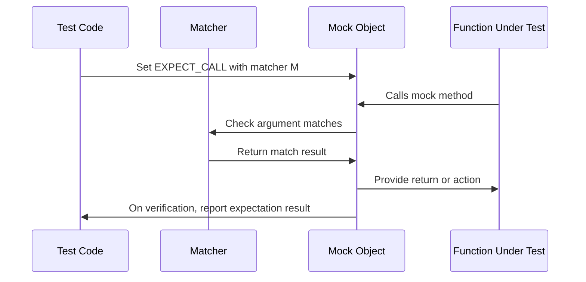

# Matchers Reference

A comprehensive catalog of GoogleMock and GoogleTest matchers. This reference covers core and advanced matchers for value comparison, container validation, predicate evaluation, and complex custom matching logic. It includes concrete usage patterns, examples, and recommended practices to help you leverage matchers effectively in your unit and mock tests.

---

## Overview

Matchers form the heart of validation in GoogleTest and GoogleMock, allowing you to assert precise conditions about function arguments and return values.

This guide details the variety of built-in matchers available, how to combine them, and introduces customization patterns for advanced use cases.

You’ll learn how to express expectations clearly and elegantly, from simple equality checks to intricate container content assertions.


## Basic Matchers for Simple Values

### Wildcard Matcher: `_`

- Matches anything (any value of any type).
- Useful when you want to ignore particular arguments.

```cpp
EXPECT_CALL(mock_foo, DoSomething(_));
```

### Equality Matchers

- `Eq(value)` or simply `value` matches objects equal to `value`.
- `Ne(value)` matches objects not equal to `value`.

```cpp
EXPECT_CALL(mock_foo, GetNumber()).WillOnce(Return(42));
EXPECT_CALL(mock_foo, Process(Eq(100)));
```

### Relational Matchers

- `Gt(value)` matches values greater than `value`.
- `Ge(value)`, `Lt(value)`, `Le(value)` for greater-or-equal, less-than, less-or-equal.

```cpp
EXPECT_CALL(mock_foo, SetThreshold(Gt(10)));
```

### Null and Pointer Matchers

- `IsNull()` matches any pointer that is null.
- `NotNull()` matches any pointer that is non-null.
- `Pointee(matcher)` matches a pointer whose pointee value matches `matcher`.

```cpp
EXPECT_CALL(mock_foo, ProcessData(Pointee(Ge(0))));  // Pointer to value >= 0.
```

### Reference Matcher

- `Ref(variable)` matches any argument that refers exactly to `variable` by reference.

```cpp
int x = 5;
EXPECT_CALL(mock_foo, Update(Ref(x)));
```

## Matchers for Strings

GoogleTest provides flexible matching for strings, including case insensitive and substring checks.

- `StrEq(str)` matches strings equal to `str` (case sensitive).
- `StrNe(str)` matches strings not equal to `str`.
- `StrCaseEq(str)` and `StrCaseNe(str)` for case-insensitive equality and inequality.
- `HasSubstr(substring)` matches strings containing `substring`.
- `StartsWith(prefix)` matches strings starting with `prefix`.
- `EndsWith(suffix)` matches strings ending with `suffix`.

```cpp
EXPECT_THAT(some_string, StartsWith("Hello"));
EXPECT_THAT(another_string, HasSubstr("error"));
```

## Matchers for Containers

Matchers for containers let you assert properties and element compositions.

### Basic Container Matchers

- `IsEmpty()` matches containers with no elements.
- `SizeIs(matcher)` matches containers whose size matches matcher.
- `BeginEndDistanceIs(matcher)` matches containers by distance between `begin()` and `end()`. Useful for containers without size(), e.g. `std::forward_list`.

### Compositional Matchers

- `ElementsAre(m1, m2, ...)` matches a container whose elements match the matchers `m1, m2, ...` in exact order.
- `UnorderedElementsAre(m1, m2, ...)` matches containers with exactly the given elements in any order.
- `ElementsAreArray(...)` and `UnorderedElementsAreArray(...)` work similarly, taking arrays or iterators.
- `Contains(matcher)` matches containers that contain at least one element matching `matcher`. Supports a `Times()` modifier to specify expected occurrence count.
- `Each(matcher)` matches containers where every element matches `matcher`.

```cpp
EXPECT_CALL(mock_foo, ProcessBatch(ElementsAre(Ge(10), _, Lt(50))));
EXPECT_THAT(vector_data, UnorderedElementsAre(1, 2, 3));
```

### Matching Maps and Key-Value Pairs

- `Key(matcher)` matches an `std::pair` whose key `(first)` matches `matcher`.
- `Pair(matcher1, matcher2)` matches an `std::pair` where first and second elements match the respective matchers.

```cpp
EXPECT_THAT(my_map, Contains(Pair(Eq("key"), Ge(100))));
```

### Advanced Container Matchers

- `ContainerEq(container)` matches containers equal to `container` but provides detailed mismatch information highlighting missing or extra elements.
- `WhenSorted(matcher)` matches containers that match `matcher` after sorting.
- `Pointwise(pair_matcher, container)` matches containers where each element forms a pair with the respective element in `container`, matched by `pair_matcher`.
- `UnorderedPointwise(...)` as above but order does not matter.

## Logical and Composite Matchers

To express complex constraints, combine multiple matchers:

- `AllOf(m1, m2, ...)`: matches if all matchers match.
- `AnyOf(m1, m2, ...)`: matches if any matcher matches.
- `Not(m)`: negates matcher `m`.
- `Conditional(condition, m1, m2)`: matches using `m1` if `condition` is true, otherwise `m2`.

```cpp
EXPECT_THAT(value, AllOf(Gt(5), Lt(10)));
EXPECT_THAT(value, Not(Eq(42)));
```

## Predicate Matchers

Use `Truly(predicate)` to wrap an arbitrary unary predicate as a matcher.

```cpp
bool IsPrime(int n) { ... }
EXPECT_CALL(mock, Foo(Truly(IsPrime)));
```

## Argument Matching Clauses

- `.With(multi_arg_matcher)` can be used in `EXPECT_CALL` or `ON_CALL` to match all arguments as a tuple.
- `Args<k1,k2,...>(matcher)` matches selected arguments in a mock call as a tuple against `matcher`.

## Custom Matchers

You can define your own matchers for domain-specific needs using:

- `MATCHER(name, description) { ... }` for non-parameterized matchers.
- `MATCHER_P(name, param, description) { ... }` for parameterized matchers.
- Up to `MATCHER_P10` for matchers with multiple parameters.

Inside the matcher body, use `arg` to refer to the value being matched and `result_listener` to provide explanations on match failures.

Example:

```cpp
MATCHER(IsEven, "checks if number is even") {
  return (arg % 2) == 0;
}
...
EXPECT_CALL(mock, Foo(IsEven()));
```

## Matcher Casting

- `SafeMatcherCast<T>(m)` safely casts matchers to type `Matcher<T>` ensuring type correctness.
- `MatcherCast<T>(m)` is less restrictive but should be used carefully.

## Using Matchers in Assertions

Matchers are used with:

- `EXPECT_THAT(value, matcher)` and `ASSERT_THAT(value, matcher)` assertion macros for expressive test conditions.

Example:

```cpp
EXPECT_THAT(my_string, StartsWith("Hello"));
EXPECT_THAT(my_container, Contains(Eq(5)));
```

---

## Practical Tips and Best Practices

- Use `_` (wildcard matcher) to ignore arguments you don't care about.
- Prefer `ON_CALL` for default mock method behaviors and `EXPECT_CALL` only when verifying calls.
- Combine matchers with `AllOf` and `AnyOf` to express composite conditions clearly.
- Take advantage of container matchers to validate collection contents without writing verbose loops.
- Remember that matchers are pure functions; avoid side-effects inside `MATCHER` definitions.
- Use `.RetiresOnSaturation()` if you want call expectations to deactivate after a specific number of calls.

---

## Examples

### Matching a Calls Argument Exactly

```cpp
EXPECT_CALL(mock, ProcessValue(42));  // Argument must be exactly 42.
```

### Using Matchers to Accept a Range of Values

```cpp
EXPECT_CALL(mock, ProcessValue(Ge(10)));  // Argument >= 10.
```

### Matching Containers

```cpp
EXPECT_CALL(mock, SendBatch(ElementsAre(1, Gt(5), _)));  // Container must have 3 elements matching criteria.
EXPECT_THAT(my_vector, UnorderedElementsAre(3, 5, 7));    // Container has these elements in any order.
```

### Matching String Contents

```cpp
EXPECT_THAT(message, HasSubstr("error"));   // Message contains substring.
EXPECT_THAT(username, StartsWith("user_"));
```

### Combining Matchers

```cpp
EXPECT_CALL(mock, UpdateValue(AllOf(Gt(0), Lt(100))));  // Argument between 1 and 99 inclusive.
```

### Custom Matcher Example

```cpp
MATCHER(IsEven, "is an even number") {
  return (arg % 2) == 0;
}
EXPECT_CALL(mock, Foo(IsEven()));
```

---

## Troubleshooting

- Ensure types match exactly or use `SafeMatcherCast` to safely adjust.
- For matchers on pointers, ensure you distinguish between pointer itself (`IsNull()`) and the value pointed to (`Pointee(...)`).
- Use container matchers to avoid brittle manual iteration and element checks.
- Watch out for uninteresting calls (calls to mock methods without expectations) causing warnings; use `NiceMock` or add `EXPECT_CALL(...).Times(AnyNumber())` to suppress.
- When matching overloaded methods, help the compiler resolve ambiguities with the proper matcher or `Const()` wrapper.

---

## Further Reading

- [Mocking Reference](reference/mocking.md) for using mocks with matchers.
- [Assertions Reference](reference/assertions.md) for integrating matchers with assertions.
- [gMock Cookbook](gmock_cook_book.md) for advanced mocking patterns.
- [Writing Custom Matchers Quickly](guides/advanced-usage-integration/custom-matchers-actions.md) for creating matcher extensions.

---

## Summary Diagram of Matcher Usage Workflow



---

## References

- Official GoogleTest Matchers API header: `googlemock/include/gmock/gmock-matchers.h`
- matcher test examples: `googlemock/test/gmock-matchers-comparisons_test.cc`
- gMock Cheat Sheet for using matchers: [gmock_cheat_sheet.md](gmock_cheat_sheet.md)
- Assertions with matchers: [assertions.md#EXPECT_THAT](reference/assertions.md#EXPECT_THAT)

---

This reference page is your starting point to master the expressive and powerful matcher library built into GoogleTest and GoogleMock.
