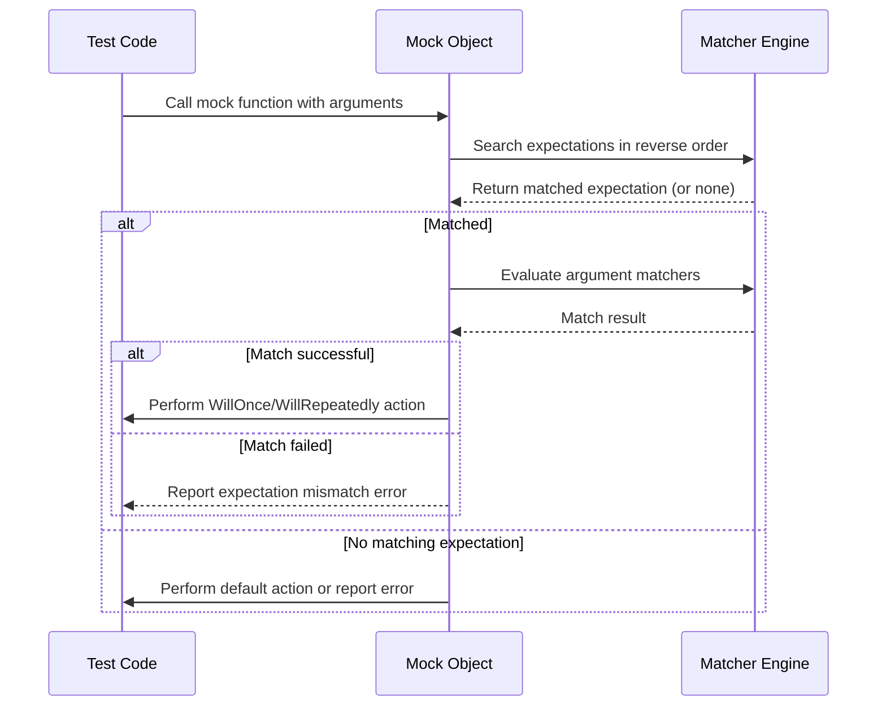

# Argument and Result Matchers

GoogleMock’s matcher library enables precise specification of argument constraints and return values in mock expectations and actions. This guide documents the built-in matchers available, how to combine and customize them, and offers insight into advanced scenarios such as matching tuples, containers, optionals, and defining your own matchers.

---

## Introduction to Matchers

A **matcher** defines a set of rules that a single argument is expected to satisfy in a mock function call. You can use matchers in `EXPECT_CALL` or `ON_CALL` statements to specify what arguments are acceptable, or use them standalone with assertions like `EXPECT_THAT` and `ASSERT_THAT`.

The primary macros for matcher usage are:

- `EXPECT_THAT(actual_value, matcher)`: Checks if `actual_value` satisfies the matcher, producing a nonfatal failure if it doesn't.
- `ASSERT_THAT(actual_value, matcher)`: Like `EXPECT_THAT` but causes immediate fatal failure.

> ⚠️ **Important:** Implicit equality matching via `EXPECT_THAT(value, expected_value)` is supported but can cause unintended behavior due to implicit conversions. Prefer explicit matchers like `Eq(expected_value)` or use `EXPECT_EQ` for simple equality comparisons.

---

## Built-In Matcher Categories

Matchers cover a wide array of use cases. Below are the major categories you will use most.

### Wildcard Matchers

| Matcher         | Description                                    |
|-----------------|------------------------------------------------|
| `_`             | Accepts any argument of the expected type.    |
| `A<Type>()` / `An<Type>()` | Matches any value of the specified `Type`.    |

### Basic Comparisons

| Matcher             | Description                                   |
|---------------------|-----------------------------------------------|
| `Eq(value)` or just `value` | Exact equality: `argument == value`.          |
| `Ne(value)`          | Inequality: `argument != value`.              |
| `Lt(value)`          | Less than: `argument < value`.                 |
| `Le(value)`          | Less or equal: `argument <= value`.            |
| `Gt(value)`          | Greater than: `argument > value`.              |
| `Ge(value)`          | Greater or equal: `argument >= value`.         |
| `IsTrue()`           | Argument evaluates to `true`.                  |
| `IsFalse()`          | Argument evaluates to `false`.                 |
| `IsNull()`           | Argument is a null pointer (raw or smart).    |
| `NotNull()`          | Argument is a non-null pointer (raw or smart).|
| `Ref(variable)`      | Argument is a reference to the specified variable.
|

> **Tip:** When matching pointers, wrap values in `Ref()` to test for object identity without copying.

### Floating-Point Matchers

Built-in matchers handle floating-point values elegantly using ULP-based comparison:

| Matcher                    | Description                                      |
|----------------------------|------------------------------------------------|
| `FloatEq(value)`           | Approximate equality for `float` values, distinguishes NaNs as unequal.
|
| `NanSensitiveFloatEq(value)` | Approximate equality for `float` treating NaNs as equal.
|
| `DoubleEq(value)`          | Approximate equality for `double`, distinguishes NaNs as unequal.
|
| `NanSensitiveDoubleEq(value)` | Approximate equality for `double` treating NaNs as equal.
|
| `FloatNear(value, max_abs_error)` | Close to `value` within absolute error, NaNs unequal.
|
| `NanSensitiveFloatNear(value, max_abs_error)` | Close to `value` within absolute error, NaNs equal.
|
| `DoubleNear(value, max_abs_error)` | Close to `value` within absolute error, NaNs unequal.
|
| `NanSensitiveDoubleNear(value, max_abs_error)` | Close to `value` within abs error, NaNs equal.
|
| `IsNan()`                 | Argument is a NaN (not a number).

### String Matchers

Matchers support various string operations for C-style and C++ strings:

| Matcher              | Description                                     |
|----------------------|------------------------------------------------|
| `StrEq(string)`      | Matches exact string equality.                  |
| `StrNe(string)`      | Matches string inequality.                       |
| `StrCaseEq(string)`  | Matches strings equal ignoring case.            |
| `StrCaseNe(string)`  | Matches strings unequal ignoring case.          |
| `HasSubstr(string)`  | Matches containing substring.                    |
| `StartsWith(prefix)` | Matches strings starting with prefix.           |
| `EndsWith(suffix)`   | Matches strings ending with suffix.              |
| `MatchesRegex(regex)` | Matches exact regex match.
|
| `ContainsRegex(regex)` | Matches substring matching the regex.
|
| `WhenBase64Unescaped(matcher)` | Matches a base64-escaped string whose unescaped form matches the matcher.

> **Note:** Regex syntax follows the extended POSIX-style grammar documented in the advanced guide.

### Exception Matchers

To test functions or callables for expected exceptions:

| Matcher                               | Description                                   |
|-------------------------------------|-----------------------------------------------|
| `Throws<ExceptionType>()`            | Callable throws an exception of the specified type.
|
| `Throws<ExceptionType>(matcher)`     | Callable throws an exception of the specified type with message matching `matcher`.
|
| `ThrowsMessage<ExceptionType>(matcher)` | Callable throws an exception of the specified type and its message matches `matcher`.

```cpp
EXPECT_THAT([] { throw std::runtime_error("error msg"); },
            Throws<std::runtime_error>());
EXPECT_THAT([] { throw std::runtime_error("error msg"); },
            Throws<std::runtime_error>(Property(&std::runtime_error::what, Eq("error msg"))));
EXPECT_THAT([] { throw std::runtime_error("error msg"); },
            ThrowsMessage<std::runtime_error>(HasSubstr("msg")));
```

### Container Matchers

GoogleMock provides powerful matchers for STL-style containers such as `std::vector`, `std::list`, `std::map`, etc. These allow you to match expected contents flexibly and informatively.

| Matcher                                  | Description                             |
|------------------------------------------|---------------------------------------|
| `Each(matcher)`                         | Every element in the container matches `matcher`.
|
| `Contains(element_or_matcher)`          | Container contains at least one element matching the matcher.
|
| `Contains(element_or_matcher).Times(n)`| Container contains exactly `n` matches.
|
| `ElementsAre(m1, m2, ..., mn)`          | Container elements match the matchers in order.
|
| `ElementsAreArray(container_or_array)`  | As `ElementsAre()` but the matchers come from another container or array.
|
| `UnorderedElementsAre(m1, m2, ..., mn)`| Container elements match the matchers in any order.
|
| `UnorderedElementsAreArray(...)`       | Same as above for arrays/containers.
|
| `IsSubsetOf(container_or_array)`        | Container is a subset of the given elements.
|
| `IsSupersetOf(container_or_array)`      | Container is a superset of the given elements.
|
| `SizeIs(matcher_or_value)`               | Container has size matching the matcher or value.
|
| `BeginEndDistanceIs(matcher_or_value)`  | Distance between iterators `begin()` and `end()` matches.
|
| `Pointwise(tuple_matcher, container)`   | Matches paired elements pointwise in order.
|
| `UnorderedPointwise(tuple_matcher, container)` | Matches paired elements pointwise ignoring order.

> **Tip:** Nest container matchers inside pointer matchers like `Pointee(ElementsAre(...))` when matching pointer arguments.

### Member Matchers

These matchers target members, fields, or properties inside user-defined types.

| Matcher                                | Description                                   |
|--------------------------------------|-----------------------------------------------|
| `Field(&Class::member, matcher)`      | Matches when the member variable matches `matcher`.
|
| `Field(fieldName, &Class::member, matcher)` | Same as above, but with better error messages tagging `fieldName`.
|
| `Property(&Class::getter, matcher)`  | Matches the return value of a const getter matching `matcher`.
|
| `Property(propertyName, &Class::getter, matcher)` | Same, with explicit property name in messages.
|
| `Key(matcher)`                       | Matches the `.first` key of a pair.
|
| `Pair(matcher1, matcher2)`           | Matches an `std::pair` whose `.first` and `.second` fields match.
|
| `FieldsAre(m1, m2, ..., mn)`          | Matches all members piecewise by expectation.

```cpp
EXPECT_THAT(my_tuple, FieldsAre(Ge(0), HasSubstr("hello")));
struct MyStruct {
  int value = 42;
  std::string greeting = "aloha";
};
MyStruct s;
EXPECT_THAT(s, FieldsAre(42, "aloha"));
```

### Matchers on Function Results

- `ResultOf(f, matcher)`: Matches when `f(argument)` satisfies `matcher`. Useful for matching computed results inside objects.

### Pointer Matchers

- `IsNull()`: matches null pointers.
- `NotNull()`: matches non-null pointers.
- `Pointee(matcher)`: matches pointer types pointing to values matching `matcher`.
- `Pointer(matcher)`: matches pointer values matching `matcher`.
- `Address(matcher)`: matches the address of the argument matching `matcher`.
- `WhenDynamicCastTo<T>(matcher)`: matches when dynamic cast to `T` matches `matcher`.

> Null pointers always fail `Pointee()`, so it safely checks non-null and content together.

---

## Composite Matchers

Matchers can be composed to express complex logic:

| Matcher            | Semantics                                   |
|--------------------|---------------------------------------------|
| `AllOf(m1, ..., mn)` | Matches if all nested matchers match.       |
| `AnyOf(m1, ..., mn)` | Matches if any nested matcher matches.       |
| `Not(m)`           | Matches if nested matcher does NOT match.    |
| `Conditional(cond, m1, m2)` | Matches `m1` if `cond` true, else `m2`.  |

You can also provide arrays or initializer lists of matchers to `AllOfArray()` or `AnyOfArray()`.

### Argument-Selective Matchers

- `AllArgs(m)`: Applies matcher `m` to all arguments (tuple).
- `Args<N1, ..., Nk>(m)`: Matches a sub-tuple of arguments at specified zero-based indexes using matcher `m`.

---

## Using Matchers as Predicates

Matchers function as unary predicates that return `true` if a value matches. You can use them in STL algorithms by wrapping them with `Matches()`. 

Example: Count elements >= 10

```cpp
std::vector<int> nums = {5, 12, 7, 15};
int count = std::count_if(nums.begin(), nums.end(), Matches(Ge(10)));
EXPECT_EQ(count, 2);
```

---

## Defining Custom Matchers

You can define your own matchers easily using the `MATCHER` macros:

- `MATCHER(Name, Description) { /* return bool */ }`
- `MATCHER_P(Name, param, Description) { /* use 'param' and return bool */ }`
- Up to 10 parameters using `MATCHER_Pk` macros.

Inside the body, `arg` is the value being matched; you can optionally stream details to `result_listener` for better diagnostics.

### Example: Simple Matcher

```cpp
MATCHER(IsEven, "") {
  return (arg % 2) == 0;
}
```

Usage:

```cpp
EXPECT_CALL(mock, Foo(IsEven()));
EXPECT_THAT(value, IsEven());
```

### Example: Parameterized Matcher

```cpp
MATCHER_P(HasAbsoluteValue, value, "") {
  return abs(arg) == value;
}
```

---

## Best Practices and Tips

- Prefer explicit matchers like `Eq(value)` over implicit comparisons.
- Use `_` to permit any value for an argument where you don't care about the value.
- To mock overloaded methods, disambiguate using `Const()` for const overloads or explicit `Matcher<T>` casts for ambiguous argument types.
- When matching containers with unordered elements (such as `std::unordered_map`), choose `UnorderedElementsAre` instead of `ElementsAre`.
- Suppress unwanted warnings for uninteresting calls using `NiceMock`.
- Consider delegating to fakes or real objects for complex behaviors via `ON_CALL` default actions.
- Always ensure matchers are pure and side-effect free.

---

## Common Matcher Usage Examples

### Matching Arguments Exactly

```cpp
EXPECT_CALL(mock, DoSomething(5));
EXPECT_CALL(mock, DoSomething(Eq(5)));
```

### Using Wildcard

```cpp
EXPECT_CALL(mock, DoSomething(_));  // Matches any argument.
```

### Combining Matchers

```cpp
EXPECT_CALL(mock, DoSomething(AllOf(Gt(5), Ne(10))));
EXPECT_CALL(mock, DoSomething(Not(HasSubstr("fail"))));
```

### Matching Containers

```cpp
EXPECT_CALL(mock, ProcessVector(ElementsAre(1, Gt(0), _, 5)));
EXPECT_CALL(mock, ProcessMap(UnorderedElementsAre(Pair("key", Eq(3)))));
```

### Matching Pointer Contents

```cpp
EXPECT_CALL(mock, SetPointer(Pointee(Ge(10))));
EXPECT_CALL(mock, SetPointer(Pointee(_)));
```

### Setting Default Return Values

```cpp
ON_CALL(mock, GetValue()).WillByDefault(Return(42));
```

### Defining Custom Matcher

```cpp
MATCHER(IsMultipleOfThree, "") {
  return (arg % 3) == 0;
}
EXPECT_CALL(mock, Foo(IsMultipleOfThree()));
```

---

## Troubleshooting Matchers

- **Unexpected Match Failures:** Run tests with `--gmock_verbose=info` to see matcher evaluation trace.
- **Ambiguous Overloads:** Use `Const()` or explicit `Matcher<Type>()` around matchers.
- **Uninteresting Call Warnings:** Use `NiceMock` or add `EXPECT_CALL(...).Times(AnyNumber())`.
- **Copying Non-Copyable Arguments:** Wrap the argument in `std::ref()` to save by reference.

---

## Further Learning

- See the [Mock Classes and Methods Reference](./mock-classes-and-methods.md) for how matchers integrate with mock methods.
- Explore [Core Testing APIs](../core-testing-apis/) to understand overall test and mock lifecycle.
- Learn advanced techniques in the [gMock Cookbook](../gmock_cook_book.md) for custom matchers and actions.

---

## Mermaid Diagram: Flow of a Mock Function Call and Matchers



---

## Code Snippet: Using Matchers with EXPECT_CALL

```cpp
using ::testing::_;  // wildcard matcher
using ::testing::Gt; // greater than
using ::testing::HasSubstr;
using ::testing::ElementsAre;
using ::testing::Pointee;
using ::testing::Return;

class MockClass {
 public:
  MOCK_METHOD(bool, UpdateValue, (int new_val), ());
  MOCK_METHOD(void, SetName, (const std::string& name), ());
  MOCK_METHOD(int, GetScores, (const std::vector<int>& scores), ());
  MOCK_METHOD(int, GetPointerValue, (int* ptr), ());
};

// Example usage in a test
TEST(MockTest, MatcherExamples) {
  MockClass mock;

  // Expect UpdateValue to be called with int >= 10
  EXPECT_CALL(mock, UpdateValue(Gt(9)))
      .WillOnce(Return(true));

  // Expect SetName to be called with a string containing "test"
  EXPECT_CALL(mock, SetName(HasSubstr("test")));

  // Expect GetScores to be called with a container matching ElementsAre
  EXPECT_CALL(mock, GetScores(ElementsAre(1, 2, _, 4)));

  // Expect GetPointerValue to be called with a pointer to an int >= 5
  EXPECT_CALL(mock, GetPointerValue(Pointee(Gt(4))));

  // Exercise mock
  mock.UpdateValue(10);
  mock.SetName("unit test");
  std::vector<int> scores = {1, 2, 3, 4};
  mock.GetScores(scores);
  int val = 6;
  mock.GetPointerValue(&val);
}
```

---

## Summary

Matchers are powerful predicates to specify and verify argument values in mock interactions, providing clear diagnostics and flexibility. GoogleMock offers a rich set of built-in matchers for simple comparisons, containers, strings, pointers, and exceptions, as well as support for composing matchers and defining custom polymorphic or parameterized matchers to suit your specific needs.

---

## See Also

- [Mock Classes and Methods Reference](./mock-classes-and-methods.md)
- [Actions and Behaviors](./actions-and-behaviors.md)
- [Core Testing APIs](../core-testing-apis/)
- [gMock Cookbook](../gmock_cook_book.md)
- [Matchers Reference](./matchers.md)

---

## Troubleshooting Tips

- Use explicit matcher types when ambiguity arises in overloaded methods.
- Prefer `NiceMock` to silence warnings about uninteresting calls.
- Use `EXPECT_CALL(...).Times(AnyNumber())` to allow any number of calls on a mock method.
- Ensure matchers are free of side effects for consistent and reliable matching.

---