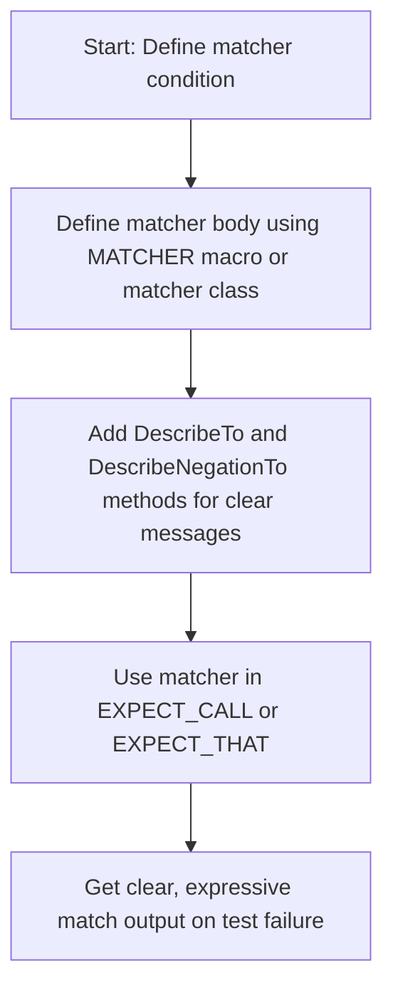
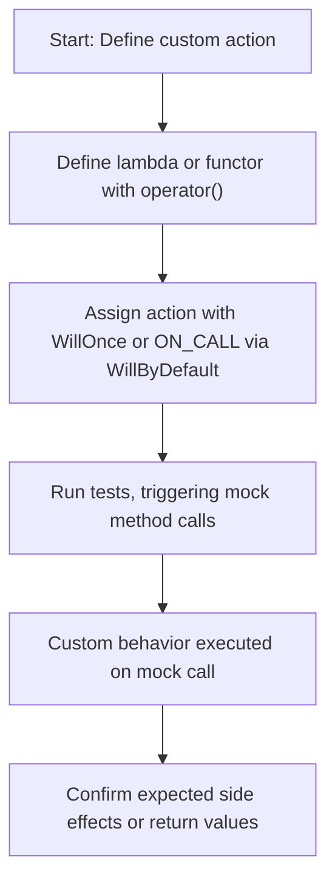

# Custom Actions and Matchers

Extend the GoogleMock framework by defining custom actions and matchers to tailor your mocks for complex testing scenarios. This page guides you through creating reusable, powerful extensions including macros and helper utilities to build new behaviors beyond built-in capabilities.

---

## Overview

GoogleMock comes with a rich set of built-in matchers and actions to specify mock behavior and validate arguments. However, your test cases may sometimes require more specialized conditions or behaviors that built-in constructs cannot express succinctly. Custom actions and matchers empower you to extend GoogleMock precisely to your needs.

This documentation focuses on user-centric workflows for defining these custom extensions, showing you how to represent complex predicates, side effects, and behaviors with clear examples and best practices.

---

## Understanding Custom Matchers

Matchers enable you to specify the criteria that arguments to mock function calls must satisfy. When built-in matchers don't suit your requirements, you can define custom matchers:

- **Simple and Parameterized Matchers**: Use `MATCHER` macros for fast, inline creation of new predicate matchers with descriptive failure messages.
- **Matcher Classes**: For reusable, more control, implement matcher classes with methods like `MatchAndExplain()`, `DescribeTo()`, and `DescribeNegationTo()`.
- **Polymorphic Matchers**: Create matchers that work across multiple argument types using template-based matcher classes.

### Creating a Basic Matcher with `MATCHER`

The `MATCHER` macro defines a predicate matcher by implementing a boolean condition on the argument.

```cpp
MATCHER(IsDivisibleBy7, "") { return (arg % 7) == 0; }

// Usage
EXPECT_CALL(mock_obj, Method(IsDivisibleBy7()));
```

You can enhance failure messages by streaming to the `result_listener` inside the matcher.

```cpp
MATCHER(IsDivisibleBy7, "") {
  if ((arg % 7) == 0) return true;
  *result_listener << "the remainder is " << (arg % 7);
  return false;
}
```

### Parameterized Matchers with `MATCHER_P`

Define matchers with parameters:

```cpp
MATCHER_P(HasAbsoluteValue, value, "") { return std::abs(arg) == value; }

// Usage
EXPECT_CALL(mock_obj, Method(HasAbsoluteValue(10)));
```

Supply descriptive failure messages referencing the parameter for clearer diagnostics.

### Full Control with Matcher Classes

For advanced matchers that need internal state, multi-parameter control, or complex explanation logic, define a matcher class:

```cpp
class BarPlusBazEqMatcher {
 public:
  using is_gtest_matcher = void;

  explicit BarPlusBazEqMatcher(int expected_sum) : expected_sum_(expected_sum) {}

  bool MatchAndExplain(const Foo& foo, std::ostream* os) const {
    return (foo.bar() + foo.baz()) == expected_sum_;
  }

  void DescribeTo(std::ostream* os) const {
    *os << "bar() + baz() equals " << expected_sum_;
  }

  void DescribeNegationTo(std::ostream* os) const {
    *os << "bar() + baz() does not equal " << expected_sum_;
  }

 private:
  int expected_sum_;
};

::testing::Matcher<const Foo&> BarPlusBazEq(int expected_sum) {
  return BarPlusBazEqMatcher(expected_sum);
}
```

---

## Creating Custom Actions

Actions define what your mock methods actually do when called. While GoogleMock includes many built-in actions, custom actions let you simulate side effects, complex return behaviors, and delegate calls.

### Defining Simple Actions with Macros

The `ACTION` macros let you define actions inline:

```cpp
ACTION(IncrementArg1) { return ++(*arg1); }

EXPECT_CALL(mock, Method(_)).WillOnce(IncrementArg1());
```

Parameterizable actions use `ACTION_P` and `ACTION_Pk` for multiple parameters.

### Writing Callable Objects as Actions

You can implement actions as lambdas or functors with a compatible call operator:

```cpp
struct MultiplyBy {
  template <typename T>
  T operator()(T arg) { return arg * multiplier; }
  int multiplier;
};

EXPECT_CALL(mock, Method(_)).WillOnce(MultiplyBy{7});
```

This provides flexible and reusable action behavior with strong typing.

### Using Predefined Action Helpers

Some common side effects can be expressed with built-in actions:

- `SetArgPointee<N>(value)`: sets the value of the N-th pointer argument.
- `SaveArg<N>(pointer)`: saves a copy of the N-th argument for later.
- `DoAll(a1, a2, ..., an)`: executes multiple actions in sequence.

Example combining side effects with returns:

```cpp
EXPECT_CALL(mock, Mutate(_))
    .WillOnce(DoAll(SetArgPointee<0>(5), Return(true)));
```

---

## Using Advanced Utilities

### Selecting Arguments with `WithArg` and Related Actions

When your action only depends on some arguments, use:

- `WithArg<N>(action)`: apply `action` on the N-th argument.
- `WithArgs<N1, N2, ..., Nk>(action)`: apply on selected arguments.
- `WithoutArgs(action)`: ignores all arguments.

This avoids having to write adapter functions manually.

### Invoking Function Arguments

If a mock function receives a callback as argument, invoke it using `InvokeArgument`:

```cpp
EXPECT_CALL(mock, Method(_, _))
    .WillOnce(InvokeArgument<1>(arg1, arg2));
```

Wrap by-reference parameters in `std::ref()`.

### Delegating Calls

You can delegate calls to:

- A **Fake** object by defining default `ON_CALL` actions with your fake’s implementation.
- The **real implementation** to verify correctness plus count interactions.
- The **parent class' method** to fallback on original behavior.

Example delegating to a fake:

```cpp
void DelegateToFake() {
  ON_CALL(*this, DoThis).WillByDefault([this](int x) { return fake_.DoThis(x); });
}
```

---

## Best Practices & Tips

- Use `MATCHER` macros for quick, expressive matchers.
- Prefer `EXPECT_CALL` for interaction verification; `ON_CALL` for default behavior.
- Use `NiceMock` to suppress uninteresting call warnings for cleaner test output.
- Avoid over-specifying expectations to enhance test resilience.
- Delegate to fakes or parent implementations to avoid duplication.
- Share complex matchers and actions as variables to improve readability and performance.

---

## Troubleshooting Common Issues

- **Matcher description unclear?** Stream debug info to `result_listener` in matcher implementation.
- **Compilation errors mocking move-only types?** Use lambdas or delegate mock methods.
- **Uninteresting call warnings?** Consider using `NiceMock` or explicitly define default actions with `ON_CALL`.
- **Ambiguous overloads?** Use `Const()` or `TypedEq` to disambiguate matcher overloads.

---

## Practical Example: Custom Matcher and Action

```cpp
// Custom Matcher: Checks if string starts with prefix and contains substring
MATCHER_P2(StartsWithAndContains, prefix, substr, "") {
  return (arg.find(prefix) == 0) && (arg.find(substr) != std::string::npos);
}

// Usage in EXPECT_CALL
EXPECT_CALL(mock, Process(StartsWithAndContains("Hello", "world")));

// Custom Action: Append a suffix to a string argument passed by reference
ACTION_P(AppendSuffix, suffix) {
  arg0 += suffix;  // Assumes arg0 is a std::string&
  return true;
}

// Usage
EXPECT_CALL(mock, ModifyString(_)).WillOnce(AppendSuffix("_test"));
```

---

## Further Resources

- [Using MATCHER Macros](https://google.github.io/googletest/gmock_cook_book.html#NewMatchers)
- [Defining Actions](https://google.github.io/googletest/docs/reference/actions.html)
- [gMock Cookbook - Extending gMock](https://google.github.io/googletest/gmock_cook_book.html#ExtendingGMock)
- [Matchers Reference](../api-reference/mocking-and-matchers/matchers-reference.md)
- [Actions Reference](../api-reference/mocking-and-matchers/expectations-and-actions.md)

---

### Navigation Context

This page fits within GoogleMock's API Reference under 'Mocking and Matchers,' complementing pages on mock definition, expectations, and the matchers library. It builds upon concepts introduced in the 'Setting Expectations and Actions' guide and links to the gMock Cookbook for practical patterns.

---

### Summary Diagram: Custom Matcher Creation Flow



### Summary Diagram: Custom Action Usage Flow


