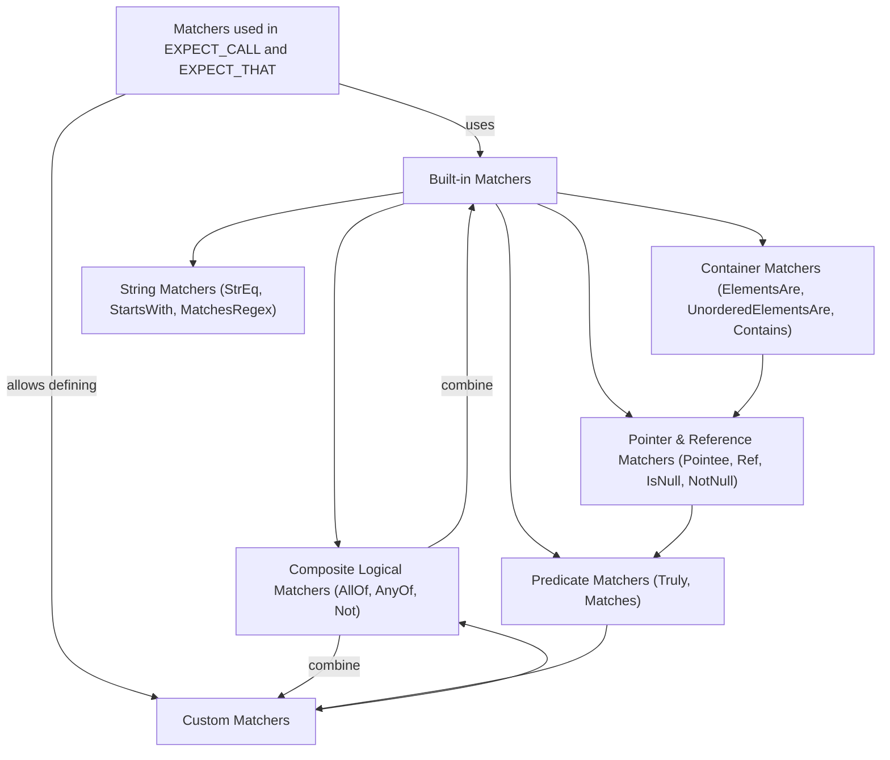

# Matchers Library Reference

GoogleTest and GoogleMock offer a rich library of **matchers** – objects and functions that let you specify flexible, readable, and precise constraints on arguments passed to mock functions or values checked in assertions. This documentation page provides a comprehensive reference for built-in and extensible matchers available in both GoogleTest and GoogleMock. You will learn how to use matchers to validate arguments, return values, and more, including how to build complex predicates through composition, handle polymorphic matchers, and define your own custom matchers.

---

## Overview

A **matcher** evaluates whether a single value meets certain criteria. Matchers integrate seamlessly into `EXPECT_CALL` and `ON_CALL` for mocks, as well as the `EXPECT_THAT()` and `ASSERT_THAT()` assertions for direct verification of values.

Matchers encourage expressive test code such as:

```cpp
EXPECT_THAT(value, StartsWith("Hello"));
EXPECT_CALL(mock, DoSomething(Ge(5), Ne(0)));
EXPECT_THAT(container, ElementsAre(1, Gt(2), _));
```

Here `StartsWith`, `Ge`, `Ne`, and `ElementsAre` are matchers, allowing flexible and clear expression of expectations.

## Basic Matchers

### Wildcard Matchers

| Matcher           | Description                                       |
|-------------------|-------------------------------------------------|
| `_`               | Matches any value of the correct type (wildcard).|
| `A<type>()`, `An<type>()` | Matches any value of the specified type `type`.       |

### Generic Comparison Matchers

Convenient matchers for common comparisons:

- `Eq(value)` or just `value`: Matches values equal to `value`.
- `Ne(value)`: Not equal to `value`.
- `Lt(value)`, `Le(value)`: Less than, or less than or equal to.
- `Gt(value)`, `Ge(value)`: Greater than, or greater than or equal to.
- `IsTrue()`, `IsFalse()`: Boolean truthiness checks.
- `IsNull()`: Matches null raw or smart pointers.
- `NotNull()`: Matches non-null pointers.
- `Optional(m)`: Matches an `optional<>` that contains a matching value.
- `VariantWith<T>(m)`: Matches a `variant<>` holding a value of type `T` matching `m`.
- `Ref(variable)`: Matches references to the exact variable instance.

### Floating Point Matchers

Due to rounding issues, floating point comparisons should use specialized matchers:

- `DoubleEq(value)` / `FloatEq(value)`: Approximate equality using ULPs.
- `NanSensitiveDoubleEq(value)`: Like `DoubleEq` but considers NaNs equal.
- `DoubleNear(value, abs_error)` / `FloatNear(value, abs_error)`: Absolute error bounds.
- `IsNan()`: Matches any NaN floating-point value.

### String Matchers

Designed for C strings, `std::string`, and wide strings:

- `StrEq(s)`, `StrNe(s)`: Equality/inequality string comparison.
- `StrCaseEq(s)`, `StrCaseNe(s)`: Case-insensitive equality/inequality.
- `HasSubstr(sub)`: Contains a substring.
- `StartsWith(prefix)`: Starts with prefix.
- `EndsWith(suffix)`: Ends with suffix.
- `MatchesRegex(regex)`: Matches full regular expression.
- `ContainsRegex(regex)`: Contains substring matching regex.
- `IsEmpty()`: Matches empty strings.
- `WhenBase64Unescaped(m)`: Matches base64-decoded strings against matcher `m`.

### Pointer and Reference Matchers

- `Pointee(m)`: Matches a (raw or smart) pointer whose pointee matches `m`.
- `Pointer(m)`: Matches a pointer against matcher `m` applied to the raw pointer.
- `WhenDynamicCastTo<T>(m)`: Matches after casting pointer or reference to type `T`.
- `Address(m)`: Matches an object whose address matches matcher `m`.
- `Ref(variable)`: Matches a reference to the exact variable instance.

### Container Matchers

Matchers designed for containers, such as STL containers, arrays, and native sequences.

- `ElementsAre(e0, e1, ..., en)`: Matches elements in order.
- `ElementsAreArray(container)`: Like `ElementsAre` but from sequence container.
- `UnorderedElementsAre(e0, e1, ..., en)`: Matches elements in any order.
- `UnorderedElementsAreArray(container)`: Like above, from container.
- `Contains(e)`: Matches containers containing at least one element matching `e`.
- `Each(e)`: All elements match `e`.
- `SizeIs(m)`: Container size matches matcher `m` (or equals if `m` is a value).
- `BeginEndDistanceIs(m)`: Distance between begin and end iterators matches `m`.
- `ContainerEq(container)`: Matches containers equal with enhanced diagnostics.
- `Pointwise(pair_matcher, container)`: Matches elements pairwise using `pair_matcher`.
- `UnorderedPointwise(pair_matcher, container)`: Like `Pointwise` but ignores order.
- `IsSupersetOf(container)`, `IsSubsetOf(container)`: Partial matching based on containment.
- `WhenSorted(m)`, `WhenSortedBy(comparator, m)`: Matches containers after sorting.

### Member Matchers

- `Field(&Class::field, m)`: Matches objects whose specified field matches `m`.
- `Property(&Class::getter, m)`: Matches objects whose property's getter matches `m`. Use only for member functions you own.
- `Key(m)`: Matches `std::pair` whose `first` matches `m` (useful for map keys).
- `Pair(m1, m2)`: Matches `std::pair` with fields matching `m1`, `m2` respectively.
- `FieldsAre(m1, m2, ...)`: Matches aggregates or tuple-like types fieldwise.

### Matching Function or Computed Results

- `ResultOf(f, m)`: Matches values whose mapping through callable `f` matches `m`.

### Composite and Logical Matchers

You can compose matchers with logical operations:

- `Not(m)`: Matches values not matching matcher `m`.
- `AllOf(m1, m2, ...)`: Matches values matching all of the sub-matchers.
- `AnyOf(m1, m2, ...)`: Matches values matching at least one sub-matcher.
- `Conditional(cond, m_true, m_false)`: Matches using `m_true` if `cond` true, else `m_false`.

### Predicate Matchers

- `Truly(predicate)`: Converts a unary predicate to a matcher. Useful for complex logic.
- `Matches(m)`: Converts a matcher into a predicate for STL algorithms.

---

## Using Matchers

### In Mock Expectations

You can specify argument expectations when setting up mocks:

```cpp
EXPECT_CALL(mock_obj, MethodName(Eq(42), Gt(0)));
EXPECT_CALL(mock_obj, MethodName(_, NotNull()));
```

You can also match all arguments at once with `With()` using a tuple matcher:

```cpp
EXPECT_CALL(mock_obj, MethodName(_, _)).With(Lt());  // first argument < second
```

### In Assertions

Matchers can be used to verify values with `EXPECT_THAT()` or `ASSERT_THAT()`:

```cpp
EXPECT_THAT(my_string, HasSubstr("needle"));
ASSERT_THAT(value, AllOf(Ge(5), Lt(10)));
```

### Composing Matchers

You can easily build complex matchers with logical operators:

```cpp
EXPECT_THAT(val, AllOf(Gt(0), Lt(100), Ne(50)));
EXPECT_THAT(text, Not(StartsWith("Bad")));
```

### Casting Matchers

If you need to cast matchers for compatible but different types, use:

- `SafeMatcherCast<T>(m)`: Throws compile-time errors if cast is unsafe.
- `MatcherCast<T>(m)`: Permissive but unsafe casting.

Example:

```cpp
EXPECT_CALL(mock, Func(SafeMatcherCast<Derived*>(m_base)));
```

### Using Matchers as STL Predicates

The `Matches(m)` helper converts a matcher to a predicate callable usable with STL:

```cpp
std::vector<int> nums = {1,2,3,4};
int count = std::count_if(nums.begin(), nums.end(), Matches(Gt(2)));
```

### Common Pitfalls

- Matchers must be pure functions with no side effects.
- Use `std::ref()` when matching non-copyable values by reference.
- Avoid over-specifying expectations; prefer `ON_CALL` for behavior and minimal `EXPECT_CALL`s for verification.

---

## Defining Custom Matchers

For common or complex checks, define your own matchers for clarity and reuse.

### Using MATCHER Macros

The `MATCHER` family of macros provide a concise way:

```cpp
MATCHER(IsEven, "") {
  return (arg % 2) == 0;
}

// Usage:
EXPECT_THAT(value, IsEven());
```

You can parameterize with `MATCHER_P`:

```cpp
MATCHER_P(IsDivisibleBy, divisor, "") {
  return (arg % divisor) == 0;
}

EXPECT_THAT(value, IsDivisibleBy(7));
```

Use the `result_listener` to add detailed match failure explanations.

### Implementing MatcherInterface

For advanced cases, directly implement the matcher interface:

```cpp
class DivisibleByMatcher {
 public:
  using is_gtest_matcher = void;

  explicit DivisibleByMatcher(int divisor) : divisor_(divisor) {}

  bool MatchAndExplain(int n, std::ostream* os) const {
    const int remainder = n % divisor_;
    if (remainder != 0 && os) {
      *os << "the remainder is " << remainder;
    }
    return remainder == 0;
  }

  void DescribeTo(std::ostream* os) const { *os << "is divisible by " << divisor_; }
  void DescribeNegationTo(std::ostream* os) const { *os << "is not divisible by " << divisor_; }

 private:
  int divisor_;
};

// Factory to create matcher
inline ::testing::Matcher<int> DivisibleBy(int divisor) {
  return ::testing::MakeMatcher(new DivisibleByMatcher(divisor));
}
```

This style gives you maximum flexibility and control.

### Polymorphic Matchers

Use the `MakePolymorphicMatcher` helper to support multiple types:

```cpp
class NotNullMatcher {
 public:
  template <typename T>
  bool MatchAndExplain(T* p, MatchResultListener*) const {
    return p != nullptr;
  }

  void DescribeTo(std::ostream* os) const { *os << "is not NULL"; }
  void DescribeNegationTo(std::ostream* os) const { *os << "is NULL"; }
};

inline testing::PolymorphicMatcher<NotNullMatcher> NotNull() {
  return MakePolymorphicMatcher(NotNullMatcher());
}

EXPECT_CALL(foo, Bar(NotNull()));
```

---

## Example Matchers

### Match Anything

```cpp
EXPECT_CALL(mock, Foo(_));  // Matches any argument
```

### Equality Matcher

```cpp
EXPECT_CALL(mock, Foo(Eq(42)));
EXPECT_THAT(value, Eq("hello"));
```

### Composite Matcher

```cpp
EXPECT_CALL(mock, Foo(AllOf(Ge(10), Le(20)));
EXPECT_THAT(result, AnyOf(Eq(1), Eq(2), Eq(3)));
```

### Container Matchers

```cpp
EXPECT_THAT(vec, ElementsAre(1, 2, 3));
EXPECT_THAT(set, UnorderedElementsAre(3, 1, 2));
EXPECT_THAT(map, Contains(Key(42)));
```

### Matching a Pointer's Pointee

```cpp
EXPECT_THAT(ptr, Pointee(Gt(10)));
```

### Custom Matcher Using MATCHER

```cpp
MATCHER(IsPrime, "") {
  if (arg < 2) return false;
  for (int i = 2; i * i <= arg; ++i) {
    if (arg % i == 0) return false;
  }
  return true;
}

EXPECT_THAT(value, IsPrime());
```

---

## Practical Tips

- Use `_` to match any argument when argument is irrelevant.
- Prefer `ON_CALL` for default mock behavior, `EXPECT_CALL` to verify important calls.
- Combine matchers with `AllOf`, `AnyOf`, and `Not` to express complex conditions.
- Use `SafeMatcherCast<T>()` to adjust matcher type when necessary.
- When matching containers, prefer `ElementsAre` for order-sensitive and `UnorderedElementsAre` otherwise.
- Use `Pointee()` to match values pointed to by raw or smart pointers safely (fails if pointer is null).
- For string matching, use `StrEq`, `StartsWith`, `ContainsRegex`, etc., instead of writing manual comparisons.
- When defining your own matcher, always add informative `DescribeTo()`, `DescribeNegationTo()`, and optionally streaming to `MatchAndExplain()` for detailed diagnostics.
- Avoid stateful matchers; matchers must be pure and side-effect free.

---

## Troubleshooting

- **Matchers don’t match expected type:** use `SafeMatcherCast` or explicit matcher creation.
- **Uninteresting calls warnings:** wrap mocks with `NiceMock` or add expectations with `.Times(AnyNumber())`.
- **Overloaded functions ambiguity:** disambiguate with explicit `TypedEq<T>()` or `Matcher<T>()`.
- **Unexpected test failures from string comparisons:** ensure correct string matcher used (`StrEq` vs. `Eq`).
- **Null pointer vs empty string conflicts:** remember `IsNull()` is for pointers, `IsEmpty()` is for strings or containers.

---

## Mermaid Diagram: Matchers Ecosystem Overview


---

## See Also

- [Matchers Reference](https://github.com/google/googletest/blob/main/docs/reference/matchers.md) - Complete list of matchers with explanations
- [Mocking Reference](https://github.com/google/googletest/blob/main/docs/reference/mocking.md) - How to use matchers with mocks
- [gMock Cookbook](https://github.com/google/googletest/blob/main/docs/gmock_cook_book.md) - Practical recipes for custom matchers
- [GoogleTest Assertions Reference](https://github.com/google/googletest/blob/main/docs/reference/assertions.md) - Using matchers in assertions

---

## Summary

The Matchers Library empowers you to write expressive and flexible assertions and expectations. It supports built-in matchers for all common types, container matchers, string matchers, pointer matchers, and provides a framework to craft your own custom, composable matchers for precise validation in tests. Use this reference to find the right matcher for your scenario and to extend GoogleTest and GoogleMock effectively.