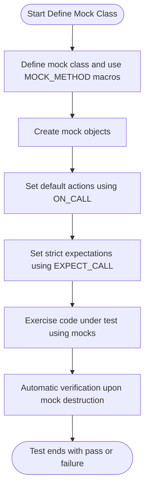

# Defining and Using Mocks

GoogleMock enables you to create mock classes and methods efficiently using a declarative macro-based syntax. This page guides you through the process of defining mocks with `MOCK_METHOD`, integrating mocks into test fixtures, and handling method variations like overloads, constness, and move-only types.

---

## 1. Defining Mock Classes with `MOCK_METHOD`

Mock classes allow you to simulate and verify interactions with interfaces or abstract classes during testing. `MOCK_METHOD` is the primary macro for defining mock methods inside a mock class.

### Syntax of `MOCK_METHOD`

```cpp
MOCK_METHOD(ReturnType, MethodName, (Args...), (Qualifiers...));
```

- **ReturnType**: The return type of the function.
- **MethodName**: The name of the method to mock.
- **Args**: The argument list enclosed in parentheses. Wrap the entire argument list in parentheses to avoid parsing errors if arguments contain commas.
- **Qualifiers** (optional): A comma-separated list inside parentheses specifying qualifiers such as `const`, `override`, `noexcept`, calling convention, or reference qualifiers.

### Example Mock Class Definition

Given an interface:

```cpp
class Turtle {
 public:
  virtual ~Turtle() {}

  virtual void PenUp() = 0;
  virtual void PenDown() = 0;
  virtual void Forward(int distance) = 0;
  virtual void Turn(int degrees) = 0;
  virtual void GoTo(int x, int y) = 0;
  virtual int GetX() const = 0;
  virtual int GetY() const = 0;
};
```

Define the mock class:

```cpp
#include <gmock/gmock.h>

class MockTurtle : public Turtle {
 public:
  MOCK_METHOD(void, PenUp, (), (override));
  MOCK_METHOD(void, PenDown, (), (override));
  MOCK_METHOD(void, Forward, (int distance), (override));
  MOCK_METHOD(void, Turn, (int degrees), (override));
  MOCK_METHOD(void, GoTo, (int x, int y), (override));
  MOCK_METHOD(int, GetX, (), (const, override));
  MOCK_METHOD(int, GetY, (), (const, override));
};
```

Note:
- The mock methods are declared in the `public:` section even if the methods are protected or private in the base class.

### Handling Complex Types and Commas in Arguments

If the return type or argument types contain commas (e.g., `std::pair` or template classes), wrap the type with an extra pair of parentheses or use type aliases:

```cpp
class MyMock {
 public:
  MOCK_METHOD((std::pair<bool, int>), GetPair, ());
  MOCK_METHOD(bool, CheckMap, ((std::map<int, double>), bool));

  using BoolAndInt = std::pair<bool, int>;
  MOCK_METHOD(BoolAndInt, GetPairAlias, ());
  using MapIntDouble = std::map<int, double>;
  MOCK_METHOD(bool, CheckMapAlias, (MapIntDouble, bool));
};
```

### Mocking Overloaded Methods

You can mock overloaded methods by including all overloads with distinct argument lists and qualifiers:

```cpp
class MockFoo : public Foo {
 public:
  MOCK_METHOD(int, Add, (Element x), (override));
  MOCK_METHOD(int, Add, (int times, Element x), (override));

  MOCK_METHOD(Bar&, GetBar, (), (override));
  MOCK_METHOD(const Bar&, GetBar, (), (const, override));
};
```

If you do not mock all versions of an overloaded method, use `using` declarations to bring the remaining overloads into scope:

```cpp
class MockFoo : public Foo {
 public:
  using Foo::Add;  // Bring in other overloads.
  MOCK_METHOD(int, Add, (Element x), (override));
};
```

### Mocking Class Templates

Template classes are mocked similarly, templating the mock class:

```cpp
template <typename Elem>
class MockStack : public StackInterface<Elem> {
 public:
  MOCK_METHOD(int, GetSize, (), (const, override));
  MOCK_METHOD(void, Push, (const Elem& x), (override));
};
```

### Mocking Non-Virtual Methods

For classes without virtual methods, define a mock class that implements the same public API signatures without inheritance. You can then use templates or alternative compile-time polymorphism to swap implementations.

```cpp
class ConcretePacketStream {
 public:
  void AppendPacket(Packet* new_packet);
  const Packet* GetPacket(size_t packet_number) const;
  size_t NumberOfPackets() const;
};

class MockPacketStream {
 public:
  MOCK_METHOD(const Packet*, GetPacket, (size_t packet_number), (const));
  MOCK_METHOD(size_t, NumberOfPackets, (), (const));
};
```

---

## 2. Using Mocks in Tests

Once your mock class is defined, the typical test workflow is:

1. Import gMock names:

```cpp
using ::testing::AtLeast;
using ::testing::_;  // Wildcard matcher
using ::testing::Return;
```

2. Create mock objects:

```cpp
MockTurtle turtle;
```

3. Set expectations using `EXPECT_CALL`:

```cpp
EXPECT_CALL(turtle, PenDown()).Times(AtLeast(1));
```

4. Exercise code using the mocks:

```cpp
Painter painter(&turtle);
EXPECT_TRUE(painter.DrawCircle(0, 0, 10));
```

5. Upon mock destruction, gMock automatically verifies whether all expectations were met.

### Example

```cpp
#include "mock_turtle.h"
#include <gmock/gmock.h>
#include <gtest/gtest.h>

using ::testing::AtLeast;
using ::testing::Return;

TEST(PainterTest, CanDrawCircle) {
  MockTurtle turtle;
  EXPECT_CALL(turtle, PenDown()).Times(AtLeast(1));

  Painter painter(&turtle);
  EXPECT_TRUE(painter.DrawCircle(0, 0, 10));
}
```

If `PenDown` is never called, the test will fail immediately, showing call count mismatch.

### Best Practice

- Always set expectations *before* the mock methods are called. Expectations represent the *future* calls expected.
- Do not interleave calls to EXPECT_CALL and mock method invocations to ensure deterministic behavior.

---

## 3. Handling Different Method Signatures

### Mocking Const Methods

Add `(const)` as a qualifier in `MOCK_METHOD`. For example:

```cpp
MOCK_METHOD(int, GetX, (), (const, override));
```

### Mocking noexcept Methods

Add `(noexcept)` qualifier:

```cpp
MOCK_METHOD(void, Close, (), (noexcept, override));
```

### Mocking Methods with Reference Qualifiers

Add `(ref(&))` or `(ref(&&))` as qualifiers:

```cpp
MOCK_METHOD(void, Foo, (), (ref(&), override));  // for lvalue-ref qualified methods
```

### Mocking Methods with Custom Calling Conventions (Windows)

Add `Calltype(STDMETHODCALLTYPE)` etc. For example:

```cpp
MOCK_METHOD(bool, Foo, (int n), (Calltype(STDMETHODCALLTYPE), override));
```

### Mocking Move-only Types

You can mock methods that take or return move-only types (e.g., `std::unique_ptr`) normally:

```cpp
MOCK_METHOD(std::unique_ptr<Buzz>, MakeBuzz, (StringPiece text), (override));
MOCK_METHOD(bool, ShareBuzz, (std::unique_ptr<Buzz> buzz, int64_t timestamp), (override));
```

### Setting Actions for Move-only Types

- Use lambdas or callables with `WillOnce` or `WillRepeatedly` to produce new move-only objects on each call.
- Avoid `Return(std::move(obj))` for repeated returns since the object will be moved-from after the first call.

Example:

```cpp
EXPECT_CALL(mock_buzzer_, MakeBuzz("x"))
    .WillRepeatedly([](StringPiece text) {
      return std::make_unique<Buzz>(AccessLevel::kInternal);
    });
```

---

## 4. Integrating Mocks into Test Fixtures

Mocks can be integrated into test fixtures by

- Declaring mock objects as members of the fixture class
- Setting up common default actions with `ON_CALL` in `SetUp()`
- Declaring specific expectations in individual tests using `EXPECT_CALL`

Example:

```cpp
class PainterTest : public ::testing::Test {
 protected:
  MockTurtle turtle_;

  void SetUp() override {
    ON_CALL(turtle_, GetX()).WillByDefault(Return(0));
  }
};

TEST_F(PainterTest, DrawCircleCallsPenDown) {
  EXPECT_CALL(turtle_, PenDown());
  Painter painter(&turtle_);
  EXPECT_TRUE(painter.DrawCircle(0, 0, 10));
}
```

---

## 5. Common Pitfalls and Tips

### Commas Must Be Parenthesized in Argument Lists

When an argument or return type contains commas (e.g., template types), always wrap them in parentheses or use typedefs/using aliases to avoid macro parsing errors.

### Always Declare Virtual Destructors

Interfaces and classes you mock must have virtual destructors to avoid undefined behavior.

### Use `NiceMock`, `NaggyMock`, or `StrictMock` to Control Uninteresting Call Behavior

- **NaggyMock** (default): warns on uninteresting calls
- **NiceMock**: suppresses warnings on uninteresting calls
- **StrictMock**: makes uninteresting calls a test failure

Example:

```cpp
NiceMock<MockFoo> nice_mock;
StrictMock<MockFoo> strict_mock;
```

### Retire Saturated Expectations Explicitly Using `.RetiresOnSaturation()`

To avoid expectation stickiness and upper bound errors, use:

```cpp
EXPECT_CALL(mock, Func()).WillOnce(Return(1)).RetiresOnSaturation();
```

Especially useful when multiple sequential `WillOnce` expectations are defined.

### Prefer `ON_CALL` for Default Behavior and Use `EXPECT_CALL` Only to Verify Calls

Avoid over-constraining tests by defining default behaviors using `ON_CALL`. Use `EXPECT_CALL` only when you want to assert the call happens.

### Ordering Expectations

Use `InSequence` or `After` clauses to specify call order when necessary.

Example with `InSequence`:

```cpp
{
  InSequence seq;
  EXPECT_CALL(mock, FirstCall());
  EXPECT_CALL(mock, SecondCall());
}
```

---

## 6. Summary Diagram: Mock Creation and Usage Flow



---

## 7. Additional Resources

- [Mocking Reference API Documentation](/api-reference/mocking-and-matchers/mock-object-apis)
- [gMock for Dummies](https://google.github.io/googletest/gmock_for_dummies.html)
- [gMock Cookbook](https://google.github.io/googletest/gmock_cook_book.html)
- [Matchers Reference](/api-reference/mocking-and-matchers/matchers-reference)
- [Actions Reference](/api-reference/mocking-and-matchers/expectations-and-actions)
- [Mock Behavior Modes (Nice, Strict, Naggy)](/api-reference/mocking-and-matchers/mock-behavior-modes)

See also the guides on setting expectations, writing flexible matchers, and the core testing API for effective test organization.


---

## 8. Troubleshooting

### Common Issues

- **Unprotected commas in method argument lists:** Always parenthesize complex types or use aliases.
- **Missing virtual destructors:** Causes memory leaks and undefined behavior.
- **Expectations set after method calls:** Leads to undefined behavior and failing tests.
- **Uninteresting call warnings:** Use `NiceMock` or add catch-all expectations with `Times(AnyNumber())`.
- **Mock object leaks:** Use `Mock::AllowLeak(&mock_obj);` to suppress reported leaks if intentional.

### Debugging Tools

- Run tests with `--gmock_verbose=info` to get detailed logs about expectation matches and mock method calls.
- Use descriptive test and expectation names to quickly identify failures.
- Verify correct call sequences with `InSequence` or `EXPECT_CALL(...).After(...)`.


---