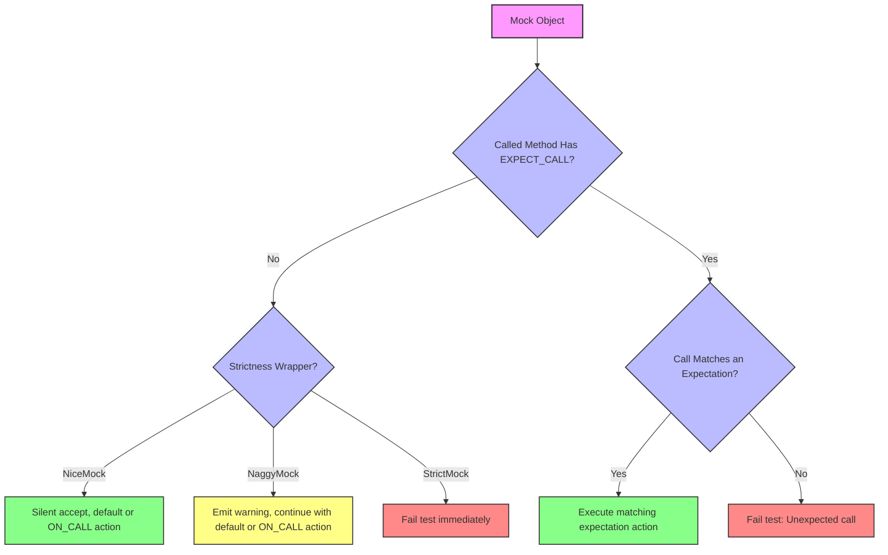

# Mock Strictness Controls

GoogleMock provides a mechanism to tailor how uninteresting calls—calls to mock methods for which no explicit expectations are set—are handled. This mechanism, realized through the strictness wrappers `NiceMock`, `NaggyMock`, and `StrictMock`, empowers developers to control whether such calls are silently ignored, logged as warnings, or treated as errors respectively.

This design supports varied test strategies, enabling more lenient behaviors during initial development phases and stricter enforcement as code matures and tests harden. This document explains how to use these wrappers, what behaviors to expect, and best practices to succeed with test strictness management.

---

## Overview of Strictness Wrappers

| Wrapper Type      | Behavior on Uninteresting Calls               | Typical Use Case                        |
|-------------------|-----------------------------------------------|---------------------------------------|
| `NiceMock<T>`     | Suppresses warnings; allows uninteresting calls without complaint | When you want clean logs and expect irrelevant calls |
| `NaggyMock<T>`    | (Default) Emits warnings on uninteresting calls | Useful during development and debugging to catch unintended calls |
| `StrictMock<T>`   | Treats uninteresting calls as test failures | Enforces strict interface adherence, ideal in final stages |

By default, mock classes behave like naggy mocks, meaning they warn on uninteresting calls. Moving towards nicer mocks reduces log noise while preserving test validity. On the other hand, strict mocks enforce zero tolerance for unexpected behavior.

---

## Usage Patterns

### Creating Strictness-Controlled Mocks

You can wrap your mock class with any of these templates to apply strictness:

```cpp
using ::testing::NiceMock;
using ::testing::NaggyMock;
using ::testing::StrictMock;

// Suppose MockFoo is your mock class:
NiceMock<MockFoo> nice_mock;    // Silences warnings.
NaggyMock<MockFoo> naggy_mock;  // Emits warnings (default behavior).
StrictMock<MockFoo> strict_mock; // Errors on uninteresting calls.
```

These wrappers: 
- Are subclasses of your mock class and thus can be used anywhere your original mock is used.
- Inherit constructors, so you can forward any arguments your mock constructor requires:

```cpp
NiceMock<MockBar> nice_bar("initial data");
StrictMock<MockBar> strict_bar('a', 'b', "c", "d", 1, 2, "e", "f", true, false);
```

### Typical Workflow

1. **Start with `NaggyMock`** while developing your tests to catch unexpected uninteresting calls as warnings.
2. **Switch to `NiceMock`** to reduce noise from irrelevant calls once tests stabilize.
3. **Adopt `StrictMock`** to enforce exact expectations in mature tests or CI pipelines.

### Fine-Grained Control

You can selectively relax strictness for specific mocks by combining strictness wrappers and explicit expectations:

```cpp
   NiceMock<MockFoo> foo;  // Suppress warnings
   EXPECT_CALL(foo, DoThis()).Times(1);
   foo.DoThis();  // OK
   foo.DoThat();  // No warning, no failure

   StrictMock<MockFoo> strict_foo;
   EXPECT_CALL(strict_foo, DoThis()).Times(1);
   strict_foo.DoThis();  // OK
   strict_foo.DoThat();  // Test failure (uninteresting call)
```

---

## Behavioral Details

### Uninteresting Calls

Uninteresting calls are calls to mock methods without a matching `EXPECT_CALL`. Their outcomes depend on which strictness wrapper is used:

- `NiceMock`: Calls proceed silently and take default or ON_CALL-defined actions.
- `NaggyMock`: Warnings are logged but execution continues.
- `StrictMock`: Calls cause test failures immediately.

### Unexpected Calls

Calls that do not match any active expectation (`EXPECT_CALL`) but correspond to a method with expectations are **always errors**, regardless of strictness.

### Handling Methods with Non-Default-Constructible Return Types

If a mocked method returns a type with no default constructor and no action is set, the call will throw or cause test failure regardless of strictness. Use `ON_CALL` or `EXPECT_CALL` with appropriate actions to specify return values explicitly in such cases.

### Destructors and Strictness

Mocks calling mock methods within destructors maintain strictness behavior and report warnings or failures accordingly when uninteresting calls happen during destruction.

---

## Practical Examples

### Suppressing Warnings With `NiceMock`

```cpp
class MockFoo {
 public:
  MOCK_METHOD(void, DoThis, (), ());
  MOCK_METHOD(int, DoThat, (bool flag), ());
};

NiceMock<MockFoo> nice_foo;
nice_foo.DoThis();  // No output, no failure even though no EXPECT_CALL
nice_foo.DoThat(true); // Likewise, silent

EXPECT_CALL(nice_foo, DoThis());
nice_foo.DoThis();  // Expected call, works normally
```

### Using `StrictMock` to Enforce Exact Calls

```cpp
StrictMock<MockFoo> strict_foo;

EXPECT_CALL(strict_foo, DoThis());
strict_foo.DoThis();  // # OK
strict_foo.DoThat(false);  // # Fatal test failure: Uninteresting call
```

### Constructors With Arguments

If your mock class has constructors that take arguments, pass those to strictness wrappers:

```cpp
class MockBar {
 public:
  explicit MockBar(const std::string& s) : str_(s) {}
  MOCK_METHOD(int, This, (), ());

 private:
  std::string str_;
};

StrictMock<MockBar> strict_bar("hello");
EXPECT_CALL(strict_bar, This());
strict_bar.This();
```

### Allowing Leaks

If your tests deliberately leak mocks and want to avoid spurious warnings at exit, use:

```cpp
Mock::AllowLeak(&my_mock);
```

---

## Best Practices

- Prefer `NiceMock` for tests that do not require strict enforcement of all mock calls.
- Use `StrictMock` when you want to catch unexpected interactions immediately.
- Start with `NaggyMock` during initial test writing, as it alerts you to unexpected calls without causing failures.
- Always set explicit expectations for calls you want to verify.
- Avoid mixing strictness wrappers on nested mocks; each wrapper should be applied only once per mock hierarchy.
- Remember strictness affects only uninteresting calls; unexpected calls are always errors.

---

## Troubleshooting

<AccordionGroup title="Common Questions and Solutions">
<Accordion title="Why do I still get warnings with NiceMock?">
Ensure that your mock methods are defined directly in your mock class using `MOCK_METHOD` macro. Methods defined in base classes might not be affected by the strictness wrappers.
</Accordion>
<Accordion title="My strict mock test fails unexpectedly on destructor calls. Is this a bug?">
No. StrictMock applies strictness even during destructor calls that invoke mock methods. You may need to add expectations for expected destructor-invoked calls.
</Accordion>
<Accordion title="Can I nest strictness wrappers like NiceMock<StrictMock<T>>?">
No, nesting strictness wrappers is not supported and will result in static assertions during compilation.
</Accordion>
</AccordionGroup>

---

## See Also

- [Defining Expectations (`EXPECT_CALL` & `ON_CALL`)](/api-reference/mocking-and-matchers/defining-expectations)
- [Mock Method Definition (`MOCK_METHOD`)](/api-reference/mocking-and-matchers/mock-methods)
- [Using Matchers](api-reference/mocking-and-matchers/using-matchers)
- [GoogleMock Cookbook](https://google.github.io/googletest/gmock_cook_book.html)
- [gMock for Dummies](https://google.github.io/googletest/gmock_for_dummies.html)

---

## Source Code 

You can review the implementation and test coverage for `NiceMock`, `NaggyMock`, and `StrictMock` in the core GoogleMock repository:

<Source url="https://github.com/google/googletest" paths={[{"path": "googlemock/include/gmock/gmock-nice-strict.h"}, {"path": "googlemock/test/gmock-nice-strict_test.cc"}]} branch="main" />

---

# Diagram of Mock Strictness Behavior


