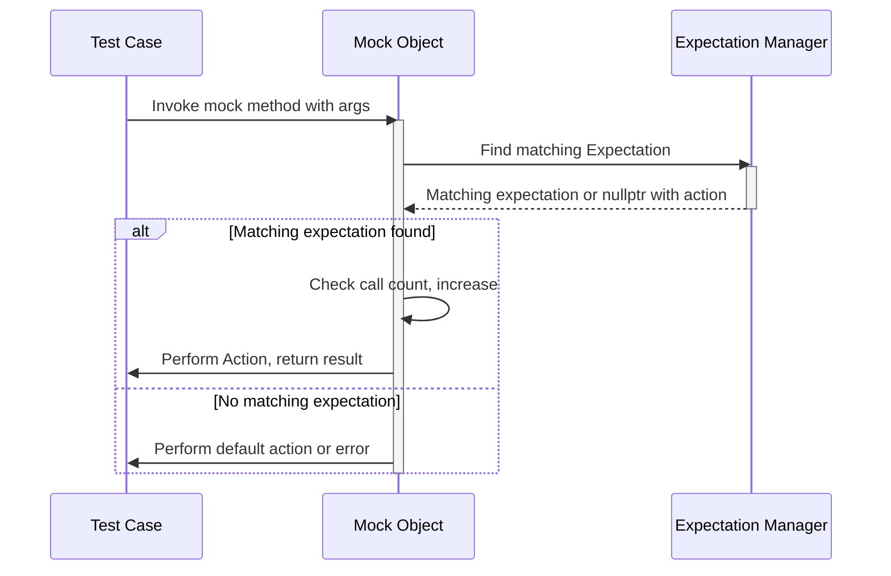

# Setting Call Expectations

Define precise expectations on mock methods using the `EXPECT_CALL` and `ON_CALL` macros. This documentation explains how to specify which calls are expected, how often they occur, and what actions they perform upon invocation. It guides you through argument matching, cardinality (call count) specification, call ordering, and how to handle unmet expectations, complete with real-world code examples demonstrating simple and advanced usage patterns.

---

## 1. Overview of Call Expectations

In GoogleMock, **mock methods** do not have an intrinsic implementation. Instead, you specify their behavior and usage contracts with `EXPECT_CALL` or `ON_CALL`. 

- `EXPECT_CALL` sets an **expectation** that a mock method will be called with arguments matching specific matchers, and optionally defines how many times it should be called and what to do when invoked.
- `ON_CALL` sets the **default action** for a mock method without imposing any requirement that it must be called.

Both macros accept argument matchers that describe what arguments are expected. The framework enforces these expectations during test execution and reports violations when calls are unexpected, missing, or excessive.

Writing clear and precise expectations is essential for effective interaction-based testing, enabling you to verify code behavior and catch defects early.


## 2. Syntax and Usage Basics

### 2.1. Setting an Expectation with EXPECT_CALL

The canonical form:

```cpp
EXPECT_CALL(mock_object, MethodName(argument_matchers...))
    .Times(cardinality)
    .WillOnce(action)
    .WillRepeatedly(action)
    .InSequence(sequence)
    .After(other_expectations)
    .RetiresOnSaturation();
```

- `mock_object`: An instance of a mock class.
- `MethodName`: The method of the mock to expect calls on.
- `argument_matchers...`: Values or matcher expressions defining the expected arguments.

### 2.2. Setting a Default Action with ON_CALL

The canonical form:

```cpp
ON_CALL(mock_object, MethodName(argument_matchers...))
    .With(optional_multi_argument_matcher)
    .WillByDefault(action);
```

`ON_CALL` specifies what should happen when the method is called but **does not** require the call to occur.


## 3. Argument Matching

### 3.1. Matchers

Each argument of the mock method can be specified as a matcher. Examples:

- Specific value: `EXPECT_CALL(mock, Foo(5))` expects argument equal to 5.
- Wildcard `_`: matches anything. For example, `EXPECT_CALL(mock, Foo(_))` expects the method to be called with any argument.
- Complex matcher: `EXPECT_CALL(mock, Foo(Ge(10)))` expects the argument to be greater than or equal to 10.

If you omit the parameter list (e.g., `EXPECT_CALL(mock, Foo)`), it behaves as if all arguments were matched with `_`, but **only for non-overloaded methods**.

### 3.2. Combining Matchers

Use combinators like `AllOf()`, `AnyOf()`, or `Not()` to express complex conditions:

```cpp
EXPECT_CALL(mock, Function(AllOf(Gt(5), Lt(10))))
```

### 3.3. `.With()` Clause

Applies a matcher on the entire argument tuple, allowing you to specify cross-argument constraints:

```cpp
EXPECT_CALL(mock, Foo(_, _))
    .With(Lt());  // expects arg0 < arg1
```

This is useful to express conditions involving multiple arguments together.


## 4. Cardinalities (Call Counts)

### 4.1. Specifying Call Counts with `.Times()`

The `.Times()` clause defines how many times an expectation is expected to be met. You can specify this as either a count or cardinality:

- `Times(1)` (default if omitted): exactly once.
- `Times(0)`: expectation is never called.
- `Times(AnyNumber())`: any number (including zero) of calls.
- `Times(AtLeast(n))`: called at least *n* times.
- `Times(AtMost(n))`: called at most *n* times.
- `Times(Between(m, n))`: between *m* and *n* times inclusive.

If `.Times()` is omitted, GoogleMock infers it based on the number of `WillOnce()` and `WillRepeatedly()` clauses provided.

### 4.2. Inferred Cardinality Rules

- No `WillOnce` nor `WillRepeatedly`: inferred as `Times(1)`.
- `n` `WillOnce` clauses, no `WillRepeatedly`: inferred as `Times(n)`.
- `n` `WillOnce` clauses plus one `WillRepeatedly`: inferred as `Times(AtLeast(n))`.

### 4.3. Behavior When Calls Exceed or Fall Short of Cardinality

- Calls exceeding the upper bound produce a test failure indicating too many calls.
- Calls fewer than the lower bound when the mock is destructed or verified produce a test failure indicating too few calls.


## 5. Ordering Calls

### 5.1. Default Behavior

By default, expectations can be matched in any order. When multiple expectations match a call, the **most recent** expectation that matches is used (newer overrides older).

### 5.2. Enforcing Call Order

Use sequences to enforce order:

```cpp
Sequence s1, s2;
EXPECT_CALL(mock, A()).InSequence(s1);
EXPECT_CALL(mock, B()).InSequence(s2);
EXPECT_CALL(mock, C()).InSequence(s1, s2);
```

This establishes that A must be called before B and C, and B must be called before C, but the order between A and C is unimportant except for these constraints.

Alternatively, use the `InSequence` RAII object to make all expectations in a scope sequential:

```cpp
{
  InSequence seq;
  EXPECT_CALL(mock, FirstCall());
  EXPECT_CALL(mock, SecondCall());
}
```

### 5.3. Using `.After()` Clause

For fine-grained control, `.After()` specifies explicit pre-requisites:

```cpp
Expectation e1 = EXPECT_CALL(mock, Init());
EXPECT_CALL(mock, Start()).After(e1);
```

This states `Start()` can only be called after `Init()` has been called.


## 6. Specifying Behavior with Actions

Actions define what the mock method does when called.

### 6.1. Common Action Clauses

- `.WillOnce(action)`: Specifies behavior for one matching call; can repeat multiple times for sequential behaviors.
- `.WillRepeatedly(action)`: Specifies the behavior for all remaining calls after `WillOnce`s are exhausted.
- `.RetiresOnSaturation()`: Marks the expectation as retired once its expected calls are met, so later calls will not match this expectation.

### 6.2. Default Actions

If no explicit action is set, GoogleMock uses a **default action**:

- For `void` methods, return immediately.
- For `bool`, return `false`.
- For numeric or pointer types, return zero or `nullptr`.
- For types with a default constructor (C++11+), return a default-constructed object.

Specify default behavior for mock methods with `ON_CALL` or set new defaults globally with `DefaultValue<T>`.


## 7. Real-World Examples

### 7.1. Basic Expectation

```cpp
class MockTurtle {
 public:
  MOCK_METHOD(void, PenDown, (), (override));
};

MockTurtle mock;
EXPECT_CALL(mock, PenDown()).Times(1);
mock.PenDown();  // Passes.
```

### 7.2. Using Matchers and Actions

```cpp
EXPECT_CALL(mock, Move(Ge(0), _))  // expects first arg >= 0, second is anything
    .Times(AtLeast(1))
    .WillRepeatedly(Return(true));

bool result = mock.Move(5, 10);  // returns true
```

### 7.3. Ordered Calls

```cpp
Sequence seq;
EXPECT_CALL(mock, Init()).InSequence(seq);
EXPECT_CALL(mock, Start()).InSequence(seq);

mock.Init();  // Must be called before Start().
mock.Start();
```

### 7.4. Using `.With()` for Cross-Argument Conditions

```cpp
EXPECT_CALL(mock, SetPosition(_, _))
    .With(Lt());  // Enforces arg0 < arg1 for the call

mock.SetPosition(1, 2);  // Matches
mock.SetPosition(2, 1);  // Fails
```


## 8. Common Patterns and Pitfalls

### 8.1. Setting Expectations Before Use

All `EXPECT_CALL`s **must be set up before** the mock methods are used. Setting expectations after calls to the mock methods leads to undefined behavior.

### 8.2. Over-Specification

Avoid overly strict expectations; excessive constraints make tests brittle and hard to maintain.

### 8.3. Uninteresting Calls

Calls to methods without expectations are "uninteresting": allowed, but typically produce warnings. To suppress warnings, use `NiceMock<MockClass>` or add an `EXPECT_CALL` with `Times(AnyNumber())`.

### 8.4. Retiring Expectations

Use `.RetiresOnSaturation()` to automatically retire expectations, avoiding unexpected call errors when calls exceed expected count.

### 8.5. Using Sequences Carefully

Sequences impose order constraints, breaking tests if the code calls mocks out of the specified order.

### 8.6. Understanding Default Actions vs. Explicit Actions

An explicit `EXPECT_CALL` with no action runs default action; explicit `ON_CALL` sets default behavior for uninteresting or unexpected calls.


## 9. Verifying and Clearing Expectations Explicitly

While GoogleMock automatically verifies expectations at mock object destruction, you can force verification explicitly:

```cpp
using ::testing::Mock;

Mock::VerifyAndClearExpectations(&mock_object);  // Verifies all expectations, returns true if all met.
Mock::VerifyAndClear(&mock_object);              // Also clears default actions.
```

Do not set new expectations after verifying and clearing a mock, as this can cause unpredictable behavior.


## 10. Advanced Topic: Specifying Multiple Sequences and Partial Orders

You can assign expectations to multiple sequences, thereby specifying complex partial orders between calls.

```cpp
Sequence s1, s2;
EXPECT_CALL(mock, A()).InSequence(s1);
EXPECT_CALL(mock, B()).InSequence(s2);
EXPECT_CALL(mock, C()).InSequence(s1, s2);
```

This creates a dependency graph where calls must follow constraints of all sequences they belong to.


---

## Appendix: Typical Mock Call Flow



---

## Troubleshooting

### Call Not Matching Any Expectation

If a mock method call does not match any `EXPECT_CALL`: 
- Verify argument matchers.
- Check call order if sequences or `.After` are used.
- Ensure all expectations are set before calls.

### Too Few or Too Many Calls

Expectations with cardinalities trigger failures if called fewer or more times than specified.
- Use `Times(AnyNumber())` if the number of calls is flexible.
- Use `.RetiresOnSaturation()` to retire finished expectations.

### Uninteresting Call Warnings

Warnings on calls without expectations can be suppressed by:
- Using `NiceMock`.
- Adding `EXPECT_CALL(mock, Method(_)).Times(AnyNumber())`.

### Leaked Mocks

If you see errors about leaked mocks at exit, remember:
- Each mock object's expectations are verified at destruction.
- Use `Mock::AllowLeak(mock_object)` to suppress warnings for intentionally leaked mocks.

---

## Related Documentation

- [Mocking Reference](reference/mocking.md) — Detailed grammar, examples, and API for `EXPECT_CALL` and `ON_CALL`.
- [gMock Cheat Sheet](docs/gmock_cheat_sheet.md) — Quick reference for common usage patterns.
- [gMock Cookbook](docs/gmock_cook_book.md) — Recipes for advanced mocking techniques.
- [Core Testing Workflows](guides/core-testing-workflows/using-mocks-in-tests.mdx) — Guide to using mocks effectively in tests.
- [Understanding Uninteresting Calls](gmock_cook_book.md#uninteresting-vs-unexpected) — Best practices for handling calls without expectations.

---