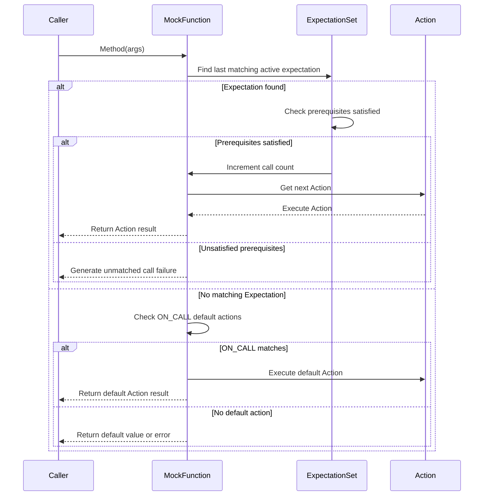

# Expectations & Actions Reference

This page provides a comprehensive reference for setting call expectations on mock methods, defining return values or side effects, and controlling mock behaviors using the `ON_CALL` and `EXPECT_CALL` macros. It covers how to use actions for specifying complex responses, chaining behaviors, and controlling invocation order within tests.

---

## Overview

GoogleMock allows you to precisely specify how mock objects behave in your tests. The two core constructs for controlling mock method behavior are:

- `ON_CALL`: Sets default behavior for a mock method without asserting that the method will be called.
- `EXPECT_CALL`: Specifies an expectation that a method *will* be called, along with its expected arguments, number of invocations, and actions to perform.

Use `ON_CALL` to set up common, default responses shared across tests, and `EXPECT_CALL` only when you want to verify that certain calls occur.

---

## Using `EXPECT_CALL`

The `EXPECT_CALL` macro allows you to declare that a mock method is expected to be called with matching arguments and to specify what it should do when called.

The general syntax is:

```cpp
EXPECT_CALL(mock_object, MethodName(matchers...))
    .With(multi_argument_matcher)      // Optional, once
    .Times(cardinality)                // Optional, once
    .InSequence(sequences...)          // Optional, many times
    .After(expectations...)            // Optional, many times
    .WillOnce(action)                  // Optional, many times
    .WillRepeatedly(action)            // Optional, once
    .RetiresOnSaturation();            // Optional, once
```

### Matchers

Arguments passed to `EXPECT_CALL` are matchers that constrain what argument values the call must receive. If omitted, the expectation matches any argument.

 - Example: `EXPECT_CALL(foo, Add(5, _));` expects the first argument to be `5` and the second to be anything.
 - Use `_` for wildcard matches: matches anything.

### The `.With()` Clause

Restricts the expectation to calls whose *whole argument tuple* matches the given matcher.

```cpp
EXPECT_CALL(obj, SetPosition(_, _))
    .With(Lt())  // The first argument less than the second
    .Times(1);
```

 `.With()` can be used at most once and must be the first clause in the chain.

### The `.Times()` Clause

Specifies how many times the call is expected.

- Use built-in cardinalities like `AnyNumber()`, `AtLeast(n)`, `AtMost(n)`, `Between(m, n)`, or `Exactly(n)`.
- If omitted, cardinality is inferred based on `WillOnce()`/`WillRepeatedly()` presence:
  - No `WillOnce` or `WillRepeatedly`: `.Times(Exactly(1))`.
  - `n` `WillOnce` instances, no `WillRepeatedly`: `.Times(Exactly(n))`.
  - `n` `WillOnce` instances and `WillRepeatedly`: `.Times(AtLeast(n))`.

### The `.InSequence()` Clause

Orders calls to this expectation with others in one or more sequences.

Example:

```cpp
Sequence s1, s2;
EXPECT_CALL(foo, Init()).InSequence(s1);
EXPECT_CALL(foo, Run()).InSequence(s1, s2);
EXPECT_CALL(foo, Cleanup()).InSequence(s2);
```

Call order must respect the sequence constraints.

### The `.After()` Clause

Specifies that this expectation can only be matched after the given expectations (or expectation sets) have been satisfied.

Example:

```cpp
Expectation e1 = EXPECT_CALL(foo, A());
Expectation e2 = EXPECT_CALL(foo, B()).After(e1);
```

Can specify up to five arguments of expectations or expectation sets.

### The `.WillOnce()` Clause

Chains actions to be performed for successive matching calls.

- Specify an action executed **once** per call in the sequence.
- Multiple `.WillOnce()` can be chained.

Example:

```cpp
EXPECT_CALL(foo, GetVal())
    .WillOnce(Return(1))
    .WillOnce(Return(2))
    .WillOnce(Return(3));
```

### The `.WillRepeatedly()` Clause

Specifies an action to perform for all calls **after** all `.WillOnce()` actions are exhausted.

- Can appear at most once.

Example:

```cpp
EXPECT_CALL(foo, GetVal())
    .WillOnce(Return(1))
    .WillRepeatedly(Return(9));
```

### The `.RetiresOnSaturation()` Clause

Indicates that the expectation should be **retired (deactivated)** once its specified number of calls has been reached.

Useful when overlapping expectations exist and you want the expectation to become inactive after saturation.

Example:

```cpp
EXPECT_CALL(foo, SetNumber(5))
    .Times(2)
    .RetiresOnSaturation();
```

---

## Using `ON_CALL`

`ON_CALL` sets a *default* action for a mock method call that matches the given arguments — without creating an expectation that the call will happen.

Syntax:

```cpp
ON_CALL(mock_object, MethodName(matchers...))
    .With(multi_argument_matcher)  // Optional, once
    .WillByDefault(action);         // Required, once
```

- You **must** call `.WillByDefault()` exactly once per `ON_CALL` statement.
- Optionally restrict matching calls using `.With()`.

`ON_CALL` default actions apply when no matching `EXPECT_CALL` is found or when the number of calls exceeds what `EXPECT_CALL` allows.

Example:

```cpp
ON_CALL(mock, GetName())
    .WillByDefault(Return("default_name"));
```

---

## Actions

Actions specify what a mock method should do when called. Both `EXPECT_CALL` and `ON_CALL` use actions to define behavior.

Refer to [Actions Reference](../reference/actions.md) for the full list. Here's an overview of common actions:

### Returning Values

- `Return(value)`: Returns a fixed value.
- `ReturnRef(variable)`: Returns a reference to a variable.
- `ReturnPointee(pointer)`: Returns the value pointed to.
- `ReturnNew<T>(args...)`: Returns a new object per call.
- `ReturnArg<N>()`: Returns the N-th argument.
- `ReturnRoundRobin({v1, ..., vn})`: Returns values cycling through the list.

### Side Effects

- `SetArgPointee<N>(value)`: Sets the value pointed to by argument N.
- `SetArrayArgument<N>(first, last)`: Copies array elements into argument N.
- `SaveArg<N>(pointer)`: Saves the argument N to the pointed location.
- `DeleteArg<N>()`: Deletes a pointer argument.
- `Assign(&var, value)`: Assigns a value to a variable.
- `Throw(exception)`: Throws an exception.

### Invoking Functions or Callables

- `Invoke(functor)`: Calls a function or lambda with the mock method's arguments.
- `InvokeWithoutArgs(functor)`: Calls a function/lambda with no arguments.
- `InvokeArgument<N>(args...)`: Calls the mock function's N-th argument (which must be callable) with supplied arguments.

### Composite Actions

- `DoAll(a1, a2, ..., an)`: Performs multiple actions sequentially.
- `IgnoreResult(a)`: Executes `a` but ignores its result.
- `WithArg<N>(a)`: Passes the N-th argument to action `a`.
- `WithArgs<N1, N2, ...>(a)`: Passes selected arguments to action `a`.
- `WithoutArgs(a)`: Performs action without arguments.

### Default and No-Op

- `DoDefault()`: Performs the default action (used primarily with `EXPECT_CALL`).

---

## Best Practices & Tips

- Prefer `ON_CALL` for common default behaviors shared by tests.
- Use `EXPECT_CALL` only when you want to verify a method is called (expectation).
- The *latest* matching `EXPECT_CALL` or `ON_CALL` overrides previous ones.
- Use `Times(AnyNumber())` to allow calls without failing due to uninteresting calls.
- To suppress warnings about uninteresting calls, consider using `NiceMock`.
- When chaining `.WillOnce()`, ensure that the number of calls matches the number of actions or add `WillRepeatedly()`.
- Use `.RetiresOnSaturation()` to avoid over-saturation failures when multiple overlapping expectations exist.
- To specify call order, use `InSequence` or `.After()` clauses.
- Be cautious with `EXPECT_CALL`s that have no callable actions: if omitted, if the mock method returns a non-void type without a default value, a failure will occur.

---

## Example Usage

### Defining Expectations and Actions

```cpp
using ::testing::Return;
using ::testing::_;
using ::testing::InSequence;
using ::testing::Sequence;

MockFoo mock;
Sequence seq;

// Default action: return "default" any time GetName() is called
ON_CALL(mock, GetName()).WillByDefault(Return("default"));

// Expect the Add() method to be called exactly twice with any arguments
EXPECT_CALL(mock, Add(_, _))
    .Times(2)
    .WillOnce(Return(10))
    .WillOnce(Return(20));

// Expect method Foo() to be called after Add and in sequence
EXPECT_CALL(mock, Foo())
    .InSequence(seq)
    .After(EXPECT_CALL(mock, Add(1, 2)));
```

### Using `.With()` to Match Argument Tuples

```cpp
using ::testing::Lt;

EXPECT_CALL(mock, SetPosition(_, _))
    .With(Lt())  // Expect first argument < second argument
    .WillOnce(Return(true));
```

---

## Common Failure Scenarios and Troubleshooting

### Too Many or Too Few Actions

If the number of `WillOnce()` actions does not match the expected call cardinality, gMock will produce warnings or failures:

- Too few `WillOnce()` for expected calls: warning "Too few actions specified..."
- Too many `WillOnce()` for expected calls: warning "Too many actions specified..."

Always match your `WillOnce()` count to expected calls or add `WillRepeatedly()`.

### Unexpected Calls

If a method call does not match any `EXPECT_CALL`, gMock reports an unexpected call failure.

- Specify expectations with argument matchers carefully.
- Use catch-all expectations (`EXPECT_CALL(mock, Method(_)).Times(AnyNumber())`) to allow other calls.

### Retired Expectations

An expectation marked with `.RetiresOnSaturation()` or in a sequence might be inactive and not match calls.

- Check whether calls are made in the correct order or after prior expectations are satisfied.

### Uninteresting Calls Warning

Calling methods without expectations causes gMock to print warnings by default.

- Use `ON_CALL` to set default actions so calls behave as expected.
- Consider using `NiceMock` to suppress uninteresting call warnings.

---

## Verifying and Clearing Expectations Manually

You can manually verify and clear expectations on a mock object before it is destructed:

```cpp
bool success = ::testing::Mock::VerifyAndClearExpectations(&mock);
```

This returns `true` if all expectations are met, `false` otherwise.

To clear default actions *and* verify expectations:

```cpp
bool success = ::testing::Mock::VerifyAndClear(&mock);
```

Do **not** set new expectations after verification, as it leads to undefined behavior.

---

## Summary Diagram: Call Resolution Flow



This flow summarizes how GoogleMock matches calls to expectations or default actions and executes them.

---

## Key References

- [GoogleMock Cookbook](../gmock_cook_book.md) — for recipes on writing and using mock expectations and actions.
- [Actions Reference](../reference/actions.md) — detailed list of built-in actions.
- [Mocking Reference](../reference/mocking.md) — full API documentation for `EXPECT_CALL`, `ON_CALL` and mock classes.
- [Matchers Reference](../reference/matchers.md) — available argument matchers.

---

## Troubleshooting Tips

- Use `--gmock_verbose=info` to see detailed logs of mock invocations and matching results.
- Prefer `ON_CALL` to specify default behaviors to avoid unexpected calls.
- When using `.WillOnce()`, remember actions are consumed as calls occur; ensure you have enough actions or add `.WillRepeatedly()`.
- Use sequences (`InSequence`) or `.After()` to control call order.
- Avoid over-specifying expectations to keep tests flexible and maintainable.

---

This reference empowers you to harness GoogleMock's powerful expectation and action API for precise and maintainable mock-based testing.
