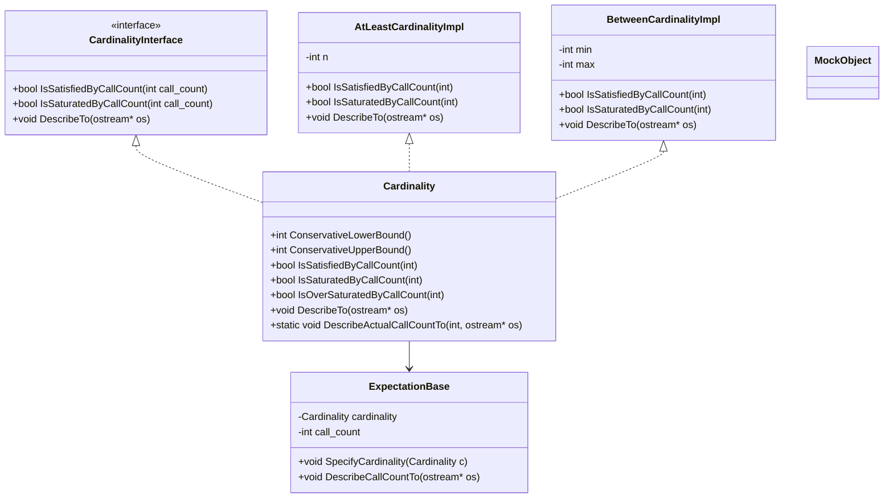

# Argument Matchers & Call Cardinalities

This reference documents GoogleMock's API for **argument matchers** and **call cardinalities**, two crucial tools for controlling and verifying mock function calls in your tests. It covers the most commonly used built-in matchers like `Eq`, `Ge`, `Contains`, and the ways to specify **how many times** a mock function is expected to be invoked using cardinality specifiers like `AtLeast`, `AtMost`, and `Times`.

---

## 1. Overview

### What Are Argument Matchers?
Argument matchers let you specify expectations on the arguments with which mock methods are called. Rather than fixating on exact values, you can assert argument properties such as equality, inequalities, string containment, or complex composite predicates.

### What Are Call Cardinalities?
Call cardinalities (used in the `.Times()` clause of an `EXPECT_CALL`) specify the number of times you expect a mock method to be invoked for matching arguments. They define precise or fuzzy constraints, ranging from exact usage counts to ranges or unlimited calls.

---

## 2. Argument Matchers

### Built-In Argument Matchers
GoogleMock offers a rich library of matchers to capture nearly any argument condition:

- **Eq(value)**: Matches arguments equal to `value`.
- **Ne(value)**: Not equal to `value`.
- **Ge(value)/Gt(value)/Le(value)/Lt(value)**: Greater-than or less-than comparisons.
- **Contains(element or substring)**: Matches containers or strings containing the given element or substring.
- **_ (wildcard matcher)**: Matches any value; useful when you don't care about an argument.

Example:
```cpp
using ::testing::Eq;
using ::testing::_;

EXPECT_CALL(mock_object, SomeMethod(Eq(5), _));  // first argument must be 5, second argument ignored
```

### Complex and Composite Matchers
Matchers can be combined logically using `AllOf()`, `AnyOf()`, and negation `Not()`.

Example:
```cpp
EXPECT_CALL(mock, Method(AllOf(Ge(5), Ne(10))));  // argument >= 5 and != 10
```

### Wildcard `_` Usage
When you don't care about an argument's value, use `_` to match anything:
```cpp
EXPECT_CALL(mock, Method(_, _));  // matches method calls with any two arguments
```

---

## 3. Call Cardinalities

Each expectation's `.Times()` clause defines how many times it applies to matching calls.

### Built-in Cardinalities
| Cardinality         | Meaning                                                |
| ------------------- | ------------------------------------------------------ |
| `AnyNumber()`       | Allows any number of calls (zero or more).             |
| `AtLeast(n)`        | Call expected at least *n* times.                      |
| `AtMost(n)`         | Call expected at most *n* times.                       |
| `Between(m, n)`     | Call expected between *m* and *n* times (inclusive).  |
| `Exactly(n)` or `n` | Call expected exactly *n* times (0 means no calls).    |

### Examples
```cpp
using ::testing::AtLeast;
using ::testing::Exactly;

EXPECT_CALL(mock, Foo())
    .Times(AtLeast(1));  // Foo() should be called one or more times

EXPECT_CALL(mock, Bar(42))
    .Times(Exactly(2));  // Bar(42) called exactly twice
```

### Behavior Notes
- If `.Times()` is omitted, gMock infers it:
  - No `WillOnce` or `WillRepeatedly` → `Times(1)`.
  - `n` `WillOnce`s and no `WillRepeatedly` → `Times(n)`.
  - `n` `WillOnce`s and one `WillRepeatedly` → `Times(AtLeast(n))`.

- An expectation can be 'sticky': it remains active after being saturated unless `.RetiresOnSaturation()` is specified or it is in a sequence.

### Creating Custom Cardinalities
Advanced users can implement their own cardinalities by subclassing `CardinalityInterface` and defining:
- `IsSatisfiedByCallCount(int)`
- `IsSaturatedByCallCount(int)`
- `DescribeTo(std::ostream*)`

Then wrap the implementation using `MakeCardinality()`.

---

## 4. Usage Patterns & Examples

### Setting Expectations with Call Cardinalities
You can specify the expected number of calls concisely using cardinalities:

```cpp
EXPECT_CALL(mock, DoWork()).Times(Exactly(3));  // Exactly 3 times
EXPECT_CALL(mock, DoWork()).Times(AtLeast(1));  // One or more times
EXPECT_CALL(mock, DoWork()).Times(AnyNumber());  // Any number of times
```

### Inferring Cardinalities from Actions
When `.Times()` is omitted but `.WillOnce()` or `.WillRepeatedly()` are present:

```cpp
EXPECT_CALL(mock, GetValue())
    .WillOnce(Return(1))
    .WillOnce(Return(2));  // Implies Times(2)
```

Or with `WillRepeatedly`:

```cpp
EXPECT_CALL(mock, GetValue())
    .WillOnce(Return(1))
    .WillRepeatedly(Return(2));  // Implies Times(AtLeast(1))
```

### Example: Mixing Matchers and Cardinalities

```cpp
using ::testing::Ge;
using ::testing::AtMost;
using ::testing::_;  // wildcard

EXPECT_CALL(mock, SetLevel(Ge(10)))
    .Times(AtMost(2)); // SetLevel with value >= 10 at most twice
EXPECT_CALL(mock, SetLevel(_))
    .Times(AnyNumber());  // Other calls allowed any number of times
```

### Describing Call Counts
GoogleMock's output for call counts is human-friendly:
- 0 calls: "never called"
- 1 call: "called once"
- 2 calls: "called twice"
- >2 calls: "called N times"

---

## 5. Best Practices & Tips

- **Specify only what matters:** Don't over-specify argument matchers or call counts. Use `_` and `AnyNumber()` when you want to ignore details.
- **Use `Times(0)` to forbid calls:** To ensure a mock method is never called with specific arguments.
- **Use `.RetiresOnSaturation()` for ephemeral expectations:** Prevent later calls from mistakenly triggering saturated expectations.
- **Prefer `AtLeast(n)` and `AtMost(n)` for flexible expectations:** This accounts for possible implementation changes.
- **Leverage Matchers for expressive argument constraints:** Combine matchers logically to express complex conditions.
- **Use the last matching expectation:** Remember gMock picks the last matching expectation in the order declared.

---

## 6. Common Pitfalls

- **Negative bounds in cardinalities:** Causes immediate failures. For example, `AtLeast(-1)` or `Between(-1, 2)` are invalid.

- **Swapped `min` and `max` in `Between()`:** Use `Between(m, n)` where `m <= n`, or a failure occurs.

- **Forget to set `.WillByDefault()` in `ON_CALL`:** It leads to runtime assertions.

- **Overlapping Expectations Without Proper Cardinalities:** Can cause unexpected match failures or errors.

- **Sticky Expectations Surprising Users:** Beware that by default an expectation remains active even after saturation, which might be unexpected; use `.RetiresOnSaturation()` if needed.

---

## 7. API Reference

### Cardinality Functions
All functions are in the `testing` namespace.

| Function                                 | Description                                                         |
| ----------------------------------------| ------------------------------------------------------------------- |
| `Cardinality AnyNumber()`                | Match any number of calls (>= 0).                                  |
| `Cardinality AtLeast(int n)`             | Match at least *n* calls (n >= 0).                                 |
| `Cardinality AtMost(int n)`              | Match at most *n* calls (n >= 0).                                  |
| `Cardinality Between(int min, int max)` | Match between *min* and *max* calls inclusive (min >= 0, min <= max).|
| `Cardinality Exactly(int n)`             | Match exactly *n* calls (n >= 0).                                  |
| `Cardinality MakeCardinality(const CardinalityInterface* c)` | Create custom cardinality from interface implementation.

### Usage Example
```cpp
EXPECT_CALL(mock, Foo())
    .Times(AtLeast(1));

EXPECT_CALL(mock, Bar(_))
    .Times(Between(2, 4));

EXPECT_CALL(mock, Baz(_))
    .Times(Exactly(0));
```

### Argument Matcher Example
```cpp
EXPECT_CALL(mock, Compute(Ge(10), Contains("test")))
    .Times(AtMost(3));
```

---

## 8. Troubleshooting

### Expectation Failures
- If you get a failure about too many or too few calls, review your `.Times()` clause.
- Use `.RetiresOnSaturation()` to avoid unexpected repeated matches from saturated expectations.

### Negative or Invalid Cardinality Arguments
- Building or running with negative values for bounds in `AtLeast`, `AtMost`, `Between`, or `Exactly` causes immediate failures.

### Unmatched Argument Errors
- Check your argument matchers for type correctness and correctness of logic.
- Use `_` for wildcards.

### Missing `.WillByDefault()` in `ON_CALL`
- Every `ON_CALL` must end with `.WillByDefault()`; otherwise, the mock call leads to runtime error.

### Diagnostic Output
- Run tests with `--gmock_verbose=info` to see detailed mock call matching and argument print-outs.
- To reduce output, choose `warning` or `error` levels.

---

## 9. Additional Resources

- Related pages: [Matcher Library](../../matchers-and-assertions/matcher-library.md), [Expectations & Actions](../../mocking-api/expectations-and-actions.md)
- Guides: [gMock Cookbook](../../guides/mocking-and-advanced-usage/mocking-with-gmock.md), [gMock for Dummies](../../getting-started/first-test-usage/write-first-test.md)
- References: [Mock Class Declaration](../mocking-api/mock-class-declaration.md), [Strictness Modes](../mocking-api/strictness-modes.md)
- Source code on GitHub: [`gmock-cardinalities.h`](https://github.com/google/googletest/blob/main/googlemock/include/gmock/gmock-cardinalities.h), [`gmock-cardinalities.cc`](https://github.com/google/googletest/blob/main/googlemock/src/gmock-cardinalities.cc)

---

## 10. Summary Diagram


