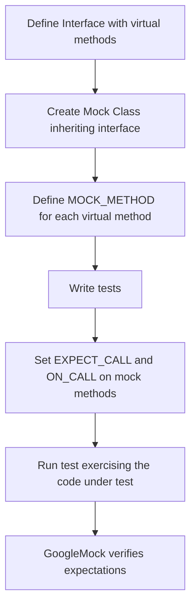

# Mock Methods & Macros

This section documents the macros and templates used for defining mock methods inside test double classes in GoogleMock. Mock methods allow you to create flexible and verifiable stand-ins for real class methods in C++ tests, greatly simplifying writing interaction-based tests by describing expected calls, arguments, and return behaviors.

---

## Overview

GoogleMock provides the `MOCK_METHOD` macro to define mock methods within mock classes. These macros generate method declarations and definitions that seamlessly integrate with GoogleMock's expectations and actions system.

Mock methods behave like virtual methods and must override the corresponding method in the base class (which should be virtual). Mock objects provide control over the behavior of these methods during test execution.

### Why Use Mock Methods?

- They allow verification of function calls by specifying:
  - Which methods are called,
  - With what arguments,
  - How many times,
  - The order in which calls happen,
  - What the methods return.

- Automate tedious mock implementations while providing clear syntax.

- Support overloads, const methods, templates, and different calling conventions.


## MOCK_METHOD Macro

The `MOCK_METHOD` macro is the primary utility to declare mock methods. Its fundamental syntax is:

```cpp
MOCK_METHOD(return_type, method_name, (args...), (specifiers));
```

- `return_type`: The method's return type.
- `method_name`: Name of the method to mock.
- `args...`: Method argument types and names enclosed in parentheses.
- `specifiers`: Optional method qualifiers such as `const`, `override`, `noexcept`, or calling conventions.

### Example

Given a base class:

```cpp
class Turtle {
 public:
  virtual ~Turtle() {}
  virtual void PenUp() = 0;
  virtual void PenDown() = 0;
  virtual void Forward(int distance) = 0;
  virtual int GetX() const = 0;
};
```

You define a mock class as:

```cpp
#include <gmock/gmock.h>

class MockTurtle : public Turtle {
 public:
  MOCK_METHOD(void, PenUp, (), (override));
  MOCK_METHOD(void, PenDown, (), (override));
  MOCK_METHOD(void, Forward, (int distance), (override));
  MOCK_METHOD(int, GetX, (), (const, override));
};
```

No additional method implementations are necessary. The macro expands to both declaration and necessary internal plumbing.


## Specifiers

The fourth optional argument to `MOCK_METHOD` controls method qualifiers:

| Specifier         | Description                                 |
|-------------------|---------------------------------------------|
| `const`           | Marks the mocked method as `const`. Required when overriding `const` methods.                |
| `override`        | Marks the method as `override`. Recommended for virtual functions.                           |
| `noexcept`        | Marks the method as `noexcept`. Required when overriding `noexcept` methods.                |
| `Calltype(...)`   | Specifies the calling convention (e.g., `STDMETHODCALLTYPE`). Useful on Windows.             |
| `ref(&)` or `ref(&&)`  | Specifies reference qualifiers if the method is restricted (e.g., lvalue or rvalue refs). |


## Handling Commas in Return Types and Arguments

Because C++ template and macro parsing can be sensitive to commas, especially in template types e.g., `std::pair<int, double>`, enclosing such types in parentheses is required:

```cpp
MOCK_METHOD((std::pair<bool, int>), GetPair, ());
MOCK_METHOD(bool, CheckMap, ((std::map<int, double>), bool));
```

Alternatively, use `using` to create type aliases:

```cpp
using BoolIntPair = std::pair<bool, int>;
MOCK_METHOD(BoolIntPair, GetPair, ());
```


## Mocking Overloaded Methods

Overloaded methods can be mocked as usual. The signatures must clearly identify the overload being mocked:

```cpp
class Foo {
 public:
  virtual ~Foo();
  virtual int Add(int x);
  virtual int Add(int times, int x);
  virtual int& GetBar();
  virtual const int& GetBar() const;
};

class MockFoo : public Foo {
 public:
  MOCK_METHOD(int, Add, (int x), (override));
  MOCK_METHOD(int, Add, (int times, int x), (override));
  MOCK_METHOD(int&, GetBar, (), (override));
  MOCK_METHOD(const int&, GetBar, (), (const, override));
};
```

To avoid compiler warnings about hidden overloads, use `using` declarations:

```cpp
class MockFoo : public Foo {
 public:
  using Foo::Add;  // Bring all Add overloads from base class into scope
  MOCK_METHOD(int, Add, (int x), (override));
  // No need to mock every overload if not desired
};
```


## Declaring Mock Methods for Templates and Class Templates

You can mock methods inside templates or mock class templates just like any other method.

Example for a class template:

```cpp
template <typename Elem>
class StackInterface {
 public:
  virtual ~StackInterface();
  virtual int GetSize() const = 0;
  virtual void Push(const Elem& x) = 0;
};

template <typename Elem>
class MockStack : public StackInterface<Elem> {
 public:
  MOCK_METHOD(int, GetSize, (), (const, override));
  MOCK_METHOD(void, Push, (const Elem& x), (override));
};
```


## Mocking Non-Virtual Methods

gMock can mock non-virtual methods using templates for high-performance dependency injection.

In this case, the mock class and the real class do not share a base. They only have methods with the same signature.

Example:

```cpp
class ConcretePacketStream {
 public:
  void AppendPacket(Packet* new_packet);
  const Packet* GetPacket(size_t packet_number) const;
  size_t NumberOfPackets() const;
};

class MockPacketStream {
 public:
  MOCK_METHOD(const Packet*, GetPacket, (size_t packet_number), (const));
  MOCK_METHOD(size_t, NumberOfPackets, (), (const));
};
```

The code under test can be written as a template to accept either type.


## Mocking Free Functions

You cannot directly mock free or static functions. Instead, rewrite code to depend on interfaces or use `MockFunction` with `std::function` where you want to test callbacks.

For example:

```cpp
class FileInterface {
 public:
  virtual bool Open(const char* path, const char* mode) = 0;
};

class File : public FileInterface {
 public:
  bool Open(const char* path, const char* mode) override {
    return ::OpenFile(path, mode);
  }
};
```

This allows easy mocking of `FileInterface`.


## Special Mock Classes

### MockFunction

You can mock standalone function types (such as `std::function`) using `MockFunction<F>`, which mocks a single method named `Call` matching `F`.

Example usage:

```cpp
MockFunction<int(std::string)> mock_function;
EXPECT_CALL(mock_function, Call("bar")).WillOnce(Return(1));
std::function<int(std::string)> f = mock_function.AsStdFunction();
EXPECT_EQ(f("bar"), 1);
```


## Best Practices

- Use `MOCK_METHOD` in the **public** section of your mock class regardless of the base method's access modifier. This is required to correctly set expectations.
- Use `override` where possible to ensure correct overriding.
- Wrap complex argument or return types containing commas with parentheses or use type aliases to avoid macro parsing issues.
- For overloaded methods, mock every version you expect to call and consider `using` declarations to pull base class overloads into scope.
- For non-virtual methods, use templated mock classes with matching method signatures.
- Avoid mocking free functions directly; refactor into interfaces or use `MockFunction` with callback function wrappers.


## Troubleshooting

- Compilation errors related to `MOCK_METHOD` are often due to commas in types not being enclosed in parentheses.
- Ambiguities with overloaded methods can be resolved by specifying full signatures or using `Const()` wrapper to disambiguate const overloads.
- Be careful using `MOCK_METHOD` with incomplete types; ensure `PrintTo()` is defined for such types.
- Always create mock expectations **before** exercising your code to avoid undefined behaviors.


## Related Macros & Tools

- `ON_CALL(...)`: For specifying default behaviors without expectation constraints.
- `EXPECT_CALL(...)`: For specifying expectations on method calls.
- `NiceMock`, `NaggyMock`, `StrictMock`: Wrappers that control how uninteresting calls are treated.
- `Return()`, `WillOnce()`, `WillRepeatedly()`: Clauses for specifying mock method behaviors.


## Example: Full Mock Class

```cpp
#include <gmock/gmock.h>

class MockTurtle : public Turtle {
 public:
  MOCK_METHOD(void, PenUp, (), (override));
  MOCK_METHOD(void, PenDown, (), (override));
  MOCK_METHOD(void, Forward, (int distance), (override));
  MOCK_METHOD(int, GetX, (), (const, override));
};

// Usage in a test
TEST(PainterTest, CallsPenDown) {
  MockTurtle turtle;
  EXPECT_CALL(turtle, PenDown()).Times(AtLeast(1));
  Painter painter(&turtle);
  painter.DrawCircle(0, 0, 10);
}
```

This test uses the mock to verify interactions.


---

## Diagram: Position of MOCK_METHOD in Mocking Workflow



---

## Further Reading & References

- [GoogleMock for Dummies](https://google.github.io/googletest/gmock_for_dummies.html) – beginner-friendly introduction including mock creation and usage.
- [Mocking Reference](https://google.github.io/googletest/reference/mocking.html) – detailed guide on mocking-related features.
- [gMock Cheat Sheet](https://google.github.io/googletest/gmock_cheat_sheet.html) – quick syntax reference.
- [Mocking with GoogleMock Guide](https://google.github.io/googletest/guides/core-workflows/mocking-with-gmock.html) – end-to-end testing workflows.
- [GoogleMock Spec Builders header](googlemock/include/gmock/gmock-spec-builders.h) for implementation insights.

---