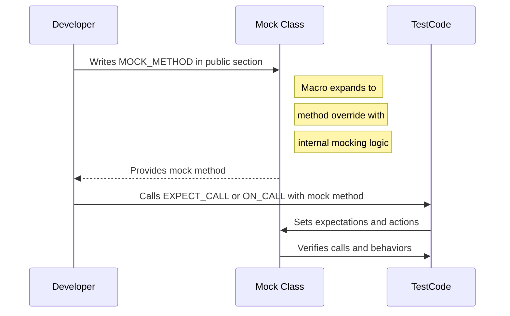

# Defining and Using Mock Methods

This page provides a detailed reference on how to define mock classes and their methods using the `MOCK_METHOD` macro in GoogleMock. You will learn how to customize mock method signatures, handle advanced declaration patterns, and integrate mock methods effectively into your test fixtures. This documentation focuses exclusively on the mechanics and usage of `MOCK_METHOD` and related mock method declaration best practices.

---

## Overview of MOCK_METHOD

To create a mock class capable of participating in unit testing with GoogleMock, you use the `MOCK_METHOD` macro. This macro generates mock implementations of virtual or non-virtual methods that can be controlled and verified during tests.

### Basic Syntax

```cpp
MOCK_METHOD(ReturnType, MethodName, (Args...), (Specifiers));
```

- **ReturnType**: The exact return type of the method being mocked.
- **MethodName**: The name of the method to mock.
- **Args...**: The method's argument types enclosed in parentheses.
- **Specifiers** (optional): A comma-separated list of qualifiers such as `const`, `override`, `noexcept`, or calling conventions.

### Example

Given an interface:

```cpp
class Foo {
 public:
  virtual ~Foo() = default;
  virtual int GetSize() const = 0;
  virtual string Describe(const char* name) = 0;
  virtual bool Process(Bar elem, int count) = 0;
};
```

You can define its mock as:

```cpp
class MockFoo : public Foo {
 public:
  MOCK_METHOD(int, GetSize, (), (const, override));
  MOCK_METHOD(string, Describe, (const char* name), (override));
  MOCK_METHOD(bool, Process, (Bar elem, int count), (override));
};
```

## Important Notes on MOCK_METHOD Usage

- **Must be in `public:` section:** Regardless of the access level of the original method, `MOCK_METHOD` calls should always be in the `public:` section of your mock class for accessibility by `ON_CALL` and `EXPECT_CALL`.
- **Virtuality:** Usually, you mock *virtual* methods. It's possible to mock non-virtual methods with extra care (see the gMock Cookbook), but the standard use case is overriding virtual interfaces.
- **Dealing with commas in types:** If your return type or argument types include commas (e.g. `std::pair<bool, int>` or `std::map<int, double>`), wrap the type in an extra set of parentheses or typedef/alias the type to avoid macro parsing errors.

  ```cpp
  // Will not compile:
  MOCK_METHOD(std::pair<bool, int>, GetPair, ());
  MOCK_METHOD(bool, CheckMap, (std::map<int, double>, bool));

  // Correct approaches:
  MOCK_METHOD((std::pair<bool, int>), GetPair, ());
  MOCK_METHOD(bool, CheckMap, ((std::map<int, double>), bool));

  // Or with type aliases:
  using BoolIntPair = std::pair<bool, int>;
  MOCK_METHOD(BoolIntPair, GetPair, ());
  using MapIntDouble = std::map<int, double>;
  MOCK_METHOD(bool, CheckMap, (MapIntDouble, bool));
  ```

- **Const and other qualifiers:** To mock a `const` method, specify the `(const)` qualifier in the fourth argument. Similarly, if the base method has `noexcept`, calling convention, or reference qualifiers, specify them here.

## Handling Overloaded Methods

When mocking overloaded methods, declare all overloads you want to mock explicitly. Example:

```cpp
class Foo {
 public:
  virtual Bar& GetBar();
  virtual const Bar& GetBar() const;
  virtual int Add(Element x);
  virtual int Add(int times, Element x);
};

class MockFoo : public Foo {
 public:
  MOCK_METHOD(Bar&, GetBar, (), (override));
  MOCK_METHOD(const Bar&, GetBar, (), (const, override));
  MOCK_METHOD(int, Add, (Element x), (override));
  MOCK_METHOD(int, Add, (int times, Element x), (override));
};
```

To avoid compiler warnings about hiding overloads you don't mock, `using` the base class methods can restore their visibility:

```cpp
using Foo::Add;
```

## Mocking Class Templates

Mock class templates can be mocked similarly, as long as their virtual methods are correctly declared:

```cpp
template <typename Elem>
class StackInterface {
 public:
  virtual ~StackInterface();
  virtual int GetSize() const = 0;
  virtual void Push(const Elem& x) = 0;
};

template <typename Elem>
class MockStack : public StackInterface<Elem> {
 public:
  MOCK_METHOD(int, GetSize, (), (const, override));
  MOCK_METHOD(void, Push, (const Elem& x), (override));
};
```

## Mocking Non-Virtual Methods

While gMock works best with virtual methods, you can mock non-virtual methods to support high-performance dependency injection. In this pattern, the mock class is unrelated to the original class but mimics its methods' signatures.

Example:

```cpp
class ConcretePacketStream {
 public:
  void AppendPacket(Packet* new_packet);
  const Packet* GetPacket(size_t packet_number) const;
  size_t NumberOfPackets() const;
};

class MockPacketStream {
 public:
  MOCK_METHOD(const Packet*, GetPacket, (size_t packet_number), (const));
  MOCK_METHOD(size_t, NumberOfPackets, (), (const));
};
```

Use template parameters to switch implementations in production vs test code.

## Specifiers in MOCK_METHOD

You can add optional qualifiers or specifiers to methods as a fourth argument, e.g.: 

- `const` for const methods
- `override` to indicate overriding a virtual method
- `noexcept` if the original method is noexcept
- `Calltype(...)` for calling conventions (Windows specific)
- `ref(&)` or `ref(&&)` to mark reference qualifiers

Example:

```cpp
MOCK_METHOD(bool, Foo, (int n), (Calltype(STDMETHODCALLTYPE)));
MOCK_METHOD(int, Bar, (double x, double y), (const, Calltype(STDMETHODCALLTYPE)));
```

## Best Practices and Recommendations

- **Mock only interfaces/classes you own:** To avoid fragile tests.
- **Put all `MOCK_METHOD` macros in `public:`:** Regardless of original access level.
- **Specify all pure virtual methods:** To avoid compilation errors.
- **Use `override` qualifier:** Enforce correct overriding.
- **Handle overloaded methods explicitly:** To avoid ambiguities and compiler errors.
- **Wrap or alias complex types:** To avoid macro parsing issues with commas.

## Example of a Complete Mock Class

```cpp
#include <gmock/gmock.h>

class Turtle {
 public:
  virtual ~Turtle() {}
  virtual void PenUp() = 0;
  virtual void PenDown() = 0;
  virtual void Forward(int distance) = 0;
  virtual void Turn(int degrees) = 0;
  virtual void GoTo(int x, int y) = 0;
  virtual int GetX() const = 0;
  virtual int GetY() const = 0;
};

class MockTurtle : public Turtle {
 public:
  MOCK_METHOD(void, PenUp, (), (override));
  MOCK_METHOD(void, PenDown, (), (override));
  MOCK_METHOD(void, Forward, (int distance), (override));
  MOCK_METHOD(void, Turn, (int degrees), (override));
  MOCK_METHOD(void, GoTo, (int x, int y), (override));
  MOCK_METHOD(int, GetX, (), (const, override));
  MOCK_METHOD(int, GetY, (), (const, override));
};
```

## Summary

- `MOCK_METHOD` automates mocking virtual and non-virtual methods.
- You must precisely declare return type, method name, argument list, and optional qualifiers.
- Advanced qualifiers enable support for const methods, noexcept, calling conventions, and reference qualifiers.
- Overloads and templates require care to correctly mock and avoid compiler issues.

## Additional Resources

For details on using mock methods in tests, setting expectations, controlling call order, and managing mock strictness (Nice, Naggy, Strict), consult these pages:

- [gMock for Dummies](gmock_for_dummies.md)
- [Setting Expectations and Actions](guides/mocking-and-advanced-testing/setting-expectations-and-actions.mdx)
- [Mocking Reference](reference/mocking.md#MOCK_METHOD)
- [gMock Cookbook](docs/gmock_cook_book.md)
- [Mock Behavior: Nice, Naggy, Strict Modes](api-reference/mocking-api/mock-behavior-controls)

---

<Accordion title="Practical Tips">

- **Wrap complex types:** Use an alias or parentheses to handle commas.
- **Keep mock methods public:** For visibility by test macros.
- **Add override keyword:** Helps catch mistakes during compilation.
- **Mock all base class pure virtual methods:** Ensures completeness.
- **Use mock classes for interfaces you own:** Encourages decoupled, maintainable tests.
- **Use `NiceMock` or `StrictMock` wrappers:** To control uninteresting call warnings.

</Accordion>

<Accordion title="Common Pitfalls">

- Forgetting the virtual destructor in base interfaces leads to leaks and undefined behavior.
- Not specifying `override` can cause silent mismatches with base methods.
- Omitting parentheses around templated types containing commas causes compile errors.
- Mocking methods without the correct qualifiers (`const`, `noexcept`) causes compilation errors or unexpected behavior.
- Setting expectations on non-virtual methods without proper design leads to ineffective mocks.

</Accordion>

## Troubleshooting Tips

- If you get mysterious macro expansion compile errors, verify parentheses around argument types.
- For virtual destructor warnings/errors, ensure base interfaces declare virtual destructors.
- Use `using` to bring base class overloads back into scope if some are hidden.
- Compile with `-Werror` or `-Wall` to catch missing `override` or signature mismatches early.
- If mocking non-virtual methods, use templates or adaptors cautiously as standard mocking macros expect virtuality.

---

## Integration with Test Fixtures

Mock methods defined with `MOCK_METHOD` can be seamlessly integrated into test fixtures (`TEST_F`) allowing rich control over mocked interactions. Use `EXPECT_CALL` and `ON_CALL` on mock objects instantiated in fixtures to establish behavior and expectations.

Example:

```cpp
class TurtleTest : public ::testing::Test {
 protected:
  MockTurtle turtle;
};

TEST_F(TurtleTest, DrawLine) {
  EXPECT_CALL(turtle, PenDown());
  EXPECT_CALL(turtle, Forward(10));

  Painter painter(&turtle);
  EXPECT_TRUE(painter.DrawLine(10));
}
```

This pattern keeps test code expressive, concise, and maintainable.

---

## Summary Diagram: Mock Method Definition Flow



---

## Summary

This page explains how to define mock methods using `MOCK_METHOD` in GoogleMock, providing detailed guidelines on syntax, qualifiers, handling overloads and templates, and integrating mocks into tests. It underscores best practices, common pitfalls, and practical tips to help developers create robust and maintainable mock classes.

---

## See Also

- [gMock Cookbook](docs/gmock_cook_book.md)
- [Mocking Reference: MOCK_METHOD](reference/mocking.md#MOCK_METHOD)
- [Setting Expectations and Actions](guides/mocking-and-advanced-testing/setting-expectations-and-actions.mdx)
- [Using Mocks in Unit Tests](guides/mocking-and-advanced-testing/using-mocks-in-unit-tests.mdx)

<Source url="https://github.com/google/googletest" paths={[{"path": "googlemock/include/gmock/gmock-spec-builders.h", "range": "1-378"}]} />