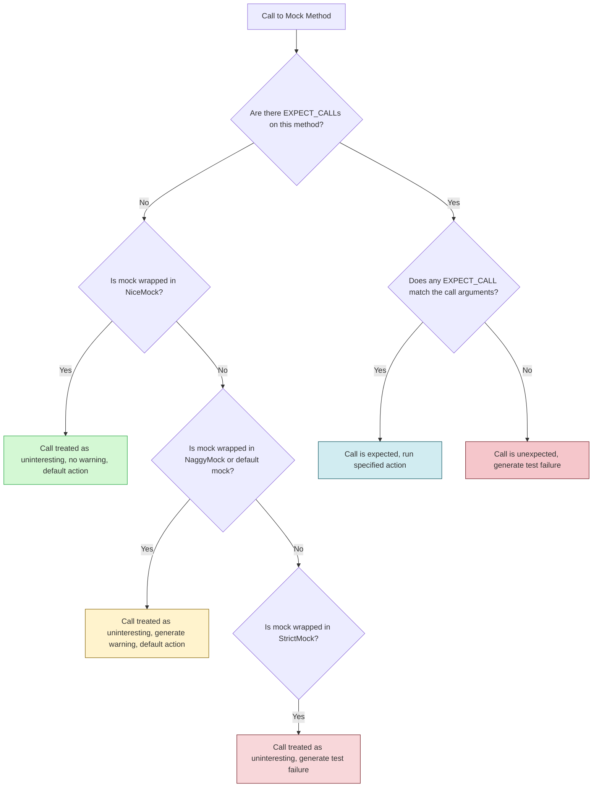

# Controlling Mock Strictness

GoogleMock provides powerful wrappers — `NiceMock`, `NaggyMock`, and `StrictMock` — to control how mock objects behave when methods are called without explicit expectations. This page guides you through these wrappers, enabling you to tailor the handling of unexpected or uninteresting calls to suit your testing needs.

---

## Understanding Uninteresting vs Unexpected Calls

Before exploring mock strictness wrappers, it is crucial to distinguish between two types of calls on mock methods:

- **Uninteresting Calls:** Calls to mock methods for which **no `EXPECT_CALL` expectations exist**. These calls are allowed by default but generate warnings by GoogleMock to indicate potential oversights in test coverage.

- **Unexpected Calls:** Calls to methods where **one or more `EXPECT_CALL` expectations are set**, but none matches the actual call’s arguments. These calls always cause test failures.

Wrappers control how uninteresting calls are treated, while unexpected calls are always treated as errors.

<Note>
If you want to suppress warnings on certain uninteresting calls, setting up explicit `EXPECT_CALL` with `.Times(AnyNumber())` can help avoid warnings while making the intent explicit.
</Note>

---

## The Mock Strictness Wrappers

### 1. `NiceMock<T>`

A `NiceMock<T>` is a subclass of the mock class `T` that **suppresses warnings for uninteresting calls**. It is the gentlest wrapper, allowing your test to ignore mock method calls you haven't explicitly expressed interest in.

- **Typical use:** When you want clean test output without warnings about uninteresting calls.
- **Behavior:** Uninteresting calls silently perform the default or `ON_CALL` behavior without warnings.
- **Construction:** Supports all constructors of the underlying mock class.

```cpp
using ::testing::NiceMock;

NiceMock<MockFoo> nice_foo;
EXPECT_CALL(nice_foo, ImportantMethod());
// Calls to other mock methods without EXPECT_CALL do not warn.
```

<Check>
Ensure the mock class’s destructor is virtual for `NiceMock<>` to work correctly.
</Check>


### 2. `NaggyMock<T>`

`NaggyMock<T>` is essentially the **default mock behavior**, where uninteresting calls generate warnings but not failures.

- **Typical use:** Default mock behavior during test development to be alerted of potentially missing expectations.
- **Behavior:** Uninteresting calls print warnings but allow test execution to continue.

```cpp
using ::testing::NaggyMock;

NaggyMock<MockFoo> naggy_foo;
EXPECT_CALL(naggy_foo, ImportantMethod());
// Calls to other mock methods warn, but don’t fail the test.
```

<Note>
Currently, raw mock objects (e.g., `MockFoo` instances) behave like `NaggyMock<MockFoo>`. There are plans to switch the default to `NiceMock` in future releases.
</Note>


### 3. `StrictMock<T>`

`StrictMock<T>` treats any uninteresting calls as **test failures**, helping you enforce a strict contract for your mock interactions.

- **Typical use:** When you want to ensure *all* mock method calls are expected and explicitly specified.
- **Behavior:** Uninteresting calls terminate tests with failures.
- **Construction:** Same as underlying mock class.

```cpp
using ::testing::StrictMock;

StrictMock<MockFoo> strict_foo;
EXPECT_CALL(strict_foo, ImportantMethod());
// Calls to any other mock methods cause test failures.
```

<Warning>
Strict mocks make tests fragile and harder to maintain; use them only when necessary to catch unexpected interactions explicitly.
</Warning>

---

## How to Use Strictness Wrappers

1. Include the wrapper by importing GoogleMock symbols:

```cpp
#include <gmock/gmock.h>
using ::testing::NiceMock;
using ::testing::NaggyMock;
using ::testing::StrictMock;
```

2. Define mock objects specifying the desired strictness wrapper:

```cpp
// Nice mock suppresses warnings on uninteresting calls.
NiceMock<MockFoo> nice_mock;

// Default naggy mock warns on uninteresting calls.
NaggyMock<MockFoo> naggy_mock;

// Strict mock causes failures on uninteresting calls.
StrictMock<MockFoo> strict_mock;
```

3. Continue with setting expectations (`EXPECT_CALL`), specifying default actions (`ON_CALL`), and use mocks as usual.

---

## Example

```cpp
#include <gmock/gmock.h>
#include <gtest/gtest.h>

class Foo {
 public:
  virtual ~Foo() = default;
  virtual void DoThis() = 0;
  virtual int GetCount() const = 0;
};

class MockFoo : public Foo {
 public:
  MOCK_METHOD(void, DoThis, (), (override));
  MOCK_METHOD(int, GetCount, (), (const, override));
};

TEST(MockStrictnessExample, NiceMockSuppressesWarnings) {
  NiceMock<MockFoo> nice;

  EXPECT_CALL(nice, DoThis()).Times(1);

  // This uninteresting call does not produce a warning.
  nice.GetCount();
  nice.DoThis();
}

TEST(MockStrictnessExample, NaggyMockWarns) {
  NaggyMock<MockFoo> naggy;

  EXPECT_CALL(naggy, DoThis()).Times(1);

  // Uninteresting call will produce a warning in output.
  naggy.GetCount();
  naggy.DoThis();
}

TEST(MockStrictnessExample, StrictMockFailsOnUninterestingCalls) {
  StrictMock<MockFoo> strict;

  EXPECT_CALL(strict, DoThis()).Times(1);

  // Uninteresting call causes test failure.
  EXPECT_NONFATAL_FAILURE(strict.GetCount(), "Uninteresting mock function call");
  strict.DoThis();
}
```

---

## Best Practices and Tips

- Prefer using **`NiceMock`** for most tests to avoid noise from uninteresting call warnings.
- Use **`NaggyMock`** during development or debugging to catch unexpected missing expectations.
- Reserve **`StrictMock`** for tests where you want to explicitly forbid any unexpected interactions.
- If you want to allow some uninteresting calls without warnings, consider adding catch-all expectations with `.Times(AnyNumber())`.
- Never nest these wrappers. For example, `NiceMock<StrictMock<MockFoo>>` is not supported and will produce compile errors.
- Ensure mocked classes have **virtual destructors** for wrappers to operate correctly.

<Warning>
Using `StrictMock` everywhere can make test maintenance difficult as every new call requires expectation updates. Balance strictness and maintainability carefully.
</Warning>

---

## Under the Hood

These wrappers inherit constructors and mock methods from your mock class but modify how uninteresting calls are handled:

- **NiceMock:** Allows uninteresting calls silently.
- **NaggyMock:** Prints warnings for uninteresting calls.
- **StrictMock:** Converts uninteresting calls into test failures.

Internally, they register and deregister call reactions with the GoogleMock framework to control default behaviors for uninteresting calls.

---

## Troubleshooting

- If you unexpectedly get warnings despite using `NiceMock`, verify your mock methods are defined **directly** in the mock class via `MOCK_METHOD` macros.
- If unexpected calls cause no failure with `StrictMock`, ensure your mock class has a **virtual destructor**.
- Use the `--gmock_verbose` flag (`info`, `warning`, `error`) to control the verbosity of mock call diagnostics.

---

## Additional Information

For more detailed guidance and advanced usage, see:

- [gMock Cheat Sheet](https://google.github.io/googletest/gmock_cheat_sheet.html#The-Nice,-the-Strict,-and-the-Naggy)
- [Mocking Reference - EXPECT_CALL and ON_CALL](https://google.github.io/googletest/reference/mocking.html#specifying-expectations)
- [gMock Cookbook - Using Actions and Expectations](https://google.github.io/googletest/gmock_cook_book.html#UseNiceStrictNaggy)

---

<AccordionGroup title="Quick Reference Examples">
<Accordion title="Creating a NiceMock">
```cpp
NiceMock<MockFoo> nice_mock;
EXPECT_CALL(nice_mock, DoThis());
// No warnings on uninteresting calls.
```
</Accordion>
<Accordion title="Creating a NaggyMock">
```cpp
NaggyMock<MockFoo> naggy_mock;
EXPECT_CALL(naggy_mock, DoThis());
// Warning on uninteresting calls.
```
</Accordion>
<Accordion title="Creating a StrictMock">
```cpp
StrictMock<MockFoo> strict_mock;
EXPECT_CALL(strict_mock, DoThis());
// Failure on uninteresting calls.
```
</Accordion>
</AccordionGroup>

---

### Mermaid Diagram: Mock Call Handling Flow



---