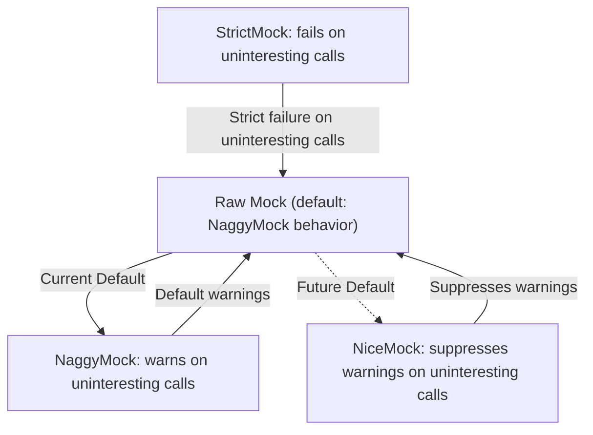

# Nice, Naggy, and Strict Mocks

GoogleMock provides three convenient wrapper templates—`NiceMock`, `NaggyMock`, and `StrictMock`—designed to help you control how your mock objects respond to uninteresting calls, i.e., calls to mocked methods that don't have explicit expectations set via `EXPECT_CALL`. These wrappers make it effortless to adjust the strictness of your tests, improving maintainability and clarity in test intent.

---

## Understanding Mock Strictness

When a mock method is called without a matching `EXPECT_CALL`, it is considered an **uninteresting call**. By default, GoogleMock objects behave like `NaggyMock`, issuing warnings for such calls but allowing tests to proceed. Depending on your testing goals, you may want to suppress these warnings or treat them as outright errors.

The three wrappers offer you this control:

| Wrapper        | Behavior on Uninteresting Calls                          |
|----------------|----------------------------------------------------------|
| **NiceMock**   | Silences warnings on uninteresting calls (ignores them) |
| **NaggyMock**  | Prints warnings on uninteresting calls (default)         |
| **StrictMock** | Fails the test on uninteresting calls                    |

---

## Using `NiceMock`, `NaggyMock`, and `StrictMock`

Each of these templates takes your existing mock class as a template parameter. They inherit from your mock class and alter its behavior regarding uninteresting calls.

### Basic Usage Example

Suppose you have a mock class `MockRobot`:

```cpp
#include <gmock/gmock.h>

class Robot {
 public:
  virtual ~Robot() {}
  virtual void Walk() = 0;
  virtual void Talk(const std::string& message) = 0;
};

class MockRobot : public Robot {
 public:
  MOCK_METHOD(void, Walk, (), (override));
  MOCK_METHOD(void, Talk, (const std::string& message), (override));
};
```

You can choose the strictness of your test by wrapping `MockRobot`:

```cpp
using ::testing::NiceMock;
using ::testing::NaggyMock;
using ::testing::StrictMock;

// NiceMock suppresses warnings on uninteresting calls
NiceMock<MockRobot> nice_robot;
EXPECT_CALL(nice_robot, Walk());
nice_robot.Walk();     // Expected call
nice_robot.Talk("Hi");   // Not expected, but no warning or error

// NaggyMock prints warnings on uninteresting calls (default behavior)
NaggyMock<MockRobot> naggy_robot;
EXPECT_CALL(naggy_robot, Walk());
naggy_robot.Walk();    // Expected call
naggy_robot.Talk("Hi"); // Warning about uninteresting call

// StrictMock treats uninteresting calls as test failures
StrictMock<MockRobot> strict_robot;
EXPECT_CALL(strict_robot, Walk());
strict_robot.Walk();    // Expected call
strict_robot.Talk("Hi"); // Test failure due to uninteresting call
```

### Constructor Forwarding

These wrappers support forwarding constructor arguments to your original mock class, allowing you to construct mocks just like you would normally:

```cpp
class MockCar {
 public:
  MockCar(int num_wheels, const std::string& color);
  MOCK_METHOD(void, Drive, (), ());
};

NiceMock<MockCar> nice_car(4, "red");  // forwards arguments to MockCar's constructor
```

### Important Notes and Limitations

- **Applicability**: These wrappers only affect mock methods defined *directly* using `MOCK_METHOD*` macros in the mock class itself. If the mock method is declared in a base class, the wrappers may not change the behavior.
- **Virtual Destructor**: Ensure your mock class has a virtual destructor for proper behavior.
- **Nesting**: Nesting these wrappers (e.g., `NiceMock<StrictMock<MockFoo>>`) is *not* supported and will trigger compile-time assertions.

---

## Best Practices for Choosing a Mock Strictness

- **Use `NiceMock` by default**: This suppresses noise from uninteresting calls and yields tests that are easier to maintain and less brittle.
- **Use `NaggyMock` for development and debugging**: It alerts you to unexpected calls while allowing the test to continue.
- **Restrict `StrictMock` for critical verifications**: Use it only when you want to enforce that *no* uninteresting calls occur, such as in in-depth unit tests guarding strict contracts.

This strategy encourages writing tests that focus on the behavior being tested without over-constraining interactions.

---

## Relationship Between Mock Types

Currently, raw mocks behave like `NaggyMock`. GoogleMock's roadmap includes making `NiceMock` the default behavior to improve test maintainability.

The following simple diagram illustrates their relationship:



---

## Troubleshooting & Tips

### Suppressing Uninteresting Call Warnings Without `NiceMock`

It's possible to suppress warnings for specific mock methods without using `NiceMock` by adding a catch-all expectation:

```cpp
EXPECT_CALL(mock_obj, MethodName(_)).Times(AnyNumber());
```

But prefer using `NiceMock` for clarity and consistency.

### Handling Methods Returning Non-Default-Constructible Types

If a mock method's return type cannot be default-constructed, unexpected calls may throw exceptions or cause test failures. You should set explicit expectations or default behaviors via `EXPECT_CALL` or `ON_CALL` to avoid surprises.

### Be Careful with Uninteresting Calls in StrictMock

`StrictMock` fails tests on uninteresting calls. If your tests unexpectedly fail, ensure you set expectations or default behaviors for every method that may be called, or use `NiceMock` or `NaggyMock` instead.

### Memory Management

You can instruct GoogleMock to allow leaked mocks without reporting failures using:

```cpp
Mock::AllowLeak(mock_ptr);
```

This is useful for mocks owned by production code that you don't explicitly delete.

---

## Summary

The `NiceMock`, `NaggyMock`, and `StrictMock` wrappers provide a clean and flexible way to manage how strictly your mocks enforce expectations about mock method calls without explicit `EXPECT_CALL`s. Proper use ensures tests are maintainable and focused on meaningful behavior rather than incidental method calls.

---

## See Also

- [Mocking with GoogleMock Guide](https://google.github.io/googletest/guides/core-workflows/mocking-with-gmock.html)
- [Setting Expectations (`EXPECT_CALL`)](https://google.github.io/googletest/reference/mocking.md#EXPECT_CALL)
- [ON_CALL: Default Actions](https://google.github.io/googletest/reference/mocking.md#ON_CALL)
- [Understanding Uninteresting vs Unexpected Calls](https://google.github.io/googletest/gmock_cook_book.html#uninteresting-vs-unexpected)
- [GoogleMock Cheat Sheet](https://google.github.io/googletest/gmock_cheat_sheet.html#NiceStrictNaggy)

---

## Example: Suppressing Noise with NiceMock

```cpp
#include <gmock/gmock.h>

class MockDatabase {
 public:
  MOCK_METHOD(void, Connect, (), ());
  MOCK_METHOD(int, Query, (const std::string&), ());
};

TEST(UserServiceTest, FetchData) {
  // Without NiceMock, uninteresting calls (e.g., Connect) print warnings.
  testing::NiceMock<MockDatabase> db;

  EXPECT_CALL(db, Query("SELECT * FROM users")).WillOnce(testing::Return(42));

  // The test only cares about Query call; Connect calls are silent.
  db.Connect();       // No warning
  int result = db.Query("SELECT * FROM users");
  EXPECT_EQ(result, 42);
}
```

This test focuses on the query, ignoring other method calls gracefully.

---

## Internal Behavior

Each wrapper class automatically registers its behavior on construction and unregisters on destruction, ensuring the mock's methods respect the desired strictness level consistently.


---

## License

GoogleMock, including these wrappers, is provided under BSD license. See [GoogleTest/LICENSE](https://github.com/google/googletest/blob/main/LICENSE) for terms.

---


---