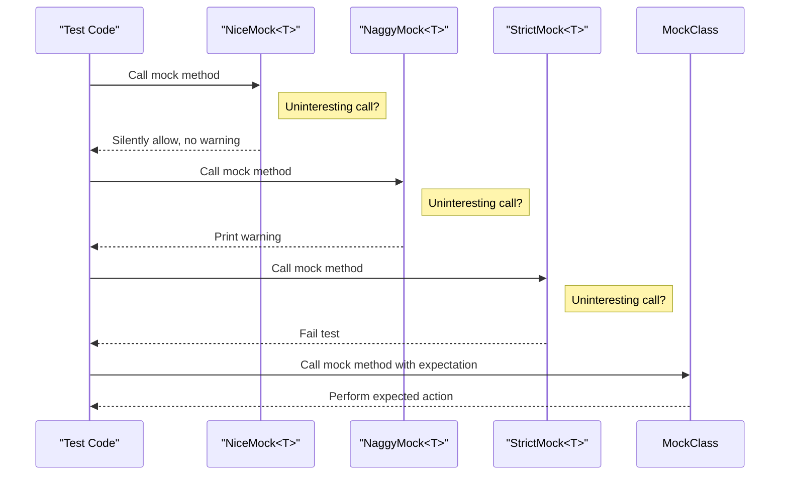

# Mock Strictness Controls

Control how uninteresting method calls are handled using the `NiceMock`, `NaggyMock`, and `StrictMock` wrappers in Google Mock. These wrappers provide a straightforward way to tune the strictness level of your mock objects, helping you balance between clarity and safety in your tests.

---

## Overview

In typical usage, mock objects help verify how your code interacts with dependencies by setting expectations on mock methods. However, not all calls to mock methods need strict verification. Some may be "uninteresting"—calls for which you don't care to set explicit expectations. Google Mock lets you control how such uninteresting calls are handled using different strictness wrappers around your mock classes:

- **`NiceMock<T>`**: Suppresses warnings for uninteresting calls, making tests less noisy.
- **`NaggyMock<T>`**: Prints warnings on uninteresting calls, the default behavior.
- **`StrictMock<T>`**: Treats uninteresting calls as test failures, enforcing strict validation.

These wrappers inherit from your mock class `T`, so you can seamlessly substitute them wherever your mock is used.

## When to Use Different Strictness Controls

Your choice of strictness impacts test clarity, resilience, and debugging:

- Use **`NiceMock`** when you want to **reduce noise** in tests, ignoring uninteresting calls silently without generating warnings or errors.
- Use **`NaggyMock`** for a **balanced approach**, warning you when uninteresting calls occur, which may indicate overlooked expectations.
- Use **`StrictMock`** when you want to **catch all unexpected interactions** immediately, making sure no unanticipated calls go unnoticed.

For most projects, starting with `NiceMock` is recommended for maintainability, switching to `NaggyMock` or `StrictMock` during debugging or for critical modules.

## Usage

### Creating Strictness-Controlled Mocks

Assuming you have a mock class `MockFoo`, you can create different variants as follows:

```cpp
#include <gmock/gmock.h>
using ::testing::NiceMock;
using ::testing::NaggyMock;
using ::testing::StrictMock;

// Raw mock object: default is Naggy (warn on uninteresting calls)
MockFoo raw_foo;

// Nice mock: no warnings on uninteresting calls
NiceMock<MockFoo> nice_foo;

// Naggy mock: warnings on uninteresting calls (same as raw)
NaggyMock<MockFoo> naggy_foo;

// Strict mock: failures on uninteresting calls
StrictMock<MockFoo> strict_foo;
```

`NiceMock<T>`, `NaggyMock<T>`, and `StrictMock<T>` are subclasses of `T`. They preserve the same constructors as `T`, so if your mock class has parameters in constructors, you can forward those accordingly:

```cpp
// Forward constructor arguments
NiceMock<MockFoo> nice_foo(5, "argument");
StrictMock<MockFoo> strict_foo(5, "argument");
```

### Behavior Differences

- **`NiceMock`** allows uninteresting calls silently, so your tests won’t be cluttered by warnings.
- **`NaggyMock`** (current default) warns you about uninteresting calls so you can spot missing or unintended calls.
- **`StrictMock`** fails tests immediately on any uninteresting call, helping enforce strict contracts, but tends to be brittle if your code under test evolves frequently.

### Important Notes

- These wrappers only affect mock methods **defined with the `MOCK_METHOD` macros directly in your mock class**. If your mock methods are inherited from a base class, the strictness modifiers might not apply.
- You cannot nest these wrappers (e.g., `NiceMock<StrictMock<MockFoo>>` is not supported).
- The mocked class should have a **virtual destructor** to avoid issues.

## Example Use Case

Imagine you have a mock interface `MockDatabase` with many methods, but in a particular test, you only want to verify calls to `Connect()`, ignoring other calls.

With a raw or naggy mock, every call to other methods causes warnings if no expectations are set. Using `NiceMock` suppresses these warnings, so your test output focuses only on relevant checks:

```cpp
class MockDatabase {
 public:
  MOCK_METHOD(bool, Connect, (), (override));
  MOCK_METHOD(void, Query, (const std::string&), (override));
};

NiceMock<MockDatabase> db;  // No warnings for uninteresting calls
EXPECT_CALL(db, Connect()).Times(1);

// During test execution
db.Connect();  // Checked

db.Query("SELECT * FROM users");  // Uninteresting, no warning
```

If you switch to `StrictMock<MockDatabase>`, the call to `Query` without expectation would fail the test, forcing you to either set an expectation or avoid the call.

## Internals and How It Works

Under the hood, the strictness wrappers register themselves with Google Mock's internal mechanisms to control the reaction to uninteresting calls:

- `NiceMock` calls `AllowUninterestingCalls`.
- `NaggyMock` calls `WarnUninterestingCalls`.
- `StrictMock` calls `FailUninterestingCalls`.

This registration occurs when the wrapper object is constructed and is deregistered at destruction.

## Best Practices

- **Prefer `NiceMock` in general test code** to reduce noise and maintenance burden.
- Reserve **`StrictMock` for critical scenarios or during focused debugging** to catch unintended interactions.
- Use **`NaggyMock` when you want to get warnings but not immediate failure**, a reasonable middle ground when stabilizing tests.
- When defining mock classes, ensure the destructor is virtual to allow proper cleanup and strictness behavior.
- Do not nest strictness wrappers; stick to one level per mock object.
- Take advantage of strictness controls to make your tests readable and reliably detectable for unexpected method calls.

## Troubleshooting

### Uninteresting Call Warnings Even When Using `ON_CALL`

By design, `ON_CALL` sets default behavior but does not imply expectations. Therefore, even if you specify `ON_CALL` for a method, calls to it without corresponding `EXPECT_CALL` still count as uninteresting and may generate warnings if you use the default `NaggyMock` (or raw mock). Switch to `NiceMock` to suppress such warnings.

### Test Fails on Uninteresting Calls with `StrictMock`

If your test fails unexpectedly due to uninteresting calls, either add explicit expectations with `EXPECT_CALL` for those calls or switch to using `NiceMock` or `NaggyMock` to relax the strictness.

### Strictness Wrappers Not Suppressing or Enforcing Strictness

Ensure that the mock methods you are testing are defined using `MOCK_METHOD` directly within your mock class. Methods inherited from base mock classes may not honor the strictness wrappers.

Also verify the mock class has a virtual destructor.

## Summary

Strictness control is vital in balancing test feedback and usability. Google Mock’s `NiceMock`, `NaggyMock`, and `StrictMock` provide simple, constructor-compatible wrappers that let you manage how uninteresting calls are handled across your tests. By choosing the appropriate strictness wrapper, you gain control over test verbosity and enforcement, aiding robust and maintainable test suites.

---

## See Also

- [gMock Cookbook - The Nice, the Strict, and the Naggy](https://google.github.io/googletest/gmock_cook_book.html#NiceStrictNaggy)
- [Mocking Reference - Strictness Classes](https://google.github.io/googletest/reference/mocking.html#NiceMock)
- [gMock Cheat Sheet](https://google.github.io/googletest/gmock_cheat_sheet.html)
- [gMock for Dummies](https://google.github.io/googletest/gmock_for_dummies.html)

---

## Diagram


