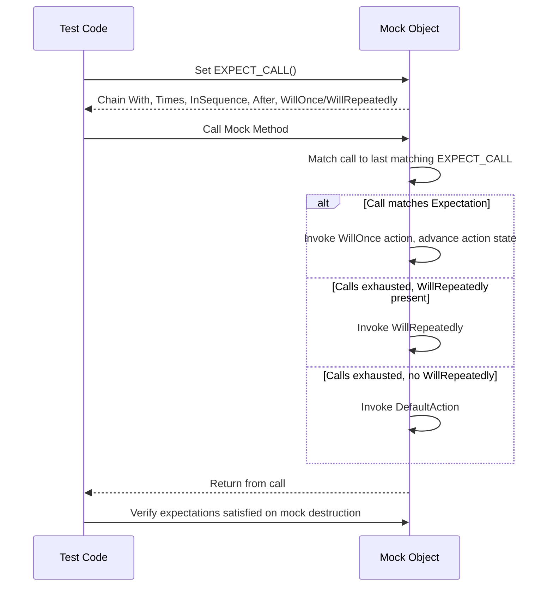

# Actions, Sequences & Advanced Control

This documentation covers the powerful and flexible mechanisms GoogleMock offers for specifying mock object behaviors and expectations beyond basic mocking. It delves into the rich set of action types that decide what mocked methods do when invoked, how to compose multiple actions, configure call cardinalities, and control call ordering and sequencing for precise and maintainable tests.

---

## Overview

When you create mocks with GoogleMock, you want to specify exactly how they behave when their methods are called, and in what order, setting precise expectations on interaction patterns. This guide teaches you how to:

- Define default and specific actions on mock methods using `ON_CALL` and `EXPECT_CALL`
- Chain multiple actions for complex behaviors
- Configure call count expectations with cardinalities such as `Times`, `AtLeast`, `AtMost`, and more
- Control the order of method calls using sequences and partial ordering
- Retire expectations automatically when saturated to avoid spurious failures

Mastering these capabilities lets you build robust, predictable, and expressive tests that document the contract between your code and its dependencies.

---

## Defining Mock Method Behaviors with Actions

Actions specify what a mock method actually does when invoked. They can return computed values, invoke callbacks, mutate arguments, throw exceptions, and more.

### ON_CALL and Default Actions

Use `ON_CALL(mock, method(args))` to specify the *default* behavior of a mock method when called with matching arguments, without setting call count expectations.

```cpp
using ::testing::Return;

ON_CALL(mock_obj, Foo(_))
    .WillByDefault(Return(true));
```

- `.With(multi_argument_matcher)` optionally restricts matching based on all arguments as a tuple.
- `.WillByDefault(action)` **must** be specified exactly once per `ON_CALL`.

> The default action is used whenever no more specific `EXPECT_CALL` matches.

### EXPECT_CALL and Explicit Expectations

Use `EXPECT_CALL(mock, method(args))` to set not only behavior but also expectations on how many times and when the method is called.

```cpp
EXPECT_CALL(mock_obj, Foo(5))
    .Times(2)
    .WillOnce(Return(10))
    .WillRepeatedly(Return(15));
```

- You can chain multiple `WillOnce` calls for sequential behaviors.
- A single optional `WillRepeatedly` action defines behavior after `WillOnce`s are exhausted.

### Built-in Actions

GoogleMock defines various built-in actions:

| Action                  | Description |
|-------------------------|-------------|
| `Return(value)`         | Return a specified value. Evaluated when expectation is set, not at call time.
| `ReturnRef(variable)`   | Return a reference to a variable.
| `ReturnPointee(ptr)`    | Return the value pointed to by a pointer at call time.
| `Invoke(f)`             | Invoke a callable `f` with the mock method's args.
| `SetArgPointee<N>(value)` | Set the `N`th argument's pointee to `value`.
| `DeleteArg<N>()`        | Delete the pointer at the `N`th argument.
| `DoAll(action1, ..., actionN)` | Perform multiple actions in order; the return value is from the last.
| `Throw(exception)`      | Throw an exception when called.

### Composing Actions

Combine multiple side effects or operations with `DoAll()`. For example:

```cpp
EXPECT_CALL(mock, Mutate(_))
    .WillOnce(DoAll(SetArgPointee<0>(5), Return(true)));
```

Here, the first argument's pointee is set to 5, then the method returns `true`.

> Note: The last action in `DoAll` must produce a return value compatible with the mock method's return type.

### Using Any Callable as an Action

You can specify any callable (functions, lambdas, functors) as an action if it matches the method signature or can adapt using helpers like `Invoke()`:

```cpp
EXPECT_CALL(mock, DoWork(_))
    .WillOnce(Invoke([](int x) { return x * 2; }));
```

> Functors passed to `WillOnce()` can be move-only and `&&`-qualified, enabling flexible one-time behaviors.

### Invoking Callable Arguments

If a mock method receives a callback/functor as an argument, you can invoke it using `InvokeArgument<N>(args...)`:

```cpp
EXPECT_CALL(mock, AsyncAction(_,_))
    .WillOnce(InvokeArgument<1>(42));  // Calls the second argument as a callback with value 42
```

For arguments that take references, wrap them using `std::ref()`.

---

## Controlling Call Counts: Cardinalities

Specify how many times a mock method is expected to be called using `.Times(cardinality)`. Some important cardinalities are:

| Cardinality          | Meaning                                                     |
|----------------------|-------------------------------------------------------------|
| `Exactly(n)` or `n`  | Called exactly *n* times.                                    |
| `AnyNumber()`        | Any number of times (including zero).                       |
| `AtLeast(n)`         | At least *n* times.                                         |
| `AtMost(n)`          | At most *n* times.                                          |
| `Between(m, n)`      | Between *m* and *n* times inclusive.                       |

If `.Times()` is omitted, gMock infers it based on `WillOnce` and `WillRepeatedly` clauses:

- No `WillOnce()` nor `WillRepeatedly()` → `Times(1)`
- *n* `WillOnce()`, no `WillRepeatedly()` → `Times(n)`
- *n* `WillOnce()`, one `WillRepeatedly()` → `Times(AtLeast(n))`

You can disallow calls by specifying `.Times(0)`. This marks a method as not expected to be called.

### Sticky Expectations & Retirement

Expectations are "sticky" by default, meaning they remain active even after being saturated (i.e., the expected number of calls are made), causing additional calls that match it to fail.

To avoid this, use `.RetiresOnSaturation()` to make an expectation retire once its upper bound is reached:

```cpp
EXPECT_CALL(mock, GetValue())
    .Times(2)
    .RetiresOnSaturation();
```

This allows subsequent calls to match other expectations or defaults.

---

## Ordering Calls: Sequences and Partial Ordering

Sometimes the order of mock calls matters. GoogleMock allows you to specify strict or partial order constraints.

### Complete Order with `InSequence`

Wrap expectations in an `InSequence` object to enforce strict sequential ordering:

```cpp
{
  ::testing::InSequence seq;

  EXPECT_CALL(mock, Start());
  EXPECT_CALL(mock, Process());
  EXPECT_CALL(mock, End());
}
```

Calls must happen in this order or the test will fail.

### Sequencing with `Sequence` Objects

For more flexible partial orderings, you can define one or multiple `Sequence` objects and assign expectations to them:

```cpp
using ::testing::Sequence;
Sequence s1, s2;

EXPECT_CALL(mock, Init())
  .InSequence(s1, s2);
EXPECT_CALL(mock, Update())
  .InSequence(s1);
EXPECT_CALL(mock, Finish())
  .InSequence(s2);
```

This models the order constraints:

- `Init()` must precede both `Update()` and `Finish()`.
- `Update()` and `Finish()` may happen in any order relative to each other but after `Init()`.

### Partial Ordering with `After`

Specify that a call must occur after specific expectations or sets of expectations:

```cpp
Expectation e1 = EXPECT_CALL(mock, Connect());
EXPECT_CALL(mock, SendData()).After(e1);
```

Multiple `.After()` calls can be chained and combined with `ExpectationSet` for complex prerequisite conditions.

### Combining Ordering Clauses

Ordering methods (`InSequence` and `After`) can be combined to describe rich interaction patterns. The order of clauses matters, e.g. `.Times()` must come before `.InSequence()`, and `.After()` clauses must come before `.WillOnce()` clauses.

---

## Examples

### Specifying Multiple Returns Over Multiple Calls

```cpp
EXPECT_CALL(mock, GetNumber())
    .WillOnce(Return(1))
    .WillOnce(Return(2))
    .WillOnce(Return(3));
```

This expects `GetNumber()` to be called 3 times, returning 1, then 2, then 3 respectively.

### Defining Default Behavior with ON_CALL

```cpp
ON_CALL(mock, IsReady())
    .WillByDefault(Return(true));
```

Whenever `IsReady()` is called and no overriding `EXPECT_CALL` applies, it will return `true`.

### Sequencing Calls

```cpp
Sequence seq;
EXPECT_CALL(mock, Initialize())
    .InSequence(seq);
EXPECT_CALL(mock, Execute())
    .InSequence(seq);
EXPECT_CALL(mock, Cleanup())
    .InSequence(seq);
```

Calls must occur in the order Initialize → Execute → Cleanup.

### Composite Actions

```cpp
EXPECT_CALL(mock, Update(_))
    .WillOnce(DoAll(SetArgPointee<0>(42), Return(true)));
```

Sets the output argument to 42, then returns true.

### Using InvokeArgument to Call a Callback

```cpp
EXPECT_CALL(mock, AsyncOperation(_, _))
    .WillOnce(InvokeArgument<1>(true));
```

Invokes the second argument, which is expected to be a callback, with `true`.

---

## Troubleshooting and Best Practices

- Always specify `.WillByDefault` with `ON_CALL`; it must appear exactly once.
- Specify expectations before invoking mock methods; changing expectations after calls leads to undefined behavior.
- Use `.RetiresOnSaturation()` to make expectations retire automatically and prevent upper bound violations.
- Leverage sequences and `.After()` to clearly document interactions' order without brittle tests.
- Use catch-all `.Times(AnyNumber())` expectations with care to avoid masking unexpected calls.
- Use `--gmock_verbose=info` to get detailed traces of matched expectations and calls for debugging.

---

## Additional References

- [Mocking Reference](mocking-basics) for basics on defining mocks
- [Matchers Reference](builtin-matchers) for matching function arguments
- [Actions Reference](actions) for detailed action types
- [gMock Cookbook](gmock_cook_book) for advanced usage patterns

---

## Mermaid Diagram: Interaction Between Expectation Clauses



---