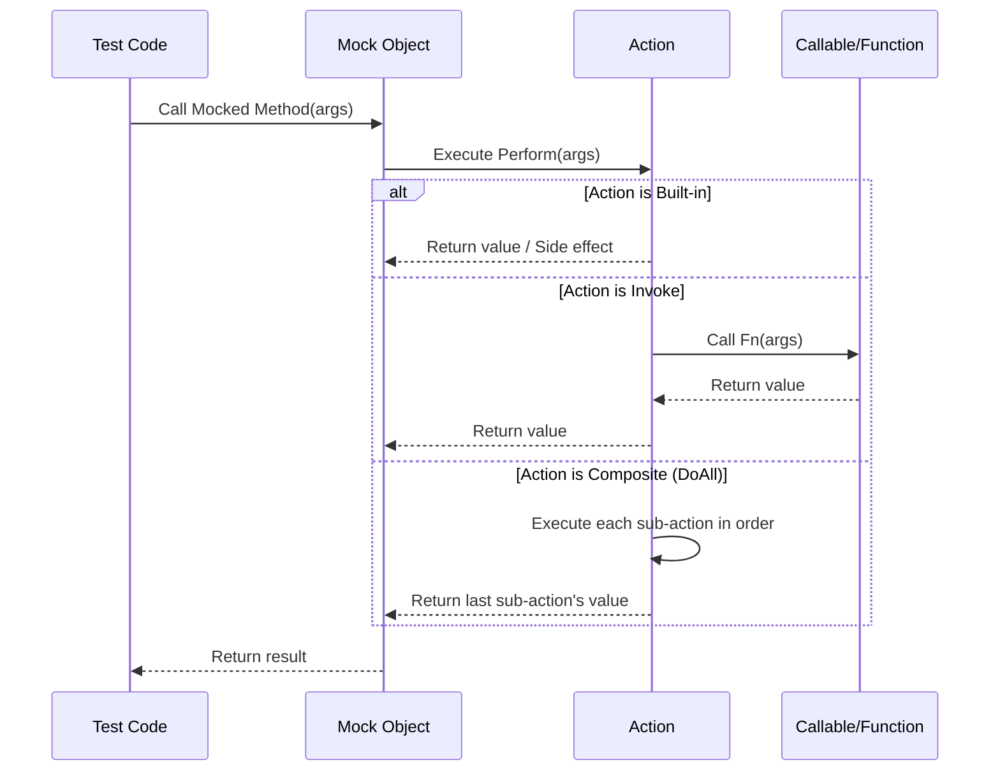

# Actions, Return Values, and Invocation Control

This reference document provides an in-depth guide to the **actions and behavior APIs** within GoogleMock, the mocking framework used alongside GoogleTest. Actions enable you to precisely specify what a mock function should do when invoked—including returning values, causing side effects, invoking callbacks, or custom behavior. This page details built-in actions, how to combine them, create your own actions, and control invocation in user-friendly ways.

---

## Overview of Actions

In GoogleMock, an *action* defines the behavior of a mock function when it is called during a test. They answer the question: _What should the mocked method do when invoked with certain arguments?_ Actions include returning specific values, performing side effects, calling other functions, throwing exceptions, and more.

All built-in actions live in the `::testing` namespace, and actions can be set in expectations using `.WillOnce(action)`, `.WillRepeatedly(action)`, or as default behaviors using `ON_CALL(...).WillByDefault(action)`.


---

## Returning Values

GoogleMock offers a variety of actions to specify return values from mock functions:

| Action                       | Description                                                                                                   |
|-----------------------------|---------------------------------------------------------------------------------------------------------------|
| `Return()`                  | Return from a `void` mock function (no value).                                                                |
| `Return(value)`             | Return the specified `value`. The value is converted to the mock function's return type at expectation set time. |
| `ReturnArg<N>()`            | Return the N-th argument passed to the mock function (zero-based index).                                      |
| `ReturnNew<T>(a1, ..., ak)` | Return a newly created `T` instance constructed with the specified arguments. A new object is created each call. |
| `ReturnNull()`              | Return a null pointer.                                                                                         |
| `ReturnPointee(ptr)`        | Return the value pointed to by pointer `ptr`.                                                                |
| `ReturnRef(variable)`       | Return a reference to the specified `variable`.
| `ReturnRefOfCopy(value)`    | Return a reference to a copy of `value`. The copy lives as long as the action.
| `ReturnRoundRobin({a1,...})`| Cycle through multiple return values, on successive calls returns the next value in the list, looping back as needed.

### Usage Examples

```cpp
using ::testing::Return;
using ::testing::ReturnRef;

class MockFoo : public Foo {
 public:
  MOCK_METHOD(int, GetValue, (), (const, override));
  MOCK_METHOD(const Bar&, GetBar, (), (override));
};

MockFoo mock;
Bar bar_instance;

EXPECT_CALL(mock, GetValue())
    .WillOnce(Return(42));  // Return 42 when called
EXPECT_CALL(mock, GetBar())
    .WillOnce(ReturnRef(bar_instance));  // Return reference to bar_instance

int val = mock.GetValue();  // val == 42
const Bar& bar = mock.GetBar();
```

---

## Side Effects and Argument Manipulation

Actions can also perform *side effects* on mocking arguments or global state:

| Action                           | Description                                             |
|---------------------------------|---------------------------------------------------------|
| `Assign(&variable, value)`       | Assign `value` to `variable`.                            |
| `DeleteArg<N>()`                 | Delete the N-th argument of the mock function, which must be a pointer. |
| `SaveArg<N>(pointer)`            | Save the N-th argument to `*pointer` via copy-assignment. |
| `SaveArgByMove<N>(pointer)`      | Move-assign the N-th argument to `*pointer`.             |
| `SaveArgPointee<N>(pointer)`     | Save the value pointed to by the N-th pointer argument to `*pointer`. |
| `SetArgReferee<N>(value)`       | Assign `value` to the reference referenced by the N-th argument. |
| `SetArgPointee<N>(value)`       | Assign `value` to the object pointed to by the N-th argument. |
| `SetArrayArgument<N>(first,last)`| Copy elements from range `[first, last)` to the array pointed to by the N-th argument. |
| `SetErrnoAndReturn(error,value)`| Set `errno` to `error` and return `value`.               |
| `Throw(exception)`               | Throw the specified exception object.

### Example: Modifying Output Arguments

```cpp
using ::testing::SetArgPointee;
using ::testing::Return;

class MockWriter {
 public:
  MOCK_METHOD(bool, Write, (int* out_value), (override));
};

MockWriter mock_writer;
EXPECT_CALL(mock_writer, Write(_))
    .WillOnce(DoAll(SetArgPointee<0>(123), Return(true)));

int val = 0;
bool result = mock_writer.Write(&val);
// val == 123, result == true
```

---

## Using Callables as Actions

Sometimes you want your mock method to invoke a custom function, functor, or lambda rather than perform fixed built-in behaviors. GoogleMock provides flexible ways to do this.

| Action                                     | Description                                                                                         |
|-------------------------------------------|---------------------------------------------------------------------------------------------------|
| `f`                                       | Use a callable `f` that will be invoked with the mock function’s arguments.                        |
| `Invoke(f)`                               | Invoke a global/static function or functor `f` with the mock arguments.                            |
| `Invoke(object_pointer, &Class::method)` | Invoke a specific method on an object. Arguments are forwarded from the mock call.                 |
| `InvokeWithoutArgs(f)`                     | Call `f` with *no* arguments whenever the mock method is invoked.                                 |
| `InvokeWithoutArgs(object_pointer, &method)`| Invoke the method on the object taking no arguments.                                              |
| `InvokeArgument<N>(args...)`              | Invoke the N-th argument of the mock function, which must be callable, with specified arguments.  |

**Key details:**
- Arguments passed to `InvokeArgument` are copied by default. To pass by reference, use `std::ref()`.
- The return value of the invoked callable (except for `InvokeArgument`) becomes the mock method’s return value.
- `Invoke` and `InvokeWithoutArgs` take ownership of their callable callbacks and require them to be permanent.

### Example: Using Lambdas and Member Functions

```cpp
using ::testing::Invoke;

class Helper {
 public:
  int Compute(int x, int y) { return x + y; }
};

Helper helper;

EXPECT_CALL(mock, Sum(_, _))
    .WillOnce(Invoke(&helper, &Helper::Compute));

EXPECT_CALL(mock, IsReady())
    .WillOnce(Invoke([]() { return true; }));
```

---

## Default Actions

GoogleMock automatically provides default actions for mock methods:
- For `void` methods, it just returns.
- For `bool`, returns `false`.
- For numeric types or pointers, returns zero or null pointers.
- For types with a default constructor, returns a default-constructed value.

You can override the default action for a specific method either per-method using `ON_CALL()` or per-type using `DefaultValue<T>`.

`DoDefault()` can be used inside `EXPECT_CALL()` to perform the default action, which may be an `ON_CALL`-specified or built-in action.

<Tip>
`DoDefault()` cannot be used inside composite actions; trying to do so results in runtime errors.
</Tip>

---

## Composite Actions

You may have complex requirements that need multiple actions performed in sequence on the same invocation.

| Action                              | Description                                                                                     |
|------------------------------------|------------------------------------------------------------------------------------------------|
| `DoAll(a1, a2, ..., an)`           | Perform all listed actions in order for each call; the return value of the last action is used. |
| `IgnoreResult(a)`                  | Perform action `a` but ignore its return value. Useful when `a` returns a value but the mock method is `void`.
|
| `WithArg<N>(a)`                   | Invokes action `a` with the N-th argument of the mock function.                                 |
| `WithArgs<N1, N2, ..., Nk>(a)`    | Invokes action `a` with selected arguments.                                                     |
| `WithoutArgs(a)`                  | Runs action `a` without forwarding any arguments from the mock call.                            |

### Example: Multiple Side Effects

```cpp
EXPECT_CALL(mock, Foo(_))
    .WillOnce(DoAll(SetArgPointee<0>(42), Return(true)));
```

This makes `mock.Foo()` assign 42 to argument 0 and then return `true`.

---

## Defining Custom Actions

When built-in actions don’t suffice, define your own actions.

### Using ACTION Macros

Define an action called `Sum` which returns the sum of the first two mock arguments:

```cpp
ACTION(Sum) {
  return arg0 + arg1;
}

EXPECT_CALL(mock, Add(_, _)).WillOnce(Sum());
```

You can also define parameterized actions:

```cpp
ACTION_P(Plus, n) {
  return arg0 + n;
}

EXPECT_CALL(mock, Add(_)).WillOnce(Plus(5));  // Adds 5 to arg0
```

And actions with multiple parameters:

```cpp
ACTION_P2(MultAdd, mul, add) {
  return arg0 * mul + add;
}
```

### Implementing Action Interfaces

Alternatively, implement `::testing::ActionInterface<F>` to define the `Perform()` method templated on return and argument types. Wrap your class with `MakeAction()` to create an action.

### Polymorphic Actions

To create actions usable with multiple function signatures (polymorphic actions), implement a class with a templated `Perform<Result, ArgsTuple>(args)` and wrap it with `MakePolymorphicAction()`.

---

## Using Action Utilities

- Wrap uninteresting arguments in actions with `Unused`.
- Use `IgnoreResult()` when you want to discard an action’s return value.
- Chain side effects with `DoAll()`.
- Choose the right cardinalities (`Times`, `AtLeast`, `Exactly`, etc.) for call frequency.

---

## Troubleshooting & Best Practices

- Always set expectations before exercising the code to avoid undefined behavior.
- For mock methods with overloaded versions, disambiguate the overload using typing helpers like `Const()` or explicit matcher casting.
- Avoid sharing action objects that hold state between expectations unless intended.
- Use the `Invoke` family of actions to bind existing functions, methods, or lambdas directly to mock invocation.
- Use the `ReturnPointee` action to return live values instead of copies.

---

## Summary

This page details the core machinery of GoogleMock's actions API, enabling you to specify what a mock function does when called, including returning values, triggering side effects, invoking external code, and defining custom behaviors. Mastery of the actions API helps in creating expressive, precise, and maintainable mock behaviors in tests.

---

## See Also

- [Mocking Reference](reference/mocking.md) — defines mocks and expectations
- [Expectations & Sequences](reference/mocking-apis/expectations-sequences.md) — control when & how mocks are called
- [Matchers Reference](reference/matchers.md) — for argument constraints
- [gMock Cookbook](gmock_cook_book.md) — recipes for advanced mocking
- [gMock Cheat Sheet](gmock_cheat_sheet.md) — quick syntax guide

---

## Diagram: Action Invocation Flow


