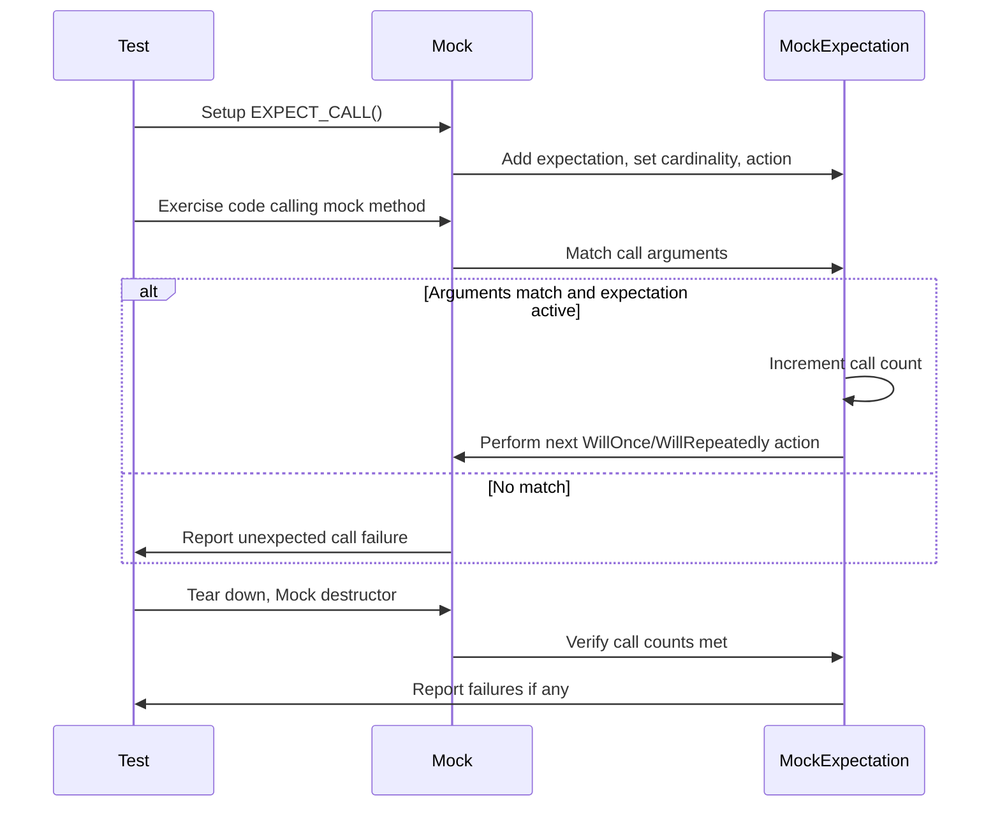

# Call Expectations & Sequences

This reference explains how to specify **expected mock function calls** using `EXPECT_CALL` and how to set **default behaviors** with `ON_CALL` in GoogleMock. It details setting call order, cardinalities, action sequencing, and how to diagnose common failures in mock expectations.

---

## Overview

Mock objects in GoogleMock enable precise control over how your code interacts with dependencies. To harness this power, you specify:

- **Default behavior** using `ON_CALL` without enforcing that the call must happen.
- **Expectations** using `EXPECT_CALL`, which specify **how many times**, **with which arguments**, and **in what order** functions should be called.

This page focuses specifically on:

- Writing clear, correct `ON_CALL` and `EXPECT_CALL` statements
- Setting **call cardinalities** (how many times a call is allowed or required)
- Defining **call order** and **sequencing** using `InSequence` and `After`
- Handling **action sequences**, including `WillOnce` and `WillRepeatedly`
- Understanding how GoogleMock matches expectations and reports failures


## Using `ON_CALL` to Set Default Actions

Use `ON_CALL` to define the default behavior of a mock method when it is invoked with matching arguments. It specifies *what happens* but not *how many times* the method is expected to be called.

### Syntax

```cpp
ON_CALL(mock_object, Method(matchers...))
    .With(multi_argument_matcher)  // optional
    .WillByDefault(action);        // required
```

- `matchers...` specify which calls this default applies to (defaults to all if omitted).
- `.With()` can further restrict matching by composing a matcher over *all* arguments as a tuple.
- `.WillByDefault()` provides the **default action** when the call matches.

### Example

```cpp
using ::testing::_;        // wildcard matcher
using ::testing::Lt;       // less-than matcher
using ::testing::Return;

ON_CALL(my_mock, SetPosition(_, _))
    .With(Lt())              // first arg less than second arg
    .WillByDefault(Return(true));
```

**Note:** Order matters — the last matching `ON_CALL` takes precedence over earlier ones.

<Check>
Make sure to always call `.WillByDefault()` exactly once per `ON_CALL` statement. Forgetting it results in runtime errors.
</Check>


## Using `EXPECT_CALL` to Set Expectations

`EXPECT_CALL` sets an explicit *expectation* that a call **will happen** during the test with arguments matching the given matchers.

### Syntax

```cpp
EXPECT_CALL(mock_object, Method(matchers...))
    .With(multi_argument_matcher)  // optional, must be first clause
    .Times(cardinality)            // optional
    .InSequence(sequences...)      // optional, any number
    .After(expectations...)        // optional, any number
    .WillOnce(action)              // optional, any number
    .WillRepeatedly(action)        // optional, at most once
    .RetiresOnSaturation();        // optional, at most once
```

### Components Explained

| Clause              | Purpose/Effect |
|---------------------|---------------|
| `.With()`           | Further restricts calls by matching *all* args as a tuple; must be first
| `.Times()`          | Specifies how many times call is expected. See **Cardinalities** below.
| `.InSequence()`     | Specifies the call must appear in one or more sequences for ordering
| `.After()`          | Specifies that this call happens *after* other specified expectations
| `.WillOnce()`       | Specifies the action to perform on *one* matching call (can chain multiple)
| `.WillRepeatedly()` | Action for all calls after all `.WillOnce()` calls are used
| `.RetiresOnSaturation()` | Deactivates expectation once its cardinality upper bound is reached.


### Example

```cpp
using ::testing::Sequence;
using ::testing::Return;

Sequence s;
EXPECT_CALL(my_mock, Connect())
    .Times(1)
    .InSequence(s)
    .WillOnce(Return(true));
EXPECT_CALL(my_mock, Disconnect())
    .Times(1)
    .InSequence(s)
    .WillOnce(Return(true));

// Connect() must be called before Disconnect()
```


### Understanding **Call Cardinality** in `Times`

Cardinality controls how many times a mock method call is expected.

If omitted, GoogleMock infers it from how many `WillOnce`/`WillRepeatedly` clauses are specified:
- If no `WillOnce` or `WillRepeatedly`: inferred as `Exactly(1)`
- If `n` `WillOnce` clauses and no `WillRepeatedly`: inferred `Times(n)`
- If `n` `WillOnce` and one `WillRepeatedly`: inferred `Times(AtLeast(n))`

| Cardinality           | Meaning                                      |
|----------------------|----------------------------------------------|
| `AnyNumber()`         | Call can happen any number of times          |
| `AtLeast(n)`          | At least `n` times                           |
| `AtMost(n)`           | At most `n` times                            |
| `Between(m, n)`       | Between `m` and `n` times (inclusive)       |
| `Exactly(n)` or `n`   | Exactly `n` times (0 means the call should never happen) |


## Sequencing Expectations

In complex tests, the order of method calls may matter. GoogleMock lets you enforce order with two mechanisms:

### `InSequence` Object

Placing `EXPECT_CALL` inside the scope of an `InSequence` enforces that the calls occur in the order declared.

```cpp
{
  InSequence seq;
  EXPECT_CALL(mock, First());
  EXPECT_CALL(mock, Second());
  EXPECT_CALL(mock, Third());
}

// Calls must occur in: First() -> Second() -> Third()
```

**Tip:** Multiple `InSequence` blocks can be used independently for unrelated sequences.

### `.InSequence()` Clause

Alternatively, you can add expectations to one or more named sequences. Calls within a sequence must occur in declaration order.

```cpp
Sequence s1, s2;
EXPECT_CALL(mock, Init()).InSequence(s1, s2);
EXPECT_CALL(mock, Step1()).InSequence(s1);
EXPECT_CALL(mock, Step2()).InSequence(s2);
```

This specifies a partial ordering DAG where `Init()` must happen before both steps, but `Step1()` and `Step2()` can happen independently.

### `.After()` Clause

For more complex ordering and partial ordering, use `.After()` to specify one or more pre-requisite expectations or sets.

```cpp
Expectation e1 = EXPECT_CALL(mock, Init());
EXPECT_CALL(mock, Run()).After(e1);
```

The `Run()` call may only occur after `Init()`.

**Note:** `.After()` and `.InSequence()` cannot be mixed in the same expectation in a conflicting order.


## Defining Actions: `WillOnce`, `WillRepeatedly`, and `WillByDefault`

### `WillOnce(action)`

Specifies the action to take for a *single* invocation. Multiple `WillOnce`s chain the actions in order.

```cpp
EXPECT_CALL(mock, GetValue())
    .WillOnce(Return(1))
    .WillOnce(Return(2));

// First call returns 1, second call returns 2
```

### `WillRepeatedly(action)`

Specifies an action for *all subsequent calls* after those matched by `WillOnce()`.

```cpp
EXPECT_CALL(mock, GetValue())
    .WillOnce(Return(1))
    .WillRepeatedly(Return(2));

// 1st call returns 1, all calls thereafter return 2
```

### `WillByDefault(action)`

Used with `ON_CALL`, specifies the default action when no `EXPECT_CALL` matches.


## Default Cardinality and Action Warnings

- GoogleMock warns if the number of `WillOnce` actions differs from the expected cardinality.
- If calls exceed expected cardinality, the call is treated as **excessive** and causes failures or default action invocation.
- If calls are fewer than expected, failures are reported on mock verification.
- Default cardinality is `Times(1)` if unspecified.


## Diagnosing Expectation Issues

The framework produces detailed failure messages including:

- Calls with arguments that don't match any expectation.
- Calls exceeding specified cardinality.
- Expectations that were never satisfied.
- Calls made out of specified order.

Turning on `--gmock_verbose=info` will print detailed traces of calls and matching expectations.


## Example: Using Sequences and Expectations Together

```cpp
using ::testing::InSequence;
using ::testing::Return;

class MockFoo {
 public:
  MOCK_METHOD(int, GetNumber, (), ());
};

TEST(SequenceTest, OrderedCalls) {
  MockFoo foo;

  {
    InSequence seq;

    EXPECT_CALL(foo, GetNumber())
        .WillOnce(Return(10))
        .RetiresOnSaturation();
    EXPECT_CALL(foo, GetNumber())
        .WillOnce(Return(20))
        .RetiresOnSaturation();
  }

  EXPECT_EQ(foo.GetNumber(), 10); // Must be first
  EXPECT_EQ(foo.GetNumber(), 20); // Must be second
}
```

This test requires `GetNumber()` to be called twice in this order, returning 10 then 20.


## Tips & Best Practices

- Use `ON_CALL` to specify default behaviors for mock methods when you don't care about call count.
- Use `EXPECT_CALL` to specify calls you want to verify.
- **Order of expectations matters:** the last added matching expectation overrides earlier ones.
- To enforce call order, use `InSequence` or explicitly declare sequences.
- Use `.Times(0)` to assert that a function should never be called.
- Use `.RetiresOnSaturation()` to automatically retire expectations once satisfied, useful when using sequences or multiple `WillOnce()` calls.
- Avoid specifying `EXPECT_CALL` after the mock method has been called: gMock's behavior is undefined in this case.
- When you need to verify mock expectations early, use `Mock::VerifyAndClearExpectations(&mock)`.


## Common Pitfalls

- **Missing `WillByDefault()` in `ON_CALL`**: leads to runtime failures as default action is not set.

- **Multiple `.With()` or `.Times()` in one `EXPECT_CALL` or `ON_CALL`**: GoogleMock flags this as a misuse.

- **Calling mock methods more times than allowed**: causes failures, unless you have specified `Times(AnyNumber())`.

- **Using `EXPECT_CALL` without argument matchers on overloaded methods**: ambiguous, causes compile errors.

- **Uninteresting vs Unexpected Calls**:
  - Uninteresting: mock method has no expectation, call is allowed but may produce warning.
  - Unexpected: a call does not match any specified expectation; always an error.


## Verifying and Clearing Expectations

GoogleMock automatically verifies expectations on mock destruction, but you can force verification:

```cpp
bool ok = Mock::VerifyAndClearExpectations(&mock_obj);
```

To also clear default actions (from `ON_CALL`), use:

```cpp
bool ok = Mock::VerifyAndClear(&mock_obj);
```


## Visualization of Typical Expectation Flow



---

## References

- [`ON_CALL` documentation](#ON_CALL)
- [`EXPECT_CALL` and modifiers](#EXPECT_CALL)
- [gMock Cheat Sheet](https://github.com/google/googletest/blob/main/docs/gmock_cheat_sheet.md)
- [Mocking Reference](https://github.com/google/googletest/blob/main/docs/reference/mocking.md)
- [Matchers Reference](https://github.com/google/googletest/blob/main/docs/api-reference/core-apis/matchers.md)
- [Actions Reference](https://github.com/google/googletest/blob/main/docs/api-reference/mocking-apis/mock-actions.md)
- [gMock Cookbook](https://github.com/google/googletest/blob/main/docs/gmock_cook_book.md)

---

## See Also

- [Mock Method Definitions](https://github.com/google/googletest/blob/main/docs/api-reference/mocking-apis/mock-methods.md)
- [Test Assertions Reference](https://github.com/google/googletest/blob/main/docs/api-reference/core-apis/test-assertions.md)
- [Matchers Overview](https://github.com/google/googletest/blob/main/docs/api-reference/core-apis/matchers.md)
- [Using `InSequence` for ordered calls](https://github.com/google/googletest/blob/main/docs/gmock_cook_book.md#ordered-calls)


---

## Troubleshooting

- **Failure: "Uninteresting mock function call" warning**
  - You likely called a mock method without an expectation (`EXPECT_CALL`). Set `EXPECT_CALL` with `Times(AnyNumber())` or use a `NiceMock` to suppress warnings.

- **Failure: "Unexpected mock function call"**
  - Check your expectations and argument matchers; ensure all expected calls are declared before exercising code.

- **Failure: Calls made out of order**
  - Use `InSequence` or `.After()` clauses to set call order dependencies explicitly.

- **Failure: "Mock function called more times than expected"**
  - Verify the `Times()` clause matches actual usages. Consider relaxing with `AtLeast` or `AnyNumber` if needed.

- **Ensure** not to mix `EXPECT_CALL` and method calls in unpredictable orders to avoid undefined behavior.

---