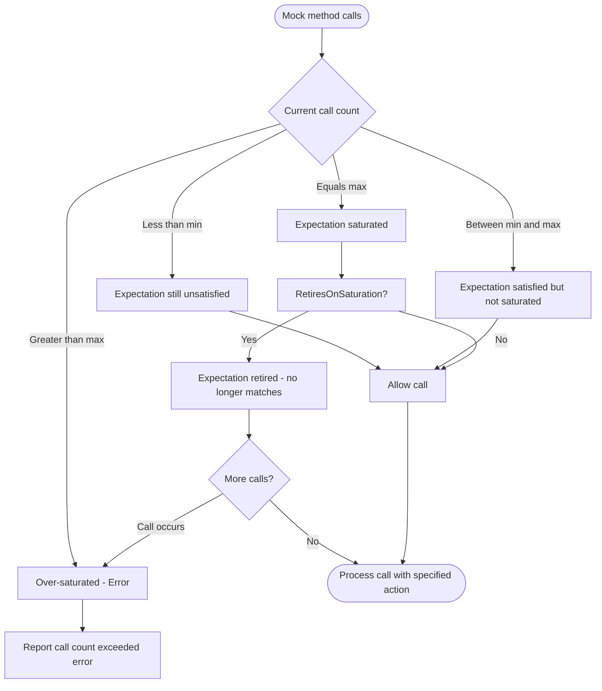

# Expectations and Cardinalities

This documentation describes how to precisely control and verify how many times mock methods are expected to be called in GoogleMock. It introduces cardinality objects and expectation specifiers which allow you to express exact and fuzzy constraints for function call counts in your tests. Understanding this is critical for writing robust and maintainable mocked interactions.

---

## 1. Understanding Cardinalities

Cardinalities specify the number of times a mock method is expected to be called. They serve as constraints for your expectations via the `.Times()` clause in `EXPECT_CALL()`.

The framework provides several built-in cardinalities, giving you flexible control over call counts:

| Cardinality     | Description                                               | Usage Example                   |
|-----------------|-----------------------------------------------------------|--------------------------------|
| `AnyNumber()`   | The mock method can be called any number of times.        | `.Times(AnyNumber())`           |
| `AtLeast(n)`    | Called at least `n` times (including more than `n`).      | `.Times(AtLeast(3))`            |
| `AtMost(n)`     | Called at most `n` times (including fewer than `n`).     | `.Times(AtMost(5))`             |
| `Between(m,n)`  | Called between `m` and `n` times inclusive.               | `.Times(Between(2, 4))`         |
| `Exactly(n)`    | Called exactly `n` times. Equivalent to `Between(n,n)`.    | `.Times(Exactly(1))` or `.Times(1)` |

### Practical Examples
```cpp
EXPECT_CALL(mock, Foo())
    .Times(Exactly(3));  // Expect Foo() to be called exactly 3 times

EXPECT_CALL(mock, Bar(_))
    .Times(AtLeast(1));  // Expect Bar() to be called at least once

EXPECT_CALL(mock, Baz())
    .Times(AnyNumber()); // Expect Baz() to be called any number of times
```

### Behavior Details
- Cardinalities are immutable objects specifying call count constraints.
- The default cardinality is `Times(1)` if none is specified.
- Cardinalities influence when expectations are considered satisfied or saturated:
  - *Satisfied*: Call count meets the minimum required.
  - *Saturated*: Call count has reached the maximum allowed.
  - *Over-saturated*: Call count exceeds the maximum allowed (error).

### Custom Cardinalities
You can define your own cardinality by implementing the `CardinalityInterface` and wrapping it with a `Cardinality` object. This enables scenarios like "call an even number of times" or any domain-specific call count rules.

```cpp
class EvenNumberCardinality : public CardinalityInterface {
 public:
  bool IsSatisfiedByCallCount(int count) const override { return count % 2 == 0; }
  bool IsSaturatedByCallCount(int count) const override { return false; }
  void DescribeTo(std::ostream* os) const override { *os << "called even number of times"; }
};

Cardinality EvenNumber() {
  return Cardinality(new EvenNumberCardinality);
}

EXPECT_CALL(mock, Foo()).Times(EvenNumber());
```

---

## 2. Using Cardinalities in Expectations

Use cardinalities in the `.Times()` clause of `EXPECT_CALL()` to define how many times a mock method is expected to be called with matching arguments.

### Syntax
```cpp
EXPECT_CALL(mock_object, Method(matchers...))
    .Times(cardinality)
    .WillOnce(...)
    .WillRepeatedly(...);
```
- `.Times(cardinality)` can appear at most once per expectation.
- If `.Times()` is omitted, cardinality is inferred from the provided actions (`WillOnce`, `WillRepeatedly`).

### Cardinality Inference Rules
- No `.Times()`, no `WillRepeatedly()`, and n `WillOnce()` calls:
  - Cardinality inferred as `n` calls.
  - If no `WillOnce()`, default cardinality is 1.
- With `.WillRepeatedly()` specified and n `WillOnce()` calls:
  - Cardinality inferred as `AtLeast(n)` calls.

### Example
```cpp
EXPECT_CALL(mock, GetValue())  // inferred Times(1)
    .WillOnce(Return(42));

EXPECT_CALL(mock, GetValue())
    .WillOnce(Return(10))
    .WillOnce(Return(20));  // inferred Times(2)

EXPECT_CALL(mock, GetValue())
    .WillOnce(Return(1))
    .WillRepeatedly(Return(2));  // inferred Times(AtLeast(1))
```

### Common Pitfalls
- Expecting a finite number of calls but getting called more leads to a test failure.
- If `WillOnce()` actions are fewer than the declared cardinality, subsequent calls perform the default action.
- Using sticky expectations (default) means they remain active even after saturation, possibly causing unexpected call errors.
- Use `.RetiresOnSaturation()` to make expectations retire (become inactive) after achieving the upper bound, allowing more calls to match other expectations.

---

## 3. Expectation Specifiers and Call Ordering

GoogleMock provides ways to control when expectations are considered active, and the order in which method calls can occur.

### .RetiresOnSaturation()
Makes the expectation inactive after it becomes saturated, preventing it from matching further calls.

```cpp
EXPECT_CALL(mock, SetNumber(7))
    .Times(2)
    .RetiresOnSaturation();
```
The first two calls to `SetNumber(7)` match this expectation, which retires afterwards. Subsequent calls to `SetNumber(7)` will match other expectations if any.

### Sequences and Partial Orders
- Use `Sequence` objects with `.InSequence()` clause to enforce ordered calls.
- Use `.After()` clause or `InSequence` objects to specify partial ordering constraints between expectations.

Example of strict sequence:
```cpp
Sequence s;
EXPECT_CALL(mock, First()).InSequence(s);
EXPECT_CALL(mock, Second()).InSequence(s);
```
Expected call order is `First()` then `Second()`.

Example with partial order using `.After()`:
```cpp
Expectation e1 = EXPECT_CALL(mock, Init());
EXPECT_CALL(mock, Process()).After(e1);
```
`Process()` must be called after `Init()`.

---

## 4. Common Pitfalls and Best Practices

### Sticky Expectations
Expectations remain active even after reaching their upper call bound by default, which can cause "too many calls" errors if the mock method is called more times.

**Best Practice:** Use `.RetiresOnSaturation()` or sequences to avoid sticky expectation issues.

### Uninteresting vs Unexpected Calls
- **Uninteresting calls:** Methods invoked without any expectations set. Generates warnings by default.
- **Unexpected calls:** Calls that do not match any active expectation. These are errors.

Use `NiceMock` to suppress warnings for uninteresting calls, `NaggyMock` (default) to get warnings, and `StrictMock` to treat uninteresting calls as errors.

### Overly Strict Expectations
Avoid over-specification of arguments and call counts. Use matchers like `_` for arguments you don’t care about and fuzzy cardinalities like `AtLeast` or `AnyNumber` where appropriate.

### Setting Expectations Before Exercising Code
Always set expectations (`EXPECT_CALL`) before invoking code that triggers those calls to ensure proper verification and failure reporting.

---

## 5. Troubleshooting Guidance

- **Too few actions specified warning:** When you specify fewer `WillOnce()` actions than expected calls by cardinality.

- **Actions ran out warning:** When `WillOnce()` actions are exhausted and no `WillRepeatedly()` is specified for further calls.

- **Unexpected mock function call:** When a call arrives that does not match any active expectation.

- **Mock function called more times than expected:** When a call exceeds the maximum allowed by cardinality and no other expectation allows it.

- **Retired expectation mismatch:** Calling a mock method that matches an expectation but that expectation is retired due to sequencing.

- Use the `--gmock_verbose=info` flag to get detailed logging of call matching, expectation invocation, and stack traces, which helps diagnose matching issues.

- Remember to verify and clear expectations with `Mock::VerifyAndClearExpectations(&mock_obj)` in tests where you manually manage mock object lifetime.

---

## 6. API Usage Summary

### Cardinality Factory Functions
```cpp
Cardinality AtLeast(int n);
Cardinality AtMost(int n);
Cardinality AnyNumber();
Cardinality Between(int min, int max);
Cardinality Exactly(int n);
```

### Setting Call Expectations
```cpp
EXPECT_CALL(mock_obj, Method(args...))
    .Times(AtLeast(1))
    .WillOnce(Return(...))
    .WillRepeatedly(Return(...))
    .RetiresOnSaturation();
```

### Example
```cpp
using ::testing::AtLeast;
using ::testing::Return;

MockFoo foo;
EXPECT_CALL(foo, Bar(_))
    .Times(AtLeast(2))
    .WillOnce(Return(10))
    .WillOnce(Return(20))
    .WillRepeatedly(Return(30));
```

---

## 7. Additional Resources

- [gMock Cheat Sheet](gmock_cheat_sheet.md) - concise macros and idioms.
- [gMock Cookbook](gmock_cook_book.md) - recipes for mocks, expectations, matchers, and actions.
- [Mocking Reference](reference/mocking.md) - detailed API specification including `EXPECT_CALL`, cardinalities, sequences.
- [Advanced Testing Patterns](guides/advanced-testing-patterns/using-googlemock.mdx) - practical mocking workflows.

---

## 8. Visualizing Cardinality Behavior



---

## 9. Summary

In GoogleMock, cardinalities let you express expected call count constraints precisely and flexibly. By coupling cardinalities with expectation specifiers like `.RetiresOnSaturation()`, `.InSequence()`, and `.After()`, you control the lifecycle and order of expectations. Proper use of these APIs ensures tests that are expressive, maintainable, and catch interaction bugs effectively.

---

<Callout title="Tip">
Always set expectations before exercising the mock to ensure correct verification.
</Callout>

<Note>
Default cardinality is 1 when neither `.Times()` nor multiple `.WillOnce()`s or `.WillRepeatedly()` are present.
</Note>

<Warning>
Calling a mock method more times than allowed by the cardinality (without retirement) will cause errors.
</Warning>

---

## 10. Source Code Links

<Source url="https://github.com/google/googletest" paths={[{path: "googlemock/include/gmock/gmock-cardinalities.h", range: "1-110"}, {path: "googlemock/src/gmock-cardinalities.cc", range: "1-94"}, {path: "googlemock/src/gmock-spec-builders.cc", range: "1-300"}]} />