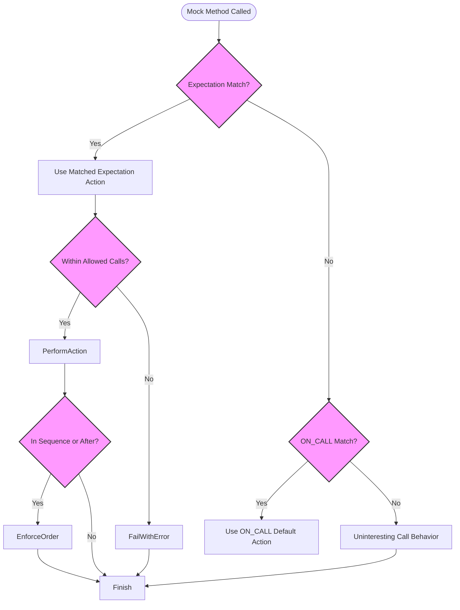

# Defining Expectations & Behaviors

This documentation provides an authoritative guide on how to create and manage expectations on mock objects using GoogleMock. It covers the syntax and semantics of `EXPECT_CALL` and `ON_CALL`, describes how to specify call sequences, default actions, and call cardinalities, and clarifies handling of uninteresting and unexpected calls. This page enables you to define precise, flexible mock behaviors essential for robust unit testing.

---

## Overview of Expectations in GoogleMock

Mock objects allow you to precisely define how your code under test should *interact* with its dependencies. In GoogleMock, you use **expectations** to specify:

- Which methods should be called,
- With what arguments,
- How many times,
- In what order,
- And what behaviors or side effects they should have.

Expectations set explicit contracts:

- Violations (too many, too few, or unexpected calls) cause test failures,
- Correct interactions pass silently.

This page focuses on defining such expectations using `EXPECT_CALL`, specifying default behaviors with `ON_CALL`, and controlling call ordering and behavior composition.

---

## `EXPECT_CALL`: Setting Call Expectations

`EXPECT_CALL` declares that a mock method is expected to be called matching specified arguments. It not only sets the behavior but also verifies that the calls happen as expected.

### Syntax

```cpp
EXPECT_CALL(mock_object, MethodName(matchers...))
    .With(multi_argument_matcher)      // Optional, once
    .Times(cardinality)                // Optional, once
    .InSequence(sequences...)          // Optional, multiple
    .After(expectations...)            // Optional, multiple
    .WillOnce(action)                  // Optional, multiple
    .WillRepeatedly(action)            // Optional, once
    .RetiresOnSaturation();            // Optional, once
```

- `mock_object` is your mock instance.
- `MethodName` is the mock method.
- `matchers...` define argument matching criteria (wildcards, specific values, predicates).

### Argument Matching

You can specify exact arguments or use matchers for flexibility:

```cpp
using ::testing::_;  // wildcard matcher
using ::testing::Gt; // greater than matcher

EXPECT_CALL(mock_obj, ProcessValue(Gt(5), _));
```

### `With` Clause

The `.With()` clause lets you match *all* arguments together using a tuple matcher, for conditions involving multiple arguments as a group.

Example:

```cpp
EXPECT_CALL(my_mock, SetRange(_, _))
    .With(Lt());  // expects first argument < second argument
```

### Cardinality (`Times`)

Use `.Times()` to specify how many times a call is expected:

| Cardinality        | Meaning                                      |
|--------------------|----------------------------------------------|
| `AnyNumber()`      | Can be called any number of times            |
| `AtLeast(n)`       | Expected at least n times                      |
| `AtMost(n)`        | Expected at most n times                       |
| `Between(m, n)`    | Between m and n times inclusive                |
| `Exactly(n)` or `n`| Exactly n times; 0 means must not be called  |

**Default behavior:**
- If no `.Times()` or `.WillOnce()/WillRepeatedly()` clause, defaults to `Times(1)`.
- If n `WillOnce()` clauses and no `WillRepeatedly()`, defaults to `Times(n)`.
- If n `WillOnce()` clauses and `WillRepeatedly()`, defaults to `Times(AtLeast(n))`.

### Call Sequences

- `.InSequence(sequences...)` enforces calls occur in the order they're declared within one or more sequences.
- `.After(expectations...)` specifies that an expectation can only be matched after specified expectations finish.

Sequences and `.After()` calls help you specify precise call ordering.

### Defining Call Actions

- `.WillOnce(action)` specifies the action performed on a single matching call.
- `.WillRepeatedly(action)` specifies the ongoing action for calls after all `WillOnce` calls are exhausted.

Example:

```cpp
EXPECT_CALL(mock_obj, GetValue())
    .WillOnce(Return(42))
    .WillOnce(Return(99))
    .WillRepeatedly(Return(0));
```

This means the first call returns 42, second returns 99, subsequent calls return 0.

### Retiring Expectations

`.RetiresOnSaturation()` causes an expectation to become inactive once it has been saturated (i.e., reached its call limit), which affects how multiple expectations on the same method interact.

### `EXPECT_CALL` Usage Tips

- Define expectations *before* exercising code.
- A newer expectation overrides older ones if they match the same method.
- For overloaded methods, specify arguments explicitly to disambiguate.
- Use `NiceMock` or `StrictMock` to control how unexpected/uninteresting calls are handled.

---

## `ON_CALL`: Specifying Default Behaviors

`ON_CALL` lets you specify the default actions for methods without setting any expectation about *whether* the method will be called. This is useful when you want a mock to behave in a certain way when a method is called, but you don't care about verifying the call.

### Syntax

```cpp
ON_CALL(mock_object, MethodName(matchers...))
    .With(multi_argument_matcher)  // Optional, once
    .WillByDefault(action);         // Required
```

- `.With()` filters calls, similar to `EXPECT_CALL`.
- `.WillByDefault()` specifies the default action taken when no matching `EXPECT_CALL` applies.

### Key Notes

- Multiple `ON_CALL`s are allowed for a method; the last matching handler is used.
- `ON_CALL` does *not* set an expectation that the method will be called.
- `EXPECT_CALL` handlers supersede `ON_CALL` actions if both match.

### Example

```cpp
ON_CALL(mock_obj, Calculate(_, _))
    .WillByDefault(Return(0));
```

---

## Managing Uninteresting and Unexpected Calls

An **uninteresting call** is a call to a mock method for which no `EXPECT_CALL` has been set (the test is not interested in the call). By default, uninteresting calls cause a warning but do not fail the test. The default action (from `ON_CALL` or a built-in default value) is performed.

An **unexpected call** is when some `EXPECT_CALL`s are set on a method, but none matches the actual call's arguments. This *is* a test failure.

### Controlling Uninteresting Call Behavior

Use mock object wrappers:

- `NiceMock<T>` suppresses warnings for uninteresting calls.
- `NaggyMock<T>` (default mock behavior) prints warnings.
- `StrictMock<T>` treats uninteresting calls as failures.

You can also explicitly ignore uninteresting calls on a specific method by adding a catch-all expectation:

```cpp
EXPECT_CALL(mock, Method(_)).Times(AnyNumber());
```

---

## Call Ordering and Partial Orders

GoogleMock lets you specify strict or partial ordering of calls:

### `InSequence`

An RAII helper that puts all enclosed `EXPECT_CALL`s into one anonymous sequence enforcing strict call order.

Example:

```cpp
{
  InSequence s;
  EXPECT_CALL(foo, A());
  EXPECT_CALL(foo, B());
}
```

Calls must be `A()` before `B()`.

### `Sequence` Objects

Define your own named sequences to specify complex partial orders, including multiple sequences on a single expectation, modeling directed acyclic graph call orders.

Example:

```cpp
Sequence s1, s2;
EXPECT_CALL(foo, A()).InSequence(s1, s2);
EXPECT_CALL(foo, B()).InSequence(s1);
EXPECT_CALL(foo, C()).InSequence(s2);
```

This means `A()` must precede `B()` and `C()`, and `C()` must precede any subsequent calls in s2.

### `After` Clause

Precisely specify a partial order relative to one or more other expectations (or expectation sets).

Example:

```cpp
Expectation e1 = EXPECT_CALL(foo, Init1());
Expectation e2 = EXPECT_CALL(foo, Init2());
EXPECT_CALL(foo, DoWork()).After(e1, e2);
```

`DoWork()` may only be matched after `Init1()` and `Init2()` have both been called.

---

## Cardinalities and Default Inference

If you skip `.Times()`, GoogleMock infers call cardinalities according to:

- No `.WillOnce()` or `.WillRepeatedly()` => `Times(1)`
- n `.WillOnce()` and no `.WillRepeatedly()` => `Times(n)`
- n `.WillOnce()` and one `.WillRepeatedly()` => `Times(AtLeast(n))`

Understanding this avoids common pitfalls where call counts mismatch expectations.

---

## Practical Usage Examples

### Simple Expectation with Return Value

```cpp
EXPECT_CALL(mock_turtle, GetX())
    .Times(3)
    .WillOnce(Return(10))
    .WillOnce(Return(20))
    .WillRepeatedly(Return(30));

// Calls:
mock_turtle.GetX(); // returns 10
mock_turtle.GetX(); // returns 20
mock_turtle.GetX(); // returns 30
mock_turtle.GetX(); // returns 30
```

### Using `With` for Multi-Argument Matchers

```cpp
EXPECT_CALL(mock_foo, ComplexFunction(_, _))
    .With(Lt());  // Arguments as tuple satisfy `Lt` matcher, e.g. first arg < second arg
```

### Enforcing Call Order Using `InSequence`

```cpp
Sequence s;
EXPECT_CALL(mock, Init()).InSequence(s);
EXPECT_CALL(mock, Run()).InSequence(s);
EXPECT_CALL(mock, Cleanup()).InSequence(s);
```

Calls must happen in order: `Init()`, then `Run()`, then `Cleanup()`.

### Mixing `After` Clause with Expectation Sets

```cpp
ExpectationSet init_set;
init_set += EXPECT_CALL(mock, InitPart1());
init_set += EXPECT_CALL(mock, InitPart2());
EXPECT_CALL(mock, Finalize()).After(init_set);
```

`Finalize()` occurs after both `InitPart1()` and `InitPart2()`.

### Suppressing Uninteresting Call Warnings

```cpp
NiceMock<MockFoo> mock_foo;
EXPECT_CALL(mock_foo, DoSomething());
// Other uninteresting calls won't print warnings.
```

---

## Common Pitfalls & Troubleshooting

- **Multiple `.With()` clauses:** Only one `.With()` allowed per `EXPECT_CALL` or `ON_CALL`.
- **Omitting required `.WillByDefault()` in `ON_CALL`:** Always specify a `.WillByDefault(...)` action.
- **Unintended overload resolution errors:** For overloaded methods, specify argument matchers explicitly.
- **Sticky Expectations:** Expectations remain active even after saturation unless `.RetiresOnSaturation()` is used or ordering (sequences) retire them.
- **Uninteresting calls warnings:** Use `NiceMock` or add catch-all expectations to suppress.
- **Ordering violations:** Use sequences or `.After()` clauses to enforce expected call order.

---

## Advanced Usage

- You can combine multiple `.InSequence()` clauses to order expectations across several sequences.
- `.After()` accepts up to 5 expectations or expectation sets.
- You can chain multiple `.WillOnce()` clauses to specify different behavior per call.
- Expectation objects (`Expectation`) can be saved and passed around to denote dependencies.

---

## Summary

By understanding and mastering these APIs and clauses, you gain precise control over your mock behavior and verification, yielding reliable, readable, and maintainable unit tests.

---

## Related Topics and References

- [Mocking Methods & Objects](reference/mocking-apis/mocking-methods.md) — for defining mock methods
- [Matchers Reference](reference/mocking-apis/using-matchers.md) — for argument matchers to use in `EXPECT_CALL`
- [Actions & Side Effects](reference/mocking-apis/actions-and-side-effects.md) — available built-in actions and how to craft custom actions
- [Mock Object Strictness Modes](reference/mocking-apis/strictness-modes.md) — using `NiceMock`, `NaggyMock`, and `StrictMock`
- [gMock Cookbook](gmock_cook_book.md) — practical recipes and examples
- [Assertions Reference](reference/assertions.md) — for verifying outcomes

---

## Practical Tips

- Evaluate arguments in `ON_CALL` and `EXPECT_CALL` exactly once to avoid side effects.
- Always set expectations before calling tested code.
- Use sequences or `.After()` to model call order dependencies clearly.
- Use `.RetiresOnSaturation()` to make expectations non-sticky when desired.
- Suppress noisy warnings using `NiceMock` or explicit catch-all expectations.

---

## Code Snippet: Example of Setting Expectations with Ordering and Default Action

```cpp
#include <gmock/gmock.h>
using ::testing::Sequence;
using ::testing::Expectation;
using ::testing::Return;
using ::testing::_;

class MockTurtle {
 public:
  MOCK_METHOD(void, PenDown, (), ());
  MOCK_METHOD(int, GetX, (), ());
  MOCK_METHOD(void, GoTo, (int x, int y), ());
};

TEST(TurtleTest, Movement) {
  MockTurtle turtle;
  Sequence s;

  EXPECT_CALL(turtle, PenDown())
      .InSequence(s);
  EXPECT_CALL(turtle, GoTo(0, 0))
      .InSequence(s)
      .Times(2);
  EXPECT_CALL(turtle, GetX())
      .WillRepeatedly(Return(42));

  // The expected calls:
  turtle.PenDown();
  turtle.GoTo(0, 0);
  turtle.GoTo(0, 0);

  EXPECT_EQ(turtle.GetX(), 42);
  EXPECT_EQ(turtle.GetX(), 42);
}
```

---

## Visualization: Call Matching and Sequencing Flow (Simplified)



---

## Troubleshooting

| Symptom                           | Cause                                    | Resolution                                          |
|----------------------------------|------------------------------------------|-----------------------------------------------------|
| Uninteresting mock call warnings | No `EXPECT_CALL` set for called method | Add `EXPECT_CALL(...).Times(AnyNumber())` or use `NiceMock<>` |
| Too few or too many calls failure | Cardinality mismatch                     | Adjust `.Times()` or `.WillOnce()` clauses appropriately |
| Expectation order failure         | Calls not matching declared sequences   | Use `InSequence` or `After` clauses to enforce expected order |
| Ambiguous overload resolution     | Overloaded methods without explicit matchers | Specify all arguments or use `Const()` wrapper for const overloads |
| Runtime exceptions on no default action | No default action or value for return type | Use `ON_CALL()` to specify `.WillByDefault()` or specify `DefaultValue<T>` |

---

## Summary

Use `EXPECT_CALL` to specify which mock methods must be called, under what conditions, and how often. Use `ON_CALL` to define default behaviors without expectations. Leverage `InSequence`, `Sequence`, and `.After()` to impose call order constraints. Manage uninteresting calls with mock strictness modes or catch-all expectations. Mastering these tools empowers you to create elegant, maintainable, and robust test suites that clearly specify your system’s expected interactions.

---