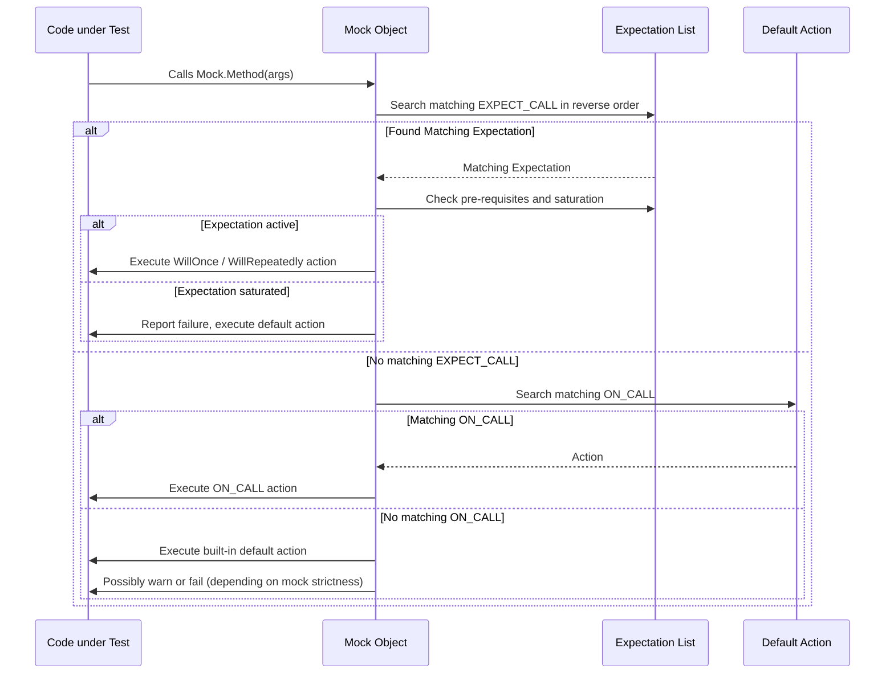

# Expectations & Actions Reference

This reference details how to specify expected interactions and default behaviors for mocks in GoogleMock using the `ON_CALL` and `EXPECT_CALL` macros. You will learn how to define precise call expectations, control sequencing, specify default actions, and manage error reporting to craft clear, intention-revealing mock interactions.

---

## 1. Purpose and Overview

GoogleMock leverages two primary macros to manage mock interactions:

- `ON_CALL`: Sets the default behavior of a mock method without asserting it must be called.
- `EXPECT_CALL`: Defines both the expected behavior and the number/order of calls expected.

This design allows you to build flexible and robust tests that verify how your code interacts with its dependencies, all while avoiding overly rigid or brittle test specifications.

---

## 2. Using `ON_CALL` to Specify Default Actions

### What it Does

`ON_CALL(mock_object, Method(matchers...))` configures the behavior that occurs when `Method` is called with matching arguments. It does *not* set expectations on call counts or ordering—calls matching this behavior may or may not happen.

This is ideal for setting up common mock behavior that tests can rely on without requiring explicit verification.

### Syntax

```cpp
ON_CALL(mock_object, Method(arg_matchers...))
    [.With(multi_argument_matcher)]  // Optional
    .WillByDefault(action);          // Required
```

- `.With()` restricts matching further by applying a tuple matcher to all arguments at once.
- `.WillByDefault()` specifies the action taken when the method is called (see Actions Reference).


### Key Details

- The `.With()` clause is optional but can be used only once per `ON_CALL`.
- `.WillByDefault()` must appear exactly once.
- The last matching `ON_CALL` statement takes precedence.
- `ON_CALL` does *not* affect call expectations or failure reporting for unexpected calls.

### Example

```cpp
using ::testing::Return;
using ::testing::_;

ON_CALL(my_mock, Calculate(_, _))
    .WillByDefault(Return(42));

// Later calls to Calculate() without explicit expectations will return 42.
```

---

## 3. Using `EXPECT_CALL` to Set Call Expectations

### What it Does

`EXPECT_CALL` defines:

- Which calls must be made on a mock object,
- How many times,
- In what order (optionally),
- And declaratively what actions to perform upon those calls.

It ensures your code interacts exactly as required by your test specification.

### Syntax

```cpp
EXPECT_CALL(mock_object, Method(arg_matchers...))
    [.With(multi_argument_matcher)]    // Optional, first clause if present
    [.Times(cardinality)]              // Optional
    [.InSequence(sequences...)]        // Optional, multiple allowed
    [.After(expectations...)]          // Optional, multiple allowed
    [.WillOnce(action)]                // Optional, can be repeated
    [.WillRepeatedly(action)]          // Optional, only once
    [.RetiresOnSaturation()]           // Optional, only once
```

### Clause Details

- **.With(matcher)** restricts matching to calls whose *all* arguments as a tuple satisfy the matcher.
  - It is invoked *once* and must be the first clause.
- **.Times(cardinality)** specifies how many matching calls are expected:
  - `Exactly(n)`, `AtLeast(n)`, `AtMost(n)`, `Between(m, n)`, or `AnyNumber()`.
  - Inferred based on `.WillOnce()` and `.WillRepeatedly()` if omitted.
  - Can be used once and *must* appear before `.InSequence()` and action clauses.
- **.InSequence(...)** groups calls into sequences enforcing call order.
  - Sequences can be multiple and associate DAGs of ordering.
- **.After(...)** defines a partial order, specifying that this call may only happen after specified expectations have been met.
- **.WillOnce(action)** defines the behavior for each successive matching call, each action runs at most once.
- **.WillRepeatedly(action)** defines behavior once all `.WillOnce()` actions are consumed.
- **.RetiresOnSaturation()** marks the expectation as inactive once saturated, allowing other expectations to match.

### Ordering Rules

- `.Times()` must appear before `.InSequence()`, `.After()`, `.WillOnce()`, etc.
- `.With()` must be the first clause if used.
- `.WillOnce()` can appear multiple times but before `.WillRepeatedly()`.
- `.WillRepeatedly()` and `.RetiresOnSaturation()` can appear at most once and must come after `.WillOnce()` clauses.

### Call Matching Logic

- When a mock method is called, `EXPECT_CALL` matching proceeds *in reverse order* of declarations—newer expectations override older ones.
- The first expectation that matches the arguments and whose pre-requisites are satisfied and which is active will be used.
- If no match is found, an unexpected call error is reported.
- If an expectation is saturated, calls that match it are considered *excessive* and cause failure reporting.

### Example

```cpp
using ::testing::Sequence;
using ::testing::Return;

Sequence s;

EXPECT_CALL(my_mock, Process(_))
    .InSequence(s)
    .Times(2)
    .WillOnce(Return(true))
    .WillOnce(Return(false))
    .RetiresOnSaturation();

EXPECT_CALL(my_mock, Process(42))
    .Times(AnyNumber())
    .WillRepeatedly(Return(true));

// Execution order must follow the sequence, returns alternate per WillOnce.
```

### Best Practices

- Prefer to use `.WillRepeatedly()` for default behavior with `.WillOnce()` for special cases.
- Use `.RetiresOnSaturation()` to make expectations non-sticky and allow later expectations to match.
- Combine `.InSequence()` and `.After()` for complex partial ordering.
- Avoid overlapping argument matchers unless you intend the last expectation precedence behavior.

---

## 4. Sequencing and Partial Ordering

### InSequence

Wrap a block with an `InSequence` object to enforce strict call order of expectations declared within the block:

```cpp
{
  InSequence s;
  EXPECT_CALL(mock, Foo(1));
  EXPECT_CALL(mock, Foo(2));
}
```

Call to `Foo(2)` before `Foo(1)` will cause a test failure.

### Sequence Objects

For more complex scenarios, create named `Sequence` objects and associate expectations explicitly:

```cpp
Sequence seq1, seq2;
EXPECT_CALL(mock, Foo(1)).InSequence(seq1, seq2);
EXPECT_CALL(mock, Foo(2)).InSequence(seq1);
EXPECT_CALL(mock, Foo(3)).InSequence(seq2);
```

This imposes a directed acyclic graph (DAG) partial order where some calls must occur before others, but others can occur in any order.

### After Clause

Use `.After(...)` to impose that an expectation only matches calls after specified other expectations (or sets of expectations) have been met.

- Can specify up to 5 prerequisites
- Multiple `.After()` clauses can be chained
- Useful for complex partial orderings where sequences might be inconvenient

---

## 5. Default Value and Default Action Behavior

### Default Value

For return types with a default constructor or a registered default value, gMock provides a built-in default action returning the corresponding value when no other action is specified.

Override with:

```cpp
::testing::DefaultValue<Type>::Set(value);
// or
::testing::DefaultValue<Type>::SetFactory(factory_function);
```

Clear with:

```cpp
::testing::DefaultValue<Type>::Clear();
```

### Default Action (`ON_CALL`)

If `ON_CALL` is used to specify `.WillByDefault`, it overrides the built-in default for matching argument sets.

If no `ON_CALL` matches, built-in default is used.

`EXPECT_CALL` overrides `ON_CALL`; if an expectation matches, its action is taken.

---

## 6. Error Reporting and Diagnostics

- **Uninteresting Calls**: Calls to mock methods with no matching `EXPECT_CALL`.
  - Default action runs silently or warns depending on verbosity and mock type.
  - `NiceMock` suppresses warnings; `NaggyMock` warns; `StrictMock` treats as failures.

- **Unexpected Calls**: Calls match some `EXPECT_CALL`s but not the arguments or pre-requisites.
  - Always treated as errors.
  - Detailed messages show failed argument matches and invocation counts.

- **Excessive Calls**: Calls exceeding the upper bound on call count.
  - Report errors and perform default or specified actions.

- **Retired Expectations**: Calls match expectations that are no longer active (retired).
  - Treated as unexpected calls with clear error messages.

### Verbosity Controls

Set verbosity with `--gmock_verbose=info|warning|error` to control diagnostic message detail.

- `info`: Prints all info messages, warnings, stack traces.
- `warning`: Prints warnings and errors (default).
- `error`: Prints errors only.

---

## 7. Practical Tips & Best Practices

- Use `ON_CALL` to set default behaviors to keep tests flexible.
- Use `EXPECT_CALL` sparingly and precisely to verify only what matters.
- Use `.RetiresOnSaturation()` in sequences or ordered expectations to avoid sticky expectations causing upper-bound errors.
- Order your `EXPECT_CALL`s so specific matchers come after more general ones.
- Use sequences and `.After()` to communicate the model of expected interaction order clearly.
- To suppress uninteresting call warnings without imposing expectations, wrap the mock with `NiceMock`.
- Use `.WillOnce()` and `.WillRepeatedly()` to define stepwise mock responses.
- Verify and clear expectations explicitly with `Mock::VerifyAndClear()` when manual control is needed.

---

## 8. Common Pitfalls

<Warning>
Avoid overlooking the default `.Times()` inference rules; unintended cardinalities can cause surprises.
</Warning>

<Warning>
Mixing `ON_CALL` and `EXPECT_CALL` for the same method without understanding precedence can lead to confusing behaviors.
</Warning>

<Warning>
Not specifying correct ordering in test scenarios requiring strict call order may mask latent bugs.
</Warning>

<Warning>
Setting expectations after mock method calls is undefined behavior and must be avoided.
</Warning>

---

## 9. Summary

| Macro          | Description                                  | Verifies Call Count | Sets Default Behavior |
|----------------|----------------------------------------------|---------------------|----------------------|
| `ON_CALL`      | Sets default action for matching call args   | No                  | Yes                  |
| `EXPECT_CALL`  | Sets expectation and action for matching      | Yes                 | Yes                  |

---

## 10. References and Further Reading

- [Mocking Reference](../reference/mocking.md)
- [Mock Classes and Expectations Guide](../guides/mocking-techniques/mock-classes-expectations.md)
- [Actions and Matchers Guide](../guides/mocking-techniques/working-with-actions-matchers.md)
- [Mock Strictness: Nice, Naggy, and Strict](../guides/mocking-techniques/strictness-nice-mocks.md)

---

## 11. Diagram: Mock Call Flow Overview



---