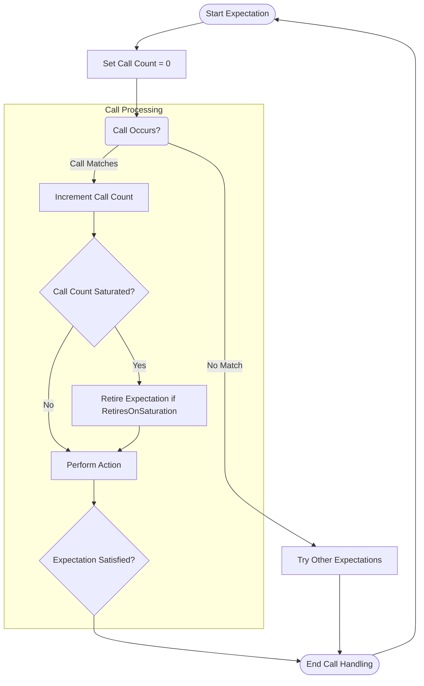

# Specifying Expectations and Cardinality

Setting precise expectations on mock methods is crucial for robust and meaningful tests in GoogleMock. This guide explains how to specify **how many times** a mock method should be called, the concept of **cardinality**, and the mechanisms GoogleMock provides to control allowed, required, or forbidden calls. It also covers best practices to write clear and maintainable test verifications.

---

## Understanding Expectations

An **expectation** in GoogleMock defines what calls are expected on a mock object during a test. Expectations can specify:

- The method expected to be called.
- The arguments with which it is called.
- The number of times the call should occur (cardinality).
- The order in which multiple expectations should be satisfied.

The core mechanism to set an expectation is via the `EXPECT_CALL()` macro.

```cpp
EXPECT_CALL(mock_object, MethodName(matchers...))
    .Times(cardinality)
    .WillOnce(action)
    .WillRepeatedly(action);
```

GoogleMock verifies these expectations during the test run and reports failures if they are violated.

---

## What Is Cardinality?

Cardinality expresses **how many times** a mock method call is expected. It can be an exact count or a range allowing flexibility.

### Common Cardinalities

| Cardinality             | Description                                 |
|-------------------------|---------------------------------------------|
| `Exactly(n)` or `n`     | Called exactly *n* times. If `n` is 0, call is forbidden. |
| `AtLeast(n)`            | Called at least *n* times.                   |
| `AtMost(n)`             | Called at most *n* times.                    |
| `Between(m, n)`         | Called between *m* and *n* times inclusive. |
| `AnyNumber()`           | Called any number of times.                  |

These are provided as factory methods in the `::testing` namespace, e.g., `testing::Exactly(3)`.

### Example: Specifying Cardinality

```cpp
using ::testing::AtLeast;
using ::testing::Return;

EXPECT_CALL(turtle, Forward)
    .Times(AtLeast(2))  // Expect the method to be called at least twice
    .WillRepeatedly(Return());
```

In this example, `Forward()` is expected at least 2 times, with default actions repeating.

### Special Case: Never Called

To specify that a mock method **must not be called**, use:

```cpp
EXPECT_CALL(mock_object, MethodName(_))
    .Times(0);
```

If the method is called, GoogleMock reports a failure immediately.

---

## How Cardinalities Interact with Actions

By default, GoogleMock infers cardinalities based on actions specified:

- If neither `.WillOnce()` nor `.WillRepeatedly()` are specified, cardinality defaults to `Exactly(1)`.
- If *n* `.WillOnce()` actions are specified and no `.WillRepeatedly()`, cardinality is `Exactly(n)`.
- If *n* `.WillOnce()` actions and one `.WillRepeatedly()` are specified, cardinality is `AtLeast(n)`.

Explicitly specifying `.Times()` overrides this inference.

---

## Using `EXPECT_CALL` Modifier Clauses

Expectations can be customized using modifier clauses, which must appear in the following order:

```cpp
EXPECT_CALL(mock_obj, Method(matchers...))
    .With(multi_arg_matcher)
    .Times(cardinality)
    .InSequence(sequences...)
    .After(expectations...)
    .WillOnce(action)
    .WillRepeatedly(action)
    .RetiresOnSaturation();
```

- **`.With()`**: Restricts expectations to calls whose arguments as a whole match the given matcher.
- **`.Times()`**: Specifies the cardinality.
- **`.InSequence()`**: Specifies that calls must occur in particular sequences.
- **`.After()`**: Specifies that the expectation occurs after other expectations.
- **`.WillOnce()`** and **`.WillRepeatedly()`**: Specify what the mock method should do on calls.
- **`.RetiresOnSaturation()`**: Makes the expectation inactive after its allowed calls are exhausted.

## Example: Setting a Complete Expectation

```cpp
using ::testing::_;             // wildcard matcher
using ::testing::Exactly;
using ::testing::Return;
using ::testing::Sequence;

Sequence s;

EXPECT_CALL(mock_turtle, GoTo(0, 0))
    .Times(Exactly(2))         // called exactly twice
    .InSequence(s)             // must occur in sequence s
    .WillRepeatedly(Return());

EXPECT_CALL(mock_turtle, PenDown())
    .Times(Exactly(1))
    .InSequence(s);
```

This specifies a sequence of calls and the count for each.

---

## Best Practices for Cardinality

- **Specify only what matters:** Avoid over-constraining by specifying exact argument values or call counts beyond the test’s intent.
- **Use flexible cardinalities for unstable tests:** For methods called multiple times with variable frequency, `AtLeast(n)` or `AnyNumber()` provides more robust tests.
- **Always specify zero calls explicitly to forbid a method:** Use `.Times(0)` to catch unexpected calls.
- **Prefer sequence controls for order-sensitive tests:** Use `.InSequence()` or `.After()` to express required call orders clearly.

---

## Retiring Expectations

Expectations remain active after reaching their call count limit by default, causing mismatched extra calls to fail immediately. You can **retire** an expectation once saturated so subsequent calls can match other expectations.

```cpp
EXPECT_CALL(mock, SetNumber(7))
    .Times(2)
    .RetiresOnSaturation();
```

After two calls with argument `7`, this expectation becomes inactive, and a third call to `SetNumber(7)` can match a different expectation.

---

## Troubleshooting Cardinality Issues

### Common Problems

- **Too few calls:** If a method is expected to be called but isn’t, tests fail upon verification.
- **Too many calls:** Unexpected extra calls beyond allowed cardinality cause immediate failures.
- **Sticky expectations:** Subsequent calls may trigger “upper bound exceeded” errors if `.RetiresOnSaturation()` isn’t used or sequences aren’t properly utilized.

### How to debug?

- Use `--gmock_verbose=info` flag to get detailed logs of call matching.
- Check that `.Times()` and `.WillOnce()` / `.WillRepeatedly()` balance out logically.
- Use sequences or the `.After()` clause to clarify order dependencies.

---

## Summary of Cardinality Factory Methods

| Function          | Description                              | Example                          |
|-------------------|------------------------------------------|---------------------------------|
| `AnyNumber()`     | Allows any number of calls (including 0) | `.Times(AnyNumber())`            |
| `AtLeast(n)`      | At least *n* calls                      | `.Times(AtLeast(3))`             |
| `AtMost(n)`       | At most *n* calls                       | `.Times(AtMost(5))`              |
| `Between(min, max)` | Between *min* and *max* calls inclusive | `.Times(Between(2,4))`           |
| `Exactly(n)`      | Exactly *n* calls                      | `.Times(Exactly(1))` or `.Times(1)` |

---

## Additional Resources

- [Mocking Reference: EXPECT_CALL](reference/mocking.md#EXPECT_CALL) - Detailed specification of `EXPECT_CALL` and clauses.
- [gMock Cheat Sheet](docs/gmock_cheat_sheet.md#SpecifyingCardinality) - Quick reference for cardinalities.
- [gMock Cookbook: Setting Expectations](docs/gmock_cook_book.md#SettingExpectations) - Practical recipes and examples.
- [Mocking & Behavior Verification Guide](guides/mocking-and-behavior-verification/specifying-expectations-and-actions.mdx) - Conceptual overview and deeper guide.

---

## Practical Example

```cpp
using ::testing::_;          // Wildcard matcher
using ::testing::AtLeast;
using ::testing::Return;
using ::testing::Sequence;

class MockTurtle : public Turtle {
 public:
  MOCK_METHOD(void, PenUp, (), (override));
  MOCK_METHOD(void, PenDown, (), (override));
  MOCK_METHOD(void, Forward, (int distance), (override));
  MOCK_METHOD(void, Turn, (int degrees), (override));
  MOCK_METHOD(void, GoTo, (int x, int y), (override));
  MOCK_METHOD(int, GetX, (), (const, override));
  MOCK_METHOD(int, GetY, (), (const, override));
};

TEST(PainterTest, DrawsCircle) {
  MockTurtle turtle;
  Sequence seq;

  EXPECT_CALL(turtle, PenDown())
      .Times(1)
      .InSequence(seq);
  EXPECT_CALL(turtle, Forward(_))
      .Times(AtLeast(1))
      .InSequence(seq);
  EXPECT_CALL(turtle, PenUp())
      .Times(1)
      .InSequence(seq);

  Painter painter(&turtle);
  EXPECT_TRUE(painter.DrawCircle(0, 0, 10));
}
```

This test specifies that `PenDown()` and `PenUp()` are expected once each, surrounding one or more calls to `Forward()`, in that order.

---

# Summary

Use `EXPECT_CALL()` combined with `.Times()` and GoogleMock’s cardinality API to specify **how many times** mock methods should be called. Cardinalities provide expressive, flexible counting for exact, minimum, maximum, or ranged invocation counts.

When needed, you can retire saturated expectations to allow other expectations to match further calls. Use sequences and the `.After()` clause to specify invocation order when your tests require it.

Writing appropriately scoped and ordered cardinalities keeps tests robust and maintainable, while mismatched or missing cardinalities are a common cause of brittle or failing tests.

---

<Callout type="tip">
Ensure to specify only those calls you genuinely expect and need to verify. Over-specification leads to brittle tests, and under-specification lets bugs slip through.
</Callout>

<Callout type="note">
`Times(0)` is your weapon to assert that a method must never be called. Use it liberally on calls you want to forbid.
</Callout>

<Callout type="warning">
Expectations without any matching calls will cause failures at mock verification. Always balance your `.Times()` with expected usage.
</Callout>

---

# Mermaid Diagram: Cardinality Flow



This diagram shows the lifecycle of a mock call relative to cardinality and expectation logic.

---

<AccordionGroup title="Frequently Asked Questions">
<Accordion title="What happens if a mock method is called more times than specified?">
GoogleMock treats this as an error. It reports a failure immediately when an expectation is over-saturated, unless the expectation is marked with `.RetiresOnSaturation()`.
</Accordion>
<Accordion title="Can I omit the .Times() clause?">
Yes. GoogleMock will infer cardinality based on the presence of `.WillOnce()` or `.WillRepeatedly()` clauses. Usually it defaults to `.Times(1)`.
</Accordion>
<Accordion title="How can I expect a call to be made at least once?">
Use `.Times(AtLeast(1))` to express the expectation concisely.
</Accordion>
<Accordion title="How can I forbid a method from being called?">
Specify `.Times(0)` in your `EXPECT_CALL()`. If it's called, the test fails immediately.
</Accordion>
</AccordionGroup>

---

# Callout
<Tip>
Use sequences to enforce call order instead of brittle call count manipulations.
</Tip>

---

# Summary

In this page, you learned how to:

- Specify expectations on mock methods with `EXPECT_CALL()`.
- Control the number of expected calls precisely with cardinalities.
- Use flexible counting with `AnyNumber()`, `AtLeast()`, `AtMost()`, and `Between()`.
- Combine multiple behaviors with `.WillOnce()` and `.WillRepeatedly()`.
- Manage the lifetime and activity of expectations using `.RetiresOnSaturation()`.
- Understand and diagnose common errors caused by cardinality mismatches.

Proper use of cardinalities is key to writing effective and maintainable tests that fail only on real contract violations.

# Related Documentation

- [Mocking Reference - EXPECT_CALL](reference/mocking.md#EXPECT_CALL)
- [gMock Cookbook - Setting Expectations](docs/gmock_cook_book.md#SettingExpectations)
- [GoogleMock Cheat Sheet](docs/gmock_cheat_sheet.md#SpecifyingCardinality)
- [Specifying Expectations and Actions Guide](guides/mocking-and-behavior-verification/specifying-expectations-and-actions.mdx)

# Source Code Reference

For the internal implementation and test coverage, see:

- [`googlemock/src/gmock-spec-builders.cc`](googlemock/src/gmock-spec-builders.cc)
- [`googlemock/test/gmock-spec-builders_test.cc`](googlemock/test/gmock-spec-builders_test.cc)
- [`googlemock/include/gmock/gmock-cardinalities.h`](googlemock/include/gmock/gmock-cardinalities.h)
- [`googlemock/src/gmock-cardinalities.cc`](googlemock/src/gmock-cardinalities.cc)
- [`googlemock/test/gmock-cardinalities_test.cc`](googlemock/test/gmock-cardinalities_test.cc)
