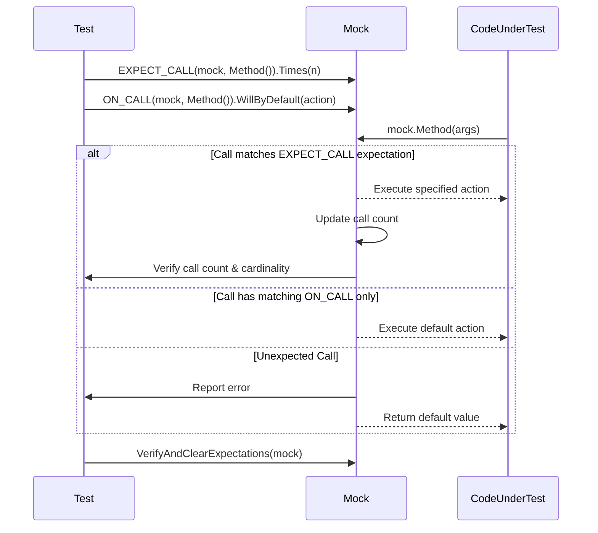

# Expectations and Cardinalities

Master the art of specifying and verifying how many times mock methods are expected to be called using GoogleMock's powerful expectation and cardinality mechanisms. This guide takes you through setting explicit call expectations with `EXPECT_CALL`, configuring default behaviors with `ON_CALL`, leveraging cardinalities to describe invocation frequency, enforcing call order and sequences, managing mock strictness (Nice, Naggy, and Strict), and understanding GoogleMock's error reporting for effective test diagnostics.

---

## 1. Understanding Expectations in GoogleMock

### What Are Expectations?
Expectations specify how your mock methods should be called during testing. They allow you to:

- Define **which mock methods** to observe.
- Specify the **expected argument patterns** using matchers.
- Indicate **how many times** a method should be called.
- Set **actions** determining the behavior of the mock method when called.

### Setting Expectations with `EXPECT_CALL`
To declare that you expect a method call, use the `EXPECT_CALL` macro:

```cpp
EXPECT_CALL(mock_object, MethodName(matchers...))
    .Times(cardinality)          // Optional - how many times
    .WillOnce(action)            // Optional - action for single call
    .WillRepeatedly(action)      // Optional - action for calls after WillOnce
    .InSequence(sequence1, ... ) // Optional - enforce call sequencing
    .After(expectation1, ...)    // Optional - specify call order relative to others
    .RetiresOnSaturation();      // Optional - retire expectation once saturated
```

Example:

```cpp
using ::testing::Return;
using ::testing::AtLeast;

EXPECT_CALL(turtle, Forward(100))
    .Times(AtLeast(1))
    .WillRepeatedly(Return());

// The method Forward(100) should be called at least once, returning void.
```

> **Tip:** `EXPECT_CALL` must be set before the tested code exercises the mock. It represents a *future* expected call.

### Default Behavior: What Happens if You Omit `Times()`?
GoogleMock infers the call count cardinality based on the actions specified:

- No `WillOnce` or `WillRepeatedly`: assumes `.Times(1)`.
- `n` `WillOnce()` clauses and no `WillRepeatedly()`: interpreted as `.Times(n)`.
- `n` `WillOnce()` clauses plus one `WillRepeatedly()`: interpreted as `.Times(AtLeast(n))`.

---

## 2. Controlling Call Frequency with Cardinalities

GoogleMock offers flexible cardinalities to specify *how many times* a mock method call is expected. These cardinalities enable precise, yet expressive control.

| Cardinality              | Description                                             | Usage Example                         |
|--------------------------|---------------------------------------------------------|-------------------------------------|
| `AnyNumber()`            | Call any number of times, including zero.               | `.Times(AnyNumber())` or `.Times(_)`|
| `AtLeast(n)`             | Call at least `n` times.                                 | `.Times(AtLeast(3))`                 |
| `AtMost(n)`              | Call at most `n` times.                                  | `.Times(AtMost(5))`                  |
| `Between(m, n)`          | Call between `m` and `n` times, inclusive.              | `.Times(Between(2, 4))`              |
| `Exactly(n)` or integer  | Call exactly `n` times; `Exactly(0)` means never called.| `.Times(Exactly(2))` or `.Times(2)` |

### Examples

```cpp
EXPECT_CALL(foo, Bar(_))
    .Times(AtLeast(1));   // At least once
EXPECT_CALL(bar, Baz(_))
    .Times(Exactly(3));  // Exactly three times
EXPECT_CALL(baz, Quux(_))
    .Times(Between(1, 3)); // Between 1 and 3 times
```

### Invalid Cardinalities

- Lower bounds must be >= 0.
- Upper bounds must be >= lower bounds.

Invalid specifications cause immediate, non-fatal failures, helping catch configuration errors early.

---

## 3. Default Behaviors with `ON_CALL`

While `EXPECT_CALL` defines the expectation and behavior, `ON_CALL` only sets the **default action** when an expected call is *not* declared.

```cpp
ON_CALL(mock_object, MethodName(matchers...))
    .WillByDefault(action);
```

This is useful to specify mock method behavior that you don't necessarily want to verify the calls for, allowing your tests to focus on what matters.

### Example

```cpp
using ::testing::Return;

ON_CALL(mock_turtle, GetX())
    .WillByDefault(Return(42));

EXPECT_CALL(mock_turtle, Forward(_))
    .Times(::testing::AnyNumber());
```

### Differentiating `ON_CALL` vs `EXPECT_CALL`

- **`ON_CALL`:** Sets behavior but **does not** add expectation.
- **`EXPECT_CALL`:** Sets behavior **and** expectation (number and order of calls).

> **Best Practice:** Use `ON_CALL` to specify general default behavior, and use `EXPECT_CALL` sparingly to verify needed interactions.

---

## 4. Enforcing Call Order and Sequences

GoogleMock allows you to enforce call order using:

### InSequence

An RAII-style helper that scopes multiple `EXPECT_CALL`s into a strict sequence.

```cpp
{
  ::testing::InSequence seq;
  EXPECT_CALL(foo, A());
  EXPECT_CALL(bar, B());
  EXPECT_CALL(foo, C());
}
```

In this block, calls must happen in the order: `foo.A()`, then `bar.B()`, then `foo.C()`.

### Sequence Objects

For more advanced partial ordering or overlapping sequences, use explicit `Sequence` objects.

```cpp
::testing::Sequence seq1, seq2;
EXPECT_CALL(foo, A()).InSequence(seq1, seq2);
EXPECT_CALL(bar, B()).InSequence(seq1);
EXPECT_CALL(baz, C()).InSequence(seq2);
```

This specifies a partial order where `foo.A()` must precede both `bar.B()` and `baz.C()`, but the relative order of `bar.B()` and `baz.C()` is unimportant.

### After Clause

`After` allows an expectation to run **only after** one or more other expectations have been fulfilled.

```cpp
Expectation e1 = EXPECT_CALL(mock, Foo());
Expectation e2 = EXPECT_CALL(mock, Bar()).After(e1);
```

`Bar()` can only be called after `Foo()`.

---

## 5. Managing Expectation Strictness

GoogleMock distinguishes how it treats **uninteresting calls** (calls to mock methods without expectations):

| Strictness      | Behavior on Uninteresting Calls                  |
|-----------------|-------------------------------------------------|
| **NaggyMock** (default) | Prints warnings (naggy) but test continues            |
| **NiceMock**    | Silences uninteresting call warnings                  |
| **StrictMock**  | Treats uninteresting calls as test failures           |

Example:

```cpp
using ::testing::NiceMock;
using ::testing::NaggyMock;
using ::testing::StrictMock;

NiceMock<MockFoo> nice_mock;   // No warnings on unexpected calls
NaggyMock<MockFoo> naggy_mock; // Warning messages printed
StrictMock<MockFoo> strict_mock; // Fails test on unexpected calls
```

**Note:** Strictness only affects uninteresting calls, not calls that have expectations but don't match the ones set (those always cause failures).

---

## 6. How GoogleMock Handles Errors and Warnings

GoogleMock generates clear and informative diagnostics to help you understand expectation violations:

- **Uninteresting Calls:** Warnings (for NaggyMock) containing function name, arguments, and optionally stack traces (depending on `--gmock_verbose`).
- **Unexpected Calls:** Failures indicating that there are no matching expectations for the function call, showing which expectations were tried and why they didn't match.
- **Too Few Calls:** When the actual call count doesn't satisfy the minimal cardinality.
- **Too Many Calls:** When mock method invocations exceed the maximum expected count.
- **Order Violations:** If call order constraints (`InSequence` or `After`) are violated.

### Output Verbosity Levels

The verbosity is adjustable via the `--gmock_verbose` flag:

| Level   | Output                            |
|---------|---------------------------------|
| `info`  | Prints all informational messages, warnings, and errors with stack trace.
| `warning` (default) | Warnings and errors without stack trace.
| `error` | Only errors, suppressing warnings.

---

## 7. Working with Cardinality APIs Directly

GoogleMock’s cardinalities are implemented as types conforming to the `CardinalityInterface`. Users mostly consume the factory functions which create cardinality objects:

- `AnyNumber()` — any number of calls.
- `AtLeast(int n)` — at least n calls.
- `AtMost(int n)` — at most n calls.
- `Between(int min, int max)` — between min and max calls.
- `Exactly(int n)` — exactly n calls.

Example:

```cpp
EXPECT_CALL(mock_object, Method())
    .Times(AtLeast(3));
```

Custom cardinalities may be implemented if needed using the interface, allowing for unique call-count semantics.

---

## 8. Common User Flows

### Basic Mocking Setup

1. Define a mock class using `MOCK_METHOD`.
2. In your test, create a mock object.
3. Use `ON_CALL` to specify default behaviors as needed.
4. Use `EXPECT_CALL` to set expectations on method calls, optionally specifying cardinalities.
5. Run your code that uses the mock, verifying that expectations are met.

### Sequencing Calls

Wrap your expectations within an `InSequence` block or use `Sequence` and `InSequence()` to enforce call order, preventing race and logic errors in tests.

### Controlling Over- or Under-Invocation

Leverage cardinalities to control and validate that methods are called exactly or within specified bounds; apply `.RetiresOnSaturation()` to prevent sticky expectations from causing premature failures.

### Managing Mock Warnings

Switch between `NiceMock`, `NaggyMock`, and `StrictMock` depending on the strictness and noisiness desired in your tests.

### Diagnosing Failed Expectations

Increase `--gmock_verbose=info` for detailed diagnostics including stack traces and expectation matches; review error messages to detect cardinality and call order violations.

---

## 9. Practical Tips & Best Practices

- Set expectations before exercising the mock methods. Expectation order matters!
- Avoid over-specification of arguments to reduce test brittleness.
- Use `ON_CALL` for default behaviors, only use `EXPECT_CALL` where call count matters.
- Prefer `AtLeast(1)` or `AnyNumber()` for flexible testing when call count may vary.
- Use sequences carefully to avoid making tests too fragile.
- Use `.RetiresOnSaturation()` when you want expectations to deactivate after being met.
- Switch to `NiceMock` when warnings about uninteresting calls clutter output.
- Use `StrictMock` to catch any unexpected method calls during development.
- Inspect error messages and use verbose logging (`--gmock_verbose=info`) to debug failing mocks.
- When defining custom cardinalities for specialized call counts, implement `CardinalityInterface`.

---

## 10. Troubleshooting Common Issues

### Expectation Not Met

- Verify that `EXPECT_CALL` is called before the mock method invocation.
- Check argument matchers for mismatches.
- Confirm the cardinality matches your call frequency.

### Unexpected Call

- Missing or incorrect `EXPECT_CALL` for a method.
- Use a catch-all `EXPECT_CALL` with `Times(AnyNumber())` if ignoring some calls.
- Check strictness mode (`NiceMock` vs `StrictMock`).

### Too Many or Too Few Calls

- Adjust `Times()` or cardinality clauses.
- Use sequences or `.RetiresOnSaturation()` to handle call lifetimes properly.

### Call Order Violations

- Use `InSequence` or `After` to define the order explicitly.
- Check test flow to ensure mocks are called in expected sequence.

### No Warning on Uninteresting Call

- You may be using `NiceMock`; switch back to `NaggyMock` to observe.
- Set explicit `EXPECT_CALL` or use `EXPECT_CALL(...).Times(AnyNumber())` to suppress warnings for specific methods.

---

## 11. Reference Links

- [EXPECT_CALL Clause Reference](../reference/mocking.md#EXPECT_CALL)
- [ON_CALL Clause Reference](../reference/mocking.md#ON_CALL)
- [Cardinalities and Times Clause](../reference/mocking.md#EXPECT_CALL.Times)
- [Strictness Models: Nice, Naggy, Strict](../concepts/mocking-and-extensibility/strictness-models-nice-naggy-strict.md)
- [Sequences and Ordering - InSequence, Sequence](../reference/mocking.md#Sequence)
- [gMock Cookbook - Expectations](https://github.com/google/googletest/blob/main/docs/gmock_cook_book.md#setting-expectations)

---

## 12. Mermaid Diagram: Call Expectation Flow



This flow demonstrates how expectations and calls are matched, how default actions are executed, and how errors are reported.

---