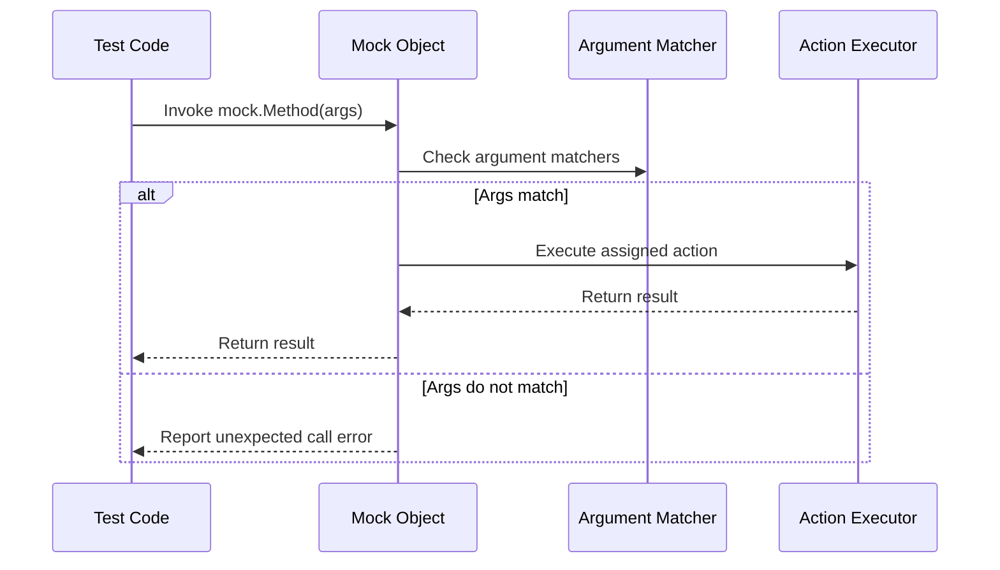

# Matchers and Actions Reference

This reference documents the complete suite of built-in **matchers** and **actions** provided by GoogleMock (gMock). These facilities enable you to precisely specify expectations for mock method calls, validate argument values, and control mock function behavior.

Matchers let you describe what arguments are expected in mock function calls, while actions define what those functions will do when invoked. Together, they form the foundation of expressive and maintainable mock-based testing in C++.

---

## Table of Contents

- [Matchers Overview](#matchers-overview)
- [Basic Matchers](#basic-matchers)
- [Combining Matchers](#combining-matchers)
- [Custom Matchers](#custom-matchers)
- [Matcher Usage Tips](#matcher-usage-tips)
- [Actions Overview](#actions-overview)
- [Built-in Actions](#built-in-actions)
- [Actions from Callables](#actions-from-callables)
- [Composite and Custom Actions](#composite-and-custom-actions)
- [Action Usage Tips](#action-usage-tips)
- [Advanced Usage](#advanced-usage)
- [Troubleshooting and Best Practices](#troubleshooting-and-best-practices)

---

## Matchers Overview

Matchers are predicates used inside `EXPECT_CALL()` or `ON_CALL()` to specify the conditions that arguments passed to a mock method must satisfy.

- Each argument of a mock method can be matched by a matcher.
- Matchers can be values (which are matched for equality), placeholders, or complex expressions.
- They form a Domain-Specific Language (DSL) to describe argument constraints in a readable, flexible manner.

### Use Case

Imagine you are mocking a function that accepts a string. You can write:

```cpp
EXPECT_CALL(mock_obj, DoSomething("hello")); // matches exactly "hello"
EXPECT_CALL(mock_obj, DoSomething(_));         // matches anything
EXPECT_CALL(mock_obj, DoSomething(HasSubstr("he"))); // matches strings containing "he"
```

This way, you precisely control which calls are expected.

---

## Basic Matchers

GoogleMock provides many built-in matchers, some of the most common include:

| Matcher               | Description                                          |
|-----------------------|------------------------------------------------------|
| `_`                   | Matches any argument (wildcard).                      |
| `Eq(value)`           | Matches if the argument equals `value`.               |
| `Ne(value)`           | Not equal to `value`.                                 |
| `Lt(value)`, `Le()`, `Gt()`, `Ge()` | Comparison operators.                        |
| `IsNull()`            | Matches pointer arguments that are null.             |
| `NotNull()`           | Matches non-null pointers.                            |
| `Contains(substring)` | Matches strings containing the substring.            |
| `StartsWith(string)`  | Matches values starting with given string.            |
| `EndsWith(string)`    | Matches values ending with given string.              |

Example:
```cpp
EXPECT_CALL(mock, ProcessData(Gt(5)));
EXPECT_CALL(mock, ProcessData(Ne(0)));
EXPECT_CALL(mock, ReceivePointer(NotNull()));
```

---

## Combining Matchers

Matchers can be combined using logical operators to form complex constraints:

- `AllOf(m1, m2, ...)` — match if all matchers match.
- `AnyOf(m1, m2, ...)` — match if any matcher matches.
- `Not(m)` — the argument does not match `m`.

Example:

```cpp
EXPECT_CALL(mock, ProcessData(AllOf(Gt(0), Lt(100))));
EXPECT_CALL(mock, ProcessData(Not(Eq(5))));
```

Using these lets your tests remain precise without being brittle.

---

## Custom Matchers

If built-in matchers do not suffice, you can define your own:

### Defining a Matcher Quickly

Use the `MATCHER` and `MATCHER_P*` macros:

```cpp
MATCHER(IsEven, "checks if a number is even") {
  return (arg % 2) == 0;
}

// Parameterized matcher which checks absolute value.
MATCHER_P(HasAbsoluteValue, n, "checks absolute value equals n") {
  return std::abs(arg) == n;
}
```

Usage:

```cpp
EXPECT_CALL(mock, Func(IsEven()));
EXPECT_CALL(mock, Func(HasAbsoluteValue(5)));
```

### Defining a Matcher Class

For more control, implement the matcher interface with methods `MatchAndExplain`, `DescribeTo`, and `DescribeNegationTo`. This allows richer failure messages and shared logic.

---

## Matcher Usage Tips

- Use `_` to indicate arguments you don't care about to reduce test brittleness.
- Avoid over-precise matchers; test intent, not implementation details.
- Use `With()` clauses in `EXPECT_CALL` to combine multiple argument matchers when necessary.
- Matchers must be side-effect free and deterministic.
- Use `SafeMatcherCast<T>()` when matching types that convert safely but differ.
- Disambiguate overloaded methods by specifying argument types or using `Const()`.

---

## Actions Overview

Actions define what a mock function does when invoked. This could be returning a value, calling a callback, throwing an exception, or performing side effects.

Actions are specified in:

- `ON_CALL()` statements, which specify default behaviors without expectations.
- `EXPECT_CALL()` statements via `.WillOnce()`, `.WillRepeatedly()`, and related modifiers.

Actions enhance the expressiveness and usefulness of mocks by enabling them to behave realistically or simulate conditions.

---

## Built-in Actions

GoogleMock defines a rich set of built-in actions categorized as:

### Returning a Value

| Action                 | Behavior                                     |
|------------------------|----------------------------------------------|
| `Return()`             | Return from a void mock function.              |
| `Return(value)`        | Return the specified `value`.                  |
| `ReturnArg<N>()`       | Return the Nth (0-based) argument.             |
| `ReturnNew<T>(args...)`| Return a new `T` constructed with the given args each call. |
| `ReturnNull()`         | Return a null pointer.                          |
| `ReturnPointee(ptr)`   | Return the value pointed by `ptr` at invocation. |
| `ReturnRef(variable)`  | Return a reference to `variable`.               |
| `ReturnRefOfCopy(value)` | Return a reference to a persistent copy of `value`. |
| `ReturnRoundRobin({a1,...,ak})` | Cycle through return values on each call.  |

### Side Effects

| Action                      | Description                                 |
|-----------------------------|---------------------------------------------|
| `Assign(&variable, value)`  | Assign `value` to `variable`.                 |
| `DeleteArg<N>()`            | Delete the Nth argument pointer.              |
| `SaveArg<N>(pointer)`       | Save Nth argument copy to `*pointer`.        |
| `SaveArgByMove<N>(pointer)` | Save Nth argument by move to `*pointer`.     |
| `SaveArgPointee<N>(pointer)`| Save the value pointed to by Nth argument.   |
| `SetArgReferee<N>(value)`   | Assign `value` to the referred variable in Nth argument. |
| `SetArgPointee<N>(value)`   | Assign `value` through pointer Nth argument. |
| `SetArrayArgument<N>(first,last)` | Copy range [first,last) to array in Nth argument. |
| `SetErrnoAndReturn(error,value)` | Set `errno` and return `value`.              |
| `Throw(exception)`          | Throw specified exception (since v1.1.0).   |

### Default Action

| Action       | Description                           |
|--------------|-------------------------------------|
| `DoDefault()`| Perform the default action (built-in or from `ON_CALL`). |

### Composite Actions

| Action                           | Description                                     |
|---------------------------------|-------------------------------------------------|
| `DoAll(a1, a2, ..., an)`         | Perform all actions sequentially; return result of `an`. (
first n-1 must be void).
|
| `IgnoreResult(a)`                | Perform `a`, discard its result.                 |
| `WithArg<N>(a)`                  | Pass Nth argument to action `a`.
|
| `WithArgs<N1,N2,...>(a)`         | Pass the selected arguments to `a`.
|
| `WithoutArgs(a)`                 | Invoke `a` ignoring mock function arguments.   |

---

## Actions from Callables

You can use free functions, functors, lambdas, or methods as actions, giving you great flexibility:

- `Invoke(f)` runs a callable `f` with arguments from the mock call.
- `InvokeWithoutArgs(f)` calls a callable `f` ignoring mock arguments.
- `Invoke(object, &Class::method)` calls a method on a given object.
- `InvokeArgument<N>(args...)` runs the Nth argument of the mock function (if callable) with provided parameters.

Example:

```cpp
EXPECT_CALL(mock, Foo(_))
    .WillOnce(Invoke([](int x) { return x * 2; }));

EXPECT_CALL(mock, Bar(_))
    .WillOnce(InvokeWithoutArgs([]() { return true; }));
```

These enable complex behavior or delegation inside mocks.

---

## Composite and Custom Actions

When built-in actions are insufficient, define your own:

- Use callable objects or lambdas with `WillOnce()` or `WillRepeatedly()`.
- Use the `ACTION` and `ACTION_P*` macros for concise custom actions.
- Implement `ActionInterface<F>` for full control over behavior.
- Use `MakePolymorphicAction()` to create polymorphic actions reusable across signatures.

Example using `ACTION_P`:

```cpp
ACTION_P(IncrementBy, n) {
  return arg0 + n;
}
EXPECT_CALL(mock, Add(_)).WillOnce(IncrementBy(5));
```

---

## Action Usage Tips

- Actions passed to `WillOnce()` can be move-only; `WillRepeatedly()` requires copyable actions.
- Use `DoAll()` to chain multiple actions, ensuring the last action returns the needed type.
- Avoid side effects evaluated at expectation setting time; prefer lambdas or custom actions.
- To suppress unused return value warnings, use `IgnoreResult()`.
- Use argument selectors like `WithArg<N>()` or `WithArgs<...>()` to adapt actions to expected signatures.

---

## Advanced Usage

### Returning References

Use `ReturnRef(variable)` to return a reference, not a value copy.

### Delegating to a Fake or Real Object

Use `ON_CALL()` with lambdas that call the underlying fake or real object's methods for default behavior, preserving test fidelity while allowing observation.

### Handling Move-Only Types

`MOCK_METHOD` supports move-only argument and return types such as `unique_ptr`. Use lambdas to construct and return fresh move-only objects on each call.

### Sequencing and Ordering

Use sequences with `.InSequence()` or partial orders with `.After()` clauses to specify the required call order between expectations.

---

## Troubleshooting and Best Practices

- Use `ON_CALL()` for setting default behaviors and `EXPECT_CALL()` only when you want to verify call frequency or arguments.
- Avoid over-specifying expectations.
- Use `NiceMock` to silence warnings on uninteresting calls; `StrictMock` to turn them into errors.
- Use `Mock::VerifyAndClearExpectations()` to force verification of mock objects when lifetime is uncertain.
- Run tests with `--gmock_verbose=info` to get detailed mock call traces.
- Remember expectations logic: newer `EXPECT_CALL`s override older ones for matching, but order in code can be enforced using sequences.

---

For usage examples, recipes, and extended descriptions, please visit the [gMock Cookbook](https://google.github.io/googletest/gmock_cook_book.html) and the [Matchers Reference](../reference/matchers.md).


<AccordionGroup title="Matchers & Actions Quick Reference">
<Accordion title="Basic Matchers">
Common matchers include `Eq()`, `Ne()`, `Lt()`, `Le()`, `Gt()`, `Ge()`, `_`, `IsNull()`, `NotNull()`, `HasSubstr()`, `StartsWith()`, and `EndsWith()`. Use them to precisely specify argument constraints in `EXPECT_CALL()`.
</Accordion>
<Accordion title="Composite Matchers">
Combine matchers logically with `AllOf()`, `AnyOf()`, and `Not()` to reflect complex argument predicates.
</Accordion>
<Accordion title="Custom Matchers">
Create custom argument matchers using `MATCHER`, `MATCHER_P*` macros, or by implementing matcher classes for maximum flexibility.
</Accordion>
<Accordion title="Common Actions">
Actions include `Return()`, `ReturnArg<N>()`, `ReturnNew<T>()`, `ReturnNull()`, `ReturnPointee()`, `ReturnRef()`, `Assign()`, `SetArgPointee()`, `Throw()`, `DoAll()`, and custom lambdas. Use `ON_CALL` for defaults and `EXPECT_CALL` with `WillOnce`/`WillRepeatedly` to specify behavior.
</Accordion>
<Accordion title="Action Adapters & Callables">
Use `Invoke()`, `InvokeWithoutArgs()`, `InvokeArgument<N>()`, and argument selectors like `WithArg<N>()` to apply callables as actions, enabling complex or stateful behavior.
</Accordion>
</AccordionGroup>

<Note>
For detailed syntax and comprehensive lists, see the official GoogleMock references on [Matchers](../reference/matchers.md) and [Actions](../reference/actions.md), and consult the [Mocking Reference](../reference/mocking.md) for cohesive usage patterns.
</Note>

---

<Info>
Explore related documentation to deepen your mastery:
- [Setting Expectations & Behaviors](/api-reference/mocking-apis/expectations-behaviors)
- [Building & Using Mocks](guides/mocking-advanced-usage/building-mocks.md)
- [Nice, Naggy, and Strict Mocks](guides/mocking-advanced-usage/nice-strict-mocks.md)
- [Custom Actions & Matchers](guides/mocking-advanced-usage/custom-actions-and-matchers.md)
- [Debugging Common Failures](guides/real-world-patterns/debugging-common-failures.md)
</Info>

---

<Steps>
<Step title="Step 1: Define Your Mock Class">
Use the `MOCK_METHOD` macro to declare mocked methods, specifying return type, method name, argument types, and qualifiers.
</Step>
<Step title="Step 2: Specify Argument Expectations">
Use `EXPECT_CALL(mock, Method(matchers))` to define argument constraints using matchers, combining them when needed.
</Step>
<Step title="Step 3: Define Method Behavior">
Assign actions using `.WillOnce()` and `.WillRepeatedly()`, leveraging built-in actions or lambdas for custom behavior.
</Step>
<Step title="Step 4: (Optional) Set Default Behavior">
Use `ON_CALL` for default behavior on calls you don't explicitly expect.
</Step>
<Step title="Step 5: Verify and Run Tests">
Run your tests; on failure, examine detailed mismatches and utilize verbose logging to troubleshoot.
</Step>
</Steps>

---

### Example: Using Matchers and Actions Together

```cpp
using ::testing::_; // wildcard matcher
using ::testing::Return;

class MockWidget {
 public:
  MOCK_METHOD(int, Compute, (int x, int y), (override));
};

TEST(WidgetTest, ComputeReturnsExpected) {
  MockWidget mock;

  // Expect Compute called twice, with any arguments.
  EXPECT_CALL(mock, Compute(_, _))
      .Times(2)
      .WillOnce(Return(10))
      .WillOnce(Return(20));

  EXPECT_EQ(mock.Compute(4, 5), 10);
  EXPECT_EQ(mock.Compute(1, 2), 20);
}
```

This shows the user flow: set expectation with argument matchers `_`, define return values with `Return`, then assert on calls.

---

### Mermaid Diagram: Matcher & Action Flow



This illustrates the core interaction: call received, check arguments, run action or error.

---

### Troubleshooting

- **Uninteresting call warnings**: If you see warnings about uninteresting calls, consider using `NiceMock` or explicitly specifying expectations with `Times(AnyNumber())`.
- **Unexpected call failures**: Verify that your argument matchers correctly reflect the expected calls.
- **Misuse of `WillOnce(Return(n++))`**: Remember actions in `WillOnce` are evaluated once when set, not each call; use lambdas for per-call side effects.
- **Overloaded methods ambiguity**: Use precise matcher types or the `Const()` wrapper to disambiguate.
- **Memory leaks in mocks**: Always ensure mocks have virtual destructors; consider `Mock::AllowLeak()` if intentional.

---

For deeper guidance and examples, consult the [gMock Cookbook](https://google.github.io/googletest/gmock_cook_book.html) and watch for upcoming documents expanding on custom advanced usage.
