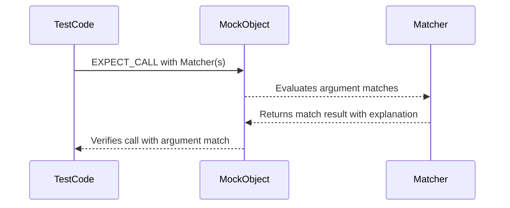

# Matchers in Mocks

GoogleMock provides a rich catalog of built-in argument matchers that allow you to specify precise and flexible conditions on mock method parameters. This page catalogs these matchers, explains their usages, and demonstrates best practices for creating expressive, readable, and robust mock expectations.

---

## Overview

Matchers in mocks serve the purpose of verifying that mock methods are called with arguments matching specific criteria. These criteria can be simple equality, comparison, string content, or complex compositions of other matchers. By leveraging matchers, your tests can express intent clearly, improve maintainability, and handle a broad variety of verification scenarios.

### Why Use Matchers?

- **Expressiveness:** Describe expected argument properties in human-readable form.
- **Flexibility:** Match any value, ranges, conditions, or custom predicates.
- **Robustness:** Guard expectations against brittle exact value matches, supporting broader verification where necessary.

---

## Core Argument Matchers

The following are the primary built-in matchers you will use to specify argument conditions in mock expectations.

### 1. Universal Matchers

- **`_`**: Matches any argument of any type.
- **`A<T>()` / `An<T>()`**: Matches any value of type `T`.

#### Example
```cpp
EXPECT_CALL(mock_obj, Foo(_));  // Accepts any argument.
EXPECT_CALL(mock_obj, Bar(A<int>()));  // Any integer argument.
```

### 2. Equality and Comparisons

- **`Eq(value)`**: Matches arguments equal to `value`.
- **`Ne(value)`**: Matches arguments not equal to `value`.
- **`Lt(value)` / `Le(value)` / `Gt(value)` / `Ge(value)`**: Matches arguments less than, less than or equal, greater than, or greater than or equal to `value`.

You can also pass literal values directly where matchers are expected, e.g., `EXPECT_CALL(mock, Foo(5))` is equivalent to `EXPECT_CALL(mock, Foo(Eq(5)))`.

#### Example
```cpp
EXPECT_CALL(mock_obj, Compute(Eq(10)));  // Expect argument equals 10
EXPECT_CALL(mock_obj, Compute(Gt(0)));  // Expect argument greater than 0
```

### 3. String Matchers

- **`StrEq(str)`**: Matches strings exactly equal to `str`.
- **`StrNe(str)`**: Matches strings not equal to `str`.
- **`StrCaseEq(str)` / `StrCaseNe(str)`**: Case-insensitive string equality or inequality.
- **`HasSubstr(substring)`**: Matches strings containing the given substring.
- **`StartsWith(prefix)` / `EndsWith(suffix)`**: Matches strings that start or end with the given string.
- **`MatchesRegex(regex)` / `ContainsRegex(regex)`**: Matches strings fully or partially matching a regex.

All string matchers support `std::string`, C strings, and `string_view` types where applicable.

#### Example
```cpp
EXPECT_CALL(mock_obj, SetName(StrEq("Alice")));
EXPECT_CALL(mock_obj, SetName(StartsWith("Al")));
EXPECT_CALL(mock_obj, Log(MatchesRegex("^Error:.*")));
```

### 4. Pointer Matchers

- **`IsNull()` / `NotNull()`**: Matches null or non-null raw or smart pointers.
- **`Pointee(matcher)`**: Matches a pointer whose pointee satisfies the `matcher`.
- **`Pointer(matcher)`**: Matches a pointer that itself matches the `matcher`.
- **`Ref(variable)`**: Matches an argument that is a reference to the specified variable.

#### Example
```cpp
EXPECT_CALL(mock_obj, SetBuffer(IsNull()));
EXPECT_CALL(mock_obj, SetBuffer(Pointee(Eq(42))));
EXPECT_CALL(mock_obj, GetReference(Ref(existing_var)));
```

### 5. Container Matchers

- **`Contains(element_matcher)`**: Matches containers with any element matching `element_matcher`.
- **`Each(element_matcher)`**: Matches containers where all elements satisfy `element_matcher`.
- **`ElementsAre(...)` / `ElementsAreArray(...)`**: Matches containers with exactly the given elements, in order.
- **`UnorderedElementsAre(...)` / `UnorderedElementsAreArray(...)`**: Matches containers with exactly the given elements, in any order.
- **`IsSubsetOf(...)` / `IsSupersetOf(...)`**: Matches containers that are subsets or supersets of the given elements or matchers.
- **`SizeIs(size_matcher)`**: Matches containers with size satisfying the `size_matcher`.
- **`WhenSorted(matcher)` / `WhenSortedBy(comparator, matcher)`**: Matches containers sorted by the comparator satisfying `matcher`.
- **`Pointwise(pair_matcher, rhs_container)`**: Matches containers element-wise with a pair matcher.

#### Example
```cpp
EXPECT_CALL(mock_obj, ProcessItems(Each(Gt(0))));
EXPECT_CALL(mock_obj, SetNames(ElementsAre("Alice", "Bob")));
EXPECT_CALL(mock_obj, SetValues(Contains(Ge(10))));
```

### 6. Tuple and Pair Matchers

- **`Pair(first_matcher, second_matcher)`**: Matches an `std::pair` whose fields satisfy the provided matchers.
- **`FieldsAre(matchers...)`**: Matches a tuple or struct fields-wise.
- **`Args<N1, N2, ...>(matcher)`**: Matches selected fields in a tuple.

#### Example
```cpp
EXPECT_CALL(mock_obj, SetKeyValue(Pair(Ge(100), StartsWith("user"))));
EXPECT_CALL(mock_obj, ProcessTuple(FieldsAre(_, Eq(42), Lt(0))));
```

### 7. Combinational Matchers

- **`Not(matcher)`**: Matches anything that doesn’t satisfy `matcher`.
- **`AllOf(matcher1, matcher2, ...)`**: Matches if *all* matchers succeed.
- **`AnyOf(matcher1, matcher2, ...)`**: Matches if *any* matcher succeeds.
- **`Conditional(condition, matcher_true, matcher_false)`**: Matches according to a runtime condition.

#### Example
```cpp
EXPECT_CALL(mock_obj, Foo(AllOf(Gt(0), Lt(10))));
EXPECT_CALL(mock_obj, Foo(AnyOf(Eq(3), Eq(5), Eq(7))));
```

### 8. Specialized Matchers

- **`Truly(predicate)`**: Matches anything for which the unary predicate returns `true`.
- **`Optional(value_matcher)`**: Matches optional-like objects whose value satisfies the matcher.
- **`VariantWith<T>(matcher)`**: Matches variant types that hold a `T` satisfying the matcher.
- **`AnyWith<T>(matcher)`**: Matches `std::any` that contains a `T` satisfying the matcher.
- **`DistanceFrom(target, matcher)`** or **`DistanceFrom(target, get_distance, matcher)`**: Matches values where distance from `target` matches the matcher.

#### Example
```cpp
EXPECT_CALL(mock_obj, ProcessValue(Truly(IsPositive)));
EXPECT_CALL(mock_obj, HandleOptional(Optional(Eq(42))));
```

---

## Using Matchers in Mock Expectations

Matchers define the criteria against which mock calls’ arguments are checked in `EXPECT_CALL` and `ON_CALL` statements.

### Defining Expectations

```cpp
// Expects Bar() to be called with an int argument > 0 and a string starting with "foo".
EXPECT_CALL(mock_obj, Bar(Gt(0), StartsWith("foo")));
```

### Composing Matchers

Combine multiple matchers logically to express complex argument conditions:

```cpp
EXPECT_CALL(mock_obj, Baz(AllOf(Ge(10), Le(20))));  // Argument between 10 and 20.
EXPECT_CALL(mock_obj, Baz(AnyOf(Eq(5), Eq(15), Eq(25))));  // Argument equal to any of these.
```

### Providing Custom Matchers

You can define your own matchers using the `MATCHER` macros. For example:

```cpp
MATCHER(IsEven, "") {
  return (arg % 2) == 0;
}

EXPECT_CALL(mock_obj, Foo(IsEven()));
```

---

## Best Practices and Tips

- **Use matchers over raw values when argument constraints are flexible.** This helps avoid brittle tests.
- **Prefer built-in matchers for common cases**, they provide better error messages and clarity.
- **Combine matchers for precise checks,** such as `AllOf`, `AnyOf`.
- **Use `Ref(variable)` to match specific references** to important test data.
- **Use container and tuple matchers to verify structured data** effectively.
- **Write custom matchers for reusable, complex conditions** to maintain test clarity.

---

## Common Pitfalls and Troubleshooting

- Using equality matchers (`Eq`) on C strings compares pointer identity, not string content. Use string matchers like `StrEq` instead.
- Expect precise argument values only when necessary; otherwise prefer flexible matchers to prevent test brittleness.
- Be mindful when matching pointer arguments; use `Pointee` or `Pointer` matchers appropriately.
- Avoid mixing raw values and matchers inconsistently in complex function signatures; use matchers for all parameters if mixing is suspected to cause issues.

---

## Example: Verifying Mock Calls with Matchers

```cpp
class Foo {
 public:
  virtual ~Foo() = default;
  virtual int Bar(int x, const std::string& s) = 0;
};

class MockFoo : public Foo {
 public:
  MOCK_METHOD(int, Bar, (int x, const std::string& s), (override));
};

TEST(MockFooTest, MatcherExample) {
  MockFoo mock;
  EXPECT_CALL(mock, Bar(Gt(0), StartsWith("prefix"))).Times(2);

  mock.Bar(5, "prefix123");  // Matches
  mock.Bar(10, "prefixXYZ"); // Matches
}
```

In this example, the `EXPECT_CALL` uses two matchers to specify that:
- The first parameter must be greater than 0
- The second parameter must be a string starting with "prefix"

The expectation is that the `Bar` method will be called exactly twice with matching arguments.

---

## Writing Custom Matchers

You can define custom matchers to encapsulate complex or frequently used argument checks:

```cpp
MATCHER(IsEven, "checks if a number is even") {
  return (arg % 2) == 0;
}

// Usage
EXPECT_CALL(mock, Foo(IsEven()));
```

Use `MATCHER_P`, `MATCHER_P2`, etc., macros to define parameterized matchers.

---

## Summary

Matchers empower you to express expectations on mock call arguments precisely. GoogleMock’s extensive set of predefined matchers address nearly all common testing needs for argument verification, with support for core types, containers, pointers, tuples, and even custom logic.

Use these matchers to write test code that is clear, maintainable, and robust. Combine and customize matchers as your testing scenarios require.

---

<Accordion title="Additional Resources">
- [GoogleTest Assertions Reference](/docs/reference/assertions.md) — for integrating matchers in assertions.
- [GoogleMock Matchers Source Code (gmock-matchers.h)](https://github.com/google/googletest/blob/main/googlemock/include/gmock/gmock-matchers.h) — for detailed implementation.
- [Guide to Mocking: Creating Mock Classes and Setting Expectations](/guides/mocking-techniques/mock-classes-expectations) — for end to end usage including matchers.
- [Working with Actions and Matchers](/guides/mocking-techniques/working-with-actions-matchers) — deeper usage with matchers.
</Accordion>

---

## Mermaid Diagram: Matcher Usage Flow



This sequence illustrates the flow of how an argument matcher participates in a mock expectation.
