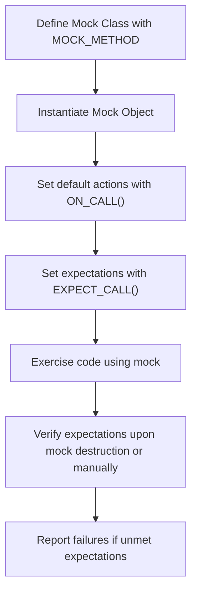

# Mock Object Definitions

This documentation explains how to define and use mock objects with GoogleMock, focusing on the `MOCK_METHOD` macros, function signature rules, constructor and destructor constraints, and guidance for integrating mocks in existing test suites.

---

## Overview

GoogleMock provides powerful facilities to define mock classes and methods to aid in unit testing C++ code. Mock objects simulate real object behavior and allow precise control over interactions and return values, improving test quality and maintainability.

The core macro for mock method definition is `MOCK_METHOD`, which you declare within the `public:` section of your mock class regardless of the access level in the base class.

To use GoogleMock mocking features, include the header:

```cpp
#include <gmock/gmock.h>
```

---

## Defining Mock Methods with `MOCK_METHOD`

The macro syntax is:

```cpp
MOCK_METHOD(ReturnType, MethodName, (Args...), (Qualifiers...));
```

- `ReturnType` - The return type of the method.
- `MethodName` - The method name.
- `(Args...)` - The argument list, surrounded by parentheses.
- `(Qualifiers...)` - Optional qualifiers such as `const`, `override`, `noexcept`, `Calltype(...)`, or `ref(...)`.

### Important Rule:

`MOCK_METHOD` must be used in the `public:` section of the mock class to ensure proper accessibility for the mocking system, even when mocking protected or private methods.

### Qualifiers:

| Qualifier                | Description                                                              |
|--------------------------|---------------------------------------------------------------------------|
| `const`                  | Marks the method as a `const` method (must match the base method).
| `override`               | Marks that the method overrides a `virtual` method (recommended).
| `noexcept`               | Marks the method as `noexcept`.
| `Calltype(convention)`    | Specifies calling convention (useful on Windows).
| `ref(&)` or `ref(&&)`    | For methods with reference qualifiers.

### Handling Arguments With Commas

Unprotected commas in template arguments confuse the macro parser:

```cpp
class MyMock {
 public:
  // Incorrect - will not compile
  MOCK_METHOD(std::pair<bool, int>, GetPair, ());
  MOCK_METHOD(bool, CheckMap, (std::map<int, double>, bool));

  // Correct: wrap return or argument types containing commas in parentheses
  MOCK_METHOD((std::pair<bool, int>), GetPair, ());
  MOCK_METHOD(bool, CheckMap, ((std::map<int, double>), bool));

  // Or use type aliases 
  using BoolInt = std::pair<bool, int>;
  using MapIntDouble = std::map<int, double>;
  MOCK_METHOD(BoolInt, GetPair, ());
  MOCK_METHOD(bool, CheckMap, (MapIntDouble, bool));
};
```

### Example Mock Class

```cpp
#include <gmock/gmock.h>

class MockFoo : public Foo {
 public:
  MOCK_METHOD(int, GetSize, (), (const, override));
  MOCK_METHOD(std::string, Describe, (const char* name), (override));
  MOCK_METHOD(std::string, Describe, (int type), (override));
  MOCK_METHOD(bool, Process, (Bar elem, int count), (override));
};
```

---

## Using Mock Classes in Tests

Typical workflow:

1. Include GoogleMock headers and import necessary symbols:
   ```cpp
   #include <gmock/gmock.h>
   using ::testing::Return;
   using ::testing::_;  // Wildcard matcher
   ```

2. Define mock classes using `MOCK_METHOD`.

3. Instantiate mock objects.

4. Optionally define default behavior for methods using `ON_CALL()`.

5. Define expectations with `EXPECT_CALL()`.

6. Exercise code under test passing the mocks.

7. Let mock destruction or manual verification confirm expectations.

### Example Test Using Mocks

```cpp
TEST(BarTest, UsageExample) {
  MockFoo foo;  // #3

  // Set default behavior
  ON_CALL(foo, GetSize()).WillByDefault(Return(1));  // #4

  // Set expectation
  EXPECT_CALL(foo, Describe(5))
      .Times(3)
      .WillRepeatedly(Return("Category 5"));  // #5

  // Exercise code
  EXPECT_EQ(MyProductionFunction(&foo), "good");  // #6
}  // #7 verification on destruction
```

### Important Usage Notes

- Set expectations **before** triggering calls on mocks. Defining `EXPECT_CALL` after the mock method is called leads to *undefined behavior*.
- Use `_` matcher for arguments you don't care about.
- For overloaded methods, disambiguate with argument types or `Const()` wrapper for const-qualified overrides.

---

## Mock Object Variants: Strictness Levels

GoogleMock defines wrappers around mock types to control the treatment of uninteresting calls (calls with no expectation).

| Wrapper                     | Behavior                                                  | Usage Example            |
|-----------------------------|-----------------------------------------------------------|--------------------------|
| `NiceMock<MockClass>`       | Suppresses warnings on uninteresting calls.              | `NiceMock<MockFoo> nice_foo;`  |
| `NaggyMock<MockClass>`      | Prints warnings on uninteresting calls (default mock behavior). | `NaggyMock<MockFoo> naggy_foo;` |
| `StrictMock<MockClass>`     | Treats uninteresting calls as test failures.              | `StrictMock<MockFoo> strict_foo;` |

### Usage

```cpp
using ::testing::NiceMock;
using ::testing::NaggyMock;
using ::testing::StrictMock;

NiceMock<MockFoo> my_nice_mock("arg1", 5);
NaggyMock<MockFoo> my_naggy_mock;
StrictMock<MockFoo> my_strict_mock;
```

### Important Notes

- These wrappers inherit all constructors of the mock class.
- They only affect mock methods defined directly in the mock class—not inherited mock methods.
- It is not supported to nest these wrappers (e.g., `NiceMock<StrictMock<MockFoo>>`).
- Virtual destructors on mocks ensure correct behavior for these wrappers.

---

## Constructor and Destructor Considerations

- Mock classes should not disable or omit the constructor and destructor.
- Constructors can be explicitly defined outside the class body to reduce compile time.
- When mocking classes with virtual destructors, ensure mocks override the destructor for correct object lifecycle.

### Mocking Destructors

C++ destructors can’t be mocked directly using `MOCK_METHOD`. Instead, define a mock method (e.g., `Die()`) and call it from the destructor:

```cpp
class MockFoo : public Foo {
 public:
  MOCK_METHOD(void, Die, ());
  ~MockFoo() override { Die(); }
};

// Test example
EXPECT_CALL(mock_foo, Die()).Times(1);
```

This pattern allows verifying that the mock object is destroyed at the correct time.

---

## Integrating Mocks in Existing Test Suites

- Define your mock classes in the appropriate test or testing subdirectory.
- Place `MOCK_METHOD` declarations in the public section of the mock class.
- When mocking external interfaces, consider wrapping those interfaces or defining adapter interfaces owned by your codebase.
- Use `ON_CALL` to set default behaviors shared among tests.
- Use `EXPECT_CALL` to set expectations specific to each test case.
- Consider using `NiceMock` or `StrictMock` to manage warnings and errors on uninteresting calls.
- Avoid setting expectations after using the mocks in tested code.
- Explicitly verify mocks when necessary using `Mock::VerifyAndClearExpectations` or `Mock::VerifyAndClear`.
- Use `Mock::AllowLeak` if you expect intentional leaks of mocks to avoid test failures.

---

## Common Pitfalls and Best Practices

- Always use `MOCK_METHOD` in the public section, regardless of the visibility in the base class.
- Wrap function signatures with commas in appropriate parentheses or use type aliases.
- Confirm virtual destructors are present in base classes to prevent memory leaks.
- Set expectations before exercising the mocks.
- Avoid mixing calls to `EXPECT_CALL()` and mock method invocations.
- Use `RetiresOnSaturation()` to make expectations non-sticky when expecting multiple sequential calls.
- Use `InSequence` or `After` for ordering expectations.
- Use `ON_CALL` for default behavior and `EXPECT_CALL` to verify calls.
- Use `NiceMock` to suppress unnecessary warnings and `StrictMock` to enforce strict verification.

---

## Example Mock Definition and Usage Workflow

```cpp
#include <gmock/gmock.h>

class MyInterface {
 public:
  virtual ~MyInterface() = default;
  virtual int Compute(int x) const = 0;
  virtual void Reset() = 0;
};

class MockMyInterface : public MyInterface {
 public:
  MOCK_METHOD(int, Compute, (int x), (const, override));
  MOCK_METHOD(void, Reset, (), (override));
};

// In a test
#include <gtest/gtest.h>
using ::testing::Return;
using ::testing::_;

TEST(MyTest, ComputeReturnsExpected) {
  MockMyInterface mock;

  // Set default behavior
  ON_CALL(mock, Compute(_)).WillByDefault(Return(42));

  // Verify Reset is called exactly once
  EXPECT_CALL(mock, Reset()).Times(1);

  // Verify Compute is called with 5 and returns 10 once
  EXPECT_CALL(mock, Compute(5)).WillOnce(Return(10));

  // Use mock in code
  EXPECT_EQ(10, mock.Compute(5));
  EXPECT_EQ(42, mock.Compute(3));  // Uses default action
  mock.Reset();
}
```

---

## Related Resources

- [Mocking Reference](docs/reference/mocking.md)
- [gMock Cheat Sheet](docs/gmock_cheat_sheet.md)
- [gMock for Dummies](docs/gmock_for_dummies.md)
- [gMock Cookbook](docs/gmock_cook_book.md)
- [Nice, Naggy, and Strict Mocks](guides/mocking-advanced-techniques/nice-naggy-strict-mocks)

For detailed matchers and actions, see the Matchers and Actions references.

---

## Troubleshooting

- If you get warnings about uninteresting calls, consider if the mock should be NiceMock or add appropriate `EXPECT_CALL`s with `Times(AnyNumber())`.
- If mocking methods in a class without a virtual destructor, suspect memory leaks or undefined behavior.
- If your expectations are not met, run tests with `--gmock_verbose=info` to get detailed call traces.
- For overloaded methods, ensure to specify argument types or use `Const()` wrappers to prevent ambiguity.

---

## Summary Diagram: Mock Class Workflow



---

This concludes the reference for defining and using mock objects with GoogleMock, emphasizing clean definition patterns, method qualifiers, strictness levels, best integration practices, and verification guidance.