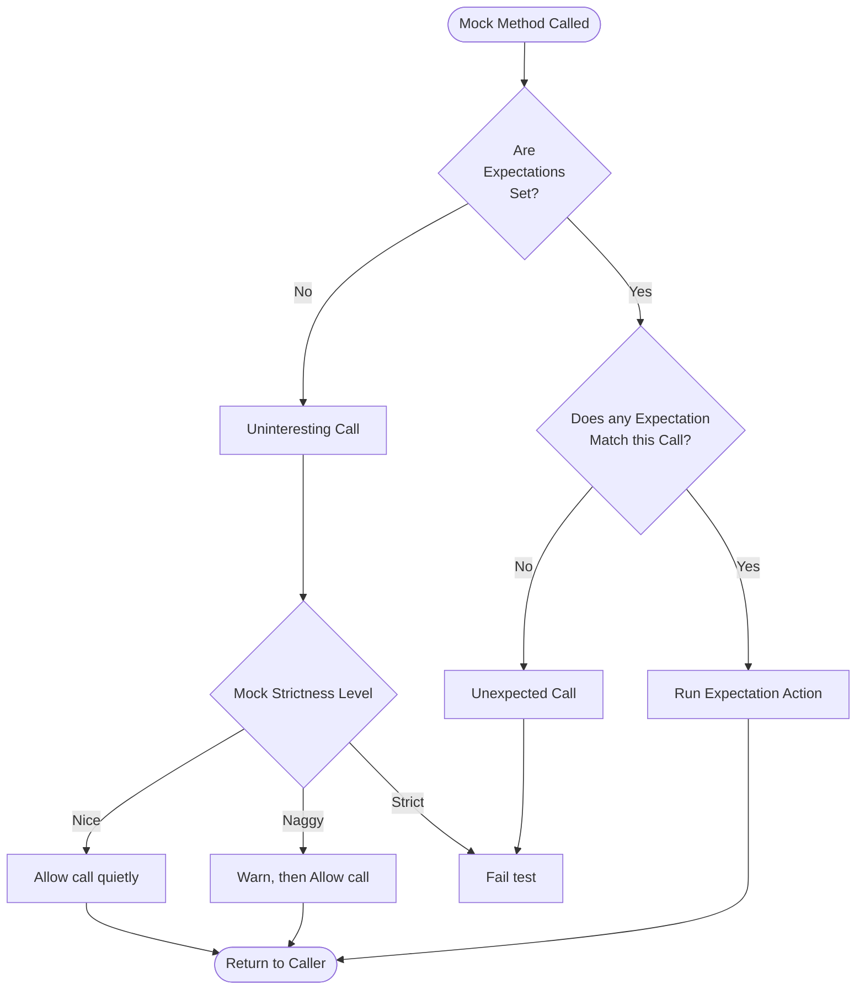

# Nice, Naggy, and Strict Mocks

This page describes the API for configuring the strictness levels of mock objects in GoogleMock. It explains how uninteresting calls to mocks—calls with no set expectations—are handled differently depending on the mock's strictness, and guides you through controlling, testing, and customizing warning and error behaviors.

---

## Overview

When writing tests using GoogleMock, you often have to decide how strict your mocks should be about calls that you don't explicitly expect or specify behavior for. GoogleMock provides three distinct behaviors for mocks regarding such "uninteresting calls":

- **Nice Mocks**: Allow uninteresting calls silently, without warning.
- **Naggy Mocks** (default): Warn on uninteresting calls but allow them.
- **Strict Mocks**: Treat uninteresting calls as test failures.

This behavior controls the verbosity and strictness of your test assertions, helping you write robust yet maintainable tests.

## Importance of Strictness Levels

Imagine a test with a mock object `MockFoo`. You explicitly set expectations on some methods but remain silent on others. When those other methods get called unintentionally:

- A **nice mock** will quietly ignore them.
- A **naggy mock** will print warnings but keep the test passing.
- A **strict mock** will fail the test immediately.

Using the appropriate strictness level helps catch accidental or unwanted interactions early or ignore benign calls as needed.

---

## Creating Nice, Naggy, and Strict Mocks

GoogleMock provides three template wrappers that modify the behavior of your mock classes with respect to uninteresting calls:

```cpp
using ::testing::NiceMock;
using ::testing::NaggyMock;
using ::testing::StrictMock;

// Example usage:
NiceMock<MockFoo> nice_foo;    // suppresses warnings for uninteresting calls
NaggyMock<MockFoo> naggy_foo;  // warns on uninteresting calls (default behavior)
StrictMock<MockFoo> strict_foo; // treats uninteresting calls as failures
```

These template wrappers subclass your mock class and "inherit" its constructors, so you can use arguments that your mock class supports.

### Example: Using NiceMock

```cpp
class MockFoo {
 public:
  MOCK_METHOD(void, DoThis, (), ());
  MOCK_METHOD(int, DoThat, (bool flag), ());
};

TEST(MyTest, NiceMockExample) {
  NiceMock<MockFoo> mock;

  // Calling an uninteresting method produces no warning or failure
  mock.DoThis();  

  EXPECT_CALL(mock, DoThat(true));
  mock.DoThat(true);  // This call is expected and verified
}
```

### Example: Using StrictMock

```cpp
StrictMock<MockFoo> mock;
EXPECT_CALL(mock, DoThis());

mock.DoThis();         // OK
mock.DoThat(false);    // Fails test: unexpected call treated as error
```

---

## Behavior Details

### Uninteresting Calls

- These are calls to mock methods with **no** `EXPECT_CALL` expectations set.
- In Naggy mocks, these produce warnings printed to standard output.
- In Nice mocks, they produce no warnings or failures.
- In Strict mocks, they cause immediate test failures.


### Unexpected Calls

- Calls with arguments that do not match **any existing** `EXPECT_CALL`.
- Always treated as errors regardless of strictness.

### Interactions with Default Actions

If you define default actions using `ON_CALL()` for uninteresting methods, those get run for the uninteresting calls. However, if you want to suppress the warnings, use NiceMock.


### Construction and Destruction

The strictness behavior is active for the whole lifetime of the mock object, including during construction (calls within the constructor) and destruction (calls within the destructor).

---

## How to Control and Test Warning and Error Behaviors

The strictness levels are controlled using `NiceMock`, `NaggyMock`, and `StrictMock` wrapper templates around your mock classes. Here’s how to utilize and test their behavior:


### Making a Mock Nice

Wrap your mock class in `NiceMock<>`:

```cpp
NiceMock<MockFoo> nice_mock;
```

Use this when you want to ignore all uninteresting calls without any warnings.

### Making a Mock Naggy (the Default)

Simply instantiate your mock normally or use `NaggyMock<>` explicitly:

```cpp
MockFoo naggy_mock;             // defaults to naggy behavior
NaggyMock<MockFoo> naggy_mock; // same as above
```

This prints warnings for uninteresting calls but continues the test.

### Making a Mock Strict

Wrap your mock class in `StrictMock<>`:

```cpp
StrictMock<MockFoo> strict_mock;
```

This treats uninteresting calls as test failures.

### Testing Strictness Behavior

GoogleTest includes extensive unit tests verifying that the strictness behaviors work correctly, such as:

- Warnings are printed on uninteresting calls for Naggy mocks.
- No warnings or errors for Nice mocks on uninteresting calls.
- Test failures on uninteresting calls for Strict mocks.
- Strictness applies in constructors and destructors.

You can enable verbose output using the `--gmock_verbose` flag with levels `info`, `warning`, or `error` to observe behaviors.


### Example: Setting Verbosity for Diagnostic Output

```cpp
GMOCK_FLAG_SET(verbose, "info");
NiceMock<MockFoo> nice;
nice.DoThis();  // Will print info-level log about uninteresting call
```

---

## Best Practices and Common Pitfalls

- **Use NiceMock for typical tests** to avoid brittle failures due to uninteresting calls.
- Use **NaggyMock** when debugging or developing tests to get warnings for unexpected mock calls.
- Use **StrictMock sparingly**, only when you want strict enforcement to catch unintended calls.
- Avoid mixing constructs: do not nest NiceMock inside StrictMock or vice versa.
- Make sure your mock class destructors are virtual to ensure strictness applies correctly.
- Remember that only mock methods defined directly via `MOCK_METHOD` in your mock class are affected properly by strictness modifiers.

### Allowing Mock Objects to Leak

Sometimes you want to prevent GoogleMock from reporting leaked mocks as errors, especially for mocks created with strictness modifiers:

```cpp
NiceMock<MockFoo>* leaked = new NiceMock<MockFoo>;
Mock::AllowLeak(leaked);
```

This is useful in tests where the mock objects are passed to other systems that manage their lifetime.

### Mock Classes without Default Constructors

You can create strictness wrappers for mocks that do not have default constructors, passing constructor arguments through:

```cpp
NiceMock<MockBar> nice_bar("argument");
StrictMock<MockBar> strict_bar(1, 2, "foo");
```

---

## Summary

GoogleMock’s strictness wrappers give you flexible tools to control how uninteresting mock calls are treated, balancing verbosity, test strictness, and maintainability. Choose your strictness level according to the needs of your tests, use explicit verbosity settings to debug, and leverage test expectations like `EXPECT_CALL` to validate interactions.

---

## Reference

- [`NiceMock<T>`](https://google.github.io/googletest/reference/mocking_8h_source.html) - suppresses warnings on uninteresting calls
- [`NaggyMock<T>`](https://google.github.io/googletest/reference/mocking_8h_source.html) - warns on uninteresting calls (default behavior)
- [`StrictMock<T>`](https://google.github.io/googletest/reference/mocking_8h_source.html) - treats uninteresting calls as errors
- [`Mock::AllowLeak()`](https://google.github.io/googletest/reference/classtesting_1_1Mock.html#aa19fca9c7e85d47fdf4f7dbdb03aa6b9) - prevents leak detection failures
- [gMock Cheat Sheet section on Nice, Naggy, and Strict Mocks](https://google.github.io/googletest/gmock_cheat_sheet.html#NiceStrictNaggy)
- [gMock Cookbook chapter: The Nice, the Strict, and the Naggy](https://google.github.io/googletest/gmock_cook_book.html#NiceStrictNaggy)

---

## Troubleshooting

- If you don’t see your strictness behavior working as expected, verify that:
  - Your mock methods use the `MOCK_METHOD` macro directly in the mock class.
  - Your mock class destructor is virtual.
  - You are using the appropriate strictness wrapper class.
- Use `--gmock_verbose=info` during test execution to trace mock calls and see matching expectations and strictness handling.
- Beware that strict mocks cause test failures for any uninteresting call, so use carefully to avoid fragile tests.

---

## Diagram: Strictness Behavior Flow



This flowchart illustrates how calls to mocks are processed. If there are no expectations, the behavior depends on the mock's strictness (Nice, Naggy, Strict). Unexpected calls always cause test failures.

---