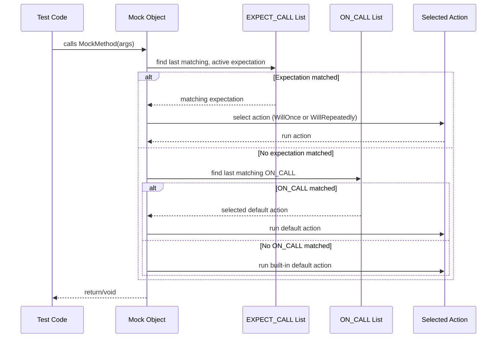

# Setting Expectations and Behavior

This reference documents how to use the core GoogleMock macros and classes that allow you to define the expected behavior of mock objects: `ON_CALL()`, `EXPECT_CALL()` and their associated fluent APIs. These tools let you specify default actions, exact call expectations, call counts, sequences, and ordering for mock methods — key techniques for precise, reliable mock verification.

---

## Introduction

GoogleMock provides two fundamental macros for controlling how mock methods behave during your tests:

- **`ON_CALL()`**: Defines the *default behavior* of your mock method when it is called with matching arguments. It sets the action the mock will perform but *does not* assert that the call must happen.

- **`EXPECT_CALL()`**: Specifies *expected calls* on mock methods, along with how many times they should be called, the order in which calls happen, and the behavior (return values, side effects) of those calls. It asserts that the calls must occur as specified.

Understanding when and how to use each is critical for writing flexible, maintainable tests that verify interactions precisely without over-constraining them.

---

## ON_CALL: Setting Default Behavior

### Purpose

`ON_CALL()` lets you configure the *default action* a mock method takes when called with particular argument patterns, without creating an expectation that the call must occur.

This is ideal for:

- Setting up common return values and side effects shared across many tests.
- Providing sensible fall-back actions so tests do not fail on uninteresting calls.

### Syntax

```cpp
ON_CALL(mock_object, Method(matchers...))
    .With(multi_argument_matcher)  // optional
    .WillByDefault(action);
```

- `mock_object`: Your mock object instance.
- `Method(matchers...)`: The method name of the mock and argument matchers. If omitted, implies wildcard match (`_`) for all arguments. For overloaded methods, must specify argument types to disambiguate.
- `.With(multi_argument_matcher)`: Optionally restricts the entire argument tuple with a multi-argument matcher.
- `.WillByDefault(action)`: Defines the default action when the call matches the argument matchers.

### Key Points

- `.WillByDefault()` **must** be called exactly once.
- You can have multiple `ON_CALL()` instances on the same method with different matchers — the *last matching* action applies.
- `ON_CALL()` *does not* impose any call count verification — the methods may be called zero or many times.

### Example

```cpp
using ::testing::Return;
using ::testing::_;

MockFoo foo;

ON_CALL(foo, GetSize()).WillByDefault(Return(42));
// By default, GetSize() will return 42 unless overridden by an EXPECT_CALL

ON_CALL(foo, Describe(_, _)).With(Lt()).WillByDefault(Return(true));
// Default behavior for Describe() when the entire tuple of arguments
// matches the multi-argument matcher Lt()
```


---

## EXPECT_CALL: Defining Call Expectations

### Purpose

`EXPECT_CALL()` declares expectations on mock methods, specifying:

- That the method must be called.
- How many times it must be called.
- Constraints on its arguments.
- What to do when it is called.

This is essential for verifying interactions precisely in your tests.

### Syntax

```cpp
EXPECT_CALL(mock_object, Method(matchers...))
    .With(multi_argument_matcher)     // optional, must be first
    .Times(cardinality)               // optional, inferred if omitted
    .InSequence(sequences...)         // optional, can appear multiple times
    .After(expectations...)           // optional, can appear multiple times
    .WillOnce(action)                 // optional, can appear multiple times
    .WillRepeatedly(action)           // optional, at most once
    .RetiresOnSaturation();           // optional, at most once
```

All clauses must be used in the above order. Clauses marked optional can be omitted.

### Clause Details

#### With

- `.With(multi_argument_matcher)`: Restricts the expectation to calls where all arguments as a tuple satisfy the matcher.
- Must be the first clause and can be used at most once.
- Useful when you want to express conditions spanning multiple arguments.

#### Times

Defines how many times the call is expected. Accepts GoogleTest cardinalities such as:

| Cardinality       | Meaning                                         |
|-------------------|-------------------------------------------------|
| `AnyNumber()`     | Zero or more calls allowed.                      |
| `AtLeast(n)`      | At least *n* calls expected.                     |
| `AtMost(n)`       | At most *n* calls expected.                      |
| `Between(m, n)`   | Between *m* and *n* calls, inclusive.            |
| `Exactly(n)` or `n`| Exactly *n* calls (0 means never called).       |

If omitted, cardinality is inferred:

- No `.WillOnce` or `.WillRepeatedly` specified → `Times(1)`.
- *n* `.WillOnce()` and no `.WillRepeatedly()` → `Times(n)`.
- *n* `.WillOnce()` and `.WillRepeatedly()` present → `Times(AtLeast(n))`.

Can appear at most once.

#### InSequence

- `.InSequence(sequences...)` adds the expectation to one or more sequence objects to impose call order.
- Expectations in the same sequence must be satisfied in the order declared.
- Can appear any number of times to belong to multiple sequences.

#### After

- `.After(expectations...)` restricts the call to occur after other expectation(s) or expectation set(s).
- Useful to enforce partial orders or dependencies between expectations.
- Can accept up to 5 Expectations or ExpectationSets.
- Can appear multiple times.

#### WillOnce

- `.WillOnce(action)` specifies the behavior when the expectation is matched, for one call.
- Multiple `.WillOnce()` calls stack; the nth call uses the nth action.
- The set of actions provided should correspond to the expected call count.

#### WillRepeatedly

- `.WillRepeatedly(action)` defines the behavior after all `.WillOnce()` actions have been exhausted.
- Only one `.WillRepeatedly()` allowed.

#### RetiresOnSaturation

- `.RetiresOnSaturation()` causes the expectation to be deactivated after its upper-bound call count is reached.
- Useful for chaining multiple expectations with different arguments, so saturation proceeds correctly.
- Can appear at most once and must be last.

### Example

```cpp
using ::testing::_;
using ::testing::Return;
using ::testing::InSequence;
using ::testing::Exactly;

MockFoo foo;

EXPECT_CALL(foo, Bar(5))         // Expect Bar(5) to be called exactly once
    .Times(Exactly(1))
    .WillOnce(Return('x'));

EXPECT_CALL(foo, Bar(_))         // Expect Bar called with any other arg any number of times
    .Times(::testing::AnyNumber())
    .WillRepeatedly(Return('y'));

{
  InSequence s;                 // Enforce order for these calls

  EXPECT_CALL(foo, Baz(1));    // Baz(1) must be called before Baz(2)
  EXPECT_CALL(foo, Baz(2));
}
```

### Behavior Notes

- Expectations are "sticky" by default: they remain active even after saturation unless `.RetiresOnSaturation()` is specified.
- The most recently declared expectation that matches is chosen first.
- On saturation, extra calls matching the expectation cause test failures unless default behaviors are defined.

### Handling Ordered Calls

To enforce call order globally across multiple expectations, use the 
`InSequence` object:

```cpp
{ InSequence seq;
  EXPECT_CALL(mock, FirstCall());
  EXPECT_CALL(mock, SecondCall());
}
```

All expectations declared inside the scope of `seq` are added to an implicit sequence enforcing strict ordering.

You can also build partial orders with sequences as parameters to `.InSequence()` or causal orderings with `.After()` clauses.

## Expectation and Sequence Concepts

### `Expectation` and `ExpectationSet`

These objects represent handles to individual or groups of expectations returned by `EXPECT_CALL()`. They can be used to define partial ordering via `.After()` clauses:

```cpp
Expectation e1 = EXPECT_CALL(mock, InitX());
Expectation e2 = EXPECT_CALL(mock, InitY());
EXPECT_CALL(mock, DoWork()).After(e1, e2);
```

`ExpectationSet` can hold multiple expectations, useful for larger groups:

```cpp
ExpectationSet all_inits;
for (int i = 0; i < n; ++i) {
  all_inits += EXPECT_CALL(mock, InitElement(i));
}
EXPECT_CALL(mock, Finalize()).After(all_inits);
```

### `Sequence`

A `Sequence` object represents a strict chronological ordering of expectations where each expectation added via `.InSequence()` must be completed before the next.

## Best Practices

- Prefer using `ON_CALL()` for setting up behavioral defaults.
- Use `EXPECT_CALL()` only when you want to verify calls happen.
- When expecting a series of calls in order, use `InSequence` or `.After()` for clarity.
- Use `.RetiresOnSaturation()` for expectations that should stop matching after a number of calls, especially in chains.
- Avoid mixing expectation setting and exercising the mock — set *all* expectations before exercising code.
- Use wildcard (`_`) matchers when argument values aren’t important.

## Common Error Scenarios and Debugging Tips

| Scenario                                        | Description                                                                           | Resolution Tip                                      |
|------------------------------------------------|---------------------------------------------------------------------------------------|----------------------------------------------------|
| Unexpected Call                                 | Call does not match any `EXPECT_CALL`.                                                | Add matching `EXPECT_CALL` or adjust matchers.     |
| Excessive Call                                  | Call count exceeds `.Times()` upper bound.                                            | Use `.RetiresOnSaturation()` or adjust `.Times()`. |
| Uninteresting Call Warnings                     | Call to a method with no expectations (naggy mock).                                 | Use `NiceMock` or suppress with catch-all expectation. |
| Argument Mismatch                               | Call arguments do not match specified matchers.                                      | Verify matcher logic and refine matchers.           |
| Unsatisfied Prerequisites                        | `.After()` clauses not fulfilled before a call.                                       | Check ordering of calls and `.After()` usage.        |

Enable verbose output using `--gmock_verbose=info` to see detailed call matching and stack traces.

---

## Verifying and Resetting Mocks

GoogleMock automatically verifies expectations when mock objects are destructed. To verify and clear a mock's expectations explicitly, use:

```cpp
#include <gmock/gmock.h>

Mock::VerifyAndClearExpectations(&mock_obj);
Mock::VerifyAndClear(&mock_obj);  // Also clears ON_CALL defaults
```

Avoid setting new expectations after verification as behavior is undefined.

If you want GoogleMock to ignore leak checks for a mock, use:

```cpp
Mock::AllowLeak(&mock_obj);
```

---

## Code Examples

### Using ON_CALL and EXPECT_CALL

```cpp
using ::testing::Return;
using ::testing::_;

class MockFoo {
 public:
  MOCK_METHOD(int, GetValue, (), ());
};

TEST(FooTest, Demonstrate) {
  MockFoo mock;

  // Set default behavior
  ON_CALL(mock, GetValue()).WillByDefault(Return(10));

  // Expect exactly two calls
  EXPECT_CALL(mock, GetValue()).Times(2);

  EXPECT_EQ(mock.GetValue(), 10);  // uses ON_CALL default
  EXPECT_EQ(mock.GetValue(), 10);
}
```

### Ordering calls using InSequence

```cpp
using ::testing::InSequence;
using ::testing::Return;

class MockBar {
 public:
  MOCK_METHOD(void, First, (), ());
  MOCK_METHOD(void, Second, (), ());
};

TEST(BarTest, OrderedCalls) {
  MockBar mock;
  {
    InSequence seq;

    EXPECT_CALL(mock, First());
    EXPECT_CALL(mock, Second());
  }

  mock.First();    // OK
  mock.Second();   // OK
}
```

### Using After to specify partial order

```cpp
Expectation e1 = EXPECT_CALL(mock, InitA());
ExpectationSet es;
es += EXPECT_CALL(mock, InitB());
es += EXPECT_CALL(mock, InitC());
EXPECT_CALL(mock, Work()).After(e1, es);
```

Calls to `Work()` won't be matched until after `InitA()`, `InitB()` and `InitC()` have been called.

---

## Summary

- `ON_CALL()` sets *default behavior* for mock methods without requiring calls.
- `EXPECT_CALL()` sets *expected calls*, call counts, call ordering, and mock actions.
- The `With()`, `Times()`, `InSequence()`, `After()`, `WillOnce()`, `WillRepeatedly()`, and `RetiresOnSaturation()` clauses provide powerful, composable building blocks for precise mock interaction verification.
- Use `Expectation` and `Sequence` to specify complex call ordering and dependencies.
- Verification occurs automatically on mock destruction or explicitly via `Mock::VerifyAndClearExpectations()`.

---

For full usage details, consult the [Mocking Reference](../reference/mocking.md), the [gMock for Dummies](../guides/gmock_for_dummies.md) tutorial, and check the [gMock Cheat Sheet](../docs/gmock_cheat_sheet.md) for quick syntax tips. For complex scenarios, see the [gMock Cookbook](../docs/gmock_cook_book.md).

---

## Troubleshooting

### Common issues

- **Uninteresting call warnings**: Use `EXPECT_CALL(...).Times(AnyNumber())` or `NiceMock` to suppress.
- **Too few or too many actions (WillOnce/WillRepeatedly mismatch `Times()`)**: Check that the number of `.WillOnce()` clauses matches the specified `Times()`.
- **Unexpected calls**: Confirm that the argument matchers accurately reflect expected call arguments.
- **Call ordering failures**: Verify sequence or `.After()` usage.

Enabling verbose logging (`--gmock_verbose=info`) reveals detailed invocation matching and call stack, assisting rapid debugging.

---

## Further Reading

- [ON_CALL](../reference/mocking.md#ON_CALL)
- [EXPECT_CALL](../reference/mocking.md#EXPECT_CALL) and its clauses
- [Match expressions and matchers](../concepts/extensibility-matchers-actions/matcher-model.md)
- [Actions and custom behaviors](../concepts/extensibility-matchers-actions/actions-architecture.md)

---

<Callout>
Always set expectations before the mock is exercised to avoid undefined behavior.
</Callout>

<Callout>
Use `.RetiresOnSaturation()` to avoid "sticky" expectations when modeling sequences of calls.
</Callout>

<Callout>
For multi-threaded tests, set expectations before concurrent usage; GoogleMock handles synchronization internally.
</Callout>

---

## Diagram: Simplified Flow of Call Matching and Behavior Selection



This flow illustrates how GoogleMock determines which expectation or default action to use for every mock method call.

---

## Summary

This reference equips you with authoritative knowledge on controlling GoogleMock mock method behaviors and expectations. Proper use of `ON_CALL()` and `EXPECT_CALL()` with their detailed clause APIs enables fine-grained, verifiable mock behaviors essential for robust unit testing.


