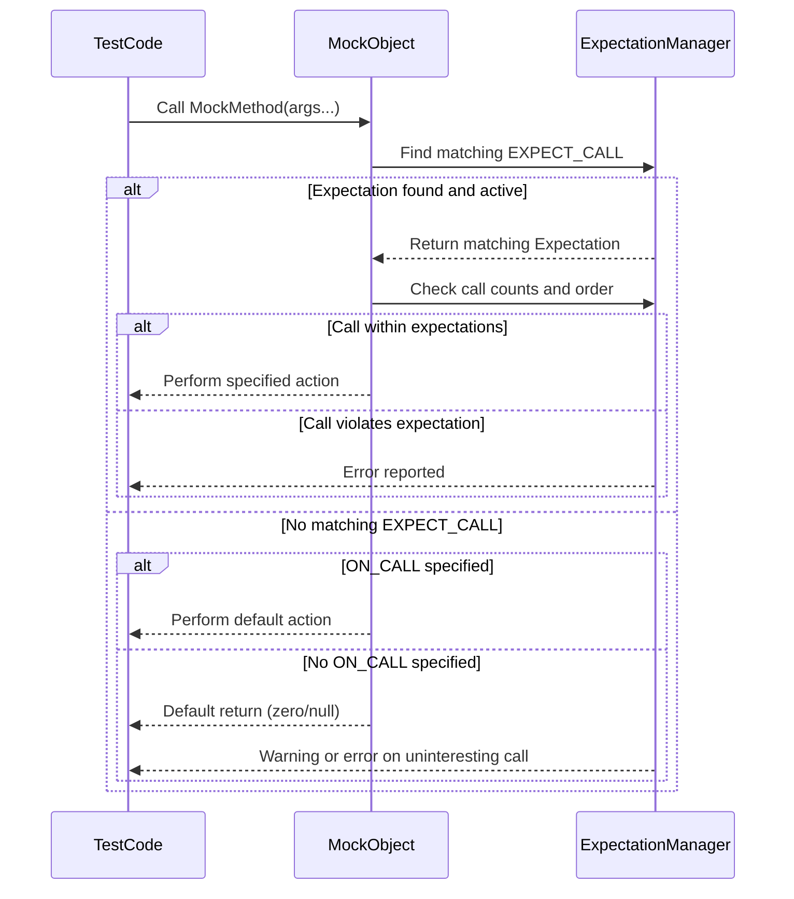

# Expectations, Actions, and Sequences

GoogleMock empowers you to precisely specify how mock objects behave, which calls are expected, their ordering, and how they're verified. This guide dives into the core mechanisms for setting expectations on mocks, defines call behaviors (actions), arranges call ordering with sequences, and explains verification and error reporting.

---

## Setting Expectations: ON_CALL and EXPECT_CALL

Mock interactions hinge on expressing what calls to mock methods are expected or may happen, and what they will do. GoogleMock employs two foundational constructs:

- `ON_CALL` — Defines the *default behavior* of a mock method when called, without enforcing that the call must occur.
- `EXPECT_CALL` — Specifies an *expectation* that a method *will be called*, how many times, with what arguments, and what it will do.


### ON_CALL

An `ON_CALL` statement customizes the default behavior of matching mock calls. It:

- Matches calls based on argument matchers.
- Specifies a default action to take when the call happens.
- Does **not** set expectations for the call count — the method may or may not be called.


#### Syntax

```cpp
ON_CALL(mock_object, Method(argument_matchers...))
    .With(multi_argument_matcher)   // Optional
    .WillByDefault(action);
```


#### Example

```cpp
using ::testing::Return;  

ON_CALL(mock_turtle, GetX())
    .WillByDefault(Return(100));
```

This means whenever `GetX()` is called (and no other `EXPECT_CALL` matches), the mock returns 100.


#### Practical tip

- Use `ON_CALL` to specify common default behaviors shared across many tests.
- To suppress uninteresting call warnings, either use `NiceMock<T>` or explicitly expect the call with `EXPECT_CALL`.


### EXPECT_CALL

`EXPECT_CALL` creates an *expectation* that method calls matching specified arguments will occur. It lets you precisely control:

- The argument matchers that calls must satisfy.
- How many times calls are expected (`Times` / cardinalities).
- The order in which calls happen (`InSequence` and `After`).
- What actions the method performs on each call.


#### Syntax

```cpp
EXPECT_CALL(mock_object, Method(argument_matchers...))
    .With(multi_argument_matcher)   // Optional
    .Times(cardinality)             // Optional (inferred if missing)
    .InSequence(sequences...)       // Optional
    .After(expectations...)         // Optional
    .WillOnce(action)               // Can appear multiple times
    .WillRepeatedly(action)         // Optional
    .RetiresOnSaturation();         // Optional
```


#### Examples

Set an expectation that `Forward(100)` is called exactly once and returns void:

```cpp
EXPECT_CALL(turtle, Forward(100)).Times(1);
```

Set an expectation that `GetX()` will be called 3 times and return different values in sequence:

```cpp
using ::testing::Return;
EXPECT_CALL(turtle, GetX())
    .WillOnce(Return(10))
    .WillOnce(Return(20))
    .WillOnce(Return(30));
```

Specify that an expectation should allow any number of calls:

```cpp
using ::testing::AnyNumber;
EXPECT_CALL(turtle, PenUp()).Times(AnyNumber());
```


### Argument Matching

Arguments passed during calls are matched against matchers provided in `EXPECT_CALL` or `ON_CALL`. Matchers range from simple exact matches (e.g., `100`) to wildcards (`_`) and complex predicates.

```cpp
EXPECT_CALL(foo, Bar(Ge(5)));  // argument must be >= 5
EXPECT_CALL(foo, Baz(_, NotNull()));  // second argument must not be null
```


### Matchers with `.With()`

You can further constrain expectations using the `.With()` clause to apply a multi-argument matcher on the entire tuple of arguments.

```cpp
EXPECT_CALL(foo, SetPosition(_, _))
    .With(Lt()); // First argument less than second
```


### Cardinalities: How Many Calls?

Cardinalities specify how many calls are expected. Common cardinalities provided include:

| Cardinality           | Meaning                                           |
|-----------------------|---------------------------------------------------|
| `AnyNumber()`         | Any number, including zero.                        |
| `AtLeast(n)`          | At least `n` times.                               |
| `AtMost(n)`           | At most `n` times.                                |
| `Between(m, n)`       | Between `m` and `n` times inclusive.              |
| `Exactly(n)` or `n`   | Exactly `n` times.                                 |

If `Times()` is omitted, cardinality is inferred:

- No `.WillOnce()` or `.WillRepeatedly()`: `Times(1)`
- *n* `.WillOnce()` clauses, no `.WillRepeatedly()`: `Times(n)`
- *n* `.WillOnce()` and a `.WillRepeatedly()` clause: `Times(AtLeast(n))`


### Ordering Expectations

By default, calls do not have to happen in a particular order. When ordering is required:

- Use [`InSequence`](#) to create a sequence object and group expected calls. Calls in the sequence must occur in order.
- Use `.After()` clause to require one expectation happens only after another.

Example:

```cpp
using ::testing::Sequence;
Sequence s1, s2;
EXPECT_CALL(mock, Reset()).InSequence(s1, s2);
EXPECT_CALL(mock, GetSize()).InSequence(s1);
EXPECT_CALL(mock, Describe()).InSequence(s2);
```


### Retiring Expectations

By default, expectations stay active even after reaching their call count limit (sticky). To disable this and retire a saturated expectation (making it inactive), use `.RetiresOnSaturation()`.

Example:

```cpp
EXPECT_CALL(mock, SetNumber(7))
    .Times(2)
    .RetiresOnSaturation();
```

This allows other expectations to match additional calls after retirement.

---

## Specifying Actions

Actions define what a mock method does when called. If no action is specified, default actions are taken:

- For `void` methods: do nothing and return.
- For numeric, pointer, or default-constructible return types: return zero, null, or default value.


### Common Action Clauses

- `.WillOnce(action)`: Defines behavior for *one* matching call. Can repeat to specify different behavior on subsequent calls.
- `.WillRepeatedly(action)`: Defines behavior for all calls after those covered by `.WillOnce()`.


### Examples

Return a fixed value on a call:

```cpp
EXPECT_CALL(mock, Compute())
    .WillOnce(Return(42));
```

Return different values on successive calls:

```cpp
EXPECT_CALL(mock, GetNext())
    .WillOnce(Return(1))
    .WillOnce(Return(2))
    .WillRepeatedly(Return(3));
```

Invoke a custom lambda for side effects or computed return:

```cpp
EXPECT_CALL(mock, Calculate(_))
    .WillOnce([](int x) { return x * 2; });
```

Perform multiple actions in sequence:

```cpp
EXPECT_CALL(mock, Modify(_))
    .WillOnce(DoAll(SetArgPointee<0>(5), Return(true)));
```


### Built-in Actions (Summary)

| Action                      | Description                                |
|-----------------------------|--------------------------------------------|
| `Return(value)`             | Return the given value.                      |
| `ReturnRef(variable)`       | Return a reference to a variable.           |
| `ReturnPointee(pointer)`    | Return the value pointed by the pointer.   |
| `SetArgPointee<N>(value)`  | Assigns `value` to the N-th parameter, pointer target.
| `DoDefault()`               | Invoke default action (from ON_CALL).        |
| `Invoke(function)`          | Calls a function or functor with the mock call's arguments.|
| `InvokeWithoutArgs(function)` | Calls a nullary function ignoring mock call's args.
| `InvokeArgument<N>(...)`    | Calls the N-th argument if it is a callable.
| `DoAll(a1, a2, ..., an)`    | Performs all actions in order; returns last action's value.
| `IgnoreResult(action)`      | Ignores return value of an action.
| `Throw(exception)`          | Throws the given exception.


---

## Sequences and Ordering of Calls

Mocking complex interactions often requires ordering constraints:

- **Sequences** let you group expectations that must be called in order.
- The `InSequence` helper adds all expectations in its scope to an anonymous sequence.
- The `After()` clause expresses complex partial orders between expectations.


### Using `InSequence`

```cpp
using ::testing::InSequence;
{
  InSequence seq;
  EXPECT_CALL(mock, Init());
  EXPECT_CALL(mock, Start());
  EXPECT_CALL(mock, Stop());
}
```

Here, `Init()` must occur before `Start()`, which must occur before `Stop()`.

### Partial Ordering with `After()`

Allows expressing expectations that must happen once one or more other expectations occur, but without necessarily requiring total order between them.

```cpp
Expectation e1 = EXPECT_CALL(mock, Init());
Expectation e2 = EXPECT_CALL(mock, Setup());
EXPECT_CALL(mock, Run()).After(e1, e2);
```

Ensures `Run()` is called only after both `Init()` and `Setup()`.


---

## Verification and Error Reporting

GoogleMock automatically verifies that expectations are met when some or all of:

- The mock object is destructed.
- You explicitly call `Mock::VerifyAndClearExpectations(&mock_obj)` to force verification early.


### What happens if expectations are violated?

If calls do not match the expectations by argument, call count, or order, GoogleMock produces detailed failure messages, including:

- The expected calls, their source locations.
- What arguments were expected vs actual.
- Call count details (expected vs actual).
- Ordering violations (e.g., calls out of sequence).


### Handling Uninteresting and Unexpected Calls

- **Uninteresting call**: A call to a mock method without any matching `EXPECT_CALL`. By default, this causes a warning but not failure.
- **Unexpected call**: A call that matches some expectations but does not satisfy any expectation (e.g., wrong argument or call count exceeded). This is always an error.

You can control the severity of uninteresting calls via mock types:

| Mock Type              | Uninteresting Call Behavior         |
|-----------------------|------------------------------------|
| `NaggyMock<T>` (default) | Generates warnings                 |
| `NiceMock<T>`          | Suppresses warnings                 |
| `StrictMock<T>`        | Treats as errors                    |

Use `NaggyMock` while developing tests to catch unexpected calls, `NiceMock` to suppress noise, and `StrictMock` to enforce stricter verification.


---

## Best Practices and Common Pitfalls

- **Set expectations (`EXPECT_CALL`) before exercising mocks.** Setting them after calls or interleaving leads to undefined behavior.
- **Use `ON_CALL` for setting default behaviors** when you don't need to verify call counts.
- **Use `NiceMock` to suppress warnings on uninteresting calls** unless you are debugging test failures.
- **Be mindful of cardinalities.** Over-specifying expectations leads to brittle tests that break easily with implementation changes.
- **Prefer sequences only when order matters.** Overusing sequences can overly constrain tests.
- **Retire expectations with `.RetiresOnSaturation()`** to avoid sticky expectations causing unexpected failures.
- **Suppress uninteresting call warnings explicitly** with `EXPECT_CALL(mock, Method(_)).Times(AnyNumber())` if calls should never cause warnings.

---

## Summary Diagram: Mock Call Expectation Handling Flow



---

## Additional Resources

- [gMock Cookbook](gmock_cook_book.md) — Detailed recipes and practical patterns
- [Mocking Reference](reference/mocking.md) — Complete API of mocking constructs
- [Actions Reference](reference/actions.md) — Available actions for mocks
- [gMock for Dummies](gmock_for_dummies.md) — Beginner-friendly introduction
- [gMock Cheat Sheet](gmock_cheat_sheet.md) — Quick syntax summary


---

## Troubleshooting Tips

- If your mock methods do not seem to intercept calls, confirm that methods are `virtual`.
- Suppress “Uninteresting mock function call” warnings by using `NiceMock` or fully specifying expectations.
- Verify that expectations do not conflict or overshadow each other, especially if ordering or cardinalities appear off.
- Use `--gmock_verbose=info` flag on test execution to see detailed call matching logs and help locate mismatches.
- For tests using move-only types, ensure lambda actions or `WillOnce` clauses handle them correctly (see gMock cookbook).

---