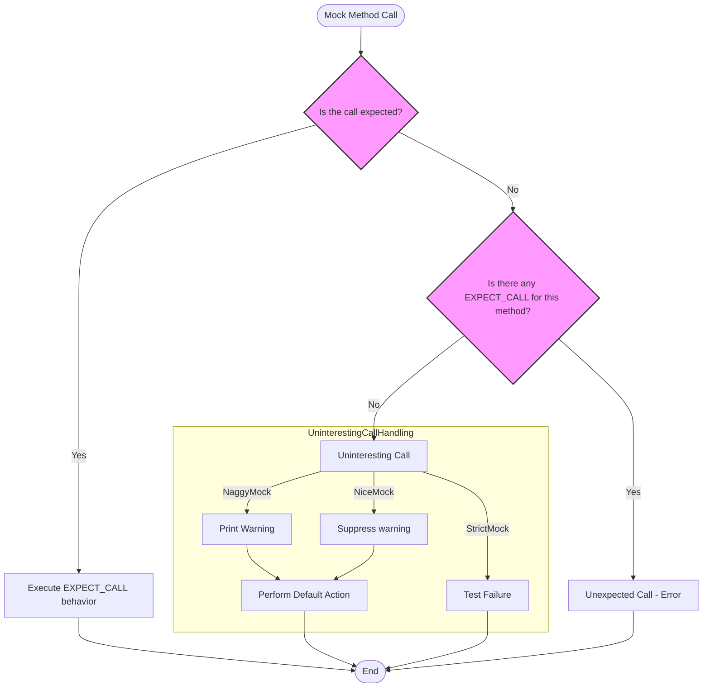

# Nice, Strict, and Naggy Mock Classes

This page explains the core model and usage of the `NiceMock`, `NaggyMock`, and `StrictMock` templates in GoogleMock. These templates control how mock objects behave when they receive *uninteresting calls*—calls to mock methods that have no explicit `EXPECT_CALL` expectations set. By applying these wrappers around your mock classes, you can precisely control warnings and failures in response to such calls, enhancing test robustness and code clarity.

---

## Understanding Mock Object Behavior Modes

When using GoogleMock, a method call on a mock object is either **interesting** or **uninteresting**:

- **Interesting call**: The mock object has an `EXPECT_CALL` on the method with matching arguments.
- **Uninteresting call**: There are no matching `EXPECT_CALL`s for the method being called.

Behavior modes determine how GoogleMock handles uninteresting calls:

| Mode        | Behavior on Uninteresting Calls                                  | Typical Use Case                      |
|-------------|-----------------------------------------------------------------|-------------------------------------|
| `NaggyMock` | Prints a warning, allowing the call to proceed with default action. This is the default behavior if no wrapper is used. |
| `NiceMock`  | Silences warnings and allows default action to proceed silently. |
| `StrictMock`| Treats uninteresting calls as test failures.                    |


### Key points:

- Mock objects, by default, behave like `NaggyMock`, warning on uninteresting calls.
- Wrapping your mock with `NiceMock` suppresses these warnings, making your test output cleaner.
- Wrapping your mock with `StrictMock` enforces stricter tests by failing on unexpected calls.
- These wrappers derive from the mock class, so they can be used anywhere the base mock is accepted.

---

## Usage Examples

Suppose you have a mock class `MockFoo`:

```cpp
#include <gmock/gmock.h>
using namespace testing;

class MockFoo {
 public:
  MOCK_METHOD(void, DoThis, ());
  MOCK_METHOD(int, DoThat, (int));
};
```

You can use the behavior wrappers like this:

### NiceMock Example

Suppress warnings on uninteresting calls:

```cpp
NiceMock<MockFoo> nice_foo;
EXPECT_CALL(nice_foo, DoThis());
nice_foo.DoThis();    // Matches expectation
nice_foo.DoThat(5);  // Uninteresting call: no warning printed
```

### NaggyMock Example (Default behavior)

Generate warnings on uninteresting calls:

```cpp
NaggyMock<MockFoo> naggy_foo;
EXPECT_CALL(naggy_foo, DoThis());
naggy_foo.DoThis();    // Matches expectation
naggy_foo.DoThat(5);  // Uninteresting call: warning printed
```

### StrictMock Example

Fail on uninteresting calls:

```cpp
StrictMock<MockFoo> strict_foo;
EXPECT_CALL(strict_foo, DoThis());
strict_foo.DoThis();    // Matches expectation
strict_foo.DoThat(5);  // Uninteresting call results in test failure
```

---

## When to Use Each Mock Behavior Mode

### NiceMock

- Ideal for tests that do not care about all interactions.
- Keeps test logs clean by ignoring irrelevant calls.
- Recommended for most use cases to reduce test brittleness.

### NaggyMock

- Useful during development or debugging to catch unexpected calls early.
- Prints warnings without failing the test.
- Currently default behavior but may change to `NiceMock` in the future.

### StrictMock

- Use when you want to ensure your code makes no unexpected calls.
- Enforces rigorous contract verification.
- Increases test strictness but can cause brittleness if overused.

---

## Practical Implications and Best Practices

- **Default Behavior Consideration**: GoogleMock currently treats mocks as `NaggyMock` by default, printing warnings for uninteresting calls. Consider wrapping your mocks with `NiceMock` to reduce noise once your tests stabilize.

- **Constructor Arguments**: `NiceMock`, `NaggyMock`, and `StrictMock` inherit all constructors of their base mock classes, so you can pass constructor arguments seamlessly:

```cpp
NiceMock<MockFoo> nice_foo(5, "argument");
```

- **Limitations**:
  - These wrappers only affect methods that are mocked directly in the mock class using `MOCK_METHOD`. Methods inherited from base mock classes may not adhere to the wrapping behavior consistently.
  - Nesting wrappers is unsupported. For example, `NiceMock<StrictMock<MockFoo>>` is invalid.
  - Mock classes should have virtual destructors for these wrappers to function reliably.

- **Usage Recommendation**:
  - Use `NiceMock` for everyday tests to prevent unnecessary warnings.
  - Use `NaggyMock` during initial test writing or diagnosing unexpected calls.
  - Use `StrictMock` sparingly, typically in critical components where interaction must be precise.

- **Suppressing Specific Method Warnings Without Whole Mock Wrapping**:
  If you want to silence warnings for certain methods only, prefer setting `EXPECT_CALL(...).Times(AnyNumber())` for those methods instead of wrapping the entire mock.

- **Understanding Uninteresting vs Unexpected Calls** (See [Understanding Uninteresting vs Unexpected Calls](https://google.github.io/googletest/gmock_cook_book.html#uninteresting-vs-unexpected))
  - *Uninteresting call*: No expectation specified for the method
  - *Unexpected call*: Arguments don't match any existing `EXPECT_CALL`

  Only unexpected calls are treated as errors in all modes. Behavior modes govern reactions to uninteresting calls.

---

## Summary

This page detailed the behavior control templates `NiceMock`, `NaggyMock`, and `StrictMock` that modify how GoogleMock's mock objects respond to uninteresting calls. By selecting the appropriate wrapper, you can strike the right balance between noisy warning outputs and strict error enforcement in your tests. Understanding these modes is essential for writing maintainable and robust unit tests that properly reflect your expectations.

---

## Additional Resources

- [GoogleMock Cookbook: The Nice, the Strict, and the Naggy](https://google.github.io/googletest/gmock_cook_book.html#NiceStrictNaggy)
- [GoogleMock Cheat Sheet](https://google.github.io/googletest/gmock_cheat_sheet.html#MockClass)
- [Mocking Reference: NiceMock, NaggyMock, StrictMock](https://google.github.io/googletest/reference/mocking.html#NiceMock)
- [Understanding Uninteresting vs Unexpected Calls](https://google.github.io/googletest/gmock_cook_book.html#uninteresting-vs-unexpected)

---

## Implementation Snapshot

The classes `NiceMock<T>`, `NaggyMock<T>`, and `StrictMock<T>` are simple wrappers that inherit from `T` while registering their preferred behavior for uninteresting calls with GoogleMock's internal `Mock` framework. They enable or disable warnings or failures accordingly, while forwarding all calls to the underlying mock methods.

```cpp
using ::testing::NiceMock;
using ::testing::NaggyMock;
using ::testing::StrictMock;

NiceMock<MockFoo> nice_foo;      // Ignores uninteresting call warnings.
NaggyMock<MockFoo> naggy_foo;    // Prints warnings (default behavior).
StrictMock<MockFoo> strict_foo;  // Treats uninteresting calls as errors.
```

This composition empowers flexible and expressive unit testing patterns with GoogleMock.

---

## Troubleshooting

<AccordionGroup title="Common Issues with Mock Behavior Modes">
<Accordion title="Unwanted Warnings Still Appear with NiceMock">If warnings about uninteresting calls still appear when using `NiceMock`, verify that all mock methods are declared directly in your mock class and not inherited from a base mock class. Also, ensure your mock class has a virtual destructor.</Accordion>
<Accordion title="Nesting NiceMock or StrictMock Causes Compilation Errors">Nesting wrappers like `NiceMock<StrictMock<MockFoo>>` is unsupported and will cause compile errors. Use only one wrapper at the top-level.</Accordion>
<Accordion title="Unexpected Calls Still Cause Failures in NiceMock">`NiceMock` only suppresses warnings for uninteresting calls. Unexpected calls (calls that do not match any expectation) always cause test failures, regardless of the mock behavior mode.</Accordion>
<Accordion title="Default Behavior Changed After Upgrading">GoogleMock is planning to shift the default mock behavior from `NaggyMock` to `NiceMock` in future releases. Review your tests after upgrading and consider explicitly wrapping mocks with your preferred mode to prevent surprises.</Accordion>
</AccordionGroup>

---

## Diagram: Mock Behavior Flow



This flowchart illustrates how GoogleMock processes each mock method call and how `NiceMock`, `NaggyMock`, and `StrictMock` influence the handling of uninteresting calls.

---

## Source Reference

<Source url="https://github.com/google/googletest" branch="main" paths={[{"path": "googlemock/include/gmock/gmock-nice-strict.h", "range": "1-166"}]} />

---

## Summary

- Acts as subclasses of your mock classes modifying reactions to **uninteresting calls**.
- `NiceMock`: suppresses warnings; `NaggyMock`: prints warnings; `StrictMock`: treats as errors.
- Helps maintain clean, understandable, and robust test output.
- Essential when writing precise interaction-based tests.

---

Happy mocking!
