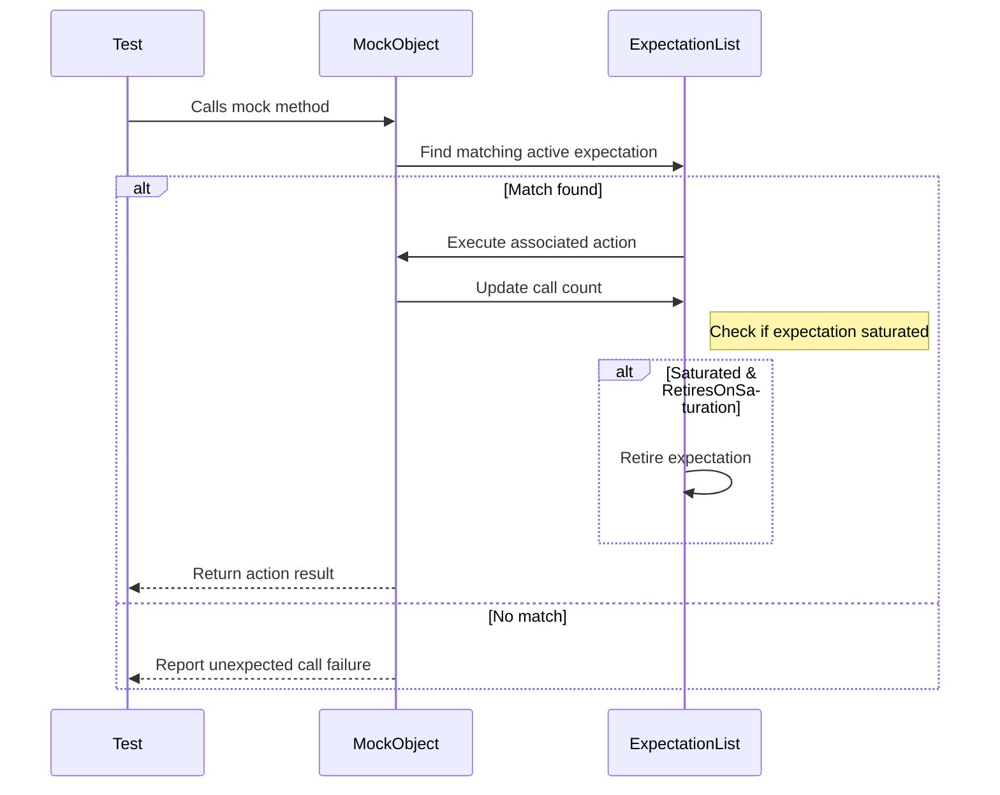

# Actions, Cardinalities, and Advanced Mock Control

This documentation details advanced GoogleMock (gMock) features for defining custom mock behaviors (actions), specifying call count constraints (cardinalities), and controlling mock expectations to suit complex testing scenarios. It provides practical explanations, usage examples, and best practices to empower you to write precise, expressive, and maintainable tests that fully harness gMock's capabilities.

---

## Table of Contents

1. [Introduction to Actions](#introduction-to-actions)
2. [Defining Custom Actions](#defining-custom-actions)
3. [Cardinality Constraints for Call Counts](#cardinality-constraints-for-call-counts)
4. [Using Predefined Cardinalities](#using-predefined-cardinalities)
5. [Creating Custom Cardinalities](#creating-custom-cardinalities)
6. [Controlling Expectation Behavior](#controlling-expectation-behavior)
7. [Combining Actions and Cardinalities](#combining-actions-and-cardinalities)
8. [Best Practices and Common Pitfalls](#best-practices-and-common-pitfalls)
9. [Troubleshooting Common Issues](#troubleshooting-common-issues)

---

## Introduction to Actions

**Actions** define what a mock method actually does when it is invoked. Unlike merely setting expectations about *whether* and *how often* a method is called, actions specify *how* the method behaves at runtime.

- Actions can return values, throw exceptions, invoke callbacks, or perform arbitrary user-defined logic.
- They allow simulating varied real-world behaviors, including success/failure paths, side effects, or dynamic return values.

Example: Returning different values on successive calls:

```cpp
EXPECT_CALL(mock, GetValue())
    .WillOnce(Return(10))
    .WillOnce(Return(20))
    .WillRepeatedly(Return(30));
```

This expects `GetValue()` to be called at least twice, returning 10 on the first call, 20 on the second, then 30 afterwards.

---

## Defining Custom Actions

You can use lambdas, functions, or functors as actions, enabling flexible behavior:

```cpp
EXPECT_CALL(mock, Compute(_))
    .WillOnce([](int x) { return x * 2; })
    .WillRepeatedly(Return(0));
```

More elaborate custom actions can be defined by implementing `ActionInterface<F>`. However, the most common approach is to use lambdas or existing built-in actions.

### Built-in Action Helpers:

- `Return(value)`: return a fixed value
- `ReturnRef(variable)`: return a reference
- `Invoke(callable)`: invoke a function or functor
- `DoAll(action1, action2, ..., actionN)`: perform multiple actions in sequence
- `SetArgPointee<N>(value)`: set the value pointed to by the N-th argument
- `InvokeArgument<N>(args...)`: invoke the callable argument at position N
- `IgnoreResult(action)`: ignore the return value of an action

### Example: Delegating to a Fake Object

If you have a fake implementation you'd like to delegate calls to by default:

```cpp
class MockFoo : public Foo {
 public:
  MOCK_METHOD(int, Bar, (int), (override));

  void DelegateToFake() {
    ON_CALL(*this, Bar)
        .WillByDefault([this](int x) { return fake_.Bar(x); });
  }

 private:
  FakeFoo fake_;
};
```

This pattern lets you verify call counts while relying on existing logic.

---

## Cardinality Constraints for Call Counts

**Cardinalities** express how many times you expect a mock method to be called.

Use in conjunction with `.Times(cardinality)` in `EXPECT_CALL`:

```cpp
EXPECT_CALL(mock, Foo()).Times(AtLeast(2));
```

Cardinalities support flexible constraints, including exact counts, ranges, or fuzzy bounds.

### Key Methods of Cardinalities:

- `IsSatisfiedByCallCount(int count)`: returns true if the expected call count satisfies the cardinality.
- `IsSaturatedByCallCount(int count)`: true if further calls would saturate the cardinality.
- `IsOverSaturatedByCallCount(int count)`: true if call count exceeds allowed calls.

### Cardinality Text Descriptions

gMock describes cardinalities with readable strings such as "called once", "never called", "called at least twice", etc.

---

## Using Predefined Cardinalities

GoogleMock ships with commonly used cardinalities, all available in the `testing` namespace:

| Cardinality        | Description                                                  | Usage Example                             |
|--------------------|--------------------------------------------------------------|-----------------------------------------|
| `AnyNumber()`      | Allow calls any number of times (including zero and unlimited) | `.Times(AnyNumber())`                    |
| `AtLeast(n)`       | Expected to be called at least *n* times                     | `.Times(AtLeast(2))`                     |
| `AtMost(n)`        | Expected to be called up to *n* times                        | `.Times(AtMost(5))`                      |
| `Between(m, n)`    | Expected to be called between *m* and *n* times inclusive   | `.Times(Between(1, 3))`                  |
| `Exactly(n)`       | Expected to be called exactly *n* times                      | `.Times(Exactly(3))` or `.Times(3)`     |

**Examples:**

```cpp
EXPECT_CALL(mock, Foo()).Times(AnyNumber());
EXPECT_CALL(mock, Bar()).Times(Exactly(0));    // should never be called
EXPECT_CALL(mock, Baz()).Times(Between(2, 4));
```

Calling a method more or less times than specified by cardinality triggers failure messages.

---

## Creating Custom Cardinalities

If predefined cardinalities do not fit your use case, you can write your own by implementing the `CardinalityInterface`:

```cpp
class CustomCardinality : public CardinalityInterface {
 public:
  bool IsSatisfiedByCallCount(int c) const override { ... }
  bool IsSaturatedByCallCount(int c) const override { ... }
  void DescribeTo(std::ostream* os) const override { ... }
};

Cardinality Custom() {
  return MakeCardinality(new CustomCardinality);
}
```

This enables arbitrary rules for call matching, like "called an even number of times":

```cpp
class EvenCardinality : public CardinalityInterface {
 public:
  bool IsSatisfiedByCallCount(int c) const override { return c % 2 == 0; }
  bool IsSaturatedByCallCount(int) const override { return false; }
  void DescribeTo(std::ostream* os) const override { *os << "called even number of times"; }
};

Cardinality EvenNumber() {
  return MakeCardinality(new EvenCardinality);
}

EXPECT_CALL(mock, Foo()).Times(EvenNumber());
```

---

## Controlling Expectation Behavior

Expectations control when and how mock methods are matched and considered satisfied or retired.

### Retiring Expectations on Saturation

By default, expectations remain active even if saturated (called max times). This can cause failures if the saturated expectation blocks others from matching.

Use `.RetiresOnSaturation()` to automatically retire an expectation once it reaches its upper call limit:

```cpp
EXPECT_CALL(mock, SetNumber(7)).Times(2).RetiresOnSaturation();
```

A third call to `SetNumber(7)` will then match a different expectation if present rather than producing a failure.

### Partial and Ordered Matching

- Use `.InSequence()` (with `Sequence` objects or `InSequence` scope) to enforce order of calls.
- Use `.After()` to express dependencies, requiring some expectations to be satisfied before others.

These enable modeling complex call order constraints to verify interaction sequences precisely.

### Sticky Expectations

Expectations are "sticky" by default, meaning they stay active after being saturated.

For sequences, or when using `.RetiresOnSaturation()`, expectations retire early to allow testing multiple call patterns clearer.

---

## Combining Actions and Cardinalities

Complex mock behaviors arise from combining cardinalities and actions:

```cpp
EXPECT_CALL(mock, GetValue())
    .Times(Between(1, 3))
    .WillOnce(Return(5))
    .WillRepeatedly(Return(10));
```

This states the method is expected 1-3 times, returning 5 once, then 10 thereafter.

You can layer `.InSequence()`, `.After()`, and `.RetiresOnSaturation()` to control ordering, dependencies, and expectation lifetime.

---

## Best Practices and Common Pitfalls

- **Set expectations before code under test invokes mock methods.**
- **Avoid overly strict cardinalities that cause brittle tests.** Choose flexible counts like `AtLeast` where appropriate.
- **Use `NiceMock` or `StrictMock` to control uninteresting call warnings or errors.**
- **Delegate default behavior to fakes or real objects via `ON_CALL` to simplify test setups.**
- **Use descriptive matchers and actions to clarify intent.** Avoid unnecessary complexity.
- **Retire saturated expectations if they conflict with subsequent expectations.**
- **Do not set new expectations after verifying or running test code; undefined behavior may occur.**


---

## Troubleshooting Common Issues

### Unexpected Call Failures

Occurs when a call doesn't match any active expectation. Check:

- Correctness and specificity of matchers
- Proper cardinality settings
- Order constraints via sequences or `.After()`

### Too Many or Too Few Actions Warnings

Make sure the number of `.WillOnce()` clauses matches the expected calls in cardinality. If you use `.WillRepeatedly()`, ensure cardinality reflects it.

### Over-saturation Errors

Adding `.RetiresOnSaturation()` can help if too many calls are made and cause saturation.

### Uninteresting Call Warnings

Use `NiceMock` to suppress when not interested. Or add catch-all `EXPECT_CALL(...).Times(AnyNumber())` to allow calls without warnings.

### Compile Errors on Mock Methods

Wrap complex types with parentheses or use type aliases in `MOCK_METHOD` to handle commas in template types.

---

## Additional Resources

- [gMock Cookbook](gmock_cook_book.md) - Comprehensive recipes for mocking
- [Mocking Reference](reference/mocking.md) - Detailed API reference
- [gMock for Dummies](gmock_for_dummies.md) - Beginner-friendly introduction
- [Matchers Reference](mocking-framework-apis/using-matchers.md) - Matcher guide
- [GoogleTest Primer](overview/introduction-overview/product-welcome.mdx) - Foundation of testing with GoogleTest

---

Harness these core concepts and features to write robust, precise, and maintainable tests that simulate complex behaviors and interactions using GoogleMock's advanced mocking capabilities.


---

### Example: Using Cardinalities and Actions Together
```cpp
using ::testing::AtLeast;
using ::testing::Return;
using ::testing::Exactly;

MockFoo mock;

// Expect Bar() to be called at least twice, returning 10 once then 20 repeatedly
EXPECT_CALL(mock, Bar())
    .Times(AtLeast(2))
    .WillOnce(Return(10))
    .WillRepeatedly(Return(20));

// Expect Baz(x) to never be called
EXPECT_CALL(mock, Baz(_))
    .Times(Exactly(0));

// Expect Foo() to be called between 1 and 3 times
EXPECT_CALL(mock, Foo())
    .Times(Between(1, 3))
    .WillRepeatedly(Return(true));
```

This test snippet concisely defines expected call counts and behaviors.

---

### Mermaid Diagram: Mock Expectation Evaluation Flow


This illustrates the core runtime behavior as mock calls are matched and executed.
